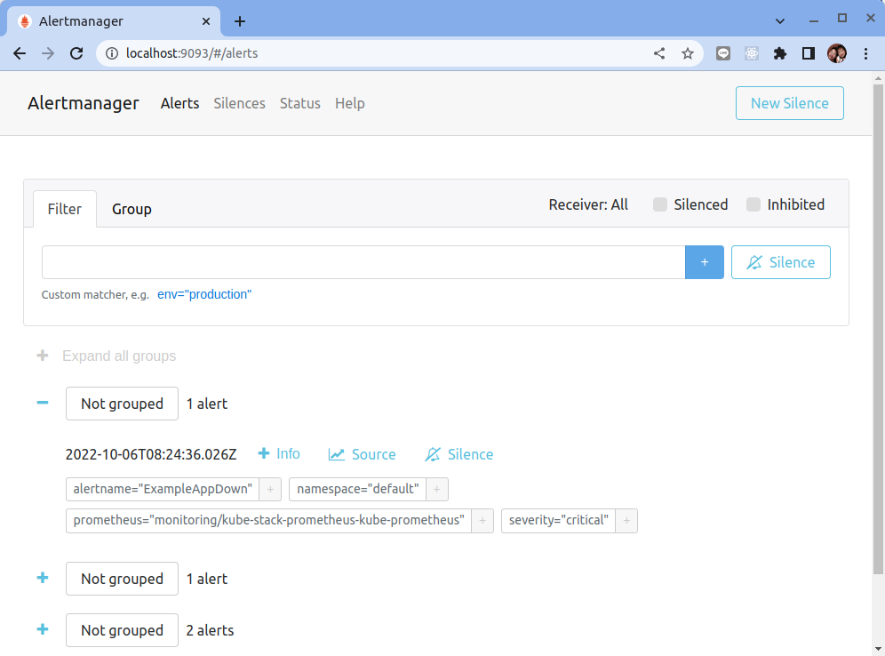
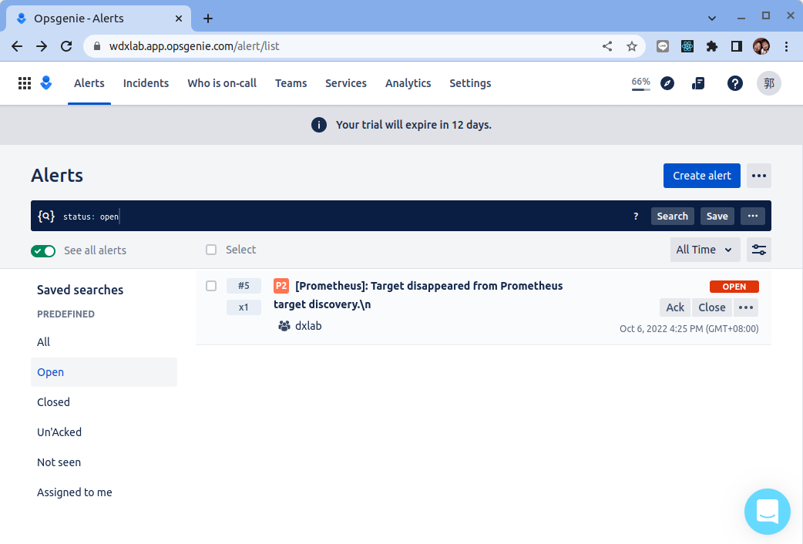

# 自定義監控報警

原文: [自定义监控报警](https://p8s.io/docs/operator/custom/)

上一個教程家講解了 Prometheus Operator 的安裝和基本使用方法，本教程主要給大家介紹如何在 Prometheus Operator 中添加一個自定義的監控項。

除了 Kubernetes 業務監控中心的一些資源對象、節點以及組件需要，有可能我們還需要根據實際需要添加自定義監控項，添加一個自定義監控的步驟也是非常簡單的。

1. 建立一個 ServiceMonitor 對象，用於 Prometheus 添加監控項
2. 為 ServiceMonitor 對象關聯 metrics 數據接口的一個 Service 對象
3. 確保 Service 對象可以正確獲取到 metrics 數據

接下來我們就來為大家演示如何對自己開發的應用程序添加監控與告警。


## 佈署範例應用程序

讓我們佈置一個會暴露 `~/metrics`指標資料的範例應用程序。

```bash
# Create a new Deployment
cat <<EOF | kubectl apply -n default -f -
apiVersion: apps/v1
kind: Deployment
metadata:
  name: example-app
spec:
  replicas: 3
  selector:
    matchLabels:
      app: example-app
  template:
    metadata:
      labels:
        app: example-app
    spec:
      containers:
      - name: example-app
        image: fabxc/instrumented_app
        ports:
        - name: web
          containerPort: 8080
EOF
```

結果:

```bash
$ kubectl get all
NAME                               READY   STATUS    RESTARTS   AGE
pod/example-app-7d95cbf666-ppwkw   1/1     Running   0          92s
pod/example-app-7d95cbf666-zc6h8   1/1     Running   0          92s
pod/example-app-7d95cbf666-4gdpk   1/1     Running   0          92s

NAME                 TYPE        CLUSTER-IP   EXTERNAL-IP   PORT(S)   AGE
service/kubernetes   ClusterIP   10.43.0.1    <none>        443/TCP   15m

NAME                          READY   UP-TO-DATE   AVAILABLE   AGE
deployment.apps/example-app   3/3     3            3           92s

NAME                                     DESIRED   CURRENT   READY   AGE
replicaset.apps/example-app-7d95cbf666   3         3         3       92s
```

接著創建一個 Service 對象來連接到範例應用的 pods:


```bash
# Create a new Deployment
cat <<EOF | kubectl apply -n default -f -
kind: Service
apiVersion: v1
metadata:
  name: example-app
  labels:
    app: example-app
spec:
  selector:
    app: example-app
  ports:
  - name: web
    port: 8080
EOF
```

我們先用 port-forward 的手法來檢視範例應用程式的 `~/metrics` 端口:

```bash
kubectl port-forward svc/example-app -n default 8080:8080
```


## 配置指標 scrape 發現

### 創建 ServiceMonitor 對象

根據上面的驗證可得知 `metrics` 接口運行在 8080 端口下面的，而且是 http 的協議。接下來我們創建對應的 ServiceMonitor 對象:

```bash
cat <<EOF | kubectl apply -n default -f -
apiVersion: monitoring.coreos.com/v1
kind: ServiceMonitor
metadata:
  name: example-app
  labels:
    team: frontend
spec:
  selector:
    matchLabels:
      app: example-app
  endpoints:
  - port: web
EOF
```

關於 ServiceMonitor 更多的配置屬性，可以參考[官方的 API 文檔](https://github.com/coreos/prometheus-operator/blob/master/Documentation/api.md#servicemonitorspec)的描述。

檢查結果:

```bash
$ kubectl get servicemonitor

NAME          AGE
example-app   5s
```

使用 Prometheus 的 UI來檢查 `Status -> Targets`:


## 設定告警規則

### 創建 PrometheusRule 對象

現在我們知道怎麼自定義一個 ServiceMonitor 對象了，但是如果需要自定義一個報警規則的話呢？ 我們去查看 Prometheus Dashboard 的 Alert 頁面下面就已經有很多報警規則了，這一系列的規則其實都來自於項目 https://github.com/kubernetes-monitoring/kubernetes-mixin，我們都通過 Prometheus Operator 安裝配置上了。

但是這些報警信息是哪裡來的呢？他們應該用怎樣的方式通知我們呢？我們知道之前我們使用自定義的方式可以在 Prometheus 的配置文件之中指定 AlertManager 實例和 報警的 rules 文件，現在我們通過 Operator 部署的呢？

我們可以在 Prometheus Dashboard 的 Config 頁面下面查看關於 AlertManager 的配置：

```yaml hl_lines="32-40"
global:
  scrape_interval: 30s
  scrape_timeout: 10s
  evaluation_interval: 30s
  external_labels:
    prometheus: monitoring/kube-stack-prometheus-kube-prometheus
    prometheus_replica: prometheus-kube-stack-prometheus-kube-prometheus-0
alerting:
  alert_relabel_configs:
  - separator: ;
    regex: prometheus_replica
    replacement: $1
    action: labeldrop
  alertmanagers:
  - follow_redirects: true
    enable_http2: true
    scheme: http
    path_prefix: /
    timeout: 10s
    api_version: v2
    relabel_configs:
    - source_labels: [__meta_kubernetes_service_name]
      separator: ;
      regex: kube-stack-prometheus-kube-alertmanager
      replacement: $1
      action: keep
    - source_labels: [__meta_kubernetes_endpoint_port_name]
      separator: ;
      regex: http-web
      replacement: $1
      action: keep
    kubernetes_sd_configs:
    - role: endpoints
      kubeconfig_file: ""
      follow_redirects: true
      enable_http2: true
      namespaces:
        own_namespace: false
        names:
        - monitoring
rule_files:
- /etc/prometheus/rules/prometheus-kube-stack-prometheus-kube-prometheus-rulefiles-0/*.yaml
...
...
```

上面 alertmanagers 的配置我們可以看到是通過 `role` 為 `endpoints` 的 kubernetes 的自動發現機制獲取的，匹配的是服務名為 `kube-stack-prometheus-kube-alertmanager`，端口名為 `web` 的 Service 服務。

```bash hl_lines="6"
$ kubectl get endpoints -n monitoring

NAME                                             ENDPOINTS                                         AGE
alertmanager-operated                            172.17.0.6:9094,172.17.0.6:9094,172.17.0.6:9093   2d11h
kube-stack-prometheus-grafana                    172.17.0.4:3000                                   2d11h
kube-stack-prometheus-kube-alertmanager          172.17.0.6:9093                                   2d11h
kube-stack-prometheus-kube-operator              172.17.0.5:10250                                  2d11h
kube-stack-prometheus-kube-prometheus            172.17.0.7:9090                                   2d11h
kube-stack-prometheus-kube-state-metrics         172.17.0.3:8080                                   2d11h
kube-stack-prometheus-prometheus-node-exporter   192.168.49.2:9100                                 2d11h
prometheus-operated  
```

我們可以查看一下 `kube-stack-prometheus-kube-alertmanager` 這個 Service：

```bash hl_lines="22 24"
$ kubectl describe svc/kube-stack-prometheus-kube-alertmanager -n monitoring

Name:              kube-stack-prometheus-kube-alertmanager
Namespace:         monitoring
Labels:            app=kube-prometheus-stack-alertmanager
                   app.kubernetes.io/instance=kube-stack-prometheus
                   app.kubernetes.io/managed-by=Helm
                   app.kubernetes.io/part-of=kube-prometheus-stack
                   app.kubernetes.io/version=40.1.2
                   chart=kube-prometheus-stack-40.1.2
                   heritage=Helm
                   release=kube-stack-prometheus
                   self-monitor=true
Annotations:       meta.helm.sh/release-name: kube-stack-prometheus
                   meta.helm.sh/release-namespace: monitoring
Selector:          alertmanager=kube-stack-prometheus-kube-alertmanager,app.kubernetes.io/name=alertmanager
Type:              ClusterIP
IP Family Policy:  SingleStack
IP Families:       IPv4
IP:                10.111.152.53
IPs:               10.111.152.53
Port:              http-web  9093/TCP
TargetPort:        9093/TCP
Endpoints:         172.17.0.6:9093
Session Affinity:  None
Events:            <none>
```

可以看到服務名正是 `kube-stack-prometheus-kube-alertmanager`，Port 定義的名稱也是 `http-web`，符合上面的規則，所以 Prometheus 和 AlertManager 組件就正確關聯上了。

而對應的報警規則文件位於：`/etc/prometheus/rules/prometheus-kube-stack-prometheus-kube-prometheus-rulefiles-0/*.yaml` 目錄下面所有的 YAML 文件。我們可以進入 Prometheus 的 Pod 中驗證下該目錄下面是否有 YAML 文件：

```bash
$ kubectl exec -it pod/prometheus-kube-stack-prometheus-kube-prometheus-0 -n monitoring  -- /bin/sh

# 進到 container 中
/prometheus $ ls /etc/prometheus/rules/prometheus-kube-stack-prometheus-kube-prometheus-rulefiles-0/

monitoring-kube-stack-prometheus-kube-alertmanager.rules-0c28d352-c3a6-4e00-9bc6-c882d6a21042.yaml
monitoring-kube-stack-prometheus-kube-config-reloaders-7b77cd24-39f4-4d64-b607-e194368b6b79.yaml
monitoring-kube-stack-prometheus-kube-etcd-3b8d3ec6-03f4-4284-a1db-4982a865b0c0.yaml
monitoring-kube-stack-prometheus-kube-general.rules-ab11d1b8-7e9d-4064-b949-6a1825f08b74.yaml
monitoring-kube-stack-prometheus-kube-k8s.rules-c3a228be-e5e8-4868-b496-6b2ff501f2fa.yaml
monitoring-kube-stack-prometheus-kube-kube-apiserver-availability.rules-85cbf17f-a626-49ea-80f3-674e833baa28.yaml
monitoring-kube-stack-prometheus-kube-kube-apiserver-burnrate.rules-da158fed-ce83-4b15-9e59-2fb35f33196e.yaml
monitoring-kube-stack-prometheus-kube-kube-apiserver-histogram.rules-47b0e439-b63e-480a-93fe-84567aca9ab2.yaml
monitoring-kube-stack-prometheus-kube-kube-apiserver-slos-d99727bc-2e9c-4444-a092-cfb30f70b901.yaml
monitoring-kube-stack-prometheus-kube-kube-prometheus-general.rules-7ec7babe-2bbf-4e6f-95a4-e9a00c0e8317.yaml
monitoring-kube-stack-prometheus-kube-kube-prometheus-node-recording.rules-23a82267-aec6-4557-9cf0-6e5d486711c9.yaml
monitoring-kube-stack-prometheus-kube-kube-scheduler.rules-1093b13c-e2e5-47d5-a460-646889fc1cd9.yaml
monitoring-kube-stack-prometheus-kube-kube-state-metrics-6361c3d9-aac5-455e-9031-fcdc7eb44b60.yaml
monitoring-kube-stack-prometheus-kube-kubelet.rules-70af904c-17ca-4f68-9c6a-74095285d028.yaml
monitoring-kube-stack-prometheus-kube-kubernetes-apps-57f72625-f5ad-4957-90f2-7112ba893ba9.yaml
monitoring-kube-stack-prometheus-kube-kubernetes-resources-585f5309-b2ce-48b2-ad97-43911b9f7ae4.yaml
monitoring-kube-stack-prometheus-kube-kubernetes-storage-571a7d2d-3a4d-48e8-a513-dd8d4dfbdbb9.yaml
monitoring-kube-stack-prometheus-kube-kubernetes-system-8c1e723f-e77e-4770-932b-02fd997406dd.yaml
monitoring-kube-stack-prometheus-kube-kubernetes-system-apiserver-d951e532-9241-4836-a09b-e0306d0aa426.yaml
monitoring-kube-stack-prometheus-kube-kubernetes-system-controller-manager-c80c436a-79f8-4e9c-b98e-8bfa8350ed51.yaml
monitoring-kube-stack-prometheus-kube-kubernetes-system-kube-proxy-fd8cb774-a1e1-4f5f-8451-d040f830f414.yaml
monitoring-kube-stack-prometheus-kube-kubernetes-system-kubelet-c05e0566-1467-4d29-8d86-6d389ce30282.yaml
monitoring-kube-stack-prometheus-kube-kubernetes-system-scheduler-2101b564-e968-4c6c-9feb-0ee2a08afc83.yaml
monitoring-kube-stack-prometheus-kube-node-exporter-67adfa60-fba2-47dd-aa97-dd74b3a9c76f.yaml
monitoring-kube-stack-prometheus-kube-node-exporter.rules-99a27e95-6810-4e3c-a635-89e466be6e22.yaml
monitoring-kube-stack-prometheus-kube-node-network-68442b29-5626-4ea5-9a6c-03550f673d78.yaml
monitoring-kube-stack-prometheus-kube-node.rules-30bafea3-7a0e-4a26-a212-cc3223518a90.yaml
monitoring-kube-stack-prometheus-kube-prometheus-5211288e-bdff-4e63-972f-a0470a13b6aa.yaml
monitoring-kube-stack-prometheus-kube-prometheus-operator-76aed426-2a45-4c52-ae9a-5c87f53ac3c9.yaml
```

接著讓我們創建一個 PrometheusRule 的對象來監控 example-app 當這個服務不存在的時來觸發告警:

```bash
cat <<EOF | kubectl apply -n default -f -
apiVersion: monitoring.coreos.com/v1
kind: PrometheusRule
metadata:
  labels:
    team: frontend
  name: example-app
spec:
  groups:
    - name: example-app
      rules:
        - alert: ExampleAppDown
          annotations:
            summary: Target disappeared from Prometheus target discovery.
            description: ExampleApp has disappeared from Prometheus target discovery.
          expr: |
            absent(up{job="example-app"} == 1)
          for: 1m
          labels:
            namespace: default
            severity: critical
EOF
```

!!! tip "absent() 函數解說"
    **absent()**

    `absent(v instant-vector)`，如果傳遞給它的向量參數具有樣本數據，則返回空向量；如果傳遞的向量參數沒有樣本數據，則返回不帶度量指標名稱且帶有標籤的時間序列，且樣本值為1。

    當監控度量指標時，如果獲取到的樣本數據是空的， 使用 `absent` 方法對告警是非常有用的。例如：

    ```bash
    # 這裡提供的向量有樣本數據
    absent(http_requests_total{method="get"})  => no data
    absent(sum(http_requests_total{method="get"}))  => no data

    # 由於不存在度量指標 nonexistent，所以 返回不帶度量指標名稱且帶有標籤的時間序列，且樣本值為1
    absent(nonexistent{job="myjob"})  => {job="myjob"}  1
    # 正則匹配的 instance 不作為返回 labels 中的一部分
    absent(nonexistent{job="myjob",instance=~".*"})  => {job="myjob"}  1

    # sum 函數返回的時間序列不帶有標籤，且沒有樣本數據
    absent(sum(nonexistent{job="myjob"}))  => {}  1
    ```


我們可以在 Prometheus Dashboard 的 "Status -> Rules" 頁面下面查看關於 AlertManager 的配置：


也可以進入 Prometheus 的 Pod 中驗證下該目錄下面是否有 YAML 文件被創建出來：

```bash hl_lines="5"
$ kubectl exec -it pod/prometheus-kube-stack-prometheus-kube-prometheus-0 -n monitoring  -- /bin/sh

# 進到 container 中
/prometheus $ ls /etc/prometheus/rules/prometheus-kube-stack-prometheus-kube-prometheus-rulefiles-0/
default-example-app-97045677-d9ce-4bed-9cb4-e5d607d4c8d7.yaml
monitoring-kube-stack-prometheus-kube-alertmanager.rules-c7c084e4-b4f4-4f89-b250-873d35a59eae.yaml
...
...
```


## 配置告警推播頻道

我們知道如何去添加一個報警規則配置項 (PrometheusRule)，但是這些報警信息用怎樣的方式去發送呢？


前面的教程中我們知道我們可以通過 AlertManager 的配置文件去配置各種報警接收器，現在我們是通過 Operator 提供的 alertmanager 資源對象創建的組件，應該怎樣去修改配置呢？

首先我們去 Alertmanager (http://localhost:9093) 的頁面上 `status` 路徑下面查看 AlertManager 的配置信息:


這些配置信息實際上是來自於名為 Prometheus-Operator 自動創建的 `alertmanager-kube-stack-prometheus-kube-alertmanager-generated` 的 Secret 對象：

```bash hl_lines="5"
$ kubectl get secrets -n monitoring

NAME                                                                TYPE                 DATA   AGE
alertmanager-kube-stack-prometheus-kube-alertmanager                Opaque               1      2d15h
alertmanager-kube-stack-prometheus-kube-alertmanager-generated      Opaque               1      2d15h
alertmanager-kube-stack-prometheus-kube-alertmanager-tls-assets-0   Opaque               0      2d15h
alertmanager-kube-stack-prometheus-kube-alertmanager-web-config     Opaque               1      2d15h
kube-stack-prometheus-grafana                                       Opaque               3      2d15h
kube-stack-prometheus-kube-admission                                Opaque               3      2d16h
prometheus-kube-stack-prometheus-kube-prometheus                    Opaque               1      2d15h
prometheus-kube-stack-prometheus-kube-prometheus-tls-assets-0       Opaque               1      2d15h
prometheus-kube-stack-prometheus-kube-prometheus-web-config         Opaque               1      2d15h
sh.helm.release.v1.kube-stack-prometheus.v1                         helm.sh/release.v1   1      2d15h
sh.helm.release.v1.kube-stack-prometheus.v2                         helm.sh/release.v1   1      2d15h
```

讓我們使用下列命令進一步去了解這個 Secret 對象的內容:

```bash
$ kubectl get secret alertmanager-kube-stack-prometheus-kube-alertmanager-generated -n monitoring -o json | jq -r '.data."alertmanager.yaml.gz"' | base64 --decode | gunzip
```

結果:

```yaml
#全局設定
global:
  # 未收到標記告警通知，等待 timeout 時間之後事件標記為 resolve。
  resolve_timeout: 5m 
#根路由
route:
  #頂級路由配置的接收者（匹配不到子級路由，會使用根路由發送報警）
  receiver: "null"
  #分組規則，如果滿足group_by中包含的標籤，則這些報警會合併爲一個通知發給receiver
  group_by:
  - namespace
  #子級路由
  routes:
  #範例：符合 alertname =~ "InfoInhibitor|Watchdog" 條件者，不進行通知。
  - receiver: "null"
    matchers:
    - alertname =~ "InfoInhibitor|Watchdog"
  #設置等待時間，在此等待時間內如果接收到多個報警，則會合併成一個通知發送給receiver
  group_wait: 30s
  #兩次報警通知的時間間隔，如：5m，表示發送報警通知後，如果5分鐘內再次接收到報警則不會發送通知
  group_interval: 5m
  #發送相同告警的時間間隔，如：4h，表示4小時內不會發送相同的報警
  repeat_interval: 12h
inhibit_rules:
- target_matchers:
  - severity =~ warning|info
  source_matchers:
  - severity = critical
  equal:
  - namespace
  - alertname
- target_matchers:
  - severity = info
  source_matchers:
  - severity = warning
  equal:
  - namespace
  - alertname
- target_matchers:
  - severity = info
  source_matchers:
  - alertname = InfoInhibitor
  equal:
  - namespace
#定義所有接收者
receivers:
# 黑洞
- name: "null"
templates:
- /etc/alertmanager/config/*.tmpl

```

我們可以看到內容和上面查看的配置信息是一致的，所以如果我們想要添加自己的接收器，我們就可以直接更改這個文件。

但是這裡的內容是使用 `base64` 編碼並且經過 `gzip` 壓縮過的，如果要手動添加內容就非常不方便，為此 Prometheus-Operator 新增了一個 `AlertmanagerConfig` 的 CRD。

### 創建 AlertmanagerConfig 對象

AlertmanagerConfig 對象允許以聲明方式指定 Alertmanager 配置的子部分，允許將警報路由到自定義接收器，並設置禁止規則。


`AlertmanagerConfig` 的資源對象，可以通過 `kubectl explain alertmanagerconfig` 或者[在線 API 文檔](https://github.com/prometheus-operator/prometheus-operator/blob/master/Documentation/user-guides/alerting.md)來查看字段的含義。


#### Opsgenie 範例

下列命令會創建一個 AlertmanagerConfig 對象然後將 Critical 報警信息發送到 Opsgenie 進行報警:

```yaml
cat <<EOF | kubectl apply -n default -f -
apiVersion: monitoring.coreos.com/v1alpha1
kind: AlertmanagerConfig
metadata:
  name: config-example
  labels:
    alertmanagerConfig: example
spec:
  route:
    groupBy: ['job']
    groupWait: 30s
    groupInterval: 5m
    repeatInterval: 12h
    receiver: 'my_opsgenie'
    matchers:
    - name: severity
      matchType: =
      value: critical
  receivers:
  # added opsgenie configs
  - name: 'my_opsgenie'
    opsgenieConfigs:
    - apiKey:
          name: 'opsgenie-config'
          key: 'apiKey'
      apiURL: https://api.opsgenie.com/
      message: '{{ range .Alerts }}{{ .Annotations.summary }}\n{{ end }}'
      description: '{{ range .Alerts }}{{ .Annotations.description }}\n{{ end }}'
      priority: '{{ range .Alerts }}{{ if eq .Labels.severity "critical"}}P2{{else}}P3{{end}}{{end}}'
---
apiVersion: v1
kind: Secret
type: Opaque
metadata:
  name: opsgenie-config
data:
  apiKey: NDc2Nzk2YTEtODQ0Ni00NGUwLWFlZmUtZWUyNjJhNmY2NGMx
EOF
```

接著我們來檢看 Alertmanager (http://localhost:9093) 的頁面上 `status` 路徑下面查看 AlertManager 的配置信息是否有被改變:


我們可看到 Alertmanager 的配置因為 AlertmanagerConfig 對象而有所變更:

```yaml hl_lines="13-22 33-43"
global:
  resolve_timeout: 5m
  http_config:
    follow_redirects: true
  ...
  ...
route:
  receiver: "null"
  group_by:
  - namespace
  continue: false
  routes:
  - receiver: default/config-example/my_opsgenie
    group_by:
    - job
    matchers:
    - namespace="default"
    - severity="critical"
    continue: true
    group_wait: 30s
    group_interval: 5m
    repeat_interval: 12h
  - receiver: "null"
    matchers:
    - alertname=~"InfoInhibitor|Watchdog"
    continue: false
  group_wait: 30s
  group_interval: 5m
  repeat_interval: 12h
  ...
receivers:
- name: "null"
- name: default/config-example/my_opsgenie
  opsgenie_configs:
  - send_resolved: true
    http_config:
      follow_redirects: true
    api_key: <secret>
    api_url: https://api.opsgenie.com/
    message: '{{ range .Alerts }}{{ .Annotations.summary }}\n{{ end }}'
    description: '{{ range .Alerts }}{{ .Annotations.description }}\n{{ end }}'
    source: '{{ template "opsgenie.default.source" . }}'
    priority: '{{ range .Alerts }}{{ if eq .Labels.severity "critical"}}P2{{else}}P3{{end}}{{end}}'
templates:
- /etc/alertmanager/config/*.tmpl
```

##　驗證

接著我們模擬 example-app 被下線了, 由於告警規則　`absent(up{job="example-app"} == 1)` 是去檢驗 `example-app` 是否至少有一個服務上線,　因此把　exmaple-app 佈署的 `replicas` 數量由 `3` 改成 `0` 可用來觸發這個告警。 

### 修改 Deploy 複本數

使用下列命令來修改 example-app 的 Deployment 對象:

```bash
$ kubectl edit deployment example-app -n default
```

??? tip
    `kubectl edit` 預設會使用 vim 開啟 Deployment 設定檔，如果要更換 `kubectl edit` 的預設開啟編輯器可以設定 `KUBE_EDITOR` 這個環境變數。

    筆者習慣用 `nano` 所以先執行以下指令:

    ```bash
    export KUBE_EDITOR=nano
    ```

    這樣在執行 `kubectl edit` 指令時, 就是以 `nano` 開啟 Deployment檔案


在編輯視窗中修改 `spec.replicas` 的數量由 "3" 改成 "0":

```bash hl_lines="16"
apiVersion: apps/v1
kind: Deployment
metadata:
  annotations:
    deployment.kubernetes.io/revision: "1"
    kubectl.kubernetes.io/last-applied-configuration: |
      {"apiVersion":"apps/v1","kind":"Deployment","metadata":{"annotations":{},"name":"example-app","namespace":"default"},"spec":{"replicas":3,"selector":{"matchLabels":{"app":"example-app"}},"template":{"metadata":{"labels":{"app":"example-app"}},"spec":{"containers":[{"image":"fabxc/instrumented_app","name":"example-app","ports":[{"containerPort":8080,"name":"web"}]}]}}}}
  creationTimestamp: "2022-10-03T23:38:28Z"
  generation: 1
  name: example-app
  namespace: default
  resourceVersion: "117421"
  uid: 97f07658-6ace-43b7-a5d1-fa21a3606b65
spec:
  progressDeadlineSeconds: 600
  replicas: 0
  revisionHistoryLimit: 10
  selector:
    matchLabels:
      app: example-app
  strategy:
...
...
```

檢查結果:

```bash hl_lines="7"
$ kubectl get all

NAME                  TYPE        CLUSTER-IP      EXTERNAL-IP   PORT(S)    AGE
service/example-app   ClusterIP   10.105.91.128   <none>        8080/TCP   45m

NAME                          READY   UP-TO-DATE   AVAILABLE   AGE
deployment.apps/example-app   0/0     0            0           47m

NAME                                     DESIRED   CURRENT   READY   AGE
replicaset.apps/example-app-5f86f88d98   0         0         0       47m
```

的確在這個時候並沒有任何一個 "example-app" 的 pod 被啟動。

###　檢查 Prometheus 告警觸發

1分鐘之後(在告警裡設定了 `for: 1m`)我們可以在 Prometheus Dashboard 的 "Alerts" 頁面下面查看告警規則是否被 Prometheus 所觸發：


###　檢查 Alertmanager 告警列表

切換到 Alertmanager 的網站的 `Alerts` 網頁，應該可以看到　`ExampleAppDown` 的告警資訊:



### 檢查 Ｏpsgenie 

接著讓我們登入 Opsgenie 的網站 (下列的範例是使用　Opsgenie Free 的訂閱來進行的請參見:[Start your 14-day free trial
](https://www.atlassian.com/software/opsgenie/try))



點選新進來的告警來看由 Alertmanager 送上來的告警資訊:


