# 使用 ConfigMap 添加 Grafana 儀表板

原文:[Prometheus: adding a Grafana dashboard using a ConfigMap](https://fabianlee.org/2022/07/06/prometheus-adding-a-grafana-dashboard-using-a-configmap/)

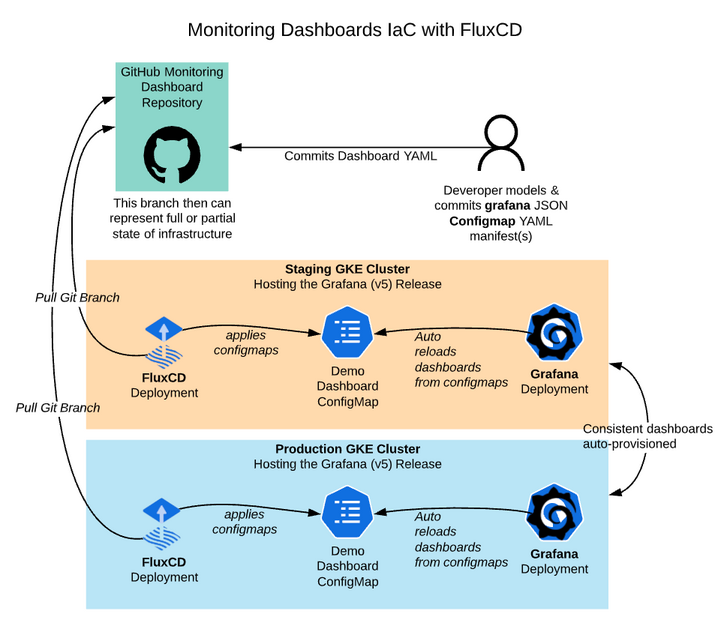

如果您的 Grafana 部署使用 sidecar 來監視定義為 ConfigMap 的新儀表板，那麼添加儀表板是一個動態操作，甚至可以在不重新啟動 pod 的情況下完成。

如果您使用 `kube-prometheus-stack` 部署了 Prometheus/Grafana 堆棧，則可以使用以下命令檢查 `grafana-sc-dashboard` 邊車是否存在：

```bash
# Define namespace that grafana reside
$ export GRAFANA_NS=monitoring
$ kubectl get pod -l app.kubernetes.io/name=grafana -n $GRAFANA_NS -o=jsonpath='{range .items[*].spec.containers[*]}{.name},{.image}{"\n"}{end}'
```

結果:

```bash hl_lines="1-2"
grafana-sc-dashboard,quay.io/kiwigrid/k8s-sidecar:1.19.2
grafana-sc-datasources,quay.io/kiwigrid/k8s-sidecar:1.19.2
grafana,grafana/grafana:9.2.3
```

在本文中，我將向您展示如何在 Prometheus 中識別要衡量的指標，在 Grafana 中創建一個儀表板來顯示該指標，然後將該儀表板導出為 json。

然後，通過使用 json 數據和適當的標籤填充 ConfigMap，可以使用此 json 跨其他 Grafana 實例重新創建此儀表板。

## 識別指標

作為一個基本示例，讓我們考慮集群的總 pod 數。使用 `kubectl`，獲取所有命名空間中非零計數的 pod 計數。

```bash
# skip any pods that have 0 count
$ kubectl get pod -A --no-headers | awk {'print $3'} | grep -v ^0 | wc -l

19
```

從 Prometheus 主頁面驗證此值是否匹配，使用類似下面的 `kubelet_running_pods` 查詢。

```promql
kubelet_running_pods{job="apiserver"}
```

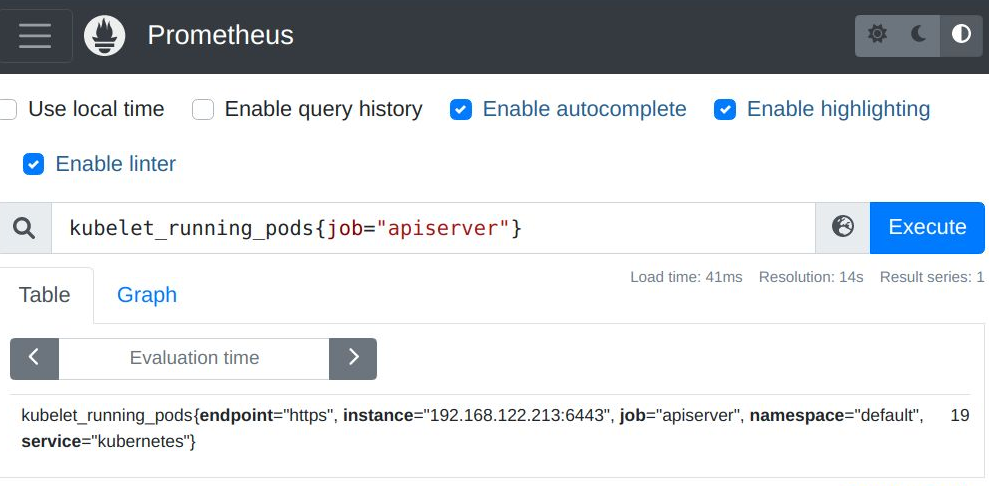

## 手動創建儀表板

現在我們在 Grafana Web UI 中手動構建儀表板。我們希望手動構建一次儀表板，然後將其導出為 json，然後可以將其放入 ConfigMap 中以供將來自動化和持久化。

登錄 Grafana，點擊 `Dashboards > New Dashboard`。

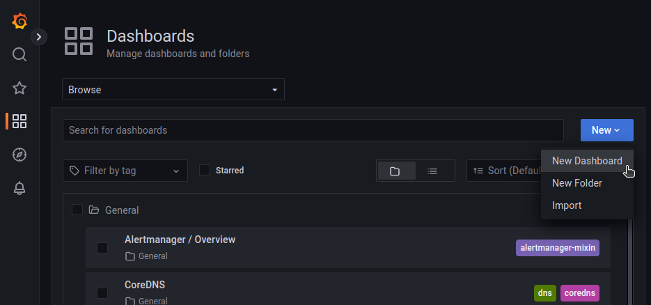

選擇 `Add a new panel`。

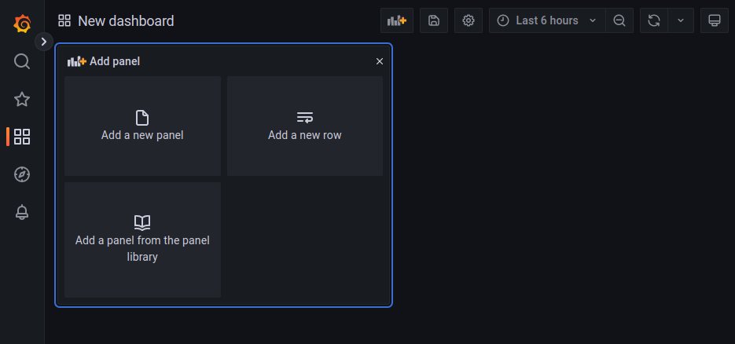

使用“Pod Count”作為圖表標題，選擇 Prometheus 作為數據源並輸入我們之前測試過的 Prometheus 指標，然後按“運行查詢”按鈕來填充圖表。

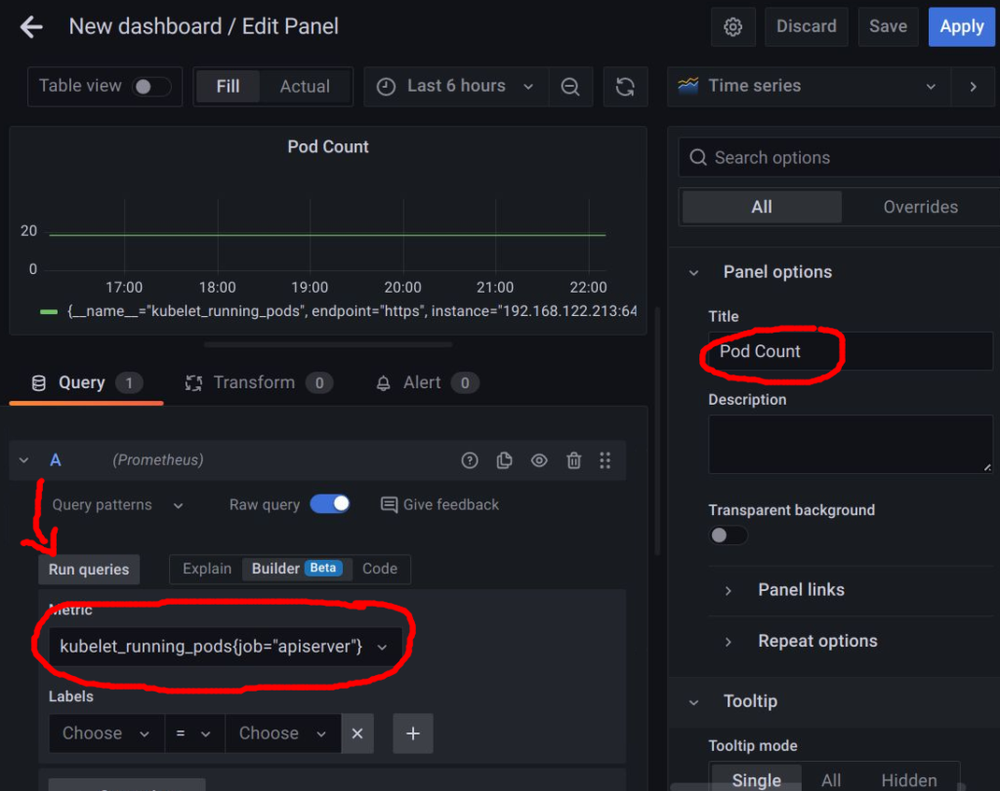

然後按“Save”並輸入儀表板名稱“kubernetes pod count”，然後按“Save”。

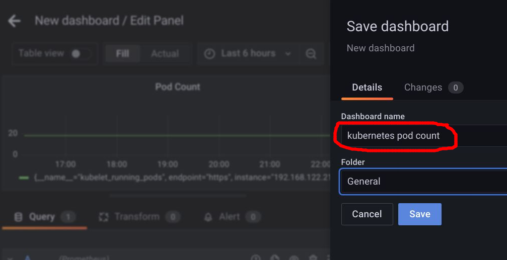

然後，您將看到呈現的儀表板。

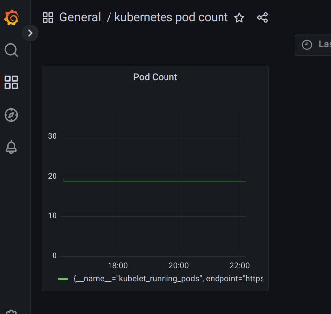

## 導出儀表板

按如下所示的“共享”圖標將此儀表板保存為 json 文件。

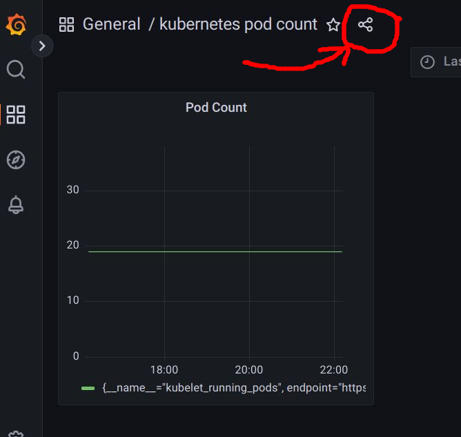

導航到“Export”選項卡，然後按“Save to file”。

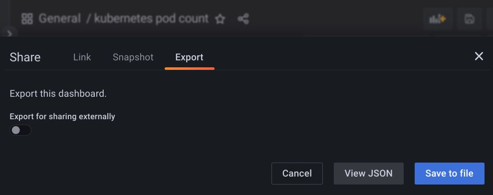

這會將一個 json 文件保存到您的主機，對於大多數操作系統/瀏覽器來說，它是您的“Downloads”目錄。

## 刪除手動創建的儀表板

為了證明我們剛剛下載的 json 文件可以重新創建這個 dashboard，我們需要刪除它。

在儀表板視圖中，按下 “Settings” 圖標，如下所示。

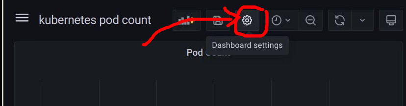

將顯示一個選擇了 “General” 選項卡的設置屏幕，向下滾動到底部並按 “Delete Dashboard” 按鈕。

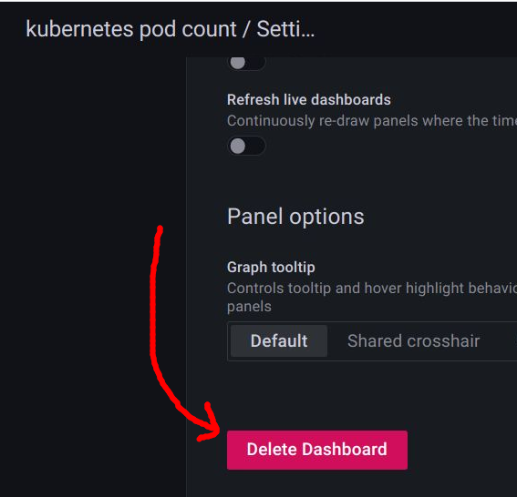

確認此選擇，您將返回主儀表板頁面，並確認您手動創建的儀表板已消失。

## 使用 ConfigMap 重新創建 Grafana 儀表板

但是我們仍然有本地下載的 json 文件，如果我們使用它來創建一個特殊標記的 ConfigMap，那麼 Grafana kiwigrid sidecar 會自動拾取它並重新創建儀表板。

### ConfigMap 語法

這個 sidecar 在與 Grafana pod（在我們的示例中為“prom”）相同的命名空間中查找 ConfigMap，標籤 “grafana_dashboard” 設置為“1”。以下是正確語法的示例，這裡是下載的完整示例。

```yaml title="pod-count-dashboard.yaml" hl_lines="4-5"
apiVersion: v1
kind: ConfigMap
metadata:
  labels:
    grafana_dashboard: "1"
  name: grafana-k8s-pod-count
  namespace: prom
data:
  k8s-pod-count.json: |-
    {
      ...
      ...
      ...
    }
```

### 創建 ConfigMap

您可以根據需要創建此 ConfigMap 清單。它可以手動完成，您將下載的 json 複製粘貼到清單中，並確保它按 yaml 塊語法縮進。或者您可以使用 kubectl 使用導出的 json 文件創建配置映射。然後添加所需的標籤。

```bash
# use your namespace
myprom_ns=prom

# create cofigmap from exported json
kubectl create configmap grafana-k8s-pod-count -n $myprom_ns --from-file=k8s-pod-count.json

# apply label that makes it Grafana target
kubectl label configmap grafana-k8s-pod-count -n $myprom_ns grafana_dashboard=1
```

### 在 Grafana 中驗證儀表板

等待大約 30 秒，然後在儀表板主視圖中搜索“pod count”，您應該會找到“kubernetes pod count”儀表板。

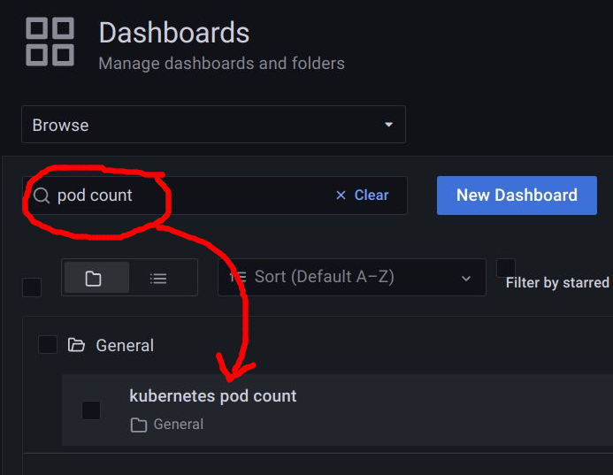

點擊它，您將再次看到您最初手動創建的儀表板。


**REFERENCES:**

- [syseleven.de, adding Grafana dashboard via ConfigMap](https://docs.syseleven.de/metakube-accelerator/building-blocks/observability-monitoring/kube-prometheus-stack#adding-grafana-dashboards)
- [Ishan Jain, kiwigrid/k8s-sidecar enabled for dashboard configmaps](https://faun.pub/grafana-dashboards-as-kubernetes-configmaps-959fd3159266)
- [github, kiwigrid sidecar project for making configmap available as local file in pod](https://github.com/kiwigrid/k8s-sidecar)
- [kustomize docs](https://kubernetes.io/docs/tasks/manage-kubernetes-objects/kustomization/)
- [github kubernetes issue, kubectl create configmap does not have option for adding label at same time](https://github.com/kubernetes/kubernetes/issues/60295)

