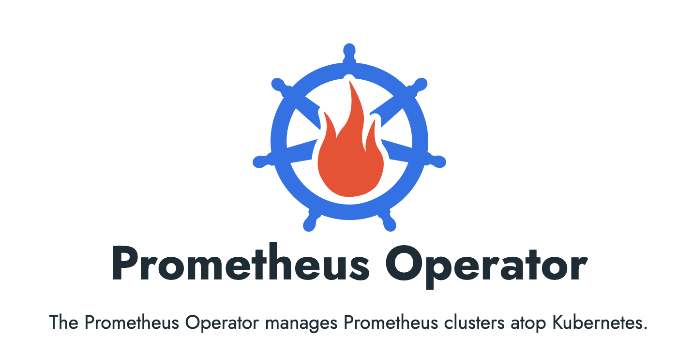
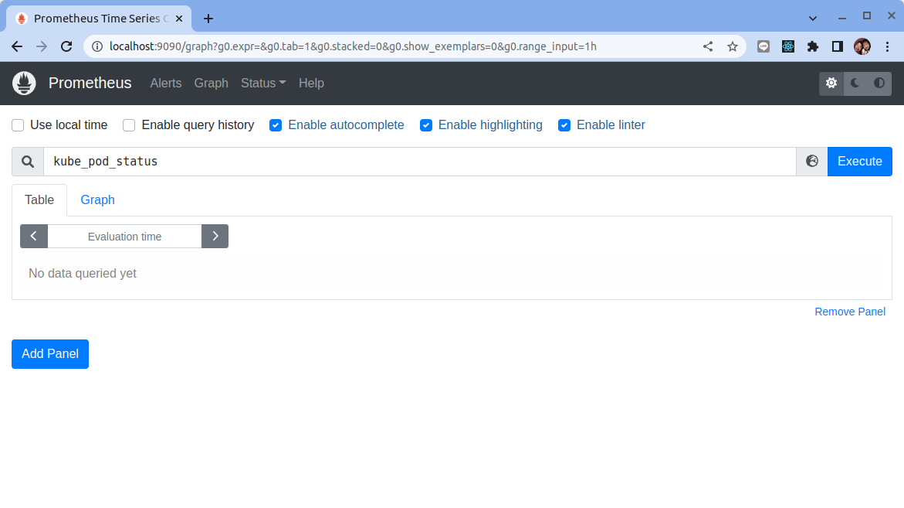
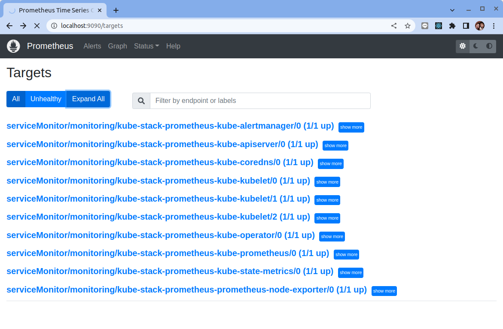
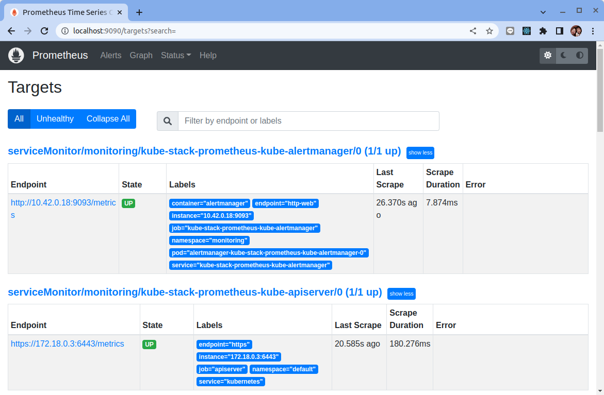
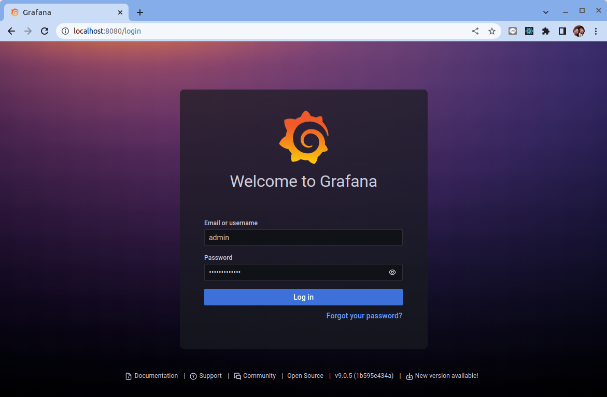
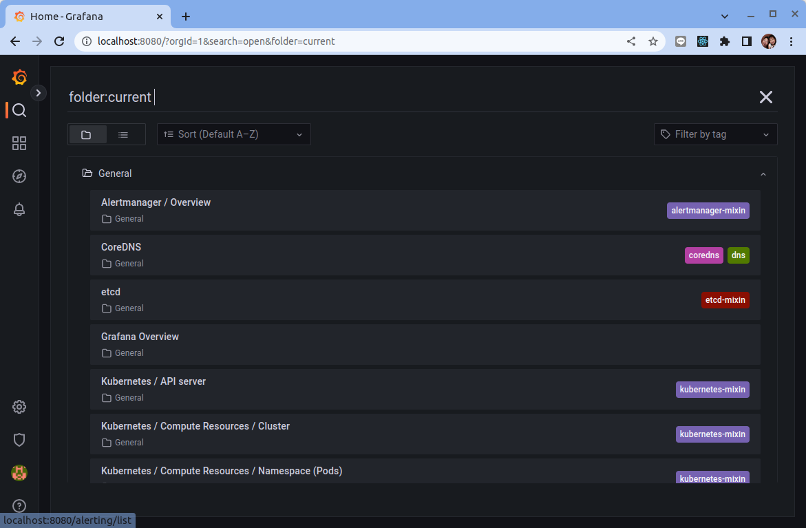

# Prometheus Operator

原文: [Prometheus Operator](https://p8s.io/docs/operator/install/)


在 Kubernetes 的集群中，我們可手動的佈署相關的監控組件(Prometheus, Alertmanager, Grafana...)來進行監控，基本上這樣的作法己經能夠完成監控報警的需求了。但實際上對上 Kubernetes 來說，還有更簡單方式來運營監控報警的手法，那就是使用 Prometheus Operator。 

Prometheus Operator 為監控 Kubernetes 資源和 Prometheus 實例的管理提供了簡單的定義，簡化在 Kubernetes 上部署、管理和運行 Prometheus 和 Alertmanager 集群。



## 介绍

Prometheus Operator 為 Kubernetes 提供了對 Prometheus 機器相關監控組件的本地部署和管理方案，該項目的目的是為了簡化和自動化基於 Prometheus 的監控棧配置，主要包括以下幾個功能：

- Kubernetes 自定義資源：使用 Kubernetes CRD 來部署和管理 Prometheus、Alertmanager 和相關組件。
- 簡化的部署配置：直接通過 Kubernetes 資源清單配置 Prometheus，比如版本、持久化、副本、保留策略等等配置。
- Prometheus 監控目標配置：基於熟知的 Kubernetes 標籤查詢自動生成監控目標配置，無需學習 Prometheus 特地的配置。


首先我們先來了解下 Prometheus Operator 的架構圖：


上圖是 Prometheus-Operator 官方提供的架構圖，各組件以不同的方式運行在 Kubernetes 集群中，其中 Operator 是最核心的部分，作為一個控制器，他會去創建 `Prometheus`、`ServiceMonitor`、`AlertManager` 以及 `PrometheusRule` 等 CRD 資源對象，然後會一直 Watch 並維持這些資源對象的狀態。

在最新版本的 Prometheus Operator 中提供了下列幾個 CRD 資源對象：

- Prometheus
- Alertmanager
- ServiceMonitor
- PodMonitor
- Probe
- ThanosRuler
- PrometheusRule
- AlertmanagerConfig

接下來我們一起來了解每個CRD的定義與目的。

### Prometheus

該 CRD 聲明定義了 Prometheus 期望在 Kubernetes 集群中運行的配置，提供了配置選項來配置副本、持久化、報警實例等。

對於每個 Prometheus CRD 資源，Operator 都會以 StatefulSet 形式在相同的命名空間下部署對應配置的資源，Prometheus Pod 的配置是通過一個包含 Prometheus 配置的名為 `<prometheus-name>` 的 Secret 對象聲明掛載的。

該 CRD 根據 **標籤選擇** 來指定部署的 Prometheus 實例應該覆蓋哪些 `ServiceMonitors`，然後 Operator 會根據包含的 `ServiceMonitors` 生成配置，並在包含配置的 Secret 中進行更新。

如果未提供對 `ServiceMonitor` 的選擇，則 Operator 會將 Secret 的管理留給用戶，這樣就可以提供自定義配置，同時還能享受 Operator 管理 Operator 的設置能力。

### Alertmanager

該 CRD 定義了在 Kubernetes 集群中運行的 Alertmanager 的配置，同樣提供了多種配置，包括持久化存儲。

對於每個 Alertmanager 資源，Operator 都會在相同的命名空間中部署一個對應配置的 `StatefulSet`，Alertmanager Pods 被配置為包含一個名為 `<alertmanager-name>` 的 Secret，該 Secret 以 `alertmanager.yaml` 為 key 的方式保存使用的配置文件。

當有兩個或更多配置的副本時，Operator 會在高可用模式下運行 Alertmanager 實例。

### ThanosRuler

該 CRD 定義了一個 Thanos Ruler 組件的配置，以方便在 Kubernetes 集群中運行。通過 Thanos Ruler，可以跨多個 Prometheus 實例處理記錄和警報規則。

一個 ThanosRuler 實例至少需要一個 `queryEndpoint`，它指向 Thanos Queriers 或 Prometheus 實例的位置。 `queryEndpoints` 用於配置 Thanos 運行時的 `--query` 參數，更多信息也可以在 Thanos 文檔中找到。

### ServiceMonitor

該 CRD 定義瞭如何監控一組動態的服務，使用標籤選擇來定義哪些 Service 被選擇進行監控。這可以讓團隊制定一個如何暴露監控指標的規範，然後按照這些規範自動發現新的服務，而無需重新配置。

為了讓 Prometheus 監控 Kubernetes 內的任何應用，需要存在一個 `Endpoints` 對象，`Endpoints` 對象本質上是 IP 地址的列表，通常 `Endpoints` 對象是由 Service 對象來自動填充的，Service 對象通過標籤選擇器匹配 Pod，並將其添加到 `Endpoints` 對象中。一個 Service 可以暴露一個或多個端口，這些端口由多個 `Endpoints` 列表支持，這些端點一般情況下都是指向一個 Pod。

Prometheus Operator 引入的這個 `ServiceMonitor` 對象就會發現這些 `Endpoints` 對象，並配置 Prometheus 監控這些 Pod。 `ServiceMonitorSpec` 的 `endpoints` 部分就是用於配置這些 `Endpoints` 的哪些端口將被 scrape 指標的。

!!! info
    注意：endpoints（小寫）是 ServiceMonitor CRD 中的字段，而 Endpoints（大寫）是 Kubernetes 的一種對象。

`ServiceMonitors` 以及被發現的目標都可以來自任何命名空間，這對於允許跨命名空間監控的場景非常重要。使用 `PrometheusSpec` 的 `ServiceMonitorNamespaceSelector`，可以限制各自的 Prometheus 服務器選擇的 `ServiceMonitors` 的命名空間。使用 `ServiceMonitorSpec` 的 `namespaceSelector`，可以限制 `Endpoints` 對象被允許從哪些命名空間中發現，要在所有命名空間中發現目標，`namespaceSelector` 必須為空：

```yaml
spec:
  namespaceSelector:
    any: true
```

### PodMonitor

該 CRD 用於定義如何監控一組動態 pods，使用標籤選擇來定義哪些 pods 被選擇進行監控。同樣團隊中可以製定一些規範來暴露監控的指標。

Pod 是一個或多個容器的集合，可以在一些端口上暴露 Prometheus 指標。

由 Prometheus Operator 引入的 `PodMonitor` 對象會發現這些 Pod，並為 Prometheus 服務器生成相關配置，以便監控它們。

`PodMonitorSpec` 中的 `PodMetricsEndpoints` 部分，用於配置 Pod 的哪些端口將被 scrape 指標，以及使用哪些參數。

`PodMonitors` 和發現的目標可以來自任何命名空間，這同樣對於允許跨命名空間的監控用例是很重要的。使用 `PodMonitorSpec` 的 `namespaceSelector`，可以限制 Pod 被允許發現的命名空間，要在所有命名空間中發現目標，`namespaceSelector` 必須為空：

```yaml
spec:
  namespaceSelector:
    any: true
```

### Probe

該 CRD 用於定義如何監控一組 Ingress 和靜態目標。除了 target 之外，Probe 對像還需要一個 prober，它是監控的目標並為 Prometheus 提供指標的服務。例如可以通過使用 `blackbox-exporter` 來提供這個服務。

### PrometheusRule

用于配置 Prometheus 的 Rule 规则文件，包括 `recording rules` 和 `alerting`，可以自动被 Prometheus 加载。

### AlertmanagerConfig

該 CRD 用於定義如何將 Alertmanager 的配置分割成不同的子對象進行配置，允許將報警路由到自定義 `Receiver` 上，並配置抑制規則。

`AlertmanagerConfig` 可以在命名空間級別上定義，為 Alertmanager 提供一個聚合的配置。這裡提供了一個如何使用它的例子。

這樣我們要在集群中監控什麼數據，就變成了直接去操作 Kubernetes 集群的資源對象了，是這樣比之前手動的方式就方便很多了。

## 安装

為了使用 Prometheus-Operator，這裡我們直接使用 [kube-prometheus](https://github.com/prometheus-operator/kube-prometheus.git) 這個項目來進行安裝，該項目和 Prometheus-Operator 的區別就類似於 Linux 內核和 CentOS/Ubuntu 這些發行版的關係，真正起作用的是 Operator 去實現的，而 kube-prometheus 只是利用 Operator 編寫了一系列常用的監控資源清單。不過需要注意 Kubernetes 版本和 kube-prometheus 的兼容：

| kube-prometheus stack                                                                      | Kubernetes 1.20 | Kubernetes 1.21 | Kubernetes 1.22 | Kubernetes 1.23 | Kubernetes 1.24 |
|--------------------------------------------------------------------------------------------|-----------------|-----------------|-----------------|-----------------|-----------------|
| [`release-0.8`](https://github.com/prometheus-operator/kube-prometheus/tree/release-0.8)   | ✔               | ✔               | ✗               | ✗               | ✗               |
| [`release-0.9`](https://github.com/prometheus-operator/kube-prometheus/tree/release-0.9)   | ✗               | ✔               | ✔               | ✗               | ✗               |
| [`release-0.10`](https://github.com/prometheus-operator/kube-prometheus/tree/release-0.10) | ✗               | ✗               | ✔               | ✔               | ✗               |
| [`release-0.11`](https://github.com/prometheus-operator/kube-prometheus/tree/release-0.11) | ✗               | ✗               | ✗               | ✔               | ✔               |
| [`main`](https://github.com/prometheus-operator/kube-prometheus/tree/main)                 | ✗               | ✗               | ✗               | ✗               | ✔               |

kube-prometheus 會安裝以下元件：

1. Grafana - 視覺化工具，可以用圖形顯示監控的資料。（其實還可以做 distribute tracing, log 查詢）
2. Prometheus。
3. Prometheus Operator - 提供 Kubernetes CRD，讓我們透過 CRD 設定 Prometheus 的設定。
4. Prometheus Node Exporter - 蒐集 Kubernetes Worker Node 的資訊（Linux 提供的資訊）。
5. kube-state-metrics - 蒐集 Kubernetes 的資訊（Kubernetes API Server 提供的資訊）。
6. Prometheus Adapter for Kubernetes Metrics APIs.

接下來我們將使用 [kube-prometheus-stack](https://github.com/prometheus-community/helm-charts/tree/main/charts/kube-prometheus-stack) 這個專案提供的 helm chart 來進行安裝。

!!! info
    註 - [kube-prometheus](https://github.com/prometheus-operator/kube-prometheus) 專案其實僅提供 YAML 的方式安裝。而 [kube-prometheus-stack](https://github.com/prometheus-community/helm-charts/tree/main/charts/kube-prometheus-stack) 專案將 kube-prometheus 包裝成 helm chart。

### 創建監控命名空間

在繼續下去之前請先創建一個 Kubernetes 的環境:
  - [使用 K3D 設置 Kubernetes 集群](../../kubernetes/01-getting-started/learning-env/k3d/k3s-kubernetes-cluster-setup-with-k3d.md)

在 Kubernetes 中，命名空間提供了一種在單個集群中隔離資源組的機制。我們創建一個名為 `monitoring` 的命名空間來準備新的部署：

```bash
$ kubectl create namespace monitoring
```

### 使用 Helm 安裝 kube-prometheus-stack

添加 Prometheus 圖表存儲庫並更新本地緩存：

```bash
$ helm repo add prometheus-community https://prometheus-community.github.io/helm-charts
$ helm repo update 
```

使用 Helm 在命名空間監控中部署 kube-stack-prometheus chart：

```bash
helm upgrade --install --wait --create-namespace --namespace monitoring  \
 kube-stack-prometheus prometheus-community/kube-prometheus-stack \
 --set prometheus.prometheusSpec.serviceMonitorSelectorNilUsesHelmValues=false \
 --set prometheus.prometheusSpec.podMonitorSelectorNilUsesHelmValues=false \
 --set prometheus.prometheusSpec.ruleSelectorNilUsesHelmValues=false \
 --set prometheus.prometheusSpec.probeSelectorNilUsesHelmValues=false \
 --set defaultRules.runbookUrl=https://cloud-guidebook.wistron.com/runbooks
```

|參數|型別|說明|範例|
|---|---|---|---|
|defaultRules|string|Prefix for runbook URLs. Use this to override the first part of the runbookURLs that is common to all rules.|runbookUrl:https://cloud-guidebook.wistron.com/runbooks|


??? tip
    默認情況下，Prometheus 會在其命名空間內發現 PodMonitors 和 ServiceMonitors，但是這些 PodMonitor 與 ServiceMonitor的標籤必需與 prometheus-operator 版本相同。
    
    讓我們查看一下 CRD "prometheus" 的設定:

    ```bash
    $ kubectl get prometheus -n monitoring
    ```

    結果:

    ```yaml hl_lines="5 6 9 10"
    ...
    ...
    podMonitorNamespaceSelector: {}
    podMonitorSelector:
      matchLabels:
        release: kube-stack-prometheus
    serviceMonitorNamespaceSelector: {}
    serviceMonitorSelector:
      matchLabels:
        release: kube-stack-prometheus
    ...
    ...
    ```

    一般來說，我們都需要允許使用著可自定義 PodMonitors/ServiceMonitors，例如用於從第三方應用程序或是自行開發的應用程式中抓取指標數據。在不影響默認 PodMonitors/ServiceMonitors 發現的情況下，一種簡單的方法是允許 ​​Prometheus 發現其命名空間內的所有 PodMonitors/ServiceMonitors，而無需應用標籤過濾。

    為此，我們可以將 `prometheus.prometheusSpec.podMonitorSelectorNilUsesHelmValues` 和 `prometheus.prometheusSpec.serviceMonitorSelectorNilUsesHelmValues` 設置為 `false`。

CRD 現在安裝在命名空間中。您可以使用以下 kubectl 命令進行驗證：

```bash
$ kubectl get -n monitoring crds    

NAME                                        CREATED AT
alertmanagerconfigs.monitoring.coreos.com   2022-03-15T10:54:41Z
alertmanagers.monitoring.coreos.com         2022-03-15T10:54:42Z
podmonitors.monitoring.coreos.com           2022-03-15T10:54:42Z
probes.monitoring.coreos.com                2022-03-15T10:54:42Z
prometheuses.monitoring.coreos.com          2022-03-15T10:54:42Z
prometheusrules.monitoring.coreos.com       2022-03-15T10:54:42Z
servicemonitors.monitoring.coreos.com       2022-03-15T10:54:42Z
thanosrulers.monitoring.coreos.com          2022-03-15T10:54:42Z
```

這是我們現在在命名空間中運行的內容：

```bash
$ kubectl get pods -n monitoring            

NAME                                                       READY   STATUS    RESTARTS   AGE
alertmanager-kube-stack-prometheus-kube-alertmanager-0     2/2     Running   0          2m36s
kube-stack-prometheus-grafana-6994bd6c69-h6s9z             3/3     Running   0          13h
kube-stack-prometheus-kube-operator-86667b5cdf-cqndt       1/1     Running   0          13h
kube-stack-prometheus-kube-state-metrics-fc9878699-dpgh6   1/1     Running   0          13h
kube-stack-prometheus-prometheus-node-exporter-vrjsl       1/1     Running   0          13h
prometheus-kube-stack-prometheus-kube-prometheus-0         2/2     Running   0          13h
```

該 Helm chart 安裝了 Prometheus 組件和 Operator、Grafana 以及以下 exporters：

- [prometheus-node-exporter](https://github.com/prometheus/node_exporter) 暴露底層硬件和操作系統的相關指標
- [kube-state-metrics](https://github.com/kubernetes/kube-state-metrics) 監聽 Kubernetes API 服務器並生成有關對象狀態的指標

我們的 Prometheus 和 Grafana 監控堆棧已經準備就緒！

### 連接到 Prometheus Web 界面

Prometheus Web UI 可通過以下命令通過端口轉發訪問：

```bash
$ kubectl port-forward --namespace monitoring svc/kube-stack-prometheus-kube-prometheus 9090:9090 --address="0.0.0.0"
```

在 http://localhost:9090 上打開瀏覽器選項卡會顯示 Prometheus Web UI。我們可以檢索從不同指標 Exporters 所收集回來的指標：



轉到“Status>Targets”，您可以看到 Prometheus 服務器發現的所有指標端點：





### 連接到 AlertManager

AlertManager Web UI 可通過以下命令通過端口轉發訪問：

```bash
kubectl port-forward svc/kube-stack-prometheus-kube-alertmanager 9093:9093 --address="0.0.0.0"
```

### 連接到 Grafana

連接到 Grafana Web 界面的帳密存儲在 Kubernetes Secret 中並以 base64 編碼。我們使用以下兩個命令檢索用戶名/密碼：

```bash
$ kubectl get secret --namespace monitoring kube-stack-prometheus-grafana -o jsonpath='{.data.admin-user}' | base64 -d
$ kubectl get secret --namespace monitoring kube-stack-prometheus-grafana -o jsonpath='{.data.admin-password}' | base64 -d
```

我們使用以下命令創建到 Grafana 的端口轉發：

```bash
$ kubectl port-forward --namespace monitoring svc/kube-stack-prometheus-grafana 3000:80 --address="0.0.0.0"
```

打開瀏覽器並轉到 http://localhost:3000 並填寫前一個命令所取得的用戶名/密碼。預設的帳號是:

- `username`: admin
- `password`: prom-operator




kube-stack-prometheus 在部署時也同時配置了許多監控用的 Grafana 儀表板：


