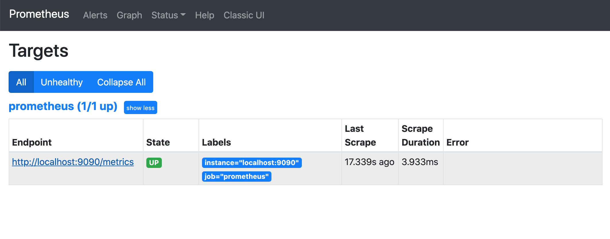
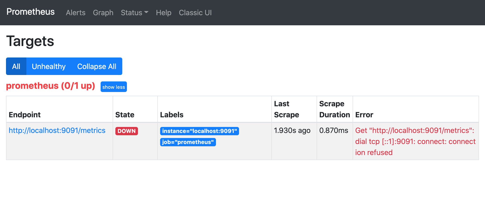
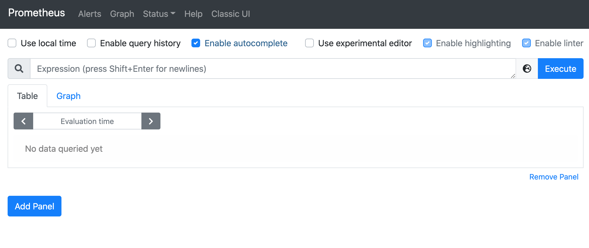
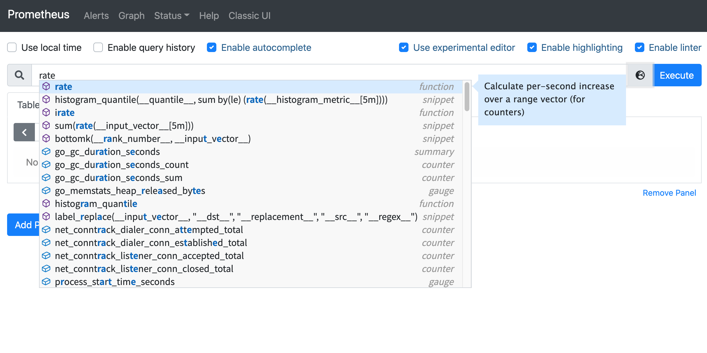
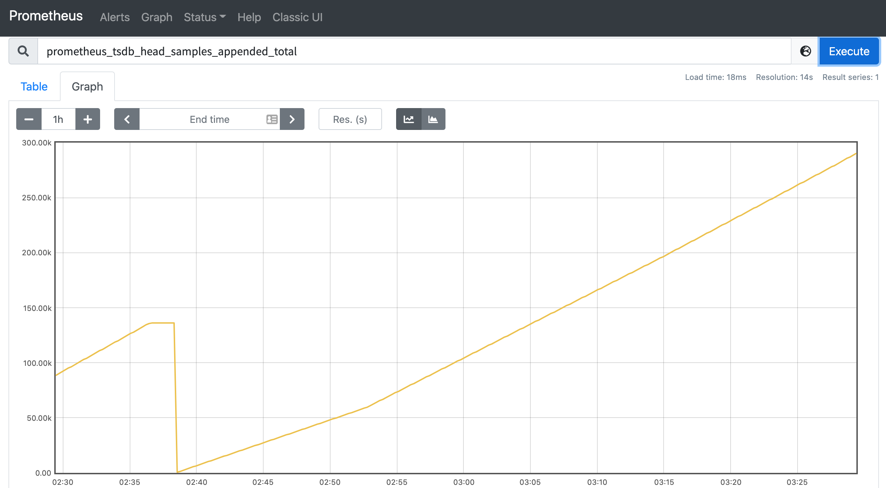
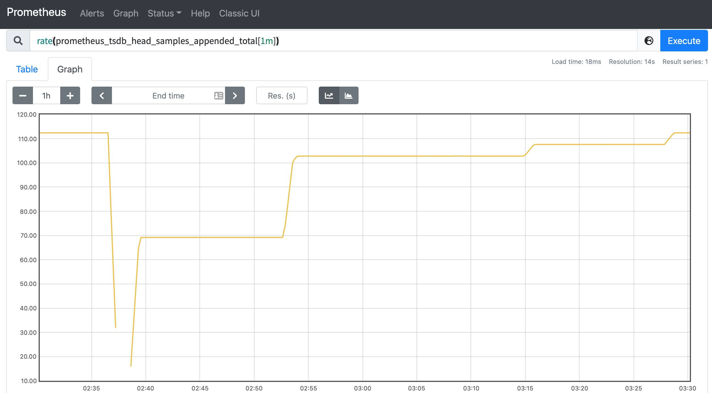

# 安裝配置

原文: [安装配置](https://p8s.io/docs/basic/install/)

## 下載 Prometheus

Prometheus 是採用 Go 語言開發的，直接使用獨立的二進製文件即可部署。下面我們就在一台 Linux 機器上來下載 Prometheus。

首先為我們的課程創建一個工作目錄：

```bash
mkdir $HOME/training
```

切換到該目錄下去：

```bash
cd $HOME/training
```

在 Prometheus 官網 https://prometheus.io/download/#prometheus 獲取適用於 Linux 的 Prometheus 安裝包，這裡我們選擇最新的 `2.38.0` 版本，我們這裡是 Linux 系統，所以選擇下載 `prometheus-2.38.0.linux-amd64.tar.gz`，其他系統請自行選擇。

```bash
wget https://github.com/prometheus/prometheus/releases/download/v2.38.0/prometheus-2.38.0.linux-amd64.tar.gz
```

解壓壓縮包：

```bash
tar -xvf prometheus-2.38.0.linux-amd64.tar.gz
```

切換到解壓縮後的目錄，執行 `prometheus --version` 命令查看是否正常：

```bash
$ cd prometheus-2.38.0.linux-amd64
$ ./prometheus --version

prometheus, version 2.38.0 (branch: HEAD, revision: 818d6e60888b2a3ea363aee8a9828c7bafd73699)
  build user:       root@e6b781f65453
  build date:       20220816-13:23:14
  go version:       go1.18.5
  platform:         linux/amd64
```

## 配置 Prometheus

前文我們已經下載完成了 Prometheus，接下來在啟動之前我們需要為其創建一個配置文件。

Prometheus 通過抓取監控目標上的 HTTP 端點來收集指標，而且 Prometheus 本身也暴露 metrics 指標接口，所以自然它也可以抓取並監控其自身的運行狀況，下面我們就用收集自身的數據為例進行配置說明。

將以下 Prometheus 配置保存為 `prometheus.yml` 文件（覆蓋現有示例的 `prometheus.yml` 文件）：

```yaml title="prometheus.yml"
global:
  scrape_interval: 5s # 抓取频率

scrape_configs:
  - job_name: "prometheus"
    static_configs:
      - targets: ["localhost:9090"]
```

上面配置了 Prometheus 每 5s 從自身抓取指標。 `global` 區域用於配置一些全局配置和默認值，`scrape_configs` 部分是用來告訴 Prometheus 要抓取哪些目標的。

在我們這裡使用 `static_configs` 屬性手動列舉了抓取的目標（以 `<host>:<port>` 格式），不過一般生產環境配置使用一個或多個 **服務發現** 來發現目標，完整的配置可以參考[官方文檔](https://prometheus.io/docs/prometheus/latest/configuration/configuration/)，後續我們也會不斷接觸相關的配置。

!!! info
    注意：5 秒鐘的抓取間隔是非常激進的，但對於我們這裡的演示目的來說還是非常有用的，因為我們希望可以快速獲得數據。在實際情況下，間隔通常在 10 到 60 秒之間。

## 啟動

現在我們使用新創建的配置文件啟動 Prometheus：

```bash
./prometheus
```

默認情況下，Prometheus 將其數據庫存儲在 `./data` 目錄中（可以使用 `--storage.tsdb.path` 標誌進行配置），並從文件 `prometheus.yml`（使用 -`-config.file` 配置）中讀取其配置。

!!! info
    注意：通過配置文件提供的任何設置都可以在運行時（通過發送 HUP 信號）重新加載，而通過標誌設置的任何變更都需要重新啟動服務器才能生效。

正常情況下 Prometheus 會啟動並在 `http://<host-ip>:9090/` 上顯示相關狀態信息，幾秒鐘過後會從其自身的 HTTP 指標端點收集關於自己的數據，我們也可以直接在瀏覽器中訪問它的指標端點來驗證 Prometheus 是否正在提供關於自己的指標：`http://<host-ip>:9090/metrics`。

## 查看監控目標

當啟動 Prometheus 後，我們可以檢查下它是否正確的抓取了配置的目標，可以在瀏覽器中訪問 `http://<host-ip>:9090/targets` 來查看所有的抓取目標列表：



如果我們配置的抓取本身的 prometheus 這個任務顯示的綠色的 `UP` 狀態，證明 Prometheus 已經正常抓取自身的監控指標了。

如果在抓取過程中出現任何問題（DNS 解析失敗、連接超時等等錯誤），抓取目標都會顯示為 `DOWN`，同時還有一條錯誤消息，提供有關抓取失敗的相關信息，可以幫助我們快速發現錯誤配置或不健康的目標。

例如，如果你將 Prometheus 配置在錯誤的端口上進行抓取（9091 而不是 9090），targets 目標頁面將顯示 `connection refused` 錯誤。



## 表達式查詢

Prometheus 內置了用於 PromQL 查詢的表達式查詢界面，瀏覽器中導航至 `http://<host-ip>:9090/graph` 並選擇 `Table` 視圖即可：



`Table` 選項卡顯示了表達式的每個輸出序列的最新值，而 `Graph` 選項卡是繪製隨時間變化的值，當然會在圖形對於服務端和瀏覽器來說是比較耗性能的，所以一般情況都是先在 `Table` 下嘗試查詢可能比較耗時的表達式，然後將表達式的查詢時間範圍縮小，再切換到 `Graph` 下面進行圖形繪製是一個更好的做法。

新版本的 Prometheus，還對查詢功能做了大幅度的升級，新增了一個非常實用的功能就是有查詢關鍵字相關的提示了。



這裡的提示功能不只是有指標名稱，還有查詢語句中使用到的查詢函數，也包括這個函數的用法提示等信息，可以說這個功能非常實用。

比如我們這裡可以查詢下面的指標，表示自進程開始以來被捉取入 Prometheus 本地存儲中的樣本總數：

```promql
prometheus_tsdb_head_samples_appended_total
```



然後可以使用下面的表達式了查詢 1 分鐘內平均每秒攝取的樣本數：

```promql
rate(prometheus_tsdb_head_samples_appended_total[1m])
```



我們可以在 `Table` 和 `Graph` 視圖下面切換查看表達式查詢的結果。