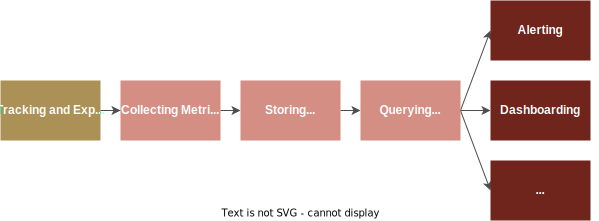
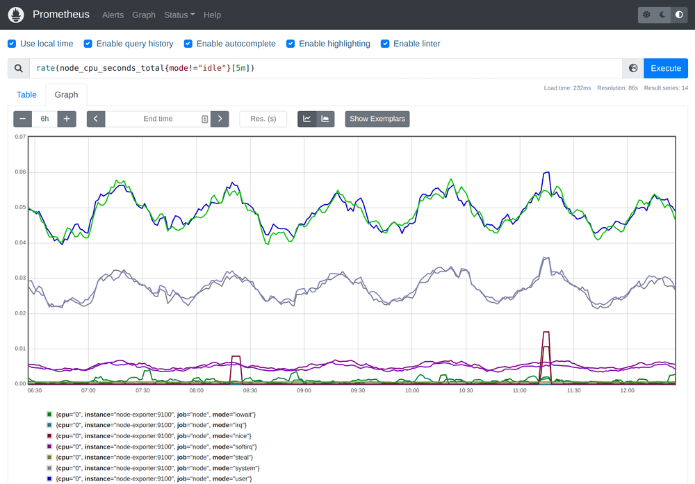
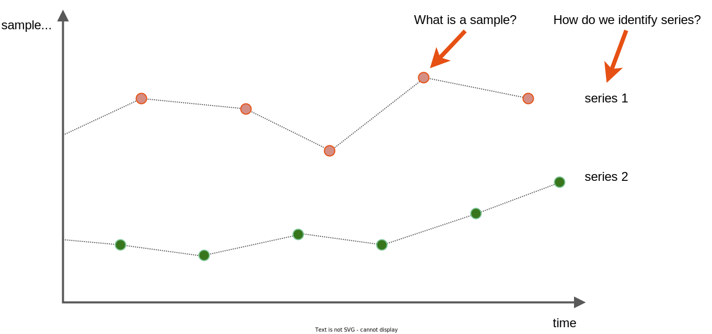
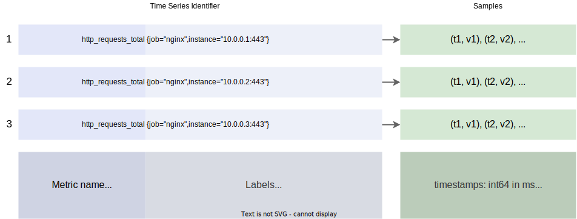
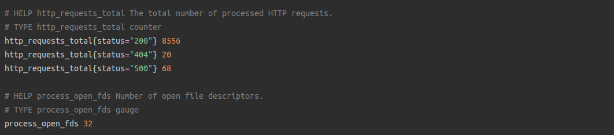
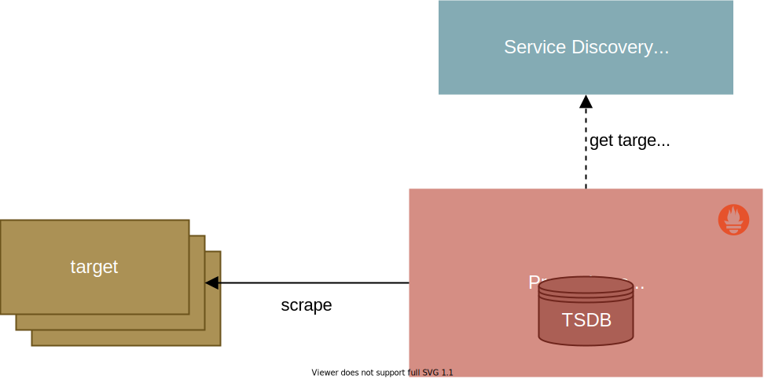
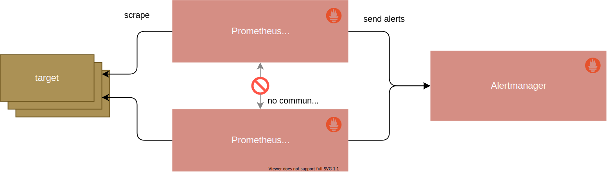

# Prometheus 簡介

原文: https://training.promlabs.com/training/introduction-to-prometheus/training-overview/introduction


本培訓教您基於 Prometheus 的監控的絕對基礎知識，涵蓋架構概述以及 Prometheus 的主要功能。作為本培訓的一部分，您還將下載、配置和運行基本的 Prometheus 設置。

在本次培訓之後，您將能夠描述 Prometheus 如何融入監控環境並以基本方式設置 Prometheus。

## 介紹

Prometheus 是一個監控系統和時間序列數據庫，特別適合監控動態雲環境。它具有維度數據模型和強大的查詢語言，並將檢測、指標收集、服務發現和警報等方面集成在一個生態系統中。

本教程會介紹基本的 Prometheus 概念。

## 什麼是 Prometheus?

Prometheus 是一個基於指標的監控和警報堆棧。

Prometheus 提供函式庫和服務器組件以提供完整的監控管道：

- 跟踪和公開指標
- 收集指標
- 存儲指標
- 查詢警報、儀表板等指標



這是 Prometheus 服務器的查詢和圖形 UI 的樣子：



Prometheus 足夠通用，可以監控堆棧的所有級別：您自己的應用程序軟件、第三方服務、主機、網絡設備或任何其他可以公開 Prometheus 兼容指標的東西。有些人甚至使用 Prometheus 來監控風力發電場或數字火車站顯示器。

由於它與服務發現機制的集成，Prometheus 特別適用於監控動態雲環境和集群調度程序，例如 Kubernetes。

## Prometheus 不是什麼？

Prometheus 專注於成為一個基於指標的監控系統，具有簡單的架構和明確的警報規則。

它明確不旨在解決：

- 日誌(logging)或跟踪(tracing)
- 基於機器學習或人工智能的異常檢測
- 水平擴展的集群存儲

這些可能是有價值的功能，但 Prometheus 將這些留給其他系統來解決，您可整合其它元件或工具來與 Prometheus 一起運行。

## 系統架構

下圖概述了整個 Prometheus 系統架構：


一個組織通常會運行一個或多個 Prometheus 服務器，它們構成了 Prometheus 監控設置的核心。您配置 Prometheus 服務器以使用 DNS、Consul、Kubernetes 等服務發現機制發現一組指標源（所謂的“目標”）。

然後，Prometheus 通過 HTTP 定期從這些目標中以基於文本的格式提取（或“抓取”）指標，並將收集到的數據存儲在本地時間序列數據庫中。目標可以是直接跟踪和公開有關其自身的 Prometheus 指標的應用程序，也可以是將指標從現有系統（如 MySQL 服務器）轉換為Prometheus 指標展示格式。

然後，Prometheus 服務器通過其內置的 Web UI、使用 Grafana 等儀表板工具或直接使用其 HTTP API 使收集的數據可用於查詢。

!!! info
    注意：每次 scrape 只將一個 target 的每個時間序列的當前值傳遞給 Prometheus，所以 **scrape 間隔** 決定了存儲數據的最終採樣頻率。目標進程本身不保留任何歷史度量數據。

您還可以將 Prometheus 服務器配置為根據收集的數據生成警報。但是，Prometheus 不會直接向人類發送警報通知。相反，它將原始警報轉發給作為單獨服務運行的 Prometheus Alertmanager。 Alertmanager 可以從組織中的多個（或所有）Prometheus 服務器接收警報，並提供一個集中位置來對這些警報進行分組、聚合和路由。最後，它通過電子郵件、Slack、PagerDuty 或其他通知服務發送通知。

## 主要特點和賣點

Prometheus 結合了多個關鍵功能，讓您可以有效地監控您的系統：

- 允許對指標進行分面跟踪的多維度數據模型
- 強大的查詢語言 (PromQL) 可提供靈活的答案
- 時間序列處理和警報的集成，
- 與服務發現機制集成以處理動態環境
- 操作簡單，
- 使用程式語言 Golang 來高效實現

我們將在以下各節中更詳細地討論這些要點。

## 數據模型

Prometheus 存儲時間序列，即在持續時間戳處採樣的數值流：



每個時間序列由一個"標識符"和一組"樣本值"組成：



### 時間系列標識符

每個時間序列數值流都由一個 **度量名稱 (Metric name)** 和一組稱為“**標籤**”的 **鍵/值對** 所組合成唯一標識:

- **度量名稱** 標識正在測量的系統的某個特定面向（如 http_requests_total，給定服務器進程處理的 HTTP 請求總數）。
- **標籤** 允許您將指標劃分為子維度（例如 method="GET" 與 method="POST" 告訴您處理了每種 HTTP 方法類型的請求數）。標籤可以有不同的來源：例如，檢測的目標本身可能會公開已被一組標籤拆分的指標，或者 Prometheus 服務器可能會將目標標籤附加到收集的系列中，以識別它們的來源。

構成時間序列標識符的指標名稱和標籤在 Prometheus 的 TSDB 中建立索引，用於在查詢數據時查找時間序列數據。

### 時間系列採樣

樣本形成一個系列的大量數據，並隨著時間的推移附加到一個系列的索引：

- **時間戳** 是毫秒精度的 64 位整數。
- **樣本值** 是 64 位浮點數（允許整數精度高達 2^53）。

## 指標傳輸格式

想要公開 Prometheus 指標的服務只需要公開一個 HTTP 端點（通常在 `/metrics`），該端點以 Prometheus 的基於文本的展示格式提供指標。這種端點的輸出是人類可讀的，最簡單的形式如下所示：



在此示例中，端點公開了一個 HTTP 請求計數器，該計數器由響應狀態代碼以及目標進程的打開文件描述符數分割。

要在瀏覽器中查看來自“真實”目標的實時指標，請查看我們運行的[演示服務的指標端點](http://demo.promlabs.com:10000/metrics)。

註釋的 #HELP 和 #TYPE 行提供了一個可選的文檔字符串和關於度量名稱的度量類型元數據。此格式中的每個未註釋行代表一個由 **度量名稱**、**標籤** 和 **採樣值** 組成的樣本記錄。這種基於行的格式可以輕鬆地從系統和服務中公開指標。

查看 Prometheus 文檔以獲取有關[指標傳輸格式](https://prometheus.io/docs/instrumenting/exposition_formats/#text-based-format)的完整詳細信息。 Prometheus 指標格式也正在演變成一個名為 [OpenMetrics](https://openmetrics.io/) 的開放標準，Prometheus 也支持該標準。

## 查詢語言

為了利用收集到的數據，Prometheus 實現了自己的查詢語言 PromQL。 PromQL 是一種函數式語言，經過優化，可以評估對時間序列數據進行靈活高效的計算。與類似 SQL 的語言相比，PromQL 僅用於讀取數據，而不用於插入、更新或刪除數據（這發生在查詢引擎之外）。


我們將在這裡看幾個簡單的例子。

給定一組具有度量名稱 http_requests_total 的 HTTP 請求計數器時間序列、一個指示響應狀態代碼的狀態標籤和一個指示 HTTP 路徑的路徑標籤，以下查詢選擇所有已處理 HTTP 請求的總數，結果為 500 狀態碼：

```promql
http_requests_total{status="500"}
```

由於絕對計數很少有用，以下查詢會告訴您每個選定計數器系列的每秒增長率，即 5 分鐘窗口內的平均值：

```promql
rate(http_requests_total{status="500"}[5m])
```

並且您可以計算各種 per-path status="500" 錯誤率與相同 HTTP 路徑的總請求率的比率，如下所示：

```promql
sum by(path) (rate(http_requests_total{status="500"}[5m]))
 /
sum by(path) (rate(http_requests_total[5m]))
```

您還可以僅選擇大於 5% 的每條路徑錯誤率比率：

```promql
sum by(path) (rate(http_requests_total{status="500"}[5m]))
 /
sum by(path) (rate(http_requests_total[5m]))
* 100
> 5
```

這些是您將在 PromQL 中看到的一些更常見的結構，但該語言具有更多的特性和功能。

## 集成警報

Prometheus 將時間序列數據的收集和處理與主動警報系統集成在一起。它的理念是在單個數據模型中收集盡可能多的關於您的系統的數據，以便您可以在其上製定集成查詢。用於臨時查詢和儀表板的查詢語言也用於定義警報規則。這與 Nagios 等故障檢測系統（運行定期檢查腳本並保留很少的歷史數據）與被動存儲指標的獨立時間序列數據庫之間的歷史分歧形成鮮明對比。

例如，以下警報規則（作為規則配置文件的一部分加載到 Prometheus 中）會在導致 500 狀態代碼的 HTTP 請求數量超過給定路徑總流量的 5% 時向您發出警報：

```promql hl_lines="4-8"
alert: Many500Errors
# This is the PromQL expression that forms the "heart" of the alerting rule.
expr: |
  (
      sum by(path) (rate(http_requests_total{status="500"}[5m]))
    /
      sum by(path) (rate(http_requests_total[5m]))
  ) * 100 > 5
for: 5m
labels:
  severity: "critical"
annotations:
  summary: "Many 500 errors for path {{$labels.path}} ({{$value}}%)"
```

`expr` 字段中的 PromQL 表達式構成警報規則的核心，而其他基於 YAML 的配置選項允許您控制警報元數據、路由標籤等。這可以根據收集的數據進行精確和準確的警報。

## 服務發現集成

現代動態 IT 環境為監控系統帶來了新的挑戰：

- 雲提供商上的按需 VM 可根據需要進行擴展和縮減
- 服務實例由容器編排器（例如 Kubernetes、Docker Swarm 或 Mesos）動態調度到主機上
- 微服務的趨勢導致越來越多的單個服務需要運行和監控

問題出現了：監控系統如何仍然能夠理解這個動態的世界？它如何知道當前應該存在哪些機器或服務實例，它們的身份是什麼，以及如何從中獲取指標？操作員不再可能靜態配置此信息，因為它太複雜且變化太快。

為了解決這個問題，Prometheus 與基礎設施中的常見服務發現提供程序集成，以從外部事實來源發現並持續更新其監控目標：



Prometheus 支持多種內置服務發現機制，例如：

- 在雲提供商（AWS、Azure、谷歌……）上發現虛擬機，
- 在集群編排器（Kubernetes、Marathon 等）上發現服務實例，
- 使用通用查找方法（如 DNS、Consul、Zookeeper 或自定義發現機制）發現目標。

Prometheus 將服務發現用於三個不同但相關的目的：

- 構建應該存在哪些目標的視圖（以便它可以記錄並在缺少目標時發出警報），
- 要獲取有關如何通過 HTTP 從目標中提取指標的技術信息，
- 使用有關目標的標記元數據豐富從目標收集的系列。

通過這種方式，Prometheus 使用服務發現作為事實來源來可靠地監控動態環境，同時最大限度地減少管理開銷。

## 操作簡單

Prometheus 的核心是概念上簡單且易於操作。

### 使用 Golang 程式語言撰寫

Prometheus 是用 [Go](https://golang.org/) 編寫的，靜態發布二進製文件可以在不依賴於外部運行時（如 JVM）、解釋器（如 Python 或 Ruby）或共享系統庫的情況下進行部署。

### 獨立節點

每個 Prometheus 服務器獨立於任何其他 Prometheus 服務器收集數據並評估警報規則，並且僅在本地存儲數據，而無需緊密的集群或複制。

### 簡單的 HA 設置

要為警報創建高可用性 (HA) 設置，您仍然可以運行兩個配置相同的 Prometheus 服務器來計算相同的警報（Alertmanager 將刪除重複的通知）：



當然，Prometheus 的大規模部署或有特殊需求的設置仍然會變得複雜。 Prometheus 還提供接口來解決其外部的一些限制，例如持久的長期存儲。但是構建塊很簡單。

## 高效實施

Prometheus 需要能夠同時從多個系統和服務中收集詳細的維度數據。為此，特別是對以下組件進行了高度優化：

- 抓取和解析傳入的指標，
- 寫入和讀取時間序列數據庫，
- 根據 TSDB 數據評估 PromQL 表達式。

根據經驗，單個大型 Prometheus 服務器每秒可以攝取多達 100 萬個時間序列樣本，並使用 1-2 個字節在磁盤上存儲每個樣本。它可以一次處理數百萬並發活動（存在於所有目標的一次抓取迭代中）時間序列。

## 結論

恭喜！在本次培訓中，您學到了：

- Prometheus 關注什麼以及它試圖不做的事情
- Prometheus 如何從目標收集時間序列數據
- PromQL 如何基於收集的數據實現靈活而強大的查詢
- Prometheus 如何將時間序列數據收集和警報聯繫在一起
- 服務發現如何幫助抓取和標記目標

您現在應該準備好解釋 Prometheus 的核心原理和特性，並運行 Prometheus 以從目標中收集數據。