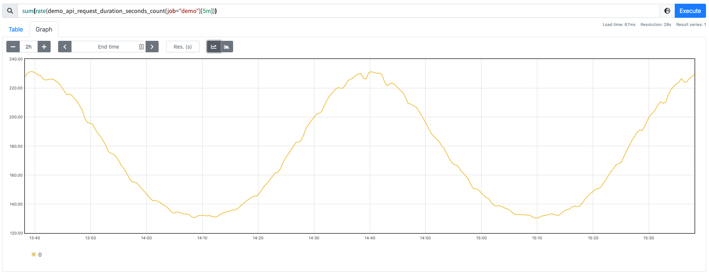
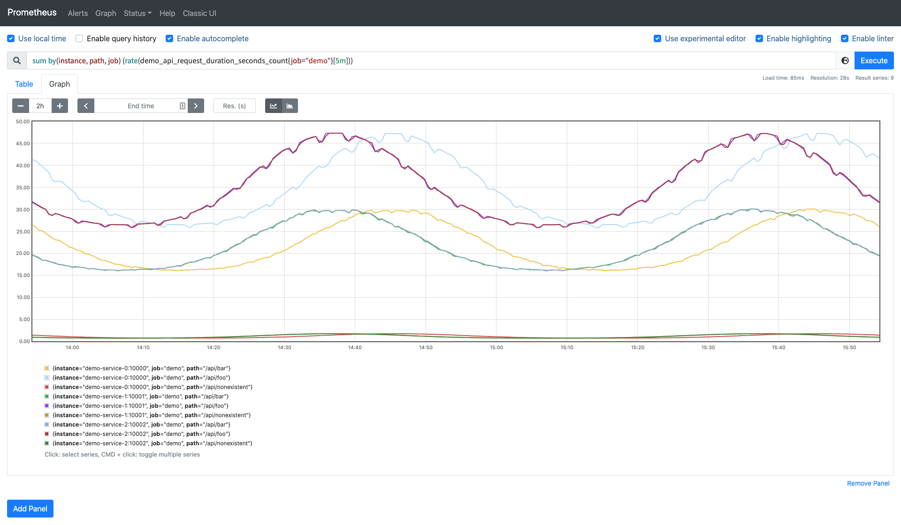
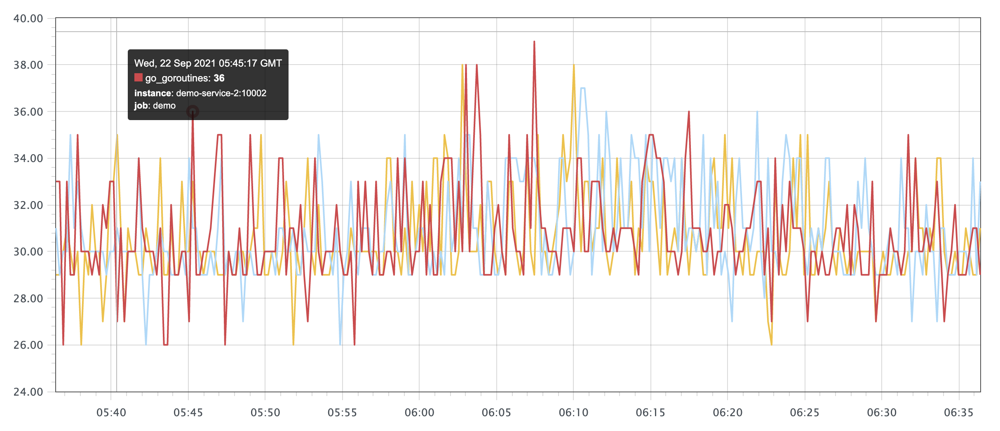
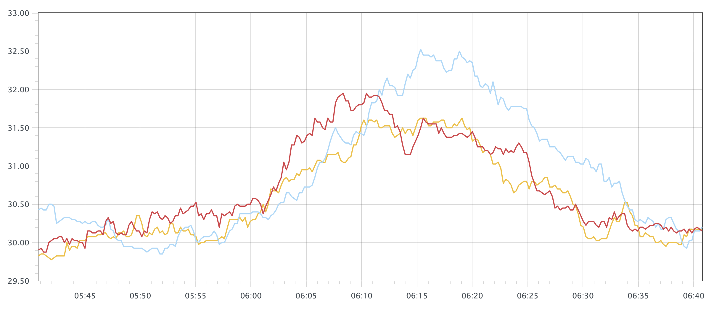
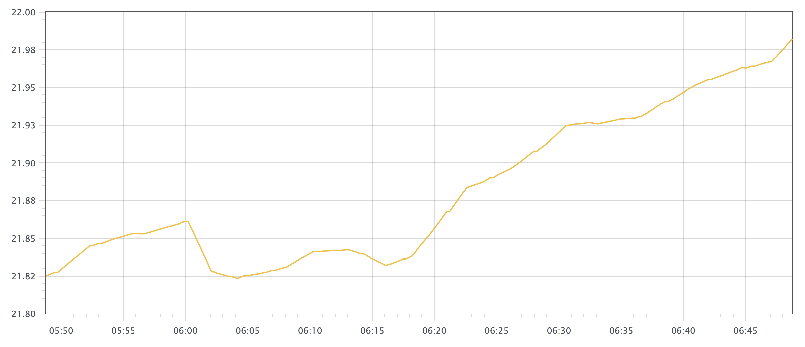

# 聚合

原文: [聚合](https://p8s.io/docs/promql/query/aggregate/)

我們知道 Prometheus 的時間序列數據是多維數據模型，我們經常就有根據各個維度進行匯總的需求。

## 基於標籤聚合

例如我們想知道我們的 `demo` 服務每秒處理的請求數，那麼可以將單個的速率相加就可以。

```promql
sum(rate(demo_api_request_duration_seconds_count{job="demo"}[5m]))
```

可以得到如下所示的結果：



但是我們可以看到繪製出來的圖形沒有保留任何標籤維度，一般來說可能我們希望保留一些維度，例如，我們可能更希望計算每個 `instance` 和 `path` 的變化率，但並不關心單個 `method` 或者 `status` 的結果，這個時候我們可以在 `sum()` 聚合器中添加一個 `without()` 的修飾符：

```promql
sum without(method, status) (rate(demo_api_request_duration_seconds_count{job="demo"}[5m]))
```

上面的查詢語句相當於用 `by()` 修飾符來保留需要的標籤的取反操作：

```promql
sum by(instance, path, job) (rate(demo_api_request_duration_seconds_count{job="demo"}[5m]))
```

現在得到的 `sum` 結果是就是按照 `instance`、`path`、`job` 來進行分組去聚合的了：



這裡的分組概念和 SQL 語句中的分組去聚合就非常類似了。

除了 `sum()` 之外，Prometheus 還支持下面的這些聚合器：

- sum()：對聚合分組中的所有值進行求和
- min()：獲取一個聚合分組中最小值
- max()：獲取一個聚合分組中最大值
- avg()：計算聚合分組中所有值的平均值
- stddev()：計算聚合分組中所有數值的標準差
- stdvar()：計算聚合分組中所有數值的標準方差
- count()：計算聚合分組中所有序列的總數
- count_values()：計算具有相同樣本值的元素數量
- bottomk(k, ...)：計算按樣本值計算的最小的 k 個元素
- topk(k，...)：計算最大的 k 個元素的樣本值
- quantile(φ，...)：計算維度上的 φ-分位數(0≤φ≤1)
- group(...)：只是按標籤分組，並將樣本值設為 1。

!!! "練習"
    1.按 `job` 分組聚合，計算我們正在監控的所有進程的總內存使用量（`process_resident_memory_bytes` 指標）：

    ```promql
    sum by(job) (process_resident_memory_bytes)
    ```

    2.計算 `demo_cpu_usage_seconds_total` 指標有多少不同的 CPU 模式：

    ```promql
    count (group by(mode) (demo_cpu_usage_seconds_total))
    ```

    3.計算每個 job 任務和指標名稱的時間序列數量：

    ```promql
    count by (job, __name__) ({__name__ != ""})
    ```

## 基於時間聚合

前面我們已經學習瞭如何使用 `sum()`、`avg()` 和相關的聚合運算符從標籤維度進行聚合，這些運算符在一個時間內對多個序列進行聚合，但是有時候我們可能想在每個序列中按時間進行聚合，例如，使尖銳的曲線更平滑，或深入了解一個序列在一段時間內的最大值。

為了基於時間來計算這些聚合，PromQL 提供了一些與標籤聚合運算符類似的函數，但是在這些函數名前面附加了 `_over_time()`：

- `avg_over_time(range-vector)`：區間向量內每個指標的平均值。
- `min_over_time(range-vector)`：區間向量內每個指標的最小值。
- `max_over_time(range-vector)`：區間向量內每個指標的最大值。
- `sum_over_time(range-vector)`：區間向量內每個指標的求和。
- `count_over_time(range-vector)`：區間向量內每個指標的樣本數據個數。
- `quantile_over_time(scalar, range-vector)`：區間向量內每個指標的樣本數據值分位數。
- `stddev_over_time(range-vector)`：區間向量內每個指標的總體標準差。
- `stdvar_over_time(range-vector)`：區間向量內每個指標的總體標準方差。

例如，我們查詢 demo 實例中使用的 `goroutine` 的原始數量，可以使用查詢語句 `go_goroutines{job="demo"}`，這會產生一些尖銳的峰值圖：



我們可以通過對圖中的每一個點來計算 10 分鐘內的 goroutines 數量進行平均來使圖形更加平滑：

```promql
avg_over_time(go_goroutines{job="demo"}[10m])
```

這個查詢結果生成的圖表看起來就平滑很多了：



比如要查詢 1 小時內內存的使用率則可以用下面的查詢語句：

```promql
100 * (1 - ((avg_over_time(node_memory_MemFree_bytes[1h]) + avg_over_time(node_memory_Cached_bytes[1h]) + avg_over_time(node_memory_Buffers_bytes[1h])) / avg_over_time(node_memory_MemTotal_bytes[1h])))
```



## 子查詢

上面所有的 `_over_time()` 函數都需要一個範圍向量作為輸入，通常情況下只能由一個區間向量選擇器來產生，比如 `my_metric[5m]`。但是如果現在我們想使用例如 `max_over_time()` 函數來找出過去一天中 demo 服務的最大請求率應該怎麼辦呢？

請求率 `rate` 並不是一個我們可以直接選擇時間的原始值，而是一個計算後得到的值，比如：

```promql
rate(demo_api_request_duration_seconds_count{job="demo"}[5m])
```

如果我們直接將表達式傳入 `max_over_time()` 並附加一天的持續時間查詢的話就會產生錯誤：

```promql
# ERROR!
max_over_time(
  rate(
    demo_api_request_duration_seconds_count{job="demo"}[5m]
  )[1d]
)
```

實際上 Prometheus 是支持子查詢的，它允許我們首先以指定的步長在一段時間內執行內部查詢，然後根據子查詢的結果計算外部查詢。子查詢的表示方式類似於區間向量的持續時間，但需要冒號後添加了一個額外的步長參數：`[<duration>:<resolution>]`。

這樣我們可以重寫上面的查詢語句，告訴 Prometheus 在一天的範圍內評估內部表達式，步長分辨率為 15s：

```promql
max_over_time(
  rate(
    demo_api_request_duration_seconds_count{job="demo"}[5m]
  )[1d:15s] # 在1天內明確地評估內部查詢，步長為15秒
)
```

也可以省略冒號後的步長，在這種情況下，Prometheus 會使用配置的全局 `evaluation_interval` 參數進行評估內部表達式：

```promql
max_over_time(
  rate(
    demo_api_request_duration_seconds_count{job="demo"}[5m]
  )[1d:]
)
```

這樣就可以得到過去一天中 demo 服務最大的 5 分鐘請求率，不過冒號仍然是需要的，以明確表示運行子查詢。子查詢還允許添加一個偏移修飾符 `offset` 來對內部查詢進行時間偏移，類似於瞬時和區間向量選擇器。

但是也需要注意長時間計算子查詢代價也是非常昂貴的，我們可以使用記錄規則（後續會講解）預先記錄中間的表達式，而不是每次運行外部查詢時都實時計算它。

!!! info "練習"
    輸出過去一小時內 demo 服務的最大 95 分位數延遲值（1 分鐘內平均），按 path 劃分：

    ```promql
    max_over_time(
      histogram_quantile(0.95, sum by(le, path) (
        rate(demo_api_request_duration_seconds_bucket[1m])
        )
      )[1h:]
    )
    ```
