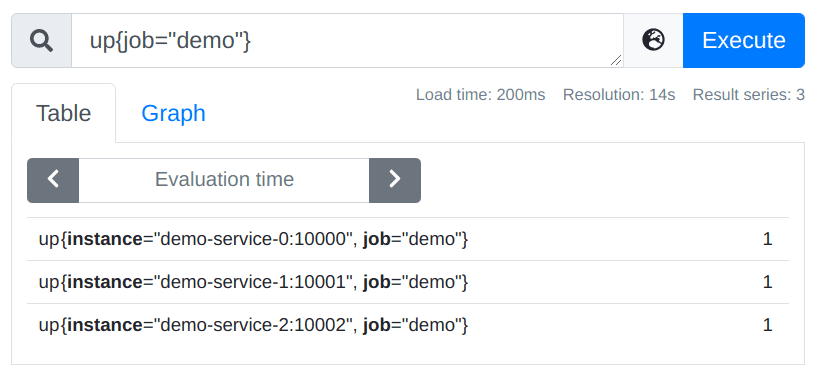
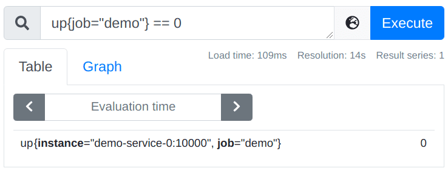
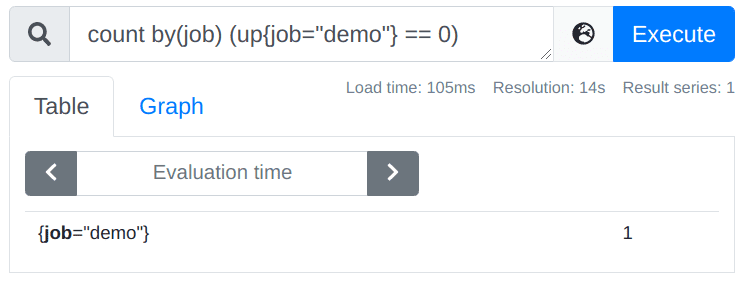
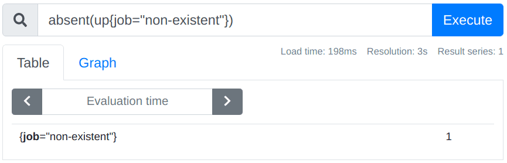

# 檢測

原文: [检测](https://p8s.io/docs/promql/query/check/)

本節我們將學習如何來檢查我們的實例數據抓取健康狀況。

## 檢查抓取實例

每當 Prometheus 抓取一個目標時，它都會存儲一個合成的樣本，其中包含指標名稱 `up` 和被抓取實例的 `job` 和 `instance` 標籤，如果抓取成功，則樣本的值被設置為 `1`，如果抓取失敗，則設置為 `0`，所以我們可以通過如下所示的查詢來獲取當前哪些實例處於正常或掛掉的狀態：

```promql
up{job="demo"}
```

正常三個演示服務實例都處於正常狀態，所以應該都為 `1`。如果我們將第一個實例停掉，重新查詢則第一個實例結果為 `0`：



如果只希望顯示 `down` 掉的實例，可以通過過濾 `0` 值來獲取：



或者獲取掛掉實例的總數：

```promql
count by(job) (up{job="demo"} == 0)
```



一般情況下這種類型的查詢會用於指標抓取健康狀態報警。

!!! info
    注意：因為 `count()` 是一個聚合運算符，它期望有一組維度的時間序列作為其輸入，並且可以根據 `by` 或 `without` 子句將輸出序列分組。任何輸出組只能基於現有的輸入序列，如果根本沒有輸入序列，就不會產生輸出。

## 檢查序列數據

在某些情況下，只查看序列的樣本值是不夠的，有時還需要檢測是否存在某些序列，上面我們用 `up{job="demo"} == 0` 語句來查詢所有無法抓取的演示服務實例，但是只有已經被抓取的目標才會被加上 `up` 指標，如果 Prometheus 都沒有抓取到任何的演示服務目標應該怎麼辦呢？ 比如它的抓取配置出問題了，服務發現可能返回也為空，或者由於 Prometheus 自身出了某些問題。

在這種情況下，`absent()` 函數就非常有用了，`absent()` 將一個瞬時向量作為其輸入，當輸入包含序列時，將返回一個空結果，不包含時將返回單個輸出序列，而且樣本值為 `1`。

例如，查詢語句 `absent(up{job="demo"})` 將得到一個空的輸出結果，如果測試一個沒有被抓取的 `job` 是否存在的時候，將得到樣本值 `1`。



這可以幫助我們檢測序列是否存在的情況。此外還有一個 `absent()` 的變種，叫做 `absent_over_time()`，它接受一個區間向量，告訴你在該輸入向量的整個時間範圍內是否有樣本。

!!! info "練習"
    1.構建一個查詢，檢測指標 `demo_api_request_duration_seconds_count` 是否具有 `PUT` 的 `method` 標籤的序列。

    ```promql
    absent(demo_api_request_duration_seconds_count{method="PUT"})
    ```

    2.構建一個查詢，當過去一小時內任務 `non-existent` 沒有記錄 `up` 指標時，該查詢輸出一個系列。

    ```promql
    absent_over_time(up{job="non-existent"}[1h])
    ```

https://wistron.webhook.office.com/webhookb2/c283298c-1460-4526-8c68-ab18a7691d41@de0795e0-d7c0-4eeb-b9bb-bc94d8980d3b/IncomingWebhook/d5524a67e4d34741a7123a55e5c6acf6/ddaec1ea-a778-4a54-a930-ba53127d7ee6