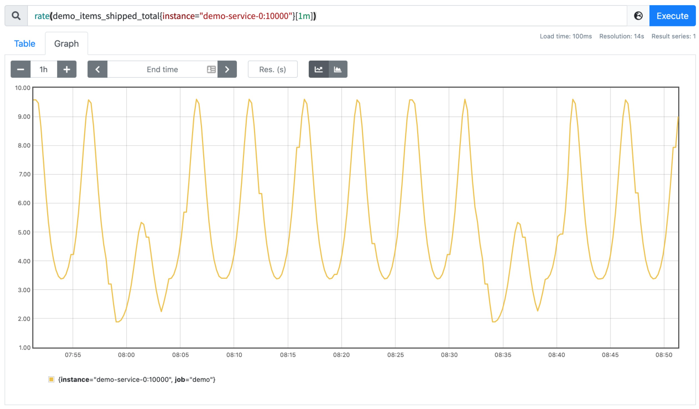
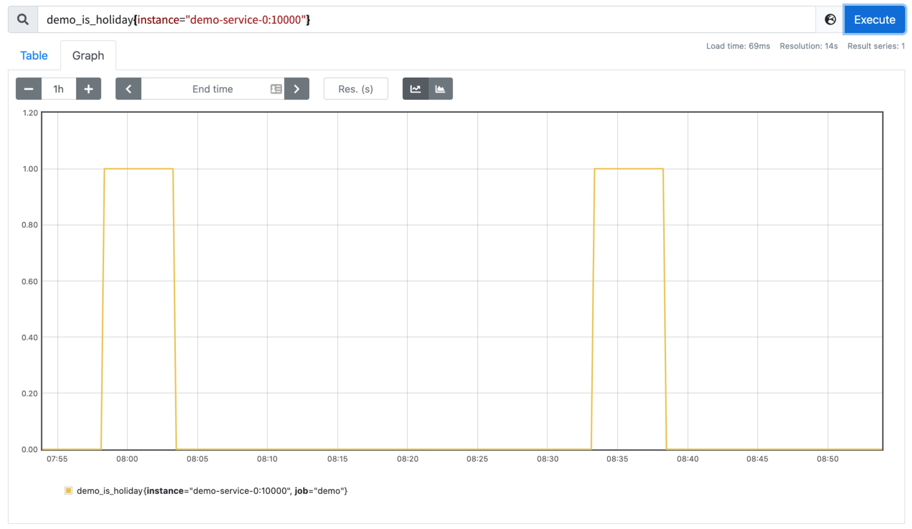
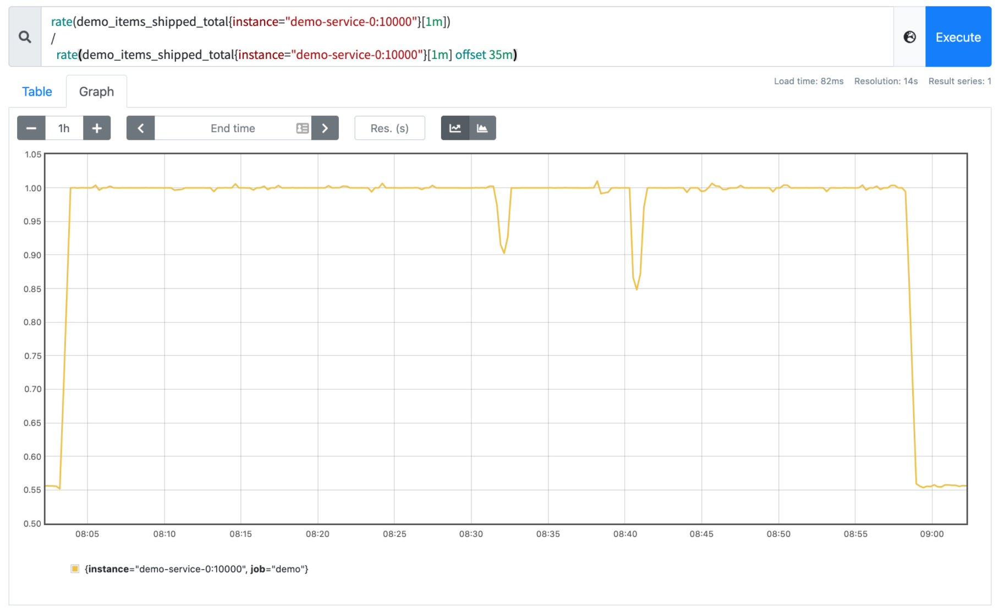
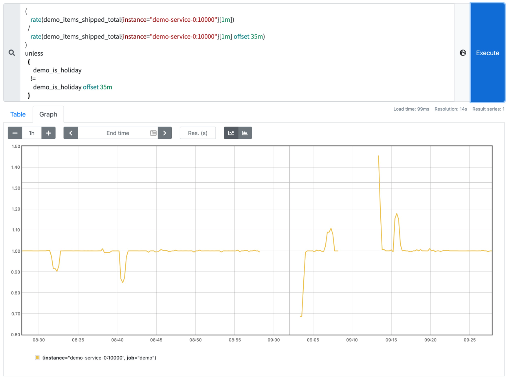

# 數據對比

原文: [数据对比](https://p8s.io/docs/promql/query/compare/)

有的時候我們可能需要去訪問過去的數據，並和當前數據進行對比。例如，我們可能想比較今天的請求率和一周前的請求率之間的差異。我們可以在任何區間向量或瞬時向量選擇器上附加一個偏移量 `offset<duration>` 的修飾符（比如 `my_metric offset 5m` 或者 `my_metric[1m] offset 7d`）。

讓我們來看一個示例，在我們的 demo 服務中暴露了一個 `Counter` 指標 `demo_items_shipped_total`，該指標追踪物品的運輸情況，用 5 分鐘來模擬"每日"流量週期，所以我們不必等待一整天才能查看該時段的數據。

我們只使用第一個演示服務實例來測試即可，首先我們來看看它的速率：

```promql
rate(demo_items_shipped_total{instance="demo-service-0:10000"}[1m])
```



該服務還暴露了一個 0 或 1 的布爾指標，告訴我們現在是否是假期：



將假期與發貨商品率進行比較，注意到節假日時它會減少!我們可以嘗試將當前的發貨速度與 7"天"（7 * 5 分鐘）前的速度進行比較，看看是否有什麼不正常的情況。

```promql
  rate(demo_items_shipped_total{instance="demo-service-0:10000"}[1m])
/
  rate(demo_items_shipped_total{instance="demo-service-0:10000"}[1m] offset 35m)
```

通常情況下，該比率約為 1，但若當天或前一天是假期時，我們得到的比率比正常情況下要略低或高。



但是，如果原因只是假期，我們想忽略這個較低或較高的比率。我們可以在過去或現在是假期的時候過濾掉這個比率，方法是附加一個 `unless` 集合操作符。

```promql
(
    rate(demo_items_shipped_total{instance="demo-service-0:10000"}[1m])
  /
    rate(demo_items_shipped_total{instance="demo-service-0:10000"}[1m] offset 35m)
)
unless
  (
    demo_is_holiday == 1  # Is it currently a holiday?
  or
    demo_is_holiday offset 35m == 1  # Was it a holiday 7 "days" ago?
  )
```

或者另外一種方法，我們只需要比較今天和一周前是否有相同的節日：

```promql
(
    rate(demo_items_shipped_total{instance="demo-service-0:10000"}[1m])
  /
    rate(demo_items_shipped_total{instance="demo-service-0:10000"}[1m] offset 35m)
)
unless
  (
      demo_is_holiday
    !=
      demo_is_holiday offset 35m
  )
```

這樣我們就可以過濾掉當前時間有假期或過去有假期的結果。



!!! info "練習"
    1.構建一個查詢，計算每個 path 路徑的總請求率和 35 分鐘前的差異。

    ```promql
    sum by(path) (rate(demo_api_request_duration_seconds_count[5m])) -
      sum by(path) (rate(demo_api_request_duration_seconds_count[5m] offset 35m))
    ```

