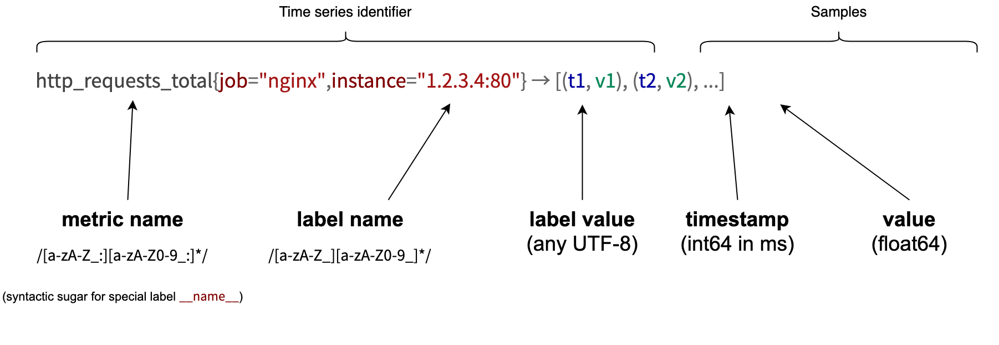

# 數據模型

原文: [数据模型](https://p8s.io/docs/promql/data-model/)

在開始學習 PromQL 的知識之前，我們先重新來熟悉下 Prometheus 的數據模型。

## 指標格式



Prometheus 會將所有採集到的樣本數據以 **時間序列** 的方式保存在內存數據庫中，並且定時保存到硬盤上。時間序列是按照時間戳和值的序列順序存放的，我們稱之為 **向量 (vector)**，每條時間序列通過 **指標名稱(metrics name)** 和 **一組標籤集(labelset)** 命名。如下所示，可以將時間序列理解為一個以時間為 X 軸的數字矩陣：

```bash
^
  │   . . . . . . . . . . . . . . . . .   . .   node_cpu_seconds_total{cpu="cpu0",mode="idle"}
  │     . . . . . . . . . . . . . . . . . . .   node_cpu_seconds_total{cpu="cpu0",mode="system"}
  │     . . . . . . . . . .   . . . . . . . .   node_load1{}
  │     . . . . . . . . . . . . . . . .   . .
  v
    <------------------ 時間 ---------------->
```

在時間序列中的每一個數據點稱為一個樣本（sample），樣本由以下三部分組成：

- **指標 (metric)**：指標名和描述當前樣本特徵的標籤集合
- **時間戳 (timestamp)**：一個精確到毫秒的時間戳
- **樣本值 (value)**： 一個 float64 的浮點型數據表示當前樣本的值

如下所示：

```bash
<--------------- metric ---------------------><-timestamp -><-value->
http_request_total{status="200", method="GET"}@1434417560938 => 94355
http_request_total{status="200", method="GET"}@1434417561287 => 94334

http_request_total{status="404", method="GET"}@1434417560938 => 38473
http_request_total{status="404", method="GET"}@1434417561287 => 38544

http_request_total{status="200", method="POST"}@1434417560938 => 4748
http_request_total{status="200", method="POST"}@1434417561287 => 4785
```

在形式上，所有的指標都通過如下格式表示：

```bash
<metric name>{<label name> = <label value>, ...}
```

- **指標的名稱** 可以反映被監控樣本的含義（比如，http*request_total 表示當前系統接收到的 HTTP 請求總量）。指標名稱只能由 ASCII 字符、數字、下劃線以及冒號組成並必須符合正則表達式 `[a-zA-Z*:]a-zA-Z0-9\*:]\*`。

- **標籤 (label)** 反映了當前樣本的特徵維度，通過這些維度 Prometheus 可以對樣本數據進行過濾，聚合等。標籤的名稱只能由 ASCII 字符、數字以及下劃線組成並滿足正則表達式 `[a-zA-Z_][a-zA-Z0-9_]*`。

!!! info
    注意：在 TSDB 內部，指標名稱也只是一個特殊的標籤，標籤名為 **__name__**，由於這個標籤在 PromQL 中隨時都會使用，所以在使用 PromQL 查詢的時候就被單獨寫在了標籤列表前面了。另外像 `method=""` 這樣的空標籤在 Prometheus 種相當於一個不存在的標籤，在 Prometheus 代碼裡面是明確地剝離了空標籤的，並不會存儲它們。


## 指標類型

每個不同的 **metric_name** 和 **label** 組合都稱為 **時間序列**，在 Prometheus 的表達式語言中，表達式或子表達式包括以下四種類型之一：

- **瞬時向量（Instant vector）**：一組時間序列，每個時間序列包含單個樣本，它們共享相同的時間戳。也就是說，表達式的返回值中只會包含該時間序列中的最新的一個樣本值。而相應的這樣的表達式稱之為瞬時向量表達式。
- **區間向量（Range vector）**：一組時間序列，每個時間序列包含一段時間範圍內的樣本數據，這些是通過將時間選擇器附加到方括號中的瞬時向量（例如[5m]5 分鐘）而生成的。
- **標量（Scalar）**：一個簡單的數字浮點值。
- **字符串（String）**：一個簡單的字符串值。

所有這些指標都是 Prometheus 定期從 `~/metrics` 接口那裡採集過來的。採集的間隔時間的設置由 `prometheus.yml` 配置中的 `scrape_interval` 指定。最多抓取間隔為 30 秒，這意味著至少每 30 秒就會有一個帶有新時間戳記錄的新數據點，這個值可能會更改，也可能不會更改，但是每隔 `scrape_interval` 都會產生一個新的數據點。

