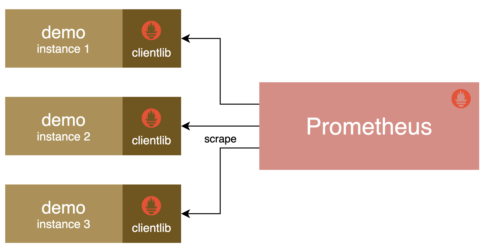
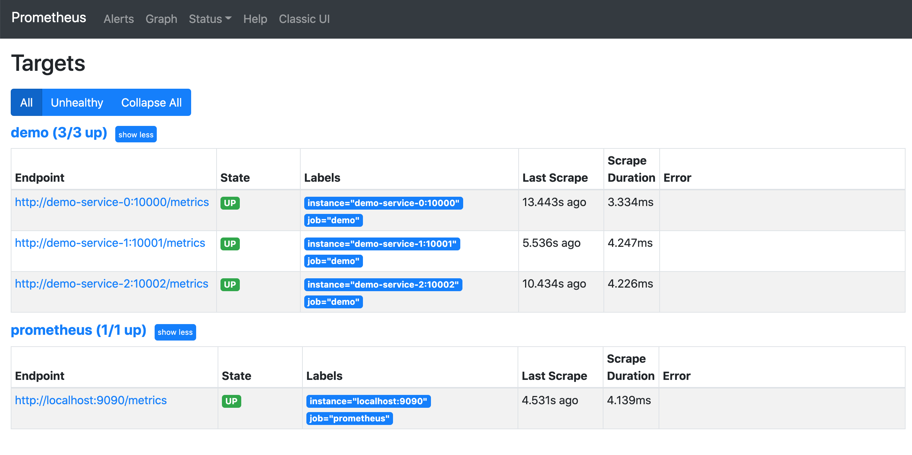

# 演示服務

原文: [演示服务](https://p8s.io/docs/promql/demo-service/)

為了盡可能詳細地給大家演示 PromQL 指標查詢，這裡我們將 Fork 一個開源的 Prometheus 演示服務來進行查詢，這樣可以讓我們更加靈活地對指標數據進行控制，項目倉庫地址：https://github.com/cnych/prometheus_demo_service，這是一個 Go 語言開發的服務，我們可以自己構建應用。

首先準備 golang 環境：

```bash
$ wget https://golang.org/dl/go1.16.3.linux-amd64.tar.gz
$ rm -rf /usr/local/go && tar -C /usr/local -xzf go1.16.3.linux-amd64.tar.gz
# 配置環境變量，可以將下面命令添加到 /etc/profile 中
$ export PATH=$PATH:/usr/local/go/bin
# 執行go命令驗證
$ go version
go version go1.16.3 linux/amd64
```

然後 clone 代碼構建：

```bash
# 首先clone代碼
$ git clone https://github.com/cnych/prometheus_demo_service
$ cd prometheus_demo_service
# 構建
$ env GOOS=linux GOARCH=amd64 go build -o prometheus_demo_service
```

構建完成後啟動 3 個服務，分別監聽 10000、10001、10002 端口：

```bash
$ ps -aux |grep demo
root      15224  2.9  0.1 834120 14836 pts/0    Sl   10:39   0:00 ./prometheus_demo_service --listen-address=:10000
root      15333  3.0  0.2 899656 16888 pts/0    Sl   10:39   0:00 ./prometheus_demo_service --listen-address=:10001
root      15353  2.7  0.1 907596 14896 pts/0    Sl   10:39   0:00 ./prometheus_demo_service --listen-address=:10002
```

上面 3 個服務都在 `/metrics` 端點暴露了一些指標數據，我們可以把這 3 個服務配置到 Prometheus 抓取任務中，這樣後續就可以使用這幾個服務來進行 PromQL 查詢說明了。

完整的 `prometheus.yml` 配置文件如下所示：

```yaml title="prometheus.yml"
global:
  scrape_interval: 5s # 抓取頻率

scrape_configs:
  - job_name: "prometheus"
    static_configs:
      - targets: ["localhost:9090"]
  # 配置demo抓取任務
  - job_name: demo
    scrape_interval: 15s
    scrape_timeout: 10s
    static_configs:
      - targets:
          - demo-service-0:10000
          - demo-service-1:10001
          - demo-service-2:10002
```

這裡我們將 3 個服務配置到名為 demo 的抓取任務中，為了看上去更加清晰，這裡我們使用 `demo-service-<index>` 來代替服務地址，直接在 Prometheus 所在節點的 `/etc/hosts` 文件中添加上對應服務的映射：

```bash
$ cat /etc/hosts
......
192.xxx.xxx.xxx demo-service-0
192.xxx.xxx.xxx demo-service-1
192.xxx.xxx.xxx demo-service-2
```

!!! info
    請使用個自主機的IP來替換上述範例中的 `192.xxx.xxx.xxx`!



配置完成後直接啟動 Prometheus 服務即可（可以參考前面的[安裝配置](../prometheus/install.md)章節）：

```bash
./prometheus
```

啟動後可以在 `/targets` 頁面查看是否在正確抓取監控指標：



該演示服務模擬了一些用於我們測試的監控指標，包括：

- 暴露請求計數和響應時間（以 path、method 和響應狀態碼為標籤 key）的 HTTP API 服務
- 一個定期的批處理任務，它暴露了最後一次成功運行的時間戳和處理的字節數
- 有關 CPU 數量及其使用情況的綜合指標
- 有關內存使用情況的綜合指標
- 有關磁盤總大小及其使用情況的綜合指標
- 其他指標......

我們將在後面查詢各個指標時了解更多關於它們的信息。