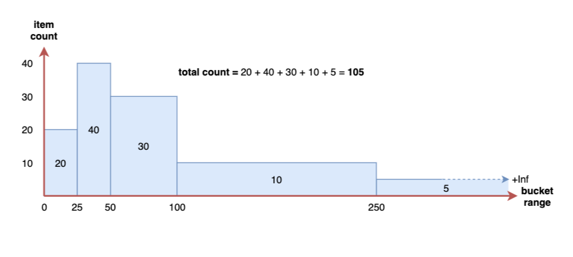
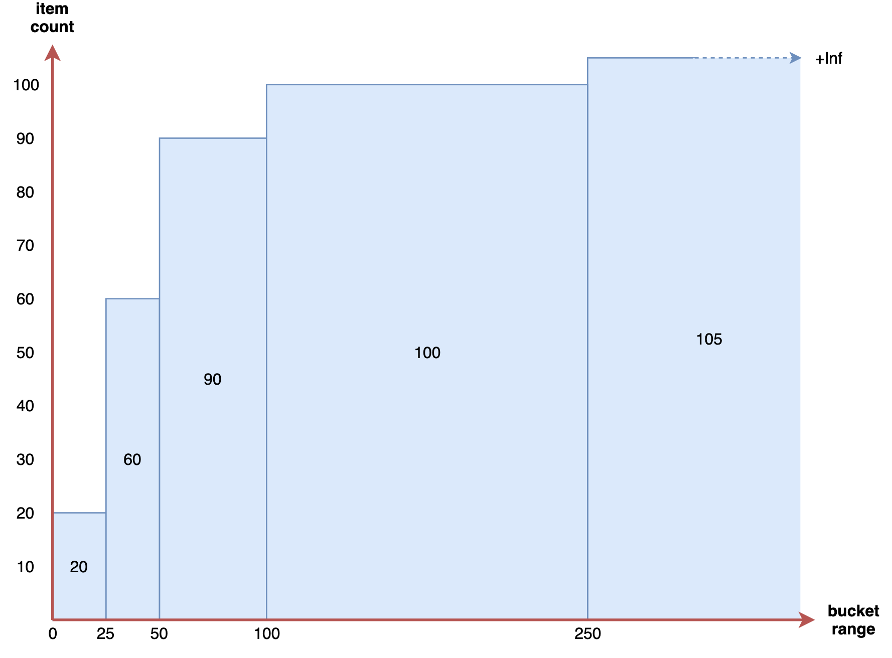
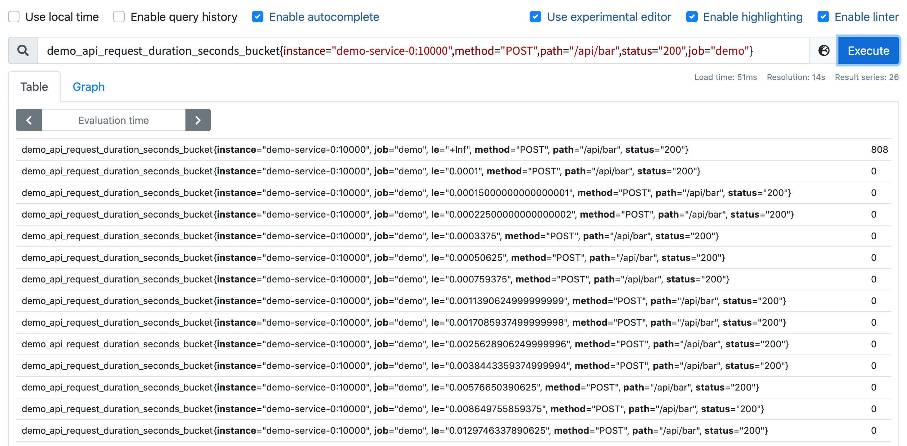
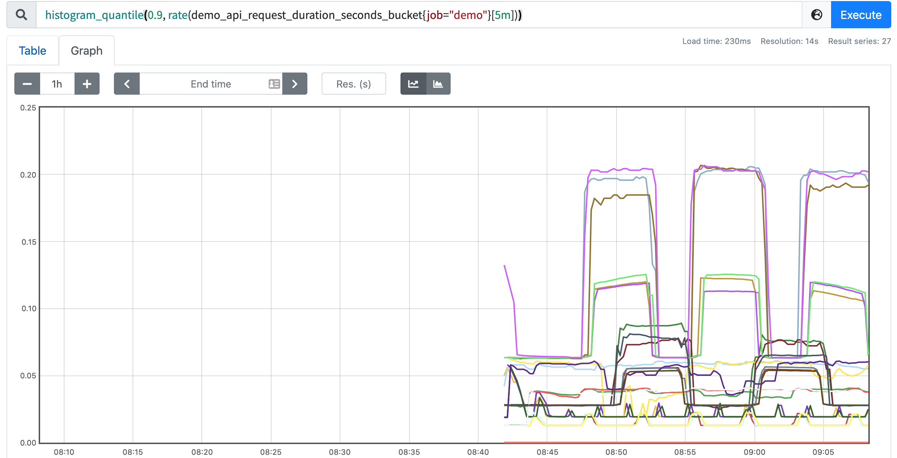
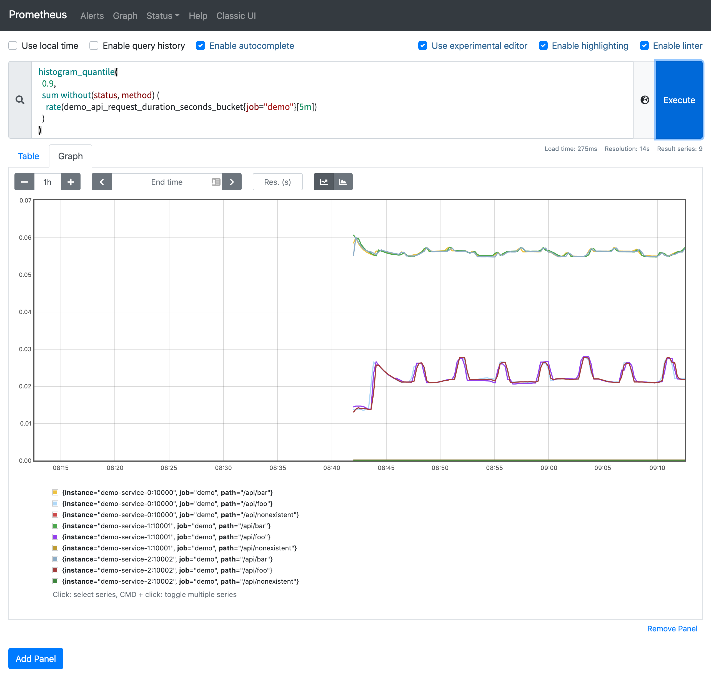

# 直方圖

在這一節中，我們將學習 histogram 指標，了解如何根據這些指標來計算分位數。 Prometheus 中的直方圖指標允許一個服務記錄一系列數值的分佈。直方圖通常用於跟踪 **請求的延遲** 或 **響應大小** 等指標值，當然理論上它是可以跟踪任何根據某種分佈而產生波動數值的大小。 Prometheus 直方圖是在客戶端對數據進行的採樣，它們使用的一些可配置的（例如延遲）bucket 桶對觀察到的值進行計數，然後將這些 bucket 作為單獨的時間序列暴露出來。

下圖是一個非累積直方圖的例子：



在 Prometheus 內部，直方圖被實現為一組時間序列，每個序列代表指定桶的計數（例如10ms以下的請求數、25ms以下的請求數、50ms以下的請求數等）。在 Prometheus 中每個 bucket 桶的計數器是累加的，這意味著較大值的桶也包括所有低數值的桶的計數。在作為直方圖一部分的每個時間序列上，相應的桶由特殊的 le 標籤表示。 le 代表的是 **小於** 或 **等於**。

與上面相同的直方圖在 Prometheus 中的累積直方圖如下所示：



可以看到在 Prometheus 中直方圖的計數是累計的，這是很奇怪的，因為通常情況下非累積的直方圖更容易理解。 Prometheus 為什麼要這麼做呢？想像一下，如果直方圖指標中加入了額外的標籤，或者劃分了更多的 bucket，那麼樣本數據的分析就會變得越來越複雜，如果直方圖是累積的，在抓取指標時就可以根據需要丟棄某些 bucket，這樣可以在降低 Prometheus 維護成本的同時，還可以粗略計算樣本值的分位數。

通過這種方法，用戶不需要修改應用代碼，便可以動態減少抓取到的樣本數量。另外直方圖還提供了 _sum 指標和 `_count` 指標，所以即使你丟棄了所有的 bucket，仍然可以通過這兩個指標值來計算請求的平均響應時間。通過累積直方圖的方式，還可以很輕鬆地計算某個 bucket 的樣本數佔所有樣本數的比例。

我們在演示的 demo 服務中暴露了一個直方圖指標 demo_api_request_duration_seconds_bucket，用於跟踪 API 請求時長的分佈，由於這個直方圖為每個跟踪的維度導出了 26 個 bucket，因此這個指標有很多時間序列。我們可以先來看下來自一個服務實例的一個請求維度組合的直方圖，查詢語句如下所示：

```promql
demo_api_request_duration_seconds_bucket{instance="demo-service-0:10000", method="POST", path="/api/bar", status="200", job="demo"}
```

正常我們可以看到 `26` 個序列，每個序列代表一個 bucket，由 `le` 標籤標識：



直方圖可以幫助我們了解這樣的問題，比如"我有多少個請求超過了100ms的時間？" (當然需要直方圖中配置了一個以 100ms 為邊界的桶)，又比如"我99%的請求是在多少延遲下完成的？"，這類數值被稱為 **百分位數** 或 **分位數**。在 Prometheus 中這兩個術語幾乎是可以通用，只是百分位數指定在 0-100 範圍內，而分位數表示在 0 和 1 之間，所以第 99 個百分位數相當於目標分位數 0.99。

如果你的直方圖桶粒度足夠小，那麼我們可以使用 `histogram_quantile(φ scalar, b instant-vector)` 函數用於計算歷史數據指標一段時間內的分位數。該函數將目標分位數 (`0 ≤ φ ≤ 1`) 和直方圖指標作為輸入，就是大家平時講的 `pxx`，`p50` 就是中位數，參數 `b` 一定是包含 `le` 這個標籤的瞬時向量，不包含就無從計算分位數了，但是計算的分位數是一個預估值，並不完全準確，因為這個函數是假定每個區間內的樣本分佈是線性分佈來計算結果值的，預估的準確度取決於 bucket 區間劃分的粒度，粒度越大，準確度越低。

回到我們的演示服務，我們可以嘗試計算所有維度在所有時間內的第 90 個百分位數，也就是 90% 的請求的持續時間。

```promql
# BAD!
histogram_quantile(0.9, demo_api_request_duration_seconds_bucket{job="demo"})
```

但是這個查詢方式是有一點問題的，當單個服務實例重新啟動時，bucket 的 `Counter` 計數器會被重置，而且我們常常想看看現在的延遲是多少（比如在過去 5 分鐘內），而不是整個時間內的指標。我們可以使用 `rate()` 函數應用於底層直方圖計數器來實現這一點，該函數會自動處理 `Counter` 重置，又可以只計算每個桶在指定時間窗口內的平均增長。

我們可以這樣去計算過去 5 分鐘內第 90 個百分位數的 API 延遲：

```promql
# GOOD!
histogram_quantile(0.9, rate(demo_api_request_duration_seconds_bucket{job="demo"}[5m]))
```

這個查詢就好很多了。



這個查詢會顯示每個維度（`job`、`instance`、`path`、`method` 和 `status`）的第 90 個百分點，但是我們可能對單獨的這些維度並不感興趣，想把他們中的一些指標聚合起來，這個時候我們可以在查詢的時候使用 Prometheus 的 `sum` 運算符與 `histogram_quantile()` 函數結合起來，計算出聚合的百分位，假設在我們想要聚合的維度之間，直方圖桶的配置方式相同（桶的數量相同，上限相同），我們可以將不同維度之間具有相同 `le` 標籤值的桶加在一起，得到一個聚合直方圖。然後，我們可以使用該聚合直方圖作為 `histogram_quantile()` 函數的輸入。

!!! info
    注意：這是假設直方圖的 bucket 在你要聚合的所有維度之間的配置是相同的，bucket 的配置也應該是相對靜態的配置，不會一直變化，因為這會破壞你使用 `histogram_quantile()` 查看的時間範圍內的結果。

下面的查詢計算了第 90 個百分位數的延遲，但只按 `job`、`instance` 和 `path` 維度進行聚合結果：



!!! info "練習"
    1.構建一個查詢，計算在 0.0001 秒內完成的 demo 服務 API 請求的總百分比，與過去 5 分鐘內所有請求總數的平均值。

    ```promql
    sum(rate(demo_api_request_duration_seconds_bucket{le="0.0001"}[5m]))
    /
    sum(rate(demo_api_request_duration_seconds_bucket{le="+Inf"}[5m])) * 100
    ```

    或者可以使用下面的語句查詢:

    ```promql
    sum(rate(demo_api_request_duration_seconds_bucket{le="0.0001"}[5m]))
    /
    sum(rate(demo_api_request_duration_seconds_count[5m])) * 100
    ```

    2.構建一個查詢，計算 demo 服務 API 請求的第 50 個百分位延遲，按 status code 和 method 進行劃分，在過去一分鐘的平均值。

    ```promql
    histogram_quantile(0.5, sum by(status, method, le) (rate(demo_api_request_duration_seconds_bucket[1m])))
    ```
