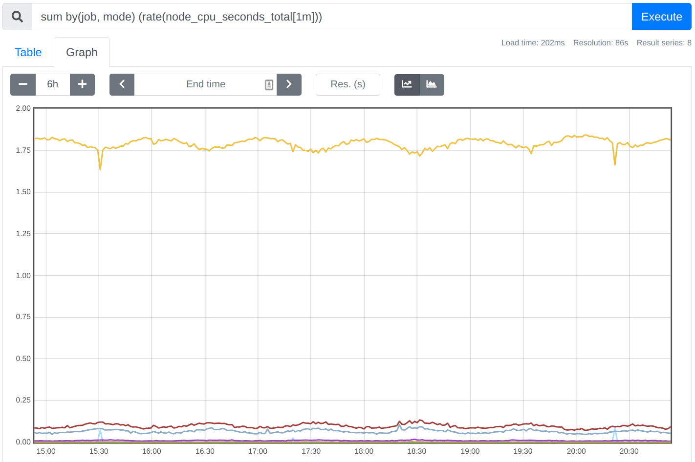

# PromQL 介紹

原文: [PromQL 介绍](https://p8s.io/docs/promql/intro/)

**PromQL** 是 Prometheus 監控系統內置的一種查詢語言，PromQL 允許你以靈活的方式選擇、聚合等其他方式轉換和計算時間序列數據，該語言僅用於讀取數據。可以說 PromQL 是我們學習 Prometheus 最困難也是最重要的部分，本章節我們將介紹 PromQL 的基礎知識、理論基礎，然後會深入了解更加高級的查詢模式。

## 目標

通過對本章節 PromQL 的學習你將能夠有效地構建、分享和理解 PromQL 查詢，可以幫助我們從容應對報警規則、儀錶盤可視化等需求，還能夠避免一些在使用 PromQL 表達式的時候遇到的一些陷阱。

## 執行

前面基礎章節我們介紹了 Prometheus 整體的架構：


當 Prometheus 從系統和服務收集指標數據時，它會把數據存儲在內置的時序數據庫（TSDB）中，要對收集到的數據進行任何處理，我們都可以使用 PromQL 從 TSDB 中讀取數據，同時可以對所選的數據執行過濾、聚合以及其他轉換操作。

PromQL 的執行可以通過兩種方式來觸發：

- 在 Prometheus 服務器中，記錄規則和警報規則會定期運行，並執行查詢操作來計算規則結果（例如觸發報警）。該執行在 Prometheus 服務內部進行，並在配置規則時自動發生。
- 外部用戶和 UI 界面可以使用 Prometheus 服務提供的 HTTP API 來執行 PromQL 查詢。這就是儀錶盤軟件（例如 Grafana、PromLens 以及 Prometheus 內置 Web UI）訪問 PromQL 的方式。

## 場景

PromQL 可以用於許多監控場景，下面簡單介紹幾個相關案例。

### 臨時查詢

我們可以用 PromQL 來對收集的數據進行實時查詢，這有助於我們去調試和診斷遇到的一些問題，我們一般也是直接使用內置的表達式查詢界面來執行這類查詢：



### 儀錶盤

同樣我們也可以基於 PromQL 查詢來創建可視化的圖形、表格等面板，當然一般我們都會使用 Grafana：


Grafana 原生支持 Prometheus 作為數據源，並內置支持了 PromQL 表達式的查詢。

### 報警

Prometheus 可以直接使用基於 PromQL 對收集的數據進行的查詢結果來生成報警，一個完整的報警規則如下所示：

```promql
groups:
  - name: demo-service-alerts
    rules:
      - alert: Many5xxErrors
        expr: |
          (
            sum by(path, instance, job) (
              rate(demo_api_request_duration_seconds_count{status=~"5..",job="demo"}[1m])
            )
          /
            sum by(path, instance, job) (
              rate(demo_api_request_duration_seconds_count{job="demo"}[1m])
            ) * 100 > 0.5
          )
        for: 30s
        labels:
          severity: critical
        annotations:
          title: "{{$labels.instance}} high 5xx rate on {{$labels.path}}"
          description: "The 5xx error rate for path {{$labels.path}} on {{$labels.instance}} is {{$value}}%."
```

除了構成報警規則核心的 PromQL 表達式（上面 YAML 文件中的 `expr` 屬性），報警規則還包含其他的一些元數據字段，後面在具體講解報警的章節中會詳細和大家講解。

然後，Prometheus 可以通過一個名為 **Alertmanager** 的組件來發送報警通知，可以配置一些接收器來接收這些報警，比如用 Opsgenie 接收報警：


### 自動化

此外我們還可以構建自動化流程，針對 PromQL 執行的查詢結果來做出決策，比如 Kubernetes 中基於自定義指標的 HPA。

