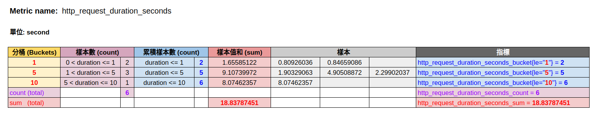

# 簡單理解 Summary 和 Histogram 指標

原文: [prometheus的summary和histogram指標的簡單理解](https://www.twblogs.net/a/5d1e33fcbd9eee1ede05fd82)

## Histogram 指標

histogram 是直方圖，在 Prometheus 系統中的查詢語言中，有三種型式的指標產生：

- 對每個採樣點進行統計，打到各個數值桶中(bucket)
- 對每個採樣點值累計和(sum)
- 對採樣點的次數累計和(count)

舉例來說一個度量指標名稱: [basename]的 histogram, 會產生下面三類的度量指標名稱:

- `[basename]_bucket{le="上邊界"}`, 這個值爲小於等於上邊界的所有採樣點數量
- `[basename]_sum`
- `[basename]_count`

###　Histogram 範例

假設我們想監控某個應用在一段時間內的某一個 API 服務被呼叫時的響應時間，最後監控到的樣本的響應時間範圍為 `0s ~ 10s`。現在我們將樣本的值域劃分為不同的區間，即不同的 bucket，下列的範例把 bucket　設成　[1,5,10]。



指標名稱: `http_request_duration_seconds`

如上表，設置 bucket=[1,5,10]，當實際採樣數據如是"樣本"欄所示, "樣本數(count)"表示採樣點落在該 bucket 中的數量:

- 落在 `[-,1]` 的樣點數爲 2
- 落在 `[1,5]` 的樣點數爲 3
- 落在 `[5,10]` 的樣點數爲 1
 
"累積樣本數(count)"是得到的最終結果（histogram 的最終結果 bucket 計數是向下累積的）:

| 指標　|
|------|
|http_request_duration_seconds_bucket{le=“1”} 2|
|http_request_duration_seconds_bucket{le=“5”} 3|
|http_request_duration_seconds_bucket{le=“10”} 6|
|http_request_duration_seconds_bucket{le="+Inf"} 6|
|http_request_duration_seconds_count 6|
|http_request_duration_seconds_sum 18.8378745|

Prometheus 並不會為　`Histogram` 　保存採樣點的值，每個　bucket　只有記錄樣本數的　counter（float64），也就是 `Histogram` 存儲的是區間的樣本數統計值，因此在客戶端進行 `Histogram` 資料的收集時的性能開銷相比於 `Counter` 和 `Gauge` 而言沒有明顯改變，適合高併發的數據收集。

## Summary 指標

因爲　`Histogram` 在客戶端就是進行了簡單的分桶和分桶計數，在　prometheus　服務端基於這樣的數據做百分位估算時，所以的確不是很準確，而 `Summary` 就是解決百分位準確的問題而來的。

`Summary` 直接存儲了 quantile 數據，而不是根據統計區間計算出來的。Prometheus 的分位數稱爲　quantile，其實叫　percentile　更準確。百分位數是指小於某個特定數值的採樣點達到一定的百分比。

Ｓummary　是採樣點分位圖統計。 有三種型式的指標產生：

- 在客戶端對於一段時間內的每個採樣點進行統計，並形成分位圖。（如：常態分佈一樣，統計低於60分不及格的同學比例，統計低於80分的同學比例，統計低於95分的同學比例）
- 統計班上所有同學的總成績(sum)
- 統計班上同學的考試總人數(count)

舉例來說一個度量指標名稱: [basename]的 summary, 會產生下面三類的度量指標名稱:

- `[basename]{quantile="0.5"}`, `[basename]{quantile="0.9"}`, `[basename]{quantile="0.99"}`
- `[basename]_sum`
- `[basename]_count`

###　Summary 範例

假設我們想監控　prometheus 服務器進行　was_fsync 操作所花費的時間:

```bash
# HELP prometheus_tsdb_wal_fsync_duration_seconds Duration of WAL fsync.
# TYPE prometheus_tsdb_wal_fsync_duration_seconds summary
prometheus_tsdb_wal_fsync_duration_seconds{quantile="0.5"} 0.012352463
prometheus_tsdb_wal_fsync_duration_seconds{quantile="0.9"} 0.014458005
prometheus_tsdb_wal_fsync_duration_seconds{quantile="0.99"} 0.017316173
prometheus_tsdb_wal_fsync_duration_seconds_sum 2.888716127000002
prometheus_tsdb_wal_fsync_duration_seconds_count 216
```

從上面的樣本中可以得知當前 Prometheus Server 進行 `wal_fsync` 操作的總次數爲 216 次，耗時 2.888716127000002 秒 。

其中 **中位數 P50 (quantile=0.5)** 的耗時都小於 0.012352463 秒，**9分位數 P90 (quantile=0.9)** 的耗時都小於 0.014458005 秒，**P99(quantile=0.99)** 的耗時都小於等於 0.017316173 秒。

## 分位數計算的選擇

要計算分位數有二種選擇:

1. 使用 Histogram 指標搭配 [histogramquantile 函數](https://www.yangcs.net/prometheus/3-prometheus/functions.html#histogramquantile)
2. 直接使用 Summary 指標

至於使用那一種方式比較好呢?　底下列出一些考量點:

- Summary 結構有頻繁的全局鎖操作，對高併發程序性能存在一定影響。Histogram 僅僅是給每個桶做一個原子變量的計數就可以了，而 Summary 要每次執行算法計算出最新的X分位 value 是多少，算法需要併發保護。會佔用客戶端的cpu和內存。
  
- 不能對 Summary 產生的 quantile 值進行 aggregation 運算（例如 sum, avg 等）。例如有兩個實例同時運行，都對外提供服務，分別統計各自的響應時間。最後分別計算出的0.5-quantile 的值爲 60 和 80，這時如果簡單的求平均 (60+80)/2，認爲是總體的 0.5-quantile 值，那麼就錯了。
  
- Summary 的百分位是提前在客戶端裏指定的，在服務端觀測指標數據時不能獲取未指定的分位數。而 Histogram 則可以通過 promql 隨便指定，雖然計算的不如Summary 準確，但帶來了靈活性。
  
- Histogram 不能得到精確的分位數，如果設置的　bucket　不合理的話，誤差會非常大。會消耗服務端的計算資源。

## 建議　

- 如果需要聚合（aggregate），選擇 Histogram。
- 如果比較清楚要觀測的指標的範圍和分佈情況，選擇 Histogram。如果需要精確的分位數選擇 Summary。