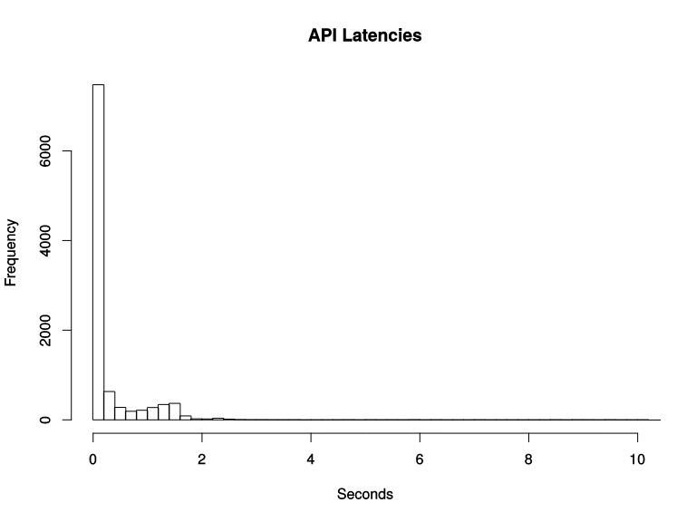
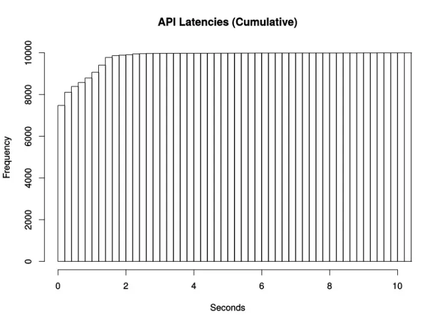
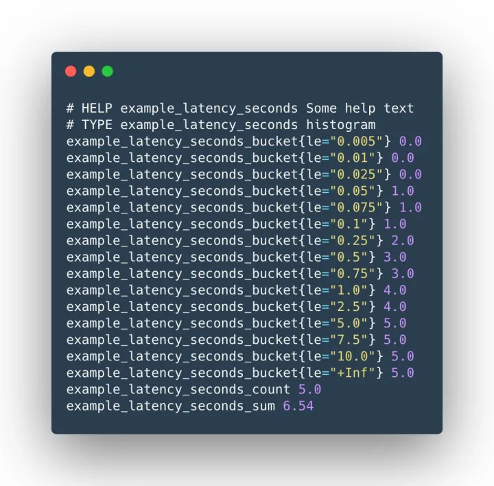
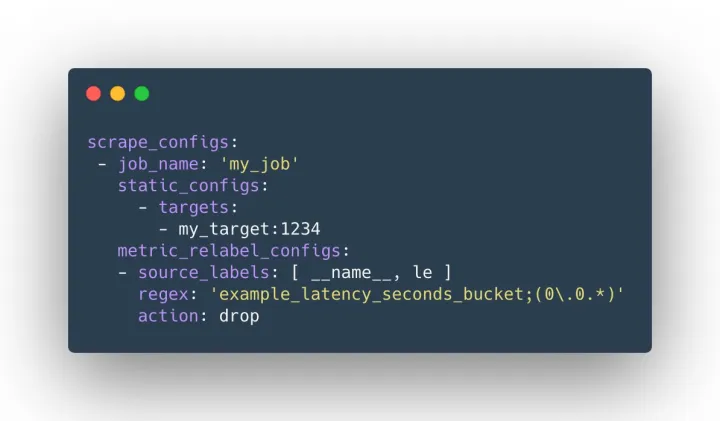
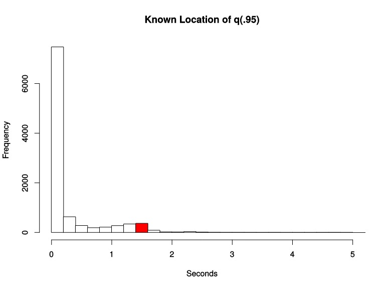
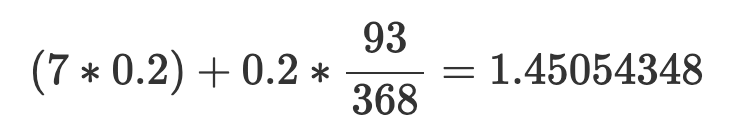

# 搞懂 Prometheus 的直方圖

原文: [一文搞懂 Prometheus 的直方图](https://icloudnative.io/posts/prometheus-histograms/)

Prometheus 中提供了四種指標類型 (參考：[Prometheus 的指標類型](https://link.zhihu.com/?target=https%3A//www.yangcs.net/prometheus/2-concepts/metric_types.html))，其中直方圖（Histogram）和摘要（Summary）是最複雜和難以理解的，這篇文章就是為了幫助大家加深對這 histogram 類型指標的理解。

## 1. 什麼是 Histogram？

根據[上篇文檔](https://link.zhihu.com/?target=https%3A//www.yangcs.net/prometheus/2-concepts/metric_types.html)，Histogram 會在一段時間範圍內對數據進行採樣（通常是請求持續時間或響應大小等），並將其計入可配置的存儲桶（bucket）中。但這句話還是不太好理解，下面通過具體的示例來說明。

假設我們想監控某個應用在一段時間內的響應時間，最後監控到的樣本的響應時間範圍為 `0s ~ 10s`。現在我們將樣本的值域劃分為不同的區間，即不同的 bucket，每個 bucket 的寬度是 `0.2s`。

那麼第一個 bucket 表示響應時間 ==小於等於 `0.2s` 的請求數量==，第二個 bucket 表示響應時間 ==大於 0.2s 小於等於 0.4s 的請求數量==，以此類推。



Prometheus 的 histogram 是一種 **累積直方圖**，與上面的區間劃分方式是有差別的，它的劃分方式如下：

>> 假設每個 bucket 的寬度是 `0.2s`，那麼第一個 bucket 表示響應時間 ==小於等於 0.2s 的請求數量==，第二個 bucket 表示響應時間 ==小於等於 0.4s== 的請求數量，以此類推。也就是說，每一個 bucket 的樣本包含了之前所有 bucket 的樣本，所以叫累積直方圖。



## 2. 為什麼是累積直方圖？

上節內容告訴我們，Prometheus 中的 histogram 是 **累積** 的，這是很奇怪的，因為通常情況下非累積的直方圖更容易理解。 Prometheus 為什麼要這麼做呢？

想像一下，如果 histogram 類型的指標中加入了額外的標籤，或者劃分了更多的 bucket，那麼樣本數據的分析就會變得越來越複雜。如果 histogram 是累積的，在抓取指標時就可以根據需要丟棄某些 bucket，這樣可以在降低 Prometheus 維護成本的同時，還可以粗略計算樣本值的分位數。通過這種方法，用戶不需要修改應用代碼，便可以動態減少抓取到的樣本數量。

假設某個 histogram 類型指標的樣本數據如下：



現在我們希望 Prometheus 在抓取指標時丟棄響應時間在 `100ms` 以下的 bucket，就可以通過下面的 `relabel` 配置來實現：



其中，`example_latency_seconds_bucket` 用來匹配標籤 `__name__` 的值，`0.0.*` 用來匹配標籤 `le` 的值，即 `le` 的值為 `0.0x`。然後將匹配到的樣本丟棄。

通過這種方法，你可以丟棄任意的 bucket，但不能丟棄 `le="+Inf"` 的 bucket，因為 `histogram_quantile` 函數需要使用這個標籤。

另外 histogram 還提供了 `_sum` 指標和 `_count` 指標，即使你丟棄了所有的 bucket，仍然可以通過這兩個指標值來計算請求的平均響應時間。

通過累積直方圖的方式，還可以很輕鬆地計算某個 bucket 的樣本數佔所有樣本數的比例。例如，想知道響應時間小於等於 1s 的請求佔所有請求的比例，可以通過以下公式來計算：

```promql
example_latency_seconds_bucket{le="1.0"} / ignoring (le) example_latency_seconds_bucket{le="+Inf"}
```

## 3. 分位數計算

Prometheus 通過 `histogram_quantile` 函數來計算分位數（quantile），而且是一個預估值，並不完全準確，因為這個函數是假定每個區間內的樣本分佈是線性分佈來計算結果值的。預估的準確度取決於 bucket 區間劃分的粒度，粒度越大，準確度越低。以下圖為例：



假設有 10000 個樣本，第 9501 個樣本落入了第 8 個 bucket。第 8 個 bucket 總共有 368 個樣本，其中第 9501 個樣本在該 bucket 中屬於第 93 個樣本。

根據 Prometheus 源代碼文件 [promql/quantile.go](https://github.com/prometheus/prometheus/blob/main/promql/quantile.go#L119) 第 108 行的公式：

```golang
return bucketStart + (bucketEnd-bucketStart)*float64(rank/count)
```

我們可以計算（quantile=0.95）的分位數值為：




這個值已經很接近精確的分位數值了。關於 `histogram_quantile` 函數的詳細使用方式，請參考：[PromQL 內置函數](https://www.yangcs.net/prometheus/3-prometheus/functions.html#histogramquantile)。

## 4. 總結

本文主要介紹了 histogram 的工作原理以及分位數的計算方法，相信通過本文的拋磚引玉，大家應該對 Prometheus 的 histogram 有了更深一步的了解，下篇文章將會為大家呈現 Summary 的工作方式。

## 5. 参考资料

- [Prometheus and Histograms](https://link.zhihu.com/?target=http%3A//linuxczar.net/blog/2016/12/31/prometheus-histograms/)