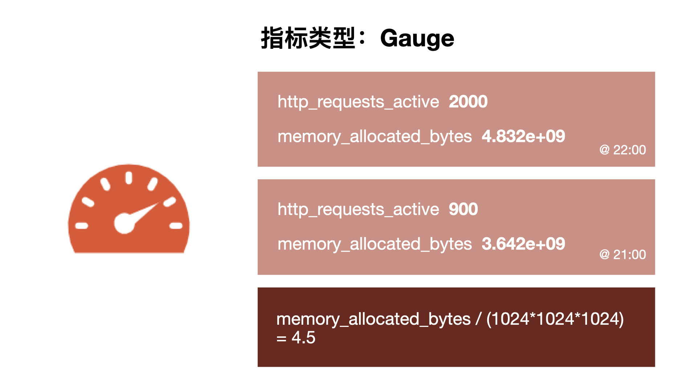

# 指標類型

原文: [指标类型](https://p8s.io/docs/promql/metric-type/)

從存儲上來講所有的監控指標都是相同的，但是在不同的場景下這些指標又有一些細微的差異。例如，在 Node Exporter 返回的樣本中指標 node_load1 反應的是當前系統的負載狀態，隨著時間的變化這個指標返回的樣本數據是在不斷變化的。而指標 `node_cpu_seconds_total` 所獲取到的樣本數據卻不同，它是一個持續增大的值，因為其反應的是 CPU 的累計使用時間，從理論上講只要係統不關機，這個值是會一直變大。

為了能夠幫助用戶理解和區分這些不同監控指標之間的差異，Prometheus 定義了 4 種不同的指標類型：Counter（計數器）、Gauge（儀錶盤）、Histogram（直方圖）、Summary（摘要）。

在 node-exporter（後面會詳細講解）返回的樣本數據中，其註釋中也包含了該樣本的類型。例如：

```bash
# HELP node_cpu_seconds_total Seconds the cpus spent in each mode.
# TYPE node_cpu_seconds_total counter
node_cpu_seconds_total{cpu="cpu0",mode="idle"} 362812.7890625
```

## Counter

`Counter` (只增不減的計數器) 類型的指標其工作方式和計數器一樣，==只增不減==，所以它對於存儲諸如服務的 HTTP 請求數量或使用的 CPU 時間之類的信息非常有用。常見的監控指標，如 `http_requests_total`、`node_cpu_seconds_total` 都是 `Counter` 類型的監控指標。


可能你會覺得一直增加的數據沒什麼用處，了解服務從開始有多少請求有什麼價值嗎？ 但是需要記住，每個指標都存儲了時間戳的，所有你的 HTTP 請求數現在可能是 1000 萬，但是 Prometheus 也會記錄之前某個時間點的值，我們可以去查詢過去一個小時內的請求數，當然更多的時候我們想要看到的是請求數增加或減少的速度有多快，因此通常情況對於 `Counter` 指標我們都是去查看變化率而不是本身的數字。 

PromQL 內置的聚合操作和函數可以讓用戶對這些數據進行進一步的分析，例如，通過 `rate()` 函數獲取 HTTP 請求的增長率：

```promql
rate(http_requests_total[5m])
```

## Gauge

與 `Counter` 不同，`Gauge`（可增可減的儀錶盤）類型的指標側重於 ==反應系統的當前狀態==，因此這類指標的樣本數據可增可減。常見指標如 `node_memory_MemFree_bytes`（當前主機空閒的內存大小）、`node_memory_MemAvailable_bytes`（可用內存大小）都是 `Gauge` 類型的監控指標。由於 `Gauge` 指標仍然帶有時間戳存儲，所有我們可以看到隨時間變化的值，通常可以直接把它們繪製出來，這樣就可以看到值本身而不是變化率了，通過 `Gauge` 指標，用戶可以直接查看系統的當前狀態。



這些簡單的指標類型都只是為每個樣本獲取一個數字，但 Prometheus 的強大之處在於如何讓你跟踪它們，比如我們繪製了兩張圖，一個是 HTTP 請求的變化率，另一個是分配的 `gauge` 類型的實際內存，直接從圖上就可以看出這兩個之間有一種關聯性，當請求出現峰值的時候，內存的使用也會出現峰值，但是我們仔細觀察也會發現在峰值過後，內存使用量並沒有恢復到峰值前的水平，整體上它在逐漸增加，這表明很可能應用程序中存在內存洩露的問題，通過這些簡單的指標就可以幫助我們找到這些可能存在的問題。


對於 `Gauge` 類型的監控指標，通過 PromQL 內置函數 `delta()` 可以獲取樣本在一段時間範圍內的變化情況。例如，計算 CPU 溫度在兩個小時內的差異：

```promql
delta(cpu_temp_celsius{host="zeus"}[2h])
```

還可以直接使用 `predict_linear()` 對數據的變化趨勢進行預測。例如，預測系統磁盤空間在 4 個小時之後的剩餘情況：

```promql
predict_linear(node_filesystem_free_bytes[1h], 4 * 3600)
```

## Histogram 和 Summary

除了 `Counter` 和 `Gauge` 類型的監控指標以外，Prometheus 還定義了 `Histogram` 和 `Summary` 的指標類型。 `Histogram` 和 `Summary` 主用用於統計和分析樣本的分佈情況。

在大多數情況下人們都傾向於使用某些量化指標的平均值，例如 CPU 的平均使用率、頁面的平均響應時間，這種方式也有很明顯的問題，以系統 API 調用的平均響應時間為例：如果大多數 API 請求都維持在 100ms 的響應時間範圍內，而個別請求的響應時間需要 5s，那麼就會導致某些 WEB 頁面的響應時間落到 **中位數** 上，而這種現像被稱為 **長尾問題**。


為了區分是 ==平均的慢還是長尾的慢==，最簡單的方式就是按照請求延遲的範圍進行分組。例如，統計延遲在 0~10ms 之間的請求數有多少而 10~20ms 之間的請求數又有多少。通過這種方式可以快速分析系統慢的原因。 Histogram 和 Summary 都是為了能夠解決這樣的問題存在的，通過 Histogram 和Summary 類型的監控指標，我們可以快速了解監控樣本的分佈情況。

### Summary

摘要用於記錄某些東西的平均大小，可能是計算所需的時間或處理的文件大小，摘要顯示兩個相關的信息：`count`（事件發生的次數）和 `sum`（所有事件的總大小），如下圖計算摘要指標可以返回次數為 3 和總和 15，也就意味著 3 次計算總共需要 15s 來處理，平均每次計算需要花費 5s。下一個樣本的次數為 10，總和為 113，那麼平均值為 11.3，因為兩組指標都記錄有時間戳，所以我們可以使用摘要來構建一個圖表，顯示平均值的變化率，比如圖上的語句表示的是 5 分鐘時間段內的平均速率。


例如，指標 `prometheus_tsdb_wal_fsync_duration_seconds` 的指標類型為 `Summary`，它記錄了 Prometheus Server 中 `wal_fsync` 的處理時間，通過訪問 Prometheus Server 的 `/metrics` 地址，可以獲取到以下監控樣本數據：

```bash
# HELP prometheus_tsdb_wal_fsync_duration_seconds Duration of WAL fsync.
# TYPE prometheus_tsdb_wal_fsync_duration_seconds summary
prometheus_tsdb_wal_fsync_duration_seconds{quantile="0.5"} 0.012352463
prometheus_tsdb_wal_fsync_duration_seconds{quantile="0.9"} 0.014458005
prometheus_tsdb_wal_fsync_duration_seconds{quantile="0.99"} 0.017316173
prometheus_tsdb_wal_fsync_duration_seconds_sum 2.888716127000002
prometheus_tsdb_wal_fsync_duration_seconds_count 216
```

從上面的樣本中可以得知當前 Prometheus Server 進行 `wal_fsync` 操作的總次數為 216 次，耗時 2.888716127000002s。其中中位數（quantile=0.5）的耗時為 0.012352463，9 分位數（quantile=0.9）的耗時為 0.014458005s。

### Histogram

摘要非常有用，但是平均值會隱藏一些細節，上圖中 10 與 113 的總和包含非常廣的範圍，如果我們想查看時間花在什麼地方了，那麼我們就需要直方圖了。

直方圖以 bucket 桶的形式記錄數據，所以我們可能有一個桶用於需要 1s 或更少的計算，另一個桶用於 5 秒或更少、10 秒或更少、20 秒或更少、60 秒或更少。該指標返回每個存儲桶的計數，其中 3 個在 5 秒或更短的時間內完成，6 個在 10 秒或更短的時間內完成。 

Prometheus 中的直方圖是 ==累積== 的，因此所有 10 次計算都屬於 60 秒或更少的時間段，而在這 10 次中，有 9 次的處理時間為 20 秒或更少，這顯示了數據的分佈。所以可以看到我們的大部分計算都在 10 秒以下，只有一個超過 20 秒，這對於計算百分位數很有用。


在 Prometheus Server 自身返回的樣本數據中，我們也能找到類型為 `Histogram` 的監控指標 `prometheus_tsdb_compaction_chunk_range_seconds_bucket`：

```bash
# HELP prometheus_tsdb_compaction_chunk_range_seconds Final time range of chunks on their first compaction
# TYPE prometheus_tsdb_compaction_chunk_range_seconds histogram
prometheus_tsdb_compaction_chunk_range_seconds_bucket{le="100"} 71
prometheus_tsdb_compaction_chunk_range_seconds_bucket{le="400"} 71
prometheus_tsdb_compaction_chunk_range_seconds_bucket{le="1600"} 71
prometheus_tsdb_compaction_chunk_range_seconds_bucket{le="6400"} 71
prometheus_tsdb_compaction_chunk_range_seconds_bucket{le="25600"} 405
prometheus_tsdb_compaction_chunk_range_seconds_bucket{le="102400"} 25690
prometheus_tsdb_compaction_chunk_range_seconds_bucket{le="409600"} 71863
prometheus_tsdb_compaction_chunk_range_seconds_bucket{le="1.6384e+06"} 115928
prometheus_tsdb_compaction_chunk_range_seconds_bucket{le="6.5536e+06"} 2.5687892e+07
prometheus_tsdb_compaction_chunk_range_seconds_bucket{le="2.62144e+07"} 2.5687896e+07
prometheus_tsdb_compaction_chunk_range_seconds_bucket{le="+Inf"} 2.5687896e+07
prometheus_tsdb_compaction_chunk_range_seconds_sum 4.7728699529576e+13
prometheus_tsdb_compaction_chunk_range_seconds_count 2.5687896e+07
```

與 `Summary` 類型的指標相似之處在於 `Histogram` 類型的樣本同樣會反應當前指標的記錄的總數(以 `_count` 作為後綴)以及其值的總量（以 `_sum` 作為後綴）。不同在於 `Histogram` 指標直接反應了在不同區間內樣本的個數，區間通過標籤 **le** 進行定義。

