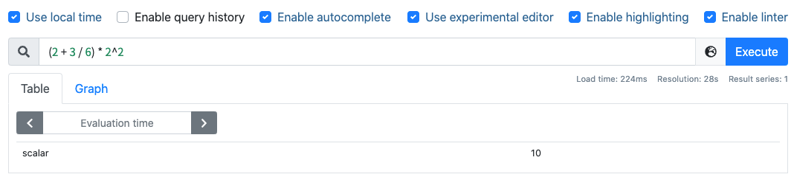
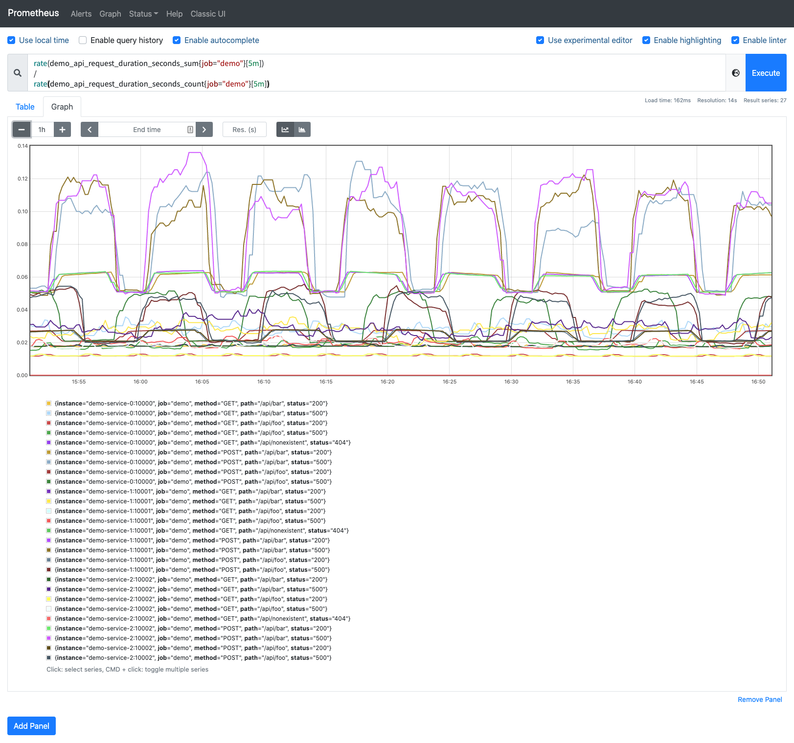
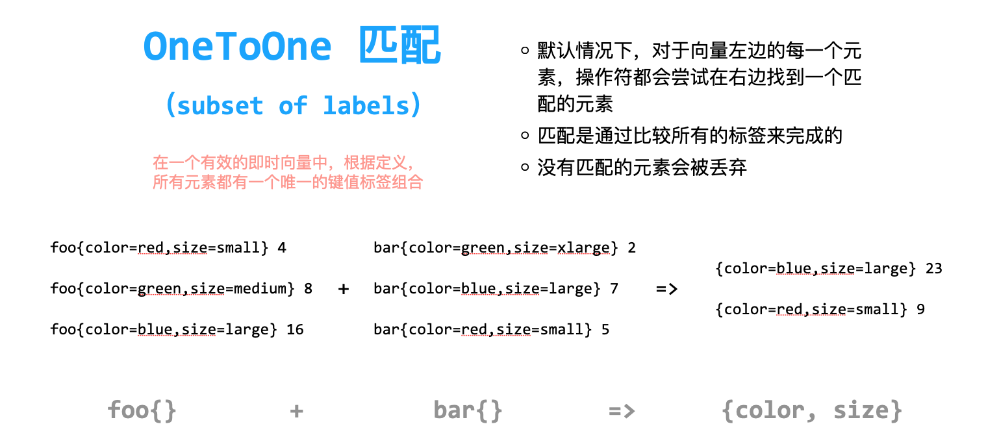
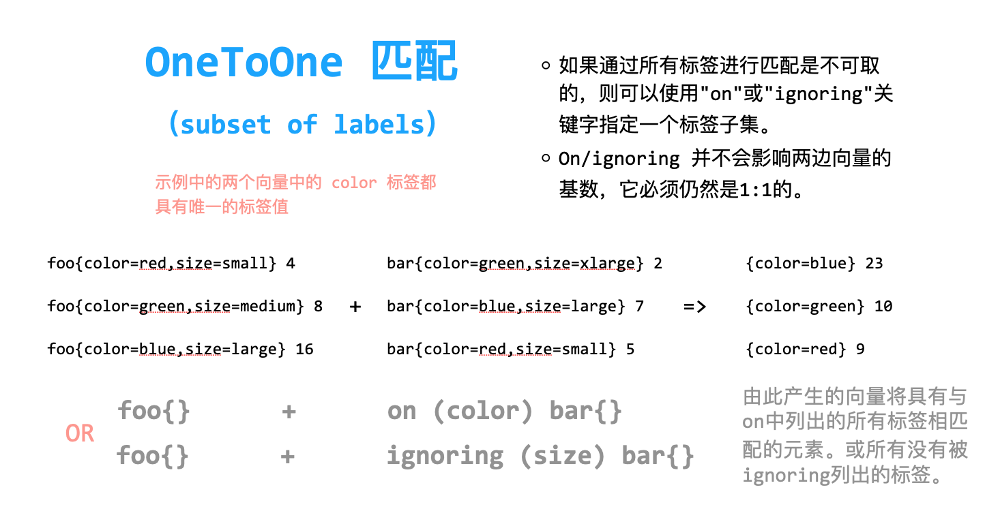
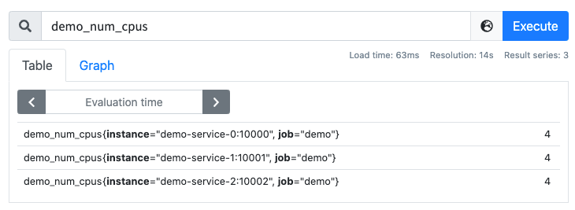

# 運算

原文: [运算](https://p8s.io/docs/promql/query/operate/)

Prometheus 的查詢語言支持基本的邏輯運算和算術運算。

## 算術運算符

在 Prometheus 系統中支持下面的二元算術運算符：

- `+` 加法
- `-` 減法
- `*` 乘法
- `/` 除法
- `%` 模
- `^` 冪等

最簡單的我們可以將一個數字計算當做一個 PromQL 語句，用於標量與標量之間計算，比如：

```promql
(2 + 3 / 6) * 2^2
```

可以得到如下所示的結果：



圖形中返回的是一個值為 10 的標量（scalar）類型的數據。

二元運算同樣適用於向量和標量之間，例如我們可以將一個字節數除以兩次 1024 來轉換為 MiB，如下查詢語句：

```promql
demo_batch_last_run_processed_bytes{job="demo"} / 1024 / 1024
```

最後計算的結果就是 MiB 單位的了：


另外 PromQL 的一個強大功能就是可以讓我們在向量與向量之間進行二元運算。

例如 `demo_api_request_duration_seconds_sum` 的數據包含了在 `path`、`method`、`status` 等不同維度上花費的總時間，指標 `demo_api_request_duration_seconds_count` 包含了上面同維度下的請求總次數。則我們可以用下面的語句來查詢過去 5 分鐘的平均請求持續時間：

```promql
rate(demo_api_request_duration_seconds_sum{job="demo"}[5m])
/
rate(demo_api_request_duration_seconds_count{job="demo"}[5m])
```

PromQL 會通過相同的標籤集自動匹配操作符左邊和右邊的元素，並將二元運算應用到它們身上。由於上面兩個指標的標籤集合都是一致的，所有可以得到相同標籤集的平均請求延遲結果：



## 向量匹配

### 一對一

上面的示例其實就是一對一的向量匹配，但是一對一向量匹配也有兩種情況，就是是否按照所有標籤匹配進行計算，下圖是匹配所有標籤的情況：



圖中我們兩個指標 foo 和 bar，分別生成了 3 個序列：

```bash
# TYPE foo gauge
foo{color="red", size="small"} 4
foo{color="green", size="medium"} 8
foo{color="blue", size="large"} 16
# TYPE bar gauge
bar{color="green", size="xlarge"} 2
bar{color="blue", size="large"} 7
bar{color="red", size="small"} 5
```

當我們執行查詢語句 `foo{} + bar{}` 的時候，對於向量左邊的每一個元素，操作符都會嘗試在右邊裡面找到一個匹配的元素，匹配是通過比較所有的標籤來完成的，沒有匹配的元素會被丟棄，我們可以看到其中的 `foo{color="green", size="medium"}` 與 `bar{color="green", size="xlarge"}` 兩個序列的標籤是不匹配的，其餘兩個序列標籤匹配，所以計算結果會拋棄掉不匹配的序列，得到的結果為其餘序列的值相加。

上面例子中其中不匹配的標籤主要是因為第二個 `size` 標籤不一致造成的，那麼如果我們在計算的時候忽略掉這個標籤可以嗎？如下圖所示：



同樣針對上面的兩個指標，我們在進行計算的時候可以使用 `on` 或者 `ignoring` 修飾符來指定用於匹配的標籤進行計算，由於示例中兩邊的標籤都具有 `color` 標籤，所以在進行計算的時候我們可以基於該標籤`（on (color)）`或者忽略其他的標籤`（ignoring (size)）`進行計算，這樣得到的結果就是所以匹配的標籤序列相加的結果，要注意結果中的標籤也是匹配的標籤。

## 一對多與多對一

上面講解的一對一的向量計算是最直接的方式，在多數情況下，`on` 或者 `ignoring` 修飾符有助於是查詢返回合理的結果，但通常情況用於計算的兩個向量之間並不是一對一的關係，更多的是一對多或者多對一的關係，對於這種場景我們就不能簡單使用上面的方式進行處理了。

多對一和一對多兩種匹配模式指的是一側的每一個向量元素可以與多側的多個元素匹配的情況，在這種情況下，必須使用 `group` 修飾符：`group_left` 或者 `group_right` 來確定哪一個向量具有更高的基數（充當多的角色）。多對一和一對多兩種模式一定是出現在操作符兩側表達式返回的向量標籤不一致的情況，因此同樣需要使用 `ignoring` 和 `on` 修飾符來排除或者限定匹配的標籤列表。

例如 `demo_num_cpus` 指標告訴我們每個實例的 CPU 核心數量，只有 `instance` 和 `job` 這兩個標籤維度。



而 `demo_cpu_usage_seconds_total` 指標則多了一個 `mode` 標籤的維度，將每個 `mode` 模式（`idle`、`system`、`user`）的 CPU 使用情況分開進行了統計。


如果要計算每個模式的 CPU 使用量除以核心數，我們需要告訴除法運算符按照 `demo_cpu_usage_seconds_total` 指標上額外的 `mode` 標籤維度對結果進行分組，我們可以使用 `group_left`（表示左邊的向量具有更高的基數）修飾符來實現。同時，我們還需要通過 `on()` 修飾符明確將所考慮的標籤集減少到需要匹配的標籤列表：

```promql
rate(demo_cpu_usage_seconds_total{job="demo"}[5m])
/ on(job, instance) group_left
demo_num_cpus{job="demo"}
```

上面的表達式可以正常得到結果：


除了 `on()` 之外，還可以使用相反的 `ignoring()` 修飾符，可以用來將一些標籤維度從二元運算操作匹配中忽略掉，如果在操作符的右側有額外的維度，則應該使用 `group_right`（表示右邊的向量具有更高的基數）修飾符。

比如上面的查詢語句同樣可以用 `ignoring` 關鍵字來完成：

```promql
rate(demo_cpu_usage_seconds_total{job="demo"}[5m])
/ ignoring(mode) group_left
demo_num_cpus{job="demo"}
```

得到的結果和前面用 `on()` 查詢的結果是一致的。

到這裡我們就知道瞭如何在 PromQL 中進行標量和向量之間的運算了。不過我們在使用 PromQL 查詢數據的時候還行要避免使用關聯查詢，先想想能不能通過 Relabel（後續會詳細介紹）的方式給原始數據多加個 Label，一條語句能查出來的何必用 Join 呢？時序數據庫不是關係數據庫。

!!! info "練習"
    1.計算過去 5 分鐘所有 POST 請求平均數的總和相對於所有請求平均數總和的百分比。

    ```promql
    sum(rate(demo_api_request_duration_seconds_count{method="POST"}[5m]))
    /
    sum(rate(demo_api_request_duration_seconds_count[5m])) * 100
    ```

    2.計算過去 5 分鐘內每個實例的 `user` 和 `system` 的模式（`demo_cpu_usage_seconds_total` 指標）下 CPU 使用量平均值總和。

    ```promql
    sum by(instance, job) (rate(demo_cpu_usage_seconds_total{mode=~"user|system"}[5m]))
    ```

    或者

    ```promql
    sum without(mode) (rate(demo_cpu_usage_seconds_total{mode=~"user|system"}[5m]))
    ```

    或者

    ```promql
    rate(demo_cpu_usage_seconds_total{mode="user"}[5m]) + ignoring(mode)
    rate(demo_cpu_usage_seconds_total{mode="system"}[5m])
    ```

