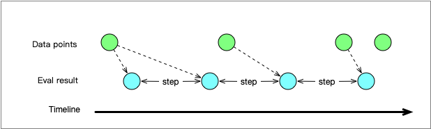

# 詳解 Prometheus range query 中的 step 參數

原文: [详解Prometheus range query中的step参数](https://chanjarster.github.io/post/p8s-step-param/)

詳細解釋Prometheus range query中的step參數的作用。

## 區間查詢參數

Prometheus 有兩種 query：instant query、range query。本文要講的就是 range query 中的 `step` 參數。

range query 是非常常見的一種 query，看看它有哪些參數：

- `query=<string>` PromQL表達式。
- `start=<rfc3339 | unix_timestamp>` 時間範圍的開始。
- `end=<rfc3339 | unix_timestamp>` 時間範圍的結束。
- `step=<duration | float>` 查詢解析度（query resolution）。
- `timeout=<duration>` 執行超時。這個參數是 optional。

在 Prometheus expression browser 裡看到的是這樣的：


注意到上圖中的 **Res 框** 裡沒有給值，沒有給的話 Prometheus 會自動給一個值，這個值在圖示右上角可以看到。

## Step 參數對於查詢結果的影響

Prometheues 在對 PromQL 表達式求值的邏輯是這樣的（詳見這個[issue](https://github.com/prometheus/docs/issues/699#issuecomment-449703646)裡的回答）：

- 對於 [start, end] 時間區間，從 start 開始，以 step 為長度，把時間區間分成若干段
- 對每個段進行求值

舉例：start=10,end=20,step=2，那麼就會有ts=10,ts=12,ts=14,ts=16,ts=18,ts=206段，然後為這 6 個段進行求值。求值方式視乎表達式中 Time series selector 的類型而定。

PromQL 有兩種 Time series selector：`instant vector selector` 和 `range vector selector`。下面將分別講解：

### 瞬時向量選擇器

下面的就是 Instant vector selector 的範本，**x** 是 metric 的名字。

```bash
x
```

Prometheus 在對每段 Instant vector selector 求值的邏輯是這樣的：

- 從該段的 timestamp（含）往前找，取第一個找到的 data point 的值。如果有一個`data point的timestamp==該段的timestamp`，則直接使用該 data point。
- 如果該段 timestamp 往前的 5 分鐘範圍內沒有找到任何 data point，則該段無值。

下面這張圖解釋了上面邏輯：


圖中的綠點是 Prometheus 實際存儲的數據，按照時間軸從左到右排列。藍點是根據 step 參數的求值結果。

當 data point 間隔比 step 更大的時候會發生下圖這種情況：



可以看到有兩個時間區段的求值結果來自於同一個 data point。

### 區間向量選擇器

下面的就是 Range vector selector，**x** 是 metric 的名字，方括号里的是 **range duration**。

```bash
x[5m]
```

range vector select 返回的是當前 timestamp 之前的 range duration 內的所有 data point。 range vector 是不能直接用做繪圖的，你得用某些 function 把 range vector 轉換成 instant vector才行，比如 `rate()`。

下圖解釋了是如何對 Range vector selector 進行分時間區段求值的：


## Step 和 Rate duration 參數

`step` 和 `range duration` 是獨立的兩個參數，在某些情況下兩者的值存在某種限制條件，這裡例舉 `rate()` 來說明。 `rate()` 的作用是獲得一個 range-vector 的每秒平均增長率。

如果 `step=10m` 而 `range duration=5m`，那麼 `rate` 在計算的時候會丟失一半的數據，兩個時間分段之間的 data point 有一半沒有被納入計算。前面那張圖就存在數據丟失的情況，有一個 data point 被漏掉了。

因此在使用 `rate()` 時，`range duration` 得大於等於 `step`。

而如果是 `irate()`，這個限制則是 `range duration` 不得大於 `step`（詳見 [Brian Brazil的Presentation](https://www.youtube.com/watch?v=67Ulrq6DxwA&feature=youtu.be&t=1826)）。

## Grafana 中的 step 參數

在 Grafana 中並沒有直接提供 `step` 參數，而是這兩個參數：`min step` 和 `resolution`（[文檔在這裡](http://docs.grafana.org/features/datasources/prometheus/#query-editor))。 `min step` 故名思義設定的是 `step` 的最小值，那麼 `resolution` 是什麼呢？

大家都知道 Grafana 都是用來畫圖表的，比如下面這張圖`Y軸`是 **值**，`X軸`是 **時間線**，因此在`X軸`方向的每個像素都代表了一個 timestamp。


`resolution` 就是用來根據像素來計算 `step` 的一個參數。下面用 `6` 個像素以及它們的 `timestamp` 來說明：

```bash
x=1,ts=0; x=2,ts=5; x=3,ts=10; x=4,ts=15; x=5,ts=20; x=6,ts=25
```

- `resolution=1/1` 時，那麼 `step` 就是相鄰像素所代表的 `timestamp` 的差，即 5；
- `resolution=1/2` 時，那麼 `step` 就是相隔 1 個像素的兩個像素的 `timestamp` 的差，即 10；
- `resolution=1/3` 時，那麼 `step` 就是相隔 2 個像素的兩個像素的 `timestamp` 的差，即 15；-
- 以此類推

而每個像素所代表的 `timestamp` 受兩個因素影響：

- 查詢所定義的時間範圍
- Graph的寬度（單位：像素）

所以在 Grafana 發起的查詢中 `step` 參數是動態的。其實這也是很合理的，因為只有這樣才能夠在 Graph 寬度小的時候繪圖更粗糙（即 `step` 更大），Graph 寬度大的時候繪圖更精細（即 `step` 更小，但是不能小於 `min step`）。實際發起的請求的 `step` 參數你可以在 Graph 的 Query Inspector 裡看到：


但是我們之前不說過了 `rate()` 的 range duration 不能小於 `step` 嗎？那麼把 `range duration` 給固定值的化就不太好了，怎麼辦呢？你可以使用 Grafana 提供的內置變量`$__interval`，它代表的是 Grafana 計算出來的 `step` 的值。比如這樣就能夠將 `range duration` 和 `step` 保持一致了（更多內置變量可以見[這裡](http://docs.grafana.org/features/datasources/prometheus/#using-interval-and-range-variables)）：

```bash
rate(x[$__interval])
```

## 所以，你想自己實驗一把

如果你想自己動手實驗，但是又苦於無法製造乾淨的假數據，那麼可以參考[這篇文章推薦的方法](https://chanjarster.github.io/post/p8s-mock-data)。