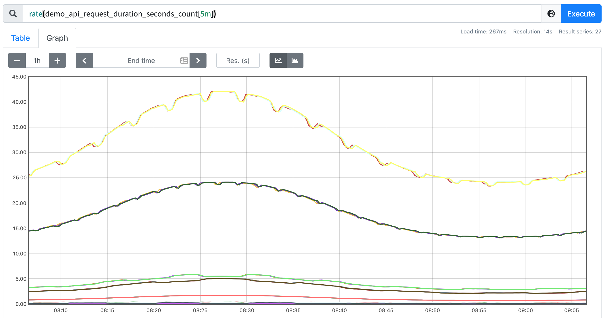

# 變化率

原文: [变化率](https://p8s.io/docs/promql/query/rates/)

通常來說直接繪製一個原始的 `Counter` 類型的指標數據用處不大，因為它們會一直增加，一般來說是不會去直接關心這個數值的，因為 `Counter` 一旦重置，總計數就沒有意義了，比如我們直接執行下面的查詢語句：

```promql
demo_api_request_duration_seconds_count{job="demo"}
```

可以得到下圖所示的圖形：


可以看到所有的都是不斷增長的，一般來說我們更想要知道的是 `Counter` 指標的變化率，PromQL 提供了不同的函數來計算變化率。

## rate 函數

用於計算變化率的最常見函數是 `rate()`，`rate()` 函數用於計算 ==在指定時間範圍內計數器平均每秒的增加量==。因為是計算一個時間範圍內的平均值，所以我們需要在序列選擇器之後添加一個範圍選擇器。

例如我們要計算 `demo_api_request_duration_seconds_count` 在最近五分鐘內的每秒平均變化率，則可以使用下面的查詢語句：

```promql
rate(demo_api_request_duration_seconds_count[5m])
```

可以得到如下所示的圖形：



現在繪製的圖形看起來顯然更加有意義了，進行 rate 計算的時候是選擇指定時間範圍下的第一和最後一個樣本進行計算，下圖是表示瞬時計算的計算方式：


往往我們需要的是繪製一個圖形，那麼就需要進行區間查詢，指定一個時間範圍內進行多次計算，將結果串聯起來形成一個圖形：


對於 `rate()` 和相關函數有幾個需要說明的：

當被抓取指標進的程重啟時，`Counter` 指標可能會重置為 0，但 `rate()` 函數會自動處理這個問題，它會假設 `Counter` 指標的值只要是減少了就認為是被重置了，然後它可以調整後續的樣本，例如，如果時間序列的值為[5,10,4,6]，則將其視為[5,10,14,16]。

變化率是從指定的時間範圍下包含的樣本進行計算的，需要注意的是這個時間窗口的邊界並不一定就是一個樣本數據，可能會不完全對齊，所以，即使對於每次都是增加整數的 Counter，也可能計算結果是非整數。


另外我們需要注意當把 `rate()` 與一個聚合運算符（例如 `sum()`）或一個隨時間聚合的函數（任何以 `_over_time` 結尾的函數）結合起來使用時，總是先取用 `rate()` 函數，然後再進行聚合，否則，當你的目標重新啟動時，`rate()` 函數無法檢測到 Counter 的重置。

!!! info
    注意：`rate()` 函數需要在指定窗口下至少有兩個樣本才能計算輸出。一般來說，比較好的做法是選擇範圍窗口大小至少是抓取間隔的 4 倍，這樣即使在遇到窗口對齊或抓取故障時也有可以使用的樣本進行計算，例如，對於 1 分鐘的抓取間隔，你可以使用 4 分鐘的 Rate 計算，但是通常將其四捨五入為 5 分鐘。所以如果使用 `query_range` 區間查詢，例如在繪圖中，那麼範圍應該至少是步長的大小，否則會丟失一些數據。

## irate 函數

由於使用 `rate` 或者 `increase` 函數去計算樣本的平均增長速率，容易陷入長尾問題當中，其無法反應在時間窗口內樣本數據的突發變化。

例如，對於主機而言在 2 分鐘的時間窗口內，可能在某一個由於訪問量或者其它問題導致 CPU 佔用 100%的情況，但是通過計算在時間窗口內的平均增長率卻無法反應出該問題。

為了解決該問題，PromQL 提供了另外一個靈敏度更高的函數 `irate(v range-vector)`。 `irate` 同樣用於計算區間向量的計算率，但是其反應出的是瞬時增長率。

`irate` 函數是通過區間向量中 **最後兩個樣本數據** 來計算區間向量的增長速率。這種方式可以避免在時間窗口範圍內的長尾問題，並且體現出更好的靈敏度，通過 `irate` 函數繪製的圖標能夠更好的反應樣本數據的瞬時變化狀態。

那既然是使用最後兩個點計算，那為什麼還要指定類似於 `[1m]` 的時間範圍呢？這個 `[1m]` 不是用來計算的，`irate` 在計算的時候會最多向前在 `[1m]` 範圍內找點，如果超過 `[1m]` 沒有找到數據點，這個點的計算就放棄了。


由於 `rate()` 提供了更平滑的結果，因此在長期趨勢分析或者告警中更推薦使用 `rate` 函數，因為當速率只出現一個短暫的峰值時，不應該觸發該報警。

使用 `irate()` 函數上面的表達式則會出現一些短暫下降的圖形：


除了計算每秒速率，你還可以使用 `increase()` 函數查詢指定時間範圍內的總增量，它基本上相當於速率乘以時間範圍選擇器中的秒數：

```promql
increase(demo_api_request_duration_seconds_count{job="demo"}[1h])
```

比如上面表達式的結果和使用 `rate()` 函數計算的結果整體圖形趨勢都是一樣的，只是 Y 軸的數據不一樣而已，一個表示數量，一個表示百分比。 `rate()`、`irate()` 和 `increase()` 函數只能輸出非負值的結果，對於跟踪一個可以上升或下降的值的指標（如溫度、內存或磁盤空間），可以使用 `delta()` 和 `deriv()` 函數來代替。

`deriv()` 函數可以計算一個區間向量中各個時間序列二階導數，使用簡單線性回歸，`deriv(v range-vector)` 的參數是一個區間向量，返回一個瞬時向量，這個函數一般只用在 `Gauge` 類型的時間序列上。例如，要計算在 15 分鐘的窗口下，每秒鐘磁盤使用量上升或下降了多少：


還有另外一個 `predict_linear()` 函數可以預測一個 `Gauge` 類型的指標在未來指定一段時間內的值，例如我們可以根據過去 15 分鐘的變化情況，來預測一個小時後的磁盤使用量是多少，可以用如下所示的表達式來查詢：

```promql
predict_linear(demo_disk_usage_bytes{job="demo"}[15m], 3600)
```


這個函數可以用於報警，告訴我們磁盤是否會在幾個小時候內用完。

