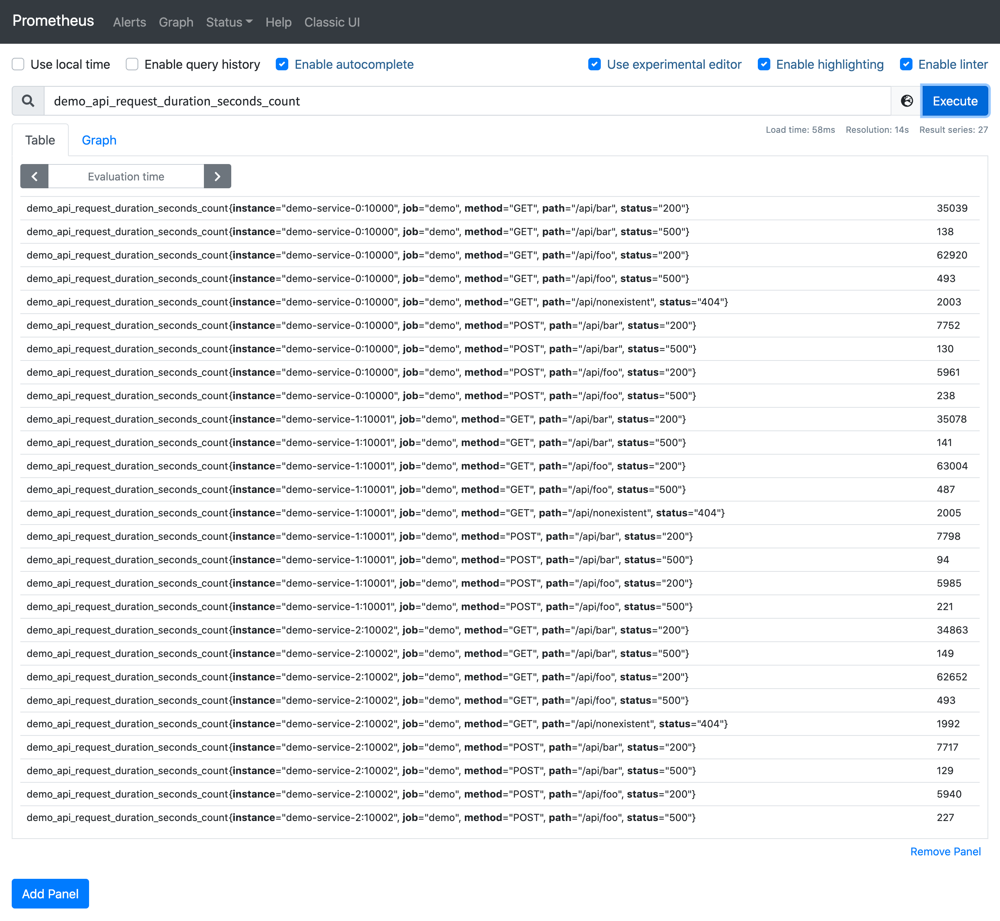
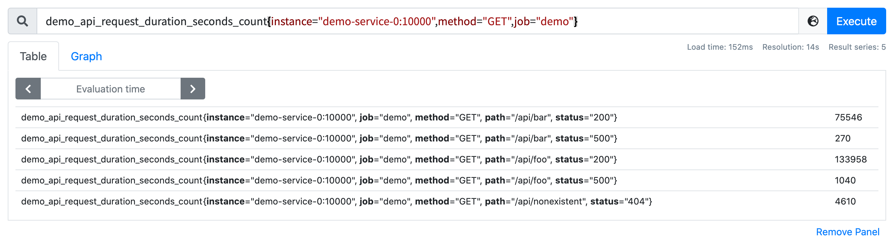
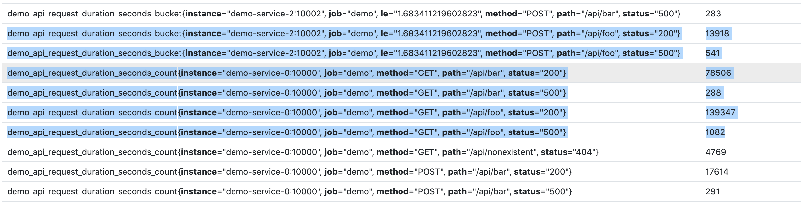
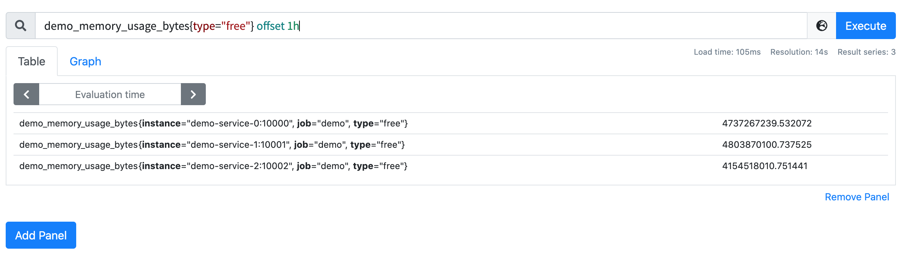

# 選擇時間序列

原文: [选择时间序列](https://p8s.io/docs/promql/query/select-series/)

本節我們將學習如何用不同的方式來選擇數據，如何在單個時間戳或一段時間範圍內基於標籤過濾數據，以及如何使用移動時間的方式來選擇數據。

## 過濾指標名稱

最簡單的 PromQL 查詢就是直接選擇具有指定指標名稱的序列，例如，以下查詢將返回所有具有指標名稱 `demo_api_request_duration_seconds_count` 的序列：

```promql
demo_api_request_duration_seconds_count
```

該查詢將返回許多具有相同指標名稱的序列，但有不同的標籤組合 instance、job、method、path 和 status 等。輸出結果如下所示：



## 根據標籤過濾

如果我們只查詢 `demo_api_request_duration_seconds_count` 中具有 method="GET" 標籤的那些指標序列，則可以在指標名稱後用大括號加上這個過濾條件：

```promql
demo_api_request_duration_seconds_count{method="GET"}
```

此外我們還可以使用逗號來組合多個標籤匹配器：

```promql
demo_api_request_duration_seconds_count{instance="demo-service-0:10000",method="GET",job="demo"}
```

上面將得到 demo 任務下面 `demo-service-0:10000` 這個實例且 `method="GET"` 的指標序列數據：



需要注意的是組合使用多個匹配條件的時候，是過濾所有條件都滿足的時間序列。

除了相等匹配之外，Prometheus 還支持其他幾種匹配器類型：

- `!=` 不等於
- `=~` 正則表達式匹配
- `!~` 正則表達式不匹配

甚至我們還可以完全省略指標名稱，比如直接查詢所有 `path` 標籤以 `/api` 開頭的所有序列：

```promql
{path=~"/api.*"}
```

該查詢會得到一些具有不同指標名稱的序列：



!!! tip
    注意： Prometheus 中的正則表達式總是針對完整的字符串而不是部分字符串匹配。因此，在匹配任何以 `/api` 開通的路徑時，不需要以 `^` 開頭，但需要在結尾處添加 `.*`，這樣可以匹配 `path="/api"` 這樣的序列。

前面我們說過在 Prometheus 內部，指標名稱本質上是一個名為 `__name__` 的特性標籤，所以查詢 `demo_api_request_duration_seconds_count` 實際上和下面的查詢方式是等效的：

```promql
{__name__="demo_api_request_duration_seconds_count"}
```

按上面的方法編寫的選擇器，可以得到一個 **瞬時向量**，其中包含所有選定序列的單個最新值。事實上有些函數要求你不是傳遞一個單一的值，而是傳遞一個序列在一段時間範圍內的值，也就是前面我們說的 **區間向量**。這個時候我們可以通過附加一個`[<數字><單位>]`形式的持續時間指定符，將"即時向量選擇器"改變為"範圍向量選擇器"（例如`[5m]`表示 5 分鐘）。

比如要查詢最近 5 分鐘的可用內存，可以執行下面的查詢語句：

```promql
demo_memory_usage_bytes{type="free"}[5m]
```

將得到如下所示的查詢結果：


可以使用的有效的時間單位為：

- `ms` -毫秒
- `s` -秒
- `m` - 分鐘
- `h` - 小時
- `d` - 天
- `y` - 年

有時我們還需要以 **時移方式 ** 訪問過去的數據，通常用來與當前數據進行比較。要將過去的數據時移到當前位置，可以使用 `offset <duration>` 修飾符添加到任何範圍或即時序列選擇器進行查詢（例如 `my_metric offset 5m` 或 `my_metric[1m] offset 7d`）。

例如，要選擇一個小時前的可用內存，可以使用下面的查詢語句：

```promql
demo_memory_usage_bytes{type="free"} offset 1h
```

這個時候查詢的值則是一個小時之前的數據：



!!! info "練習"
    1.構建一個查詢，選擇所有時間序列。
    
    ```promql
    {job!=""}
    ```

    或者：

    ```promql
    {__name__=~".+"}
    ```

    2.構建一個查詢，查詢所有指標名稱為 `demo_api_request_duration_seconds_count` 並且 `method` 標籤不為 `POST` 的序列。

    ```promql
    demo_api_request_duration_seconds_count{method!="POST"}
    ```

    3.使用 demo_memory_usage_bytes 指標查詢一小時前的 1 分鐘時間範圍的的可用空閒內存。

    ```promql
    demo_memory_usage_bytes{type="free"}[1m] offset 1h
    ```
