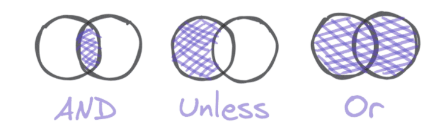
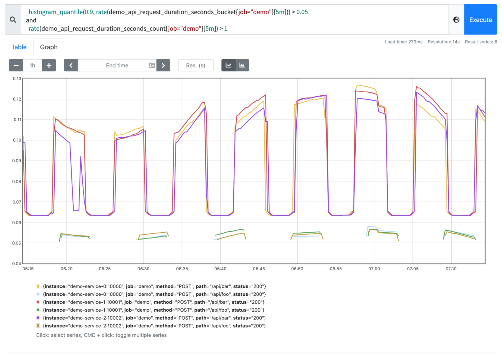

# 集合操作

原文: [集合操作](https://p8s.io/docs/promql/query/set/)

有的時候我們需要過濾或將一組時間序列與另一組時間序列進行合併，Prometheus 提供了 3 個在瞬時向量之間操作的集合運算符。

- **and（集合交集）**：比如對較高錯誤率觸發報警，但是只有當對應的總錯誤率超過某個閾值的時候才會觸發報警
- **or（集合併集）**：對序列進行並集計算
- **unless（除非）**：比如要對磁盤空間不足進行告警，除非它是唯讀的文件系統。



與算術和過濾二元運算符類似，這些集合運算符會嘗試根據相同的標籤集在左側和右側之間查找來匹配序列，除非你提供 `on()` 或 `ignoring()` 修飾符來指定應該如何找到匹配。

!!! info
    注意：與算術和過濾二進制運算符相比，集合運算符沒有 `group_left()` 或 `group_right()` 修飾符，因為集合運算符總是進行多對多的匹配，也就是說，它們總是允許任何一邊的匹配序列與另一邊的多個序列相匹配。

對於 `and` 運算符，如果找到一個匹配的，左邊的序列就會成為輸出結果的一部分，如果右邊沒有匹配的序列，則不會輸出任何結果。

例如我們想篩選出第 90 個百分位延遲高於 50ms 的所有 HTTP 端點，但只針對每秒收到多個請求的維度組合，查詢方式如下所示：

```promql
  histogram_quantile(0.9, rate(demo_api_request_duration_seconds_bucket{job="demo"}[5m])) > 0.05
and
  rate(demo_api_request_duration_seconds_count{job="demo"}[5m]) > 1
```



有的時候我們也需要對兩組時間序列進行合併操作，而不是交集，這個時候我們可以使用 `or` 集合運算符，產生的結果是運算符左側的序列，加上來自右側但左側沒有匹配標籤集的時間序列。比如我們要列出所有低於 10 或者高於 30 的請求率，則可以用下面的表達式來查詢：

```promql
  rate(demo_api_request_duration_seconds_count{job="demo"}[5m]) < 10
or
  rate(demo_api_request_duration_seconds_count{job="demo"}[5m]) > 30
```

我們可以看到在圖中使用值過濾器和集合操作會導致時間序列在圖中有斷點現象，這取決於他們在圖中的時間間隔下是否能夠與過濾器進行匹配，所以一般情況下，我們建議只在告警規則中使用這種過濾操作。

還有一個 `unless` 操作符，它只會保留左邊的時間序列，如果右邊不存在相等的標籤集合的話。

!!! info "練習"
    1.構建一個查詢，顯示按 `path`、`method`、`status`（5 分鐘內平均）劃分的 demo API 請求的第 95 個百分位延遲，除非這個維度組合每秒收到的請求少於 1 個請求（5 分鐘內平均）。

    ```promql
    histogram_quantile(0.95, sum by(path, method, status, le) (rate(demo_api_request_duration_seconds_bucket[5m])))
    unless
    sum by(path, method, status) (rate(demo_api_request_duration_seconds_count[5m])) < 1
    ```