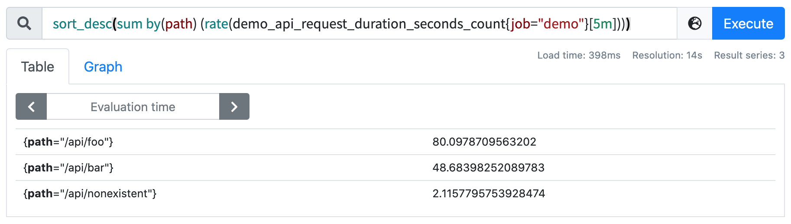
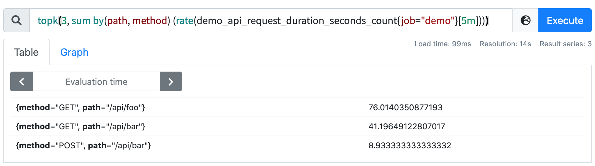

# 排序

原文: [排序](https://p8s.io/docs/promql/query/sort/)

本節我們將學習如何對查詢結果進行排序，或者只選擇一組序列中最大或最小的值。

我們可以使用 `sort()`（升序） 或者 `sort_desc()`（降序）函數來實現對輸出結果進行排序，例如，要顯示按值排序的每個路徑請求率，從最高到最低，我們可以用下面的語句進行查詢：

```promql
sort_desc(sum by(path) (rate(demo_api_request_duration_seconds_count{job="demo"}[5m])))
```



有的時候我們並不是對所有的時間序列感興趣，只對最大或最小的幾個序列感興趣，我們可以使用 `topk()` 和 `bottomk()` 這兩個運算符來操作，可以返回 K 個最大或最小的序列，比如只顯示每個 `path` 和 `method` 的前三的請求率，我們可以使用下面的語句來查詢。

```promql
topk(3, sum by(path, method) (rate(demo_api_request_duration_seconds_count{job="demo"}[5m])))
```



!!! info "練習"
    1.構建一個查詢以升序的方式顯示所有 3 個 demo 服務的磁盤使用情況。

    ```promql
    sort(demo_disk_usage_bytes)
    ```

    2.構建一個查詢，按 method、path 和 status 維度顯示 3 個最低流量的 demo API 請求比率。

    ```promql
    bottomk(3, sum by(method, path, status) (rate(demo_api_request_duration_seconds_count[5m])))
    ```