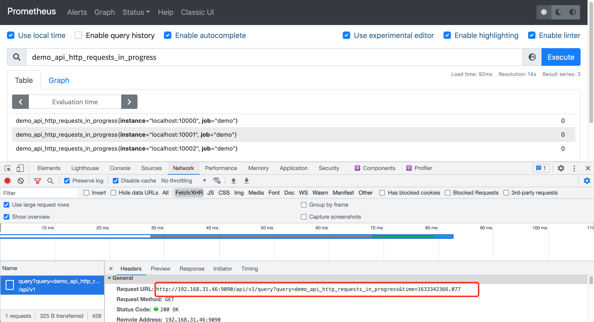
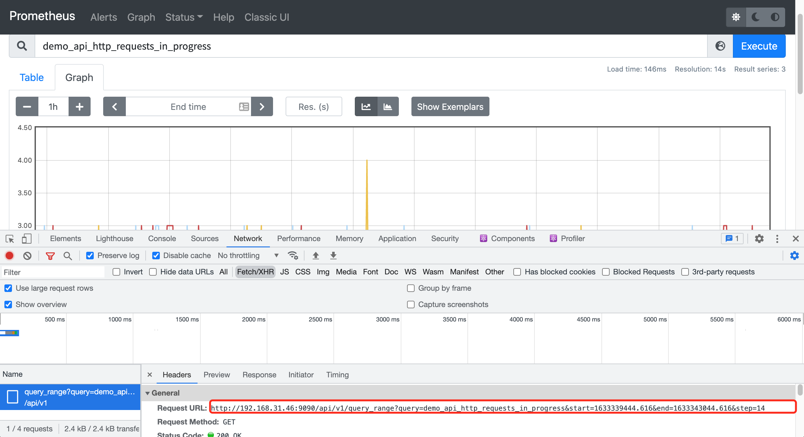
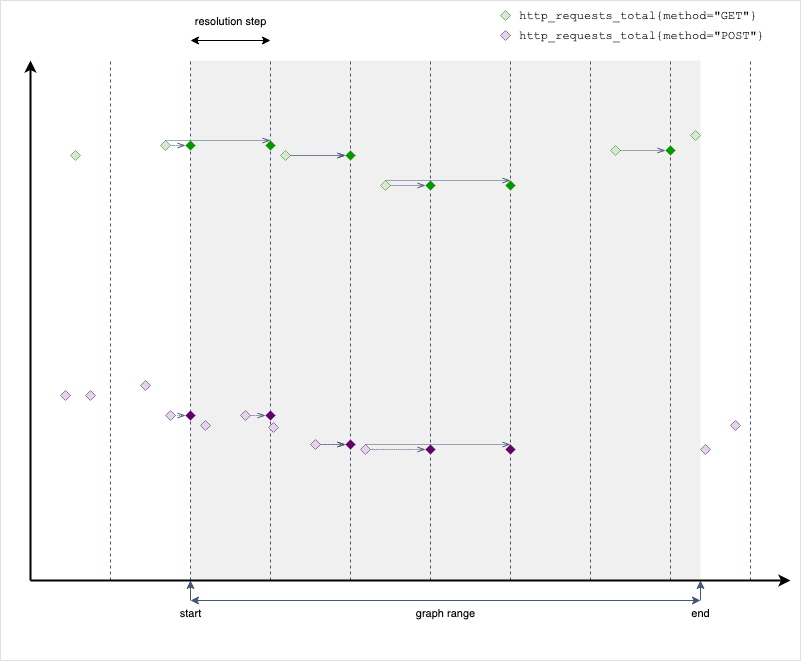

# 查詢基礎

原文: [PromQL 基础](https://p8s.io/docs/promql/query/theory/)

在繼續深入學習 PromQL 查詢細節之前，我們先來看看 PromQL 查詢的一些理論基礎。

## 嵌套結構

與 SQL 查詢語言（SELECT * FROM ...）不同，PromQL 是一種嵌套的函數式語言，就是我們要把需要查找的數據描述成一組嵌套的表達式，每個表達式都會評估為一個中間值，每個中間值都會被用作它上層表達式中的參數，而查詢的最外層表達式表示你可以在表格、圖形中看到的最終返回值。比如下面的查詢語句：

```promql
histogram_quantile(  # 查詢的根，最終結果表示一個近似分位數。
  0.9,  # histogram_quantile() 的第一個參數，分位數的目標值
  # histogram_quantile() 的第二個參數，聚合的直方圖
  sum by(le, method, path) (
    # sum() 的參數，直方圖過去5分鐘每秒增量。
    rate(
      # rate() 的參數，過去5分鐘的原始直方圖序列
      demo_api_request_duration_seconds_bucket{job="demo"}[5m]
    )
  )
)
```

PromQL 表達式不僅僅是整個查詢，而是查詢的任何嵌套部分（比如上面的rate(...)部分），你可以把它作為一個查詢本身來運行。在上面的例子中，每行註釋代表一個表達式。

## 結果類型

在查詢 Prometheus 時，有兩個 **類型** 的概念經常出現，區分它們很重要。

- 抓取目標報告的 **指標類型**：counter、gauge、histogram、summary。
- PromQL 表達式的 **結果數據類型**：字符串、標量、瞬時向量或區間向量。

PromQL 實際上沒有直接的指標類型的概念，只關注表達式的 **結果類型**。每個 PromQL 表達式都有一個類型，每個函數、運算符或其他類型的操作都要求其參數是某種表達式類型。例如，`rate()` 函數要求它的參數是一個區間向量，但是 `rate()` 本身評估為一個瞬時向量輸出，所以 `rate()` 的結果只能用在期望是瞬時向量的地方。

PromQL 中可能的表達式類型包括：

- **string(字符串)**：字符串只會作為某些函數（如 `label_join()` 和 `label_replace()`）的參數出現。
- **scalar(標量)**：一個單一的數字值，如 1.234，這些數字可以作為某些函數的參數，如 `histogram_quantile(0.9, ...)` 或 `topk(3, ...)`，也會出現在算術運算中。
- **instant vector(瞬時向量)**：一組標記的時間序列，每個序列有一個樣本，都在同一個時間戳，瞬時向量可以由 TSDB 時間序列選擇器直接產生，如 `node_cpu_seconds_total`，也可以由任何函數或其他轉換來獲取。

    ```bash
    node_cpu_seconds_total{cpu="0", mode="idle"}   → 19165078.75 @ timestamp_1
    node_cpu_seconds_total{cpu="0", mode="system"} →   381598.72 @ timestamp_1
    node_cpu_seconds_total{cpu="0", mode="user"}   → 23211630.97 @ timestamp_1
    ```
- **range vector(區間向量)**：一組標記的時間序列，每個序列都有一個隨時間變化的樣本範圍。在 PromQL 中只有兩種方法可以生成區間向量：在查詢中使用字面區間向量選擇器（如 `node_cpu_seconds_total[5m]`），或使用子查詢表達式（如 `<expression>[5m:10s]`），當想要在指定的時間窗口內聚合一個序列的行為時，區間向量非常有用，就像 `rate(node_cpu_seconds_total[5m])` 計算每秒增加率一樣，在 `node_cpu_seconds_total` 指標的最後 5 分鐘內求平均值。

    ```bash
    node_cpu_seconds_total{cpu="0", mode="idle"}   → 19165078.75 @ timestamp_1,  19165136.3 @ timestamp_2, 19165167.72 @ timestamp_3
    node_cpu_seconds_total{cpu="0", mode="system"} → 381598.72   @ timestamp_1,   381599.98 @ timestamp_2,   381600.58 @ timestamp_3
    node_cpu_seconds_total{cpu="0", mode="user"}   → 23211630.97 @ timestamp_1, 23211711.34 @ timestamp_2, 23211748.64 @ timestamp_3
    ```

## 查詢類型和評估時間

PromQL 查詢中對時間的引用只有相對引用，比如 `[5m]`，表示過去 5 分鐘，那麼如何指定一個絕對的時間範圍，或在一個表格中顯示查詢結果的時間戳？在 PromQL 中，這樣的時間參數是與表達式分開發送到 Prometheus 查詢 API 的，確切的時間參數取決於你發送的查詢類型，Prometheus 有兩種類型的 PromQL 查詢： **瞬時查詢** 和 **區間查詢**。

### 瞬時查詢

瞬時查詢用於類似表格的視圖，你想在一個時間點上顯示 PromQL 查詢的結果。一個瞬時查詢有以下參數：

- PromQL 表達式
- 一個評估的時間戳

在查詢的時候可以選擇查詢過去的數據，比如 `foo[1h]` 表示查詢 foo 序列最近 1 個小時的數據，訪問過去的數據，對於計算一段時間內的比率或平均數等聚合會非常有用。



在 Prometheus 的 WebUI 界面中表格視圖中的查詢就是瞬時查詢，API 接口 `/api/v1/query?query=xxxx&time=xxxx` 中的 `query` 參數就是 PromQL 表達式，`time` 參數就是評估的時間戳。瞬時查詢可以返回任何有效的 PromQL 表達式類型（字符串、標量、即時和範圍向量）。

下面來看一個瞬時查詢的示例，看看它是如何進行評估工作的。比如 `http_requests_total` 在指定的時間戳來評估表達式，`http_requests_total` 是一個瞬時向量選擇器，它可以選擇該時間序列的最新樣本，最新意味著查詢最近 5 分鐘的樣本數據。

如果我們在一個有最近樣本的時間戳上運行此查詢，結果將包含兩個序列，每個序列都有一個樣本：


注意每個返回的樣本輸出時間戳不再是原始樣本被採集的時間戳，而會被設置為評估的時間戳。

如果在時間戳之前有一個 >5m 的間隙，這個時候如果我們執行相同的查詢：


這個情況下查詢的結果將返回為空，因為很顯然在最近 5 分鐘內沒有能夠匹配的樣本。

### 區間查詢

區間查詢主要用於圖形，想在一個指定的時間範圍內顯示一個 PromQL 表達式，範圍查詢的工作方式與即時查詢完全相同，這些查詢在 **指定時間範圍的評估步長** 中進行評估。當然，這在後台是高度優化的，在這種情況下，Prometheus 實際上並沒有運行許多獨立的即時查詢。

區間查詢包括以下一些參數：

- PromQL 表達式
- 開始時間
- 結束時間
- 評估步長

!!! tip "步長 step 說明"
    有關區間查詢的 步長(step) 參數的說明，請參閱: [詳解 Prometheus range query 中的 step 參數](./range-query-step.md)


在開始時間和結束時間之間的每個評估步長上評估表達式後，單獨評估的時間片被拼接到一個單一的區間向量中。區間查詢允許傳入瞬時向量類型或標量類型的表達式，但始終返回一個範圍向量（標量或瞬時向量在一個時間範圍內被評估的結果）。

在 Prometheus 的 WebUI 界面中圖形視圖中的查詢就是區間查詢，API 接口 `/api/v1/query_range?query=xxx&start=xxxxxx&end=xxxx&step=14` 中的 `query` 參數就是 PromQL 表達式，`start` 為開始時間，`end` 為結束時間，`step` 為評估的步長。



比如把上面的 `http_requests_total` 表達式作為一個範圍查詢來進行評估，它的評估結果如下所示：



注意每個評估步驟的行為與獨立的瞬時查詢完全一樣，而且每個獨立的瞬時查詢都沒有查詢的總體範圍的概念，在我們這個示例中最終的結果將是一個區間向量，其中包含兩個選定序列在一定時間範圍內的樣本，但也將包含某些時間步長的序列數據的間隙。
