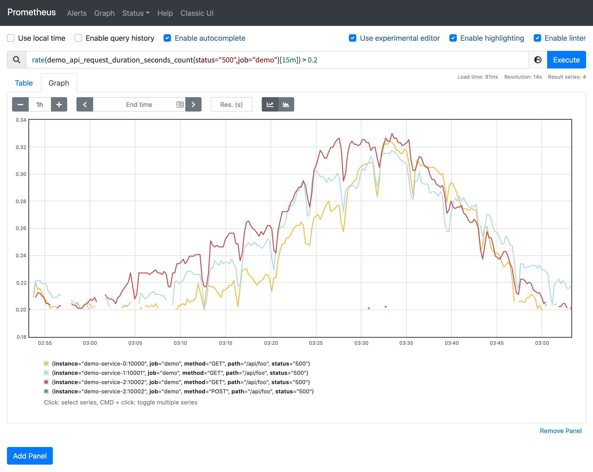
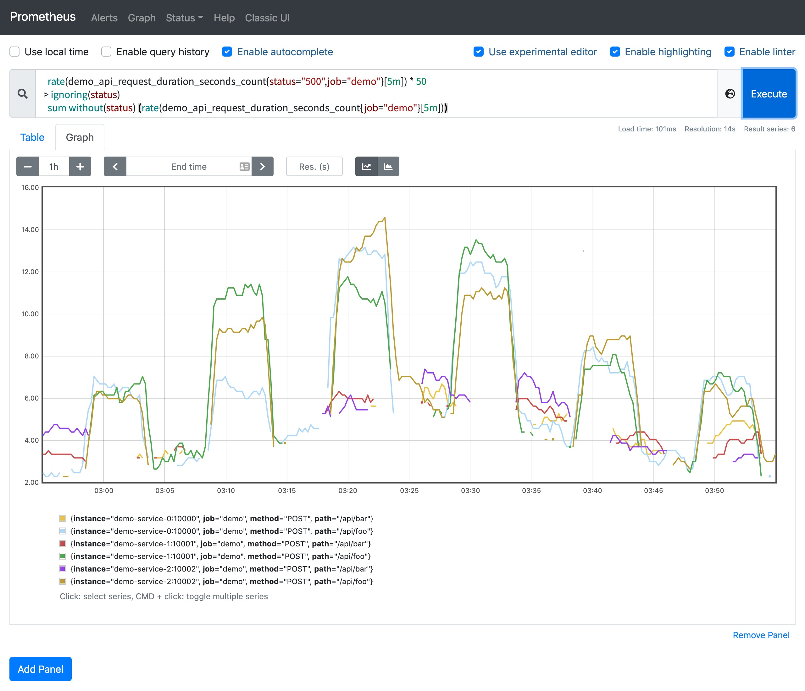
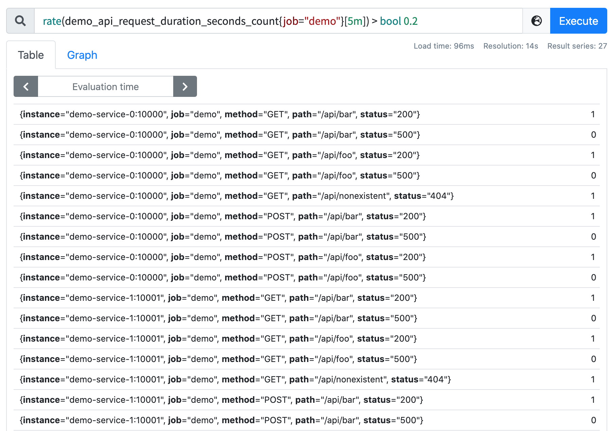

# 閾值

原文: [运算](https://p8s.io/docs/promql/query/threshold/)

PromQL 通過提供一組過濾的二元運算符（>、<、== 等），允許根據其樣本值過濾一組序列，這種過濾最常見的場景就是在報警規則中使用的閾值。比如我們想查找在過去 15 分鐘內的 `status="500"` 錯誤率大於 20% 的所有 HTTP 路徑，我們在 `rate` 表達式後面添加一個 `>0.2` 的過濾運算符：

```promql
rate(demo_api_request_duration_seconds_count{status="500",job="demo"}[15m]) > 0.2
```

這個查詢只會將錯誤率大於 20% 的數據過濾出來。



!!! info
    注意：由於在圖形中的每個步長都是完全獨立評估表達式的，因此根據每個步驟的過濾條件，某些比率會出現或消失（因此存在間隙）。一般來說，二元過濾運算符在圖形中並不常見，大多數在報警條件中出現，用來表示閾值。

這種過濾方式不僅適用於單個數字，PromQL 還允許你用一組時間序列過濾另一組序列。與上面的二元運算一樣，比較運算符會自動應用於比較左側和右側具有相同標籤集的序列之間。 `on()` / `ignoring()` 和 `group_left()` / `group_right()` 修飾符的作用也與我們前面學習的二元算術運算符一樣。

以下示例是選擇所有具有 500 錯誤率且至少比同一路徑的總請求率大 50 倍的路徑：

```promql
  rate(demo_api_request_duration_seconds_count{status="500",job="demo"}[5m]) * 50
> ignoring(status)
  sum without(status) (rate(demo_api_request_duration_seconds_count{job="demo"}[5m]))
```

不過需要注意的是我們必須忽略匹配中的 status 標籤，因為在左邊一直有這個標籤，而右邊沒有這個標籤。



比如我們還可以計算 demo 演示服務實例在一小時內的預測磁盤使用量，但要過濾只有那些預測磁盤已滿的實例。

```promql
predict_linear(demo_disk_usage_bytes{job="demo"}[1h], 3600) >= demo_disk_total_bytes{job="demo"}
```

Prometheus 支持以下過濾操作：

- `==`
- `!=`
- `<`
- `<=`
- `>`
- `>=`

有時你可能想知道比較運算符的結果而不實際刪除任何輸出系列。要實現這一點，我們可以向運算符添加一個 bool 修飾符來保留所有的序列，但是把輸出樣本值設置為 1（比較為真）或 0（比較為假）。

例如，要簡單地顯示一組數據中哪些請求率高於或低於 0.2/s，我們可以這樣查詢：

```promql
rate(demo_api_request_duration_seconds_count{job="demo"}[5m]) > bool 0.2
```

我們可以看到輸入序列的結果為 0 或 1，把數字條件轉換為了布爾輸出值。



!!! info "練習"
    1.構建一個查詢，顯示使用少於 20MB 內存的目標（`process_resident_memory_bytes` 指標）。

    ```promql
    process_resident_memory_bytes / 1024^2 < 20
    ```

    2.構建一個查詢，顯示 Prometheus 服務內部所有在過去 5 分鐘內沒有收到任何查詢的 HTTP 處理器。

    ```promql
    rate(prometheus_http_requests_total[5m]) == 0
    ```
