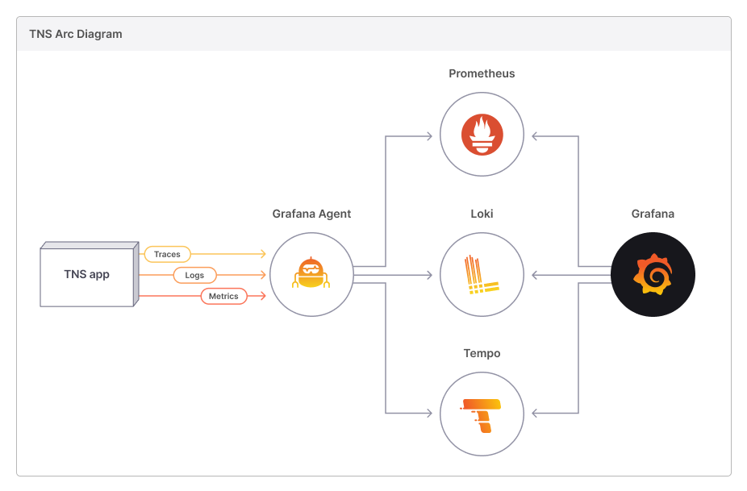

# Observability 應用程式範例

[原文](The New Stack (TNS) observability app)[https://github.com/grafana/tns]

## 概述

New Stack (TNS) 是一個簡單的三層式應用架構的 App，它完全配備了可觀察性的 3 個支柱：指標、日誌和跟踪的功能。它提供了關於現代可觀察性堆棧是什麼樣子的洞察力，並體驗了在不同類型的可觀察性數據之間相互驗證的感覺。

TNS 應用程序是 Weaveworks 構建的三層 Web 應用程序範例。它由數據層、應用邏輯層和負載均衡層組成。要了解有關它的更多信息，請參閱 [Weaveworks 中的如何使用 Wea​​ve Scope 檢測、映射和監控 Docker 容器](https://thenewstack.io/how-to-detect-map-and-monitor-docker-containers-with-weave-scope-from-weaveworks/)。

TNS 應用程序的儀器化的方向如下：

- **指標 Metric**：TNS 應用程序的每一層都在 `/metrics` 端點上公開指標，這些指標由 Grafana 代理抓取。此外，這些指標還附加了信息標籤。然後，Grafana 代理將這些指標寫入 Prometheus（啟用遠程讀取）進行存儲。 [雖然 Prometheus 可以直接從 TNS 應用程序中抓取指標，但該演示配置為使代理成為收集指標、日誌和跟踪的中心點。 你也可以使用其它替代　Prometheus 遠程寫入 (remote-write) 的後端，例如 Thanos 或 Cortex。

- **日誌 Log**：TNS 應用程序的每一層都將日誌寫到標準輸出(standard out)或標準錯誤(standard error)。這些日誌被 Kubernetes 捕獲，然後由 Grafana 代理收集。最後，代理將它們轉發給 Loki 進行存儲。

- **鏈路追踪　Trace**：TNS 應用程序的每一層都將 Jaeger 格式的 traces 發送到 Grafana Agent，然後將其轉換為 OTel 格式並轉發到 Tempo 進行存儲。

在　Grafana 配置資料源 Prometheus、Loki 和 Tempo 之後，使用者就可以在 Grafana 中查詢和可視化指標、日誌和跟鏈路追踪的相關數據。

##　探索　metrics > logs > traces

以下說明將幫助您從指標(metrics)到日誌(logs)再到跟踪(traces)。

1. 打開 TNS 儀表板。
2. 放大請求失敗的面板部分。
3. 從面板下拉菜單中，單擊 `Explore`。
4. 在瀏覽視圖中，轉到數據源下拉菜單並選擇 Loki。
5. 選擇 traceID 為 Tempo 的日誌行。

