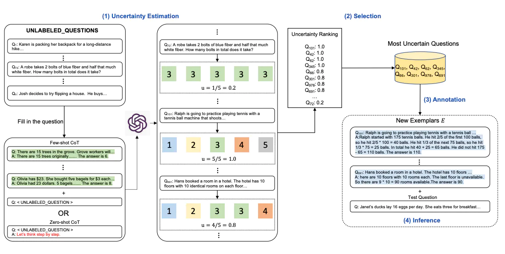

# Active-Prompt

思維鏈（CoT）方法依賴於一組固定的人工註釋範例。問題在於，這些範例可能不是不同任務的最有效示例。為了解決這個問題，[Diao等人(2023)](https://arxiv.org/pdf/2302.12246.pdf)最近提出了一種新的提示方法，稱為 Active-Prompt，以適應 LLMs 到不同的任務特定示例提示（用人類設計的 CoT 推理進行註釋）。

下面是該方法的說明。第一步是使用或不使用少量 CoT 示例查詢 LLM。對一組訓練問題生成 k 個可能的答案。基於 k 個答案計算不確定度度量（使用不一致性）。選擇最不確定的問題由人類進行註釋。然後使用新的註釋範例來推斷每個問題。

