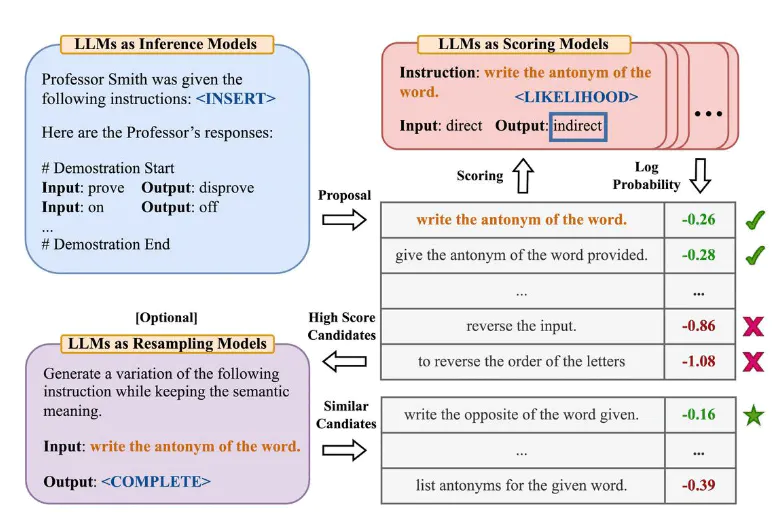
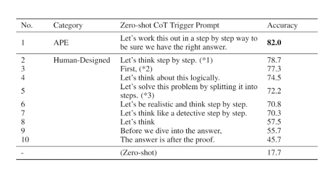

# 自動提示工程（APE）

[Zhou 等人，(2022)](https://arxiv.org/abs/2211.01910) 提出了自動提示工程師（APE），這是一個用於自動指令生成和選擇的框架。指令生成問題被構建為自然語言合成問題，使用LLMs作為黑盒優化問題的解決方案來生成和搜索候選解。

第一步涉及一個大型語言模型（作為推理模型），該模型接收輸出演示以生成任務的指令候選項。這些候選解將指導搜索過程。使用目標模型執行指令，然後根據計算的評估分數選擇最合適的指令。

APE 發現了一個比人工設計的“讓我們一步一步地思考”提示更好的零樣本CoT提示（Kojima等人，2022(opens in a new tab)）。

提示“讓我們一步一步地解決這個問題，以確保我們有正確的答案。”引發了思維鏈的推理，並提高了 MultiArith 和 GSM8K 基準測試的性能：

本文涉及與提示工程相關的重要主題，即自動優化提示的想法。雖然我們在本指南中沒有深入探討這個主題，但如果您對此主題感興趣，以下是一些關鍵論文：

- [AutoPrompt](https://arxiv.org/abs/2010.15980) - 提出了一種基於梯度引導搜索的方法，用於自動創建各種任務的提示。
- [Prefix Tuning](https://arxiv.org/abs/2101.00190) - 是一種輕量級的 fine-tuning 替代方案，為 NLG 任務添加可訓練的連續前綴。
- [Prompt Tuning](https://arxiv.org/abs/2104.08691) - 提出了一種通過反向傳播學習軟提示的機制。

