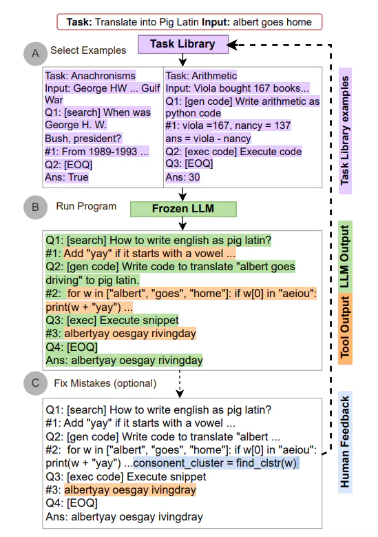
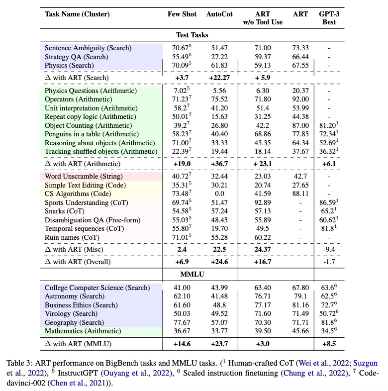

# Automatic Reasoning and Tool-use

使用 LLM 完成任務時，交替運用 CoT 提示和工具已經被證明是一種即強大又穩健的方法。這類方法通常需要針對特定任務手寫示範，還需要精心編寫交替使用生成模型和工具的腳本。 [Paranjape et al., (2023)](https://arxiv.org/abs/2303.09014)提出了一個新框架，該框架使用凍結的 LLM 來自動生成包含中間推理步驟的程序。

ART（Automatic Reasoning and Tool-use）的工作原理如下：

- 接到一個新任務的時候，從任務庫中選擇多步推理和使用工具的示範。
- 在測試中，調用外部工具時，先暫停生成，將工具輸出整合後繼續接著生成。

ART 引導模型總結示範，將新任務進行拆分並在恰當的地方使用工具。 ART 採用的是零樣本(zero-shot)形式。 ART 還可以手動擴展，只要簡單地更新任務和工具庫就可以修正推理步驟中的錯誤或是添加新的工具。這個過程如下：

在 BigBench 和 MMLU 基準測試中，ART 在未見任務上的表現大大超過了少樣本提示和自動 CoT；配合人類反饋後，其表現超過了手寫的 CoT 提示。

下面這張表格展示了 ART 在 BigBench 和 MMLU 任務上的表現：

