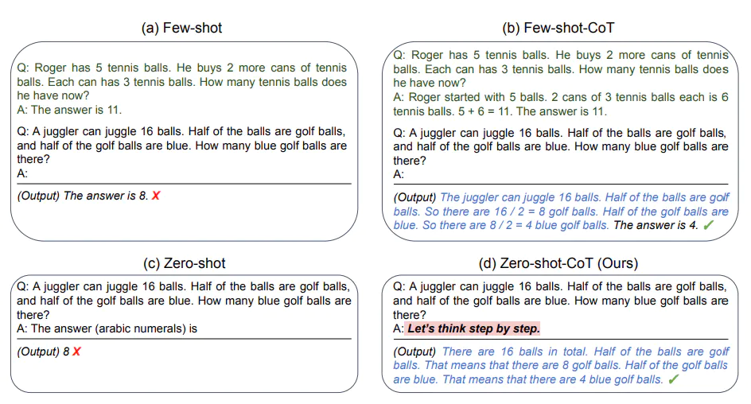

# Chain-of-Thought Prompting

## 思維鏈提示 (CoT)


在 [Wei 等人(2022)](https://arxiv.org/abs/2201.11903)中引入鍊式思考(Chain-of-Thought)提示通過中間推理步驟實現了複雜的推理能力。您可以將其與少樣本提示相結合，確定更好的結果，便於在回答之前進行推理的更複雜的任務。

**Prompt**:

```console讓我們嘗試以下算術推理示例：
The odd numbers in this group add up to an even number: 4, 8, 9, 15, 12, 2, 1.
A: Adding all the odd numbers (9, 15, 1) gives 25. The answer is False.
The odd numbers in this group add up to an even number: 17,  10, 19, 4, 8, 12, 24.
A: Adding all the odd numbers (17, 19) gives 36. The answer is True.
The odd numbers in this group add up to an even number: 16,  11, 14, 4, 8, 13, 24.
A: Adding all the odd numbers (11, 13) gives 24. The answer is True.
The odd numbers in this group add up to an even number: 17,  9, 10, 12, 13, 4, 2.
A: Adding all the odd numbers (17, 9, 13) gives 39. The answer is False.
The odd numbers in this group add up to an even number: 15, 32, 5, 13, 82, 7, 1. 
A:
```

**Output**:

```console
Adding all the odd numbers (15, 5, 13, 7, 1) gives 41. The answer is False.
```

哇！我們可以看到在提供推理步驟時得到了完美的結果。實際上，我們可以通過提供更少的示例來解決此任務，即僅一個示例似乎就足夠了：


**Prompt**:

```console
The odd numbers in this group add up to an even number: 4, 8, 9, 15, 12, 2, 1.
A: Adding all the odd numbers (9, 15, 1) gives 25. The answer is False.
The odd numbers in this group add up to an even number: 15, 32, 5, 13, 82, 7, 1. 
A:
```

**Output**:

```console
Adding all the odd numbers (15, 5, 13, 7, 1) gives 41. The answer is False.
```

請記住，作者聲稱這是足夠大的語言模型才會出現的新興能力。

## 零樣本 CoT 提示



最近提出的一個新想法是[零樣本CoT（Kojima等人，2022年）](https://arxiv.org/abs/2205.11916)，它基本上涉及將“讓我們逐步思考”添加到原始提示中。讓我們嘗試一個簡單的問題，看看模型的表現如何：

**Prompt**:

```console
I went to the market and bought 10 apples. I gave 2 apples to the neighbor and 2 to the repairman. I then went and bought 5 more apples and ate 1. How many apples did I remain with?
```

**Output**:

```console
11 apples
```

答案是不正確的！現在讓我們嘗試使用特殊提示。

**Prompt**:

```console
I went to the market and bought 10 apples. I gave 2 apples to the neighbor and 2 to the repairman. I then went and bought 5 more apples and ate 1. How many apples did I remain with?
Let's think step by step.
```

**Output**:

```console
First, you started with 10 apples.
You gave away 2 apples to the neighbor and 2 to the repairman, so you had 6 apples left.
Then you bought 5 more apples, so now you had 11 apples.
Finally, you ate 1 apple, so you would remain with 10 apples.
```

令人印象深刻的是，這個簡單的提示在這個任務中非常有效。這在您沒有太多示例可用於提示時特別有用。
