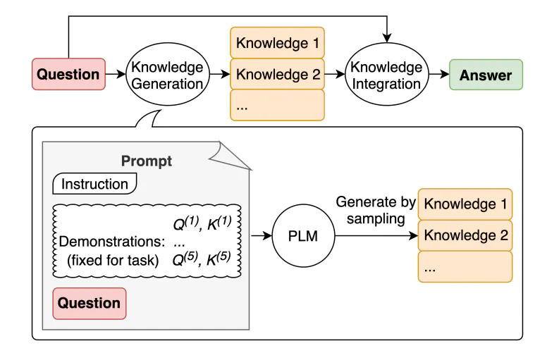

# Generated Knowledge Prompting



LLM 繼續得到改進，其中一種流行的技術是能夠融合知識或信息，以幫助模型做出更準確的預測。

使用類似的思路，模型是否也可以在做出預測之前用於生成知識呢？這就是 [Liu 等人 2022](https://arxiv.org/pdf/2110.08387.pdf) 的論文所嘗試的——生成知識以作為提示的一部分。特別是，這對於常識推理等任務有多大幫助？

讓我們嘗試一個簡單的提示：

**Prompt**:

```console
Part of golf is trying to get a higher point total than others. Yes or No?
```

**Output**:

```console
Yes.
```

這種錯誤揭示了 LLM 在執行需要更多關於世界的知識的任務時的局限性。我們如何通過生成知識來改進呢？

首先，我們生成一些“知識”：

**Prompt**:

```console
Input: Greece is larger than mexico.
Knowledge: Greece is approximately 131,957 sq km, while Mexico is approximately 1,964,375 sq km, making Mexico 1,389% larger than Greece.
Input: Glasses always fog up.
Knowledge: Condensation occurs on eyeglass lenses when water vapor from your sweat, breath, and ambient humidity lands on a cold surface, cools, and then changes into tiny drops of liquid, forming a film that you see as fog. Your lenses will be relatively cool compared to your breath, especially when the outside air is cold.
Input: A fish is capable of thinking.
Knowledge: Fish are more intelligent than they appear. In many areas, such as memory, their cognitive powers match or exceed those of ’higher’ vertebrates including non-human primates. Fish’s long-term memories help them keep track of complex social relationships.
Input: A common effect of smoking lots of cigarettes in one’s lifetime is a higher than normal chance of getting lung cancer.
Knowledge: Those who consistently averaged less than one cigarette per day over their lifetime had nine times the risk of dying from lung cancer than never smokers. Among people who smoked between one and 10 cigarettes per day, the risk of dying from lung cancer was nearly 12 times higher than that of never smokers.
Input: A rock is the same size as a pebble.
Knowledge: A pebble is a clast of rock with a particle size of 4 to 64 millimetres based on the Udden-Wentworth scale of sedimentology. Pebbles are generally considered larger than granules (2 to 4 millimetres diameter) and smaller than cobbles (64 to 256 millimetres diameter).
Input: Part of golf is trying to get a higher point total than others.
Knowledge:
```

**Knowledge 1**:

```console
The objective of golf is to play a set of holes in the least number of strokes. A round of golf typically consists of 18 holes. Each hole is played once in the round on a standard golf course. Each stroke is counted as one point, and the total number of strokes is used to determine the winner of the game.
```

**Knowledge 2**:

```console
Golf is a precision club-and-ball sport in which competing players (or golfers) use many types of clubs to hit balls into a series of holes on a course using the fewest number of strokes. The goal is to complete the course with the lowest score, which is calculated by adding up the total number of strokes taken on each hole. The player with the lowest score wins the game.
```

我們使用 [Liu 等人 2022](https://arxiv.org/pdf/2110.08387.pdf) 的論文中提供的提示。

下一步是將知識整合併得出預測。我將問題重新格式化為 QA 格式，以指導答案格式。

**Prompt**:

```console
Question: Part of golf is trying to get a higher point total than others. Yes or No?
Knowledge: The objective of golf is to play a set of holes in the least number of strokes. A round of golf typically consists of 18 holes. Each hole is played once in the round on a standard golf course. Each stroke is counted as one point, and the total number of strokes is used to determine the winner of the game.
Explain and Answer: 
```

**Answer 1**:

```console
No, the objective of golf is not to get a higher point total than others. Rather, the objective is to play a set of holes in the least number of strokes. The total number of strokes is used to determine the winner of the game, not the total number of points.
```

```console
Question: Part of golf is trying to get a higher point total than others. Yes or No?
Knowledge: Golf is a precision club-and-ball sport in which competing players (or golfers) use many types of clubs to hit balls into a series of holes on a course using the fewest number of strokes. The goal is to complete the course with the lowest score, which is calculated by adding up the total number of strokes taken on each hole. The player with the lowest score wins the game.
Explain and Answer:
```

**Answer 2**:

```console
Yes, part of golf is trying to get a higher point total than others. Each player tries to complete the course with the lowest score, which is calculated by adding up the total number of strokes taken on each hole. The player with the lowest score wins the game.
```

這個例子發生了一些非常有趣的事情。在第一個答案中，模型非常自信，但在第二個答案中不太自信。我簡化了過程以進行演示，但在得出最終答案時還有一些細節需要考慮。請查看論文以了解更多。