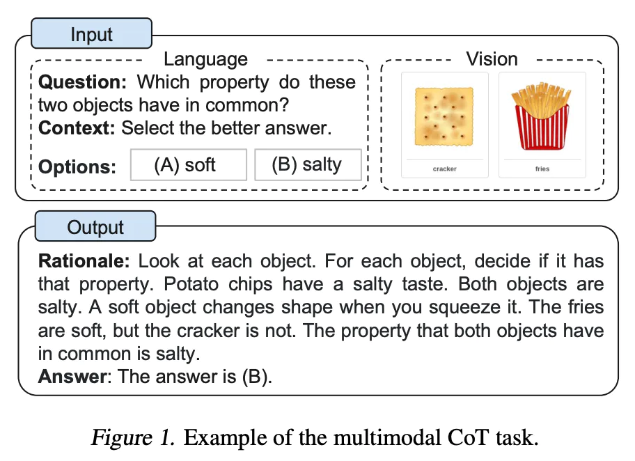

# 多模態思維鏈提示

最近，[Zhang 等人(2023)](https://arxiv.org/abs/2302.00923)提出了一種多模態思維鏈提示方法。傳統的思維鏈提示方法側重於語言模態。相比之下，多模態思維鏈提示將文本和視覺融入到一個兩階段框架中。第一步涉及基於多模態信息的理性生成。接下來是第二階段的答案推斷，它利用生成的理性信息。

多模態 CoT 模型(1B) 在 ScienceQA 基準測試中的表現優於 GPT-3.5。

進一步閱讀：

- [Language Is Not All You Need: Aligning Perception with Language Models](https://arxiv.org/abs/2302.14045)(Feb 2023)