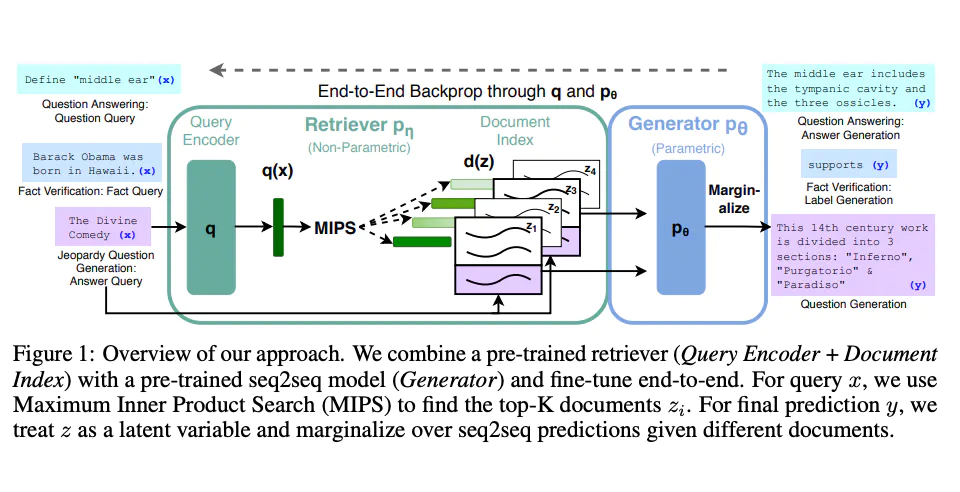

# Retrieval Augmented Generation

通用語言模型通過微調就可以完成幾類常見任務，比如分析情緒和識別命名實體。這些任務不需要額外的背景知識就可以完成。

要完成更複雜和知識密集型的任務，可以基於語言模型構建一個系統，訪問外部知識源來做到。這樣的實現與事實更加一致性，生成的答案更可靠，還有助於緩解“幻覺”問題。

Meta AI 的研究人員引入了一種叫做[檢索增強生成(Retrieval Augmented Generation，RAG)](https://ai.facebook.com/blog/retrieval-augmented-generation-streamlining-the-creation-of-intelligent-natural-language-processing-models/)的方法來完成這類知識密集型的任務。 RAG 把一個信息檢索組件和文本生成模型結合在一起。RAG 可以微調，其內部知識的修改方式很高效，不需要對整個模型進行重新訓練。

RAG 會接受輸入並檢索出一組相關/支撐的文檔，並給出文檔的來源（例如維基百科）。這些文檔作為上下文和輸入的原始提示詞組合，送給文本生成器得到最終的輸出。這樣 RAG 更加適應事實會隨時間變化的情況。這非常有用，因為 LLM 的參數化知識是靜態的。 RAG 讓語言模型不用重新訓練就能夠獲取最新的信息，基於檢索生成產生可靠的輸出。

Lewis 等人（2021）提出一個通用的 RAG 微調方法。這種方法使用預訓練的 seq2seq 作為參數記憶，用維基百科的密集向量索引作為非參數記憶（使通過神經網絡預訓練的檢索器訪問）。這種方法工作原理概況如下：

RAG 在 [Natural Questions](https://ai.google.com/research/NaturalQuestions)、[WebQuestions](https://paperswithcode.com/dataset/webquestions) 和 CuratedTrec 等基準測試中表現搶眼。用 MS-MARCO 和 Jeopardy 問題進行測試時，RAG 生成的答案更符合事實、更具體、更多樣。 FEVER 事實驗證使用 RAG 後也得到了更好的結果。

這說明 RAG 是一種可行的方案，能在知識密集型任務中增強語言模型的輸出。

最近，基於檢索器的方法越來越流行，經常與 ChatGPT 等流行 LLM 結合使用來提高其能力和事實一致性。

LangChain 文檔中可以找到一個[使用檢索器和 LLM 回答問題並給出知識來源的簡單例子](https://python.langchain.com/docs/use_cases/question_answering/how_to/vector_db_qa)。
