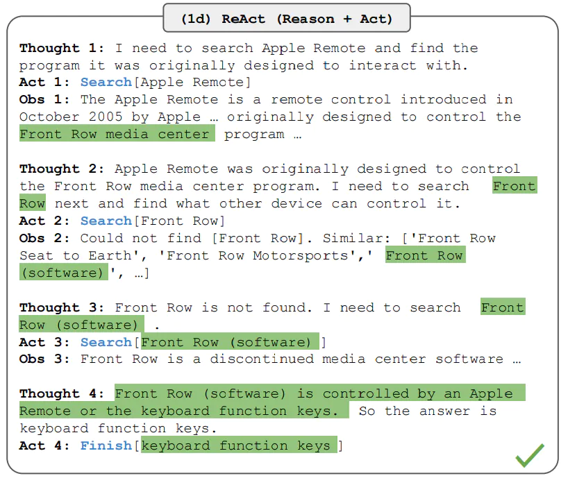
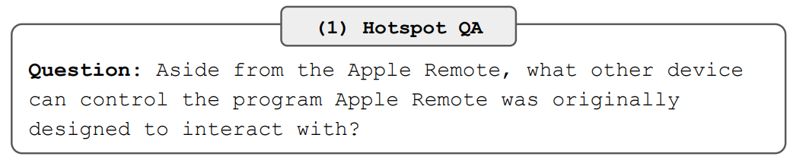
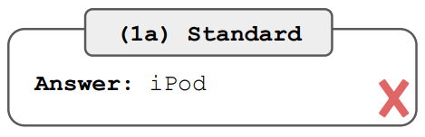
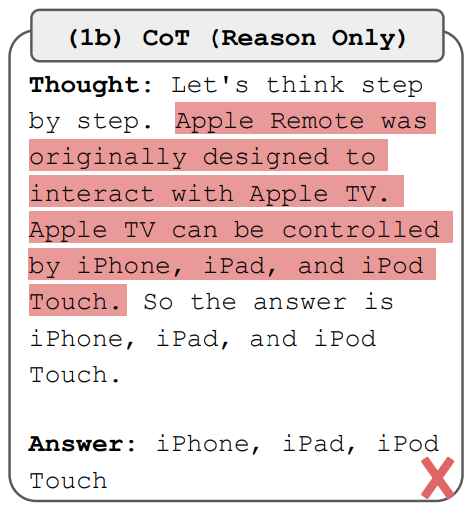
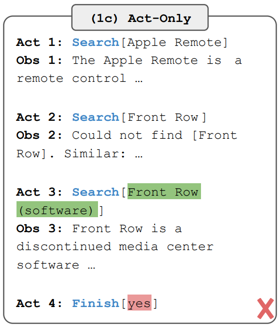
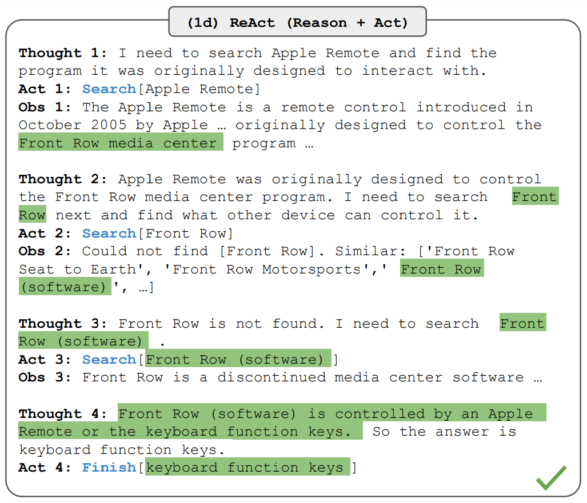

# ReAct 框架

從 [Yao 等人，2022](https://arxiv.org/abs/2210.03629) 引入了一個框架，其中 LLMs 以交錯的方式生成 `推理軌跡` 和 `任務特定操作`。

生成推理軌跡使模型能夠誘導、跟踪和更新操作計劃，甚至處理異常情況。操作步驟允許與外部源（如知識庫或環境）進行交互並且收集信息。

ReAct 框架允許 LLMs 與外部工具交互來獲取額外信息，從而給出更可靠和實際的回應。

結果表明，ReAct 可以在語言和決策任務上的表現要高於幾個最先進水準要求的的基線。 ReAct 還提高了 LLMs 的人類可解釋性和可信度。總的來說，作者發現了將 ReAct 和鍊式思考 (CoT) 結合使用的最好方法是在推理過程同時使用內部知識和獲取到的外部信息。

## 它是如何運作的?

ReAct 的靈感來自於 “推理” 和 “行為” 之間的協同作用，正是這種協同作用使得人類能夠學習新任務並做出決策或推理。

鍊式思考(CoT) 提示顯示了 LLMs 執行推理軌跡以生成涉及算術和常識推理的問題的答案的能力，以及其他任務 ([Wei等人，2022](https://arxiv.org/abs/2201.11903))。但它因缺乏和外部世界的接觸或無法更新自己的知識，而導致事實幻覺和錯誤傳播等問題。

ReAct 是一個將推理和行為與 LLMs 相結合通用的範例。 ReAct 提示 LLMs 為任務生成口頭推理軌跡和操作。這使得系統執行動態推理來創建、維護和調整操作計劃，同時還支持與外部環境(例如，Wikipedia)的交互，以將額外信息合併到推理中。下圖展示了 ReAct 的一個示例以及執行問題回答所涉及的不同步驟。

在上面的例子中，我們將如下問題作為提示給出，該問題出自 [HotpotQA](https://hotpotqa.github.io/)

## 論文解讀

ReAct 作者對人類的行為有一個見解：

!!! quote
    在人類進行一項需要多個步驟的任務時，而步驟與步驟之間，或者說動作與動作之間，往往會有一個推理過程。

以做一道菜為例，切好菜和打開煤氣之間，有一個這樣的推理，或者說內心獨白："現在我切好菜了，後面要煮菜了，我需要打開煤氣。"

在做菜過程中，如果發生意外，發現沒有鹽時，有這樣一個推理："沒有鹽了，今天我就用胡椒粉調味"，然後我們就會去拿胡椒粉。

通過這個洞察，作者提出一個方法：

!!! quote
    讓 LLM 把內心獨白說出來，然後再根據獨白做相應的動作，來提高 LLM 答案的準確性。

以下面這個問題為例：

說明：

- Apple 遙控器最早只能控制 Front Row 軟件。
- Front Row 軟件可以被兩種設備控制，Apple 遙控器和鍵盤的功能鍵。
- 所以，正確答案是 `keybloard function keys`。

**方式1，直接問LLM**

得到結果：

答案錯誤，顯然是在胡言亂語。因為 LLM 的內容生成，是根據之前所有的字預測後續內容，所以，我推測，出現這個結果很可能因為，LLM 其實並不知道相關答案，只是 Apple 遙控器和 iPod 的語義很接近，所以才得出 iPod 這個結論。

**方法2，思維鏈(Chain-of-thought)**

得到結果：

答案錯誤，思維鏈範式，其實也是在胡謅，因為它不知道答案。

**方法3，動作(Action)**

得到結果：

答案錯誤，動作(Action)，即隱式推理，也沒有得到正確答案。不難理解，隱式推理對 LLM 的推理能力要求很高，因為他會隱去思考過程。我覺得當 LLM 推理能力達到一定程度時，應該也能得出正確答案。

**方法4, ReAct方法，即推理+動作**

得到结果：

答案正確。通過顯式推理，加上動作，LLM Agent 自主找到了答案。整個過程感覺就像是個不是特別聰明的孩子，要把想法寫出來，然後去綜合所有想法和觀察，接著再做出相應的動作。但顯然這個方法很有效，它最終找到了答案。

也許將來，聰明的 LLM Agent不需要顯式推理，通過純動作，即方法3，也能得到正確答案。但作為人類，我們還是會去使用 ReAct 範式，因為他具備了可解釋性。我們可以知道 Agent 是怎麼想的，尤其是在需要調試和人工介入的情況下。

此外，作者還提出了進一步提高 ReAct 準確率的方法，即微調 finetuning，類似人類“內化”知識的過程，將上千條正確的推理動作軌跡輸入進 LLM 進行 finetuning，可以顯著提高準確率。與其他三種方法同時 finetuning 後進行比較，ReAct 的表現顯著超越其他三種傳統方法。

以上就是 ReAct 的核心思想。