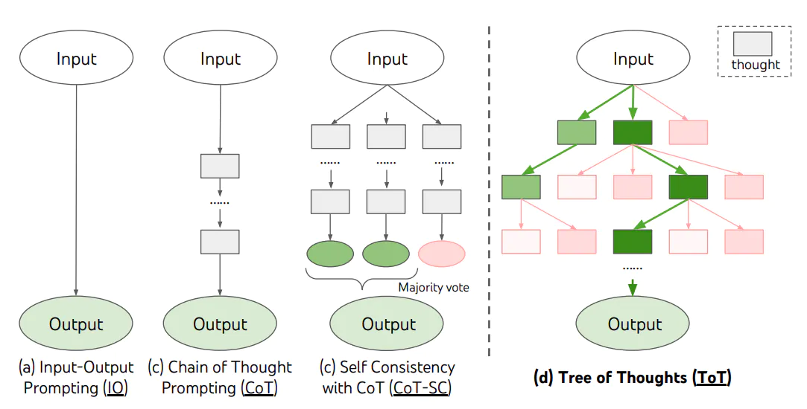
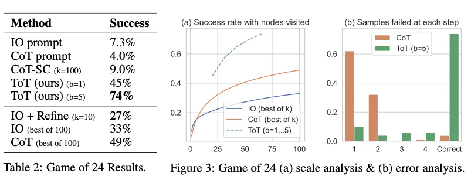

# Tree of Thoughts

對於需要探索或預判戰略的複雜任務來說，傳統或簡單的提示技巧是不夠的。最近，[Yao et el. (2023)](https://arxiv.org/abs/2305.10601) 提出了思維樹（Tree of Thoughts，ToT）框架，該框架基於思維鏈提示進行了總結，引導語言模型探索把思維作為中間步驟來解決通用問題。

ToT 維護著一棵思維樹，思維由連貫的語言序列表示，這個序列就是解決問題的中間步驟。使用這種方法，LM 能夠自己對嚴謹推理過程的中間思維進行評估。 LM 將生成及評估思維的能力與搜索算法（如廣度優先搜索和深度優先搜索）相結合，在系統性探索思維的時候可以向前驗證和回溯。

ToT 框架原理如下：



ToT 需要針對不同的任務定義思維/步驟的數量以及每步的候選項數量。例如，論文中的“算 24 遊戲”是一種數學推理任務，需要分成 3 個思維步驟，每一步都需要一個中間方程。而每個步驟保留最優的（best） 5 個候選項。

ToT 完成算24 的遊戲任務要執行廣度優先搜索（BFS），每步思維的候選項都要求LM 給出能否得到24 的評估：“sure/maybe/impossible”（一定能/可能/不可能） 。作者講到：“目的是得到經過少量向前嘗試就可以驗證正確（sure）的局部解，基於'太大/太小'的常識消除那些不可能（impossible）的局部解，其餘的局部解作為'maybe'保留。”每步思維都要抽樣得到3 個評估結果。整個過程如下圖所示：


從下圖中報告的結果來看，ToT 的表現大大超過了其他提示方法：



[這裡](https://github.com/princeton-nlp/tree-of-thought-llm)還有[這裡](https://github.com/jieyilong/tree-of-thought-puzzle-solver)可以找到代碼例子。

從大方向上來看，[Yao et el. (2023)](https://arxiv.org/abs/2305.10601) 和 [Long (2023)](https://arxiv.org/abs/2305.08291) 的核心思路是類似的。兩種方法都是以多輪對話搜索樹的形式來增強 LLM 解決複雜問題的能力。主要區別在於 Yao et el. (2023) 採用了深度優先（DFS）/廣度優先（BFS）/集束（beam）搜索，而Long (2023)(opens in a new tab) 則提出由強化學習（Reinforcement Learning）訓練出的“ToT 控制器”（ToT Controller）來驅動樹的搜索策略(寶庫什麼時候回退和搜索到哪一級回退等等)。深度優先/廣度優先/集束搜索是通用搜索策略，並不針對具體問題。相比之下，由強化學習訓練出的 ToT 控制器有可能從新的數據集學習，或是在自對弈（AlphaGo vs. 蠻力搜索）的過程中學習。因此，即使採用的是凍結的 LLM，基於強化學習構建的 ToT 系統仍然可以不斷進化，學習新的知識。

Hulbert (2023)(opens in a new tab) 提出了思維樹（ToT）提示法，將 ToT 框架的主要概念概括成了一段簡短的提示詞，指導 LLM 在一次提示中對中間思維做出評估。 ToT 提示詞的例子如下：

```console
Imagine three different experts are answering this question.
All experts will write down 1 step of their thinking,
then share it with the group.
Then all experts will go on to the next step, etc.
If any expert realises they're wrong at any point then they leave.
The question is...
```

