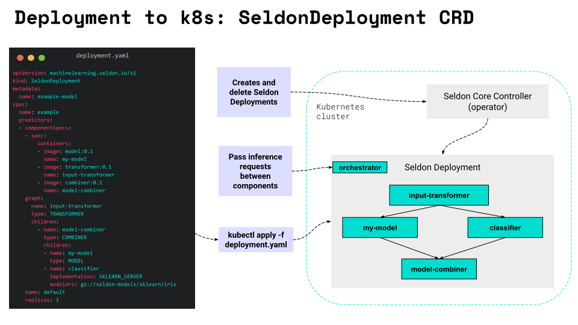
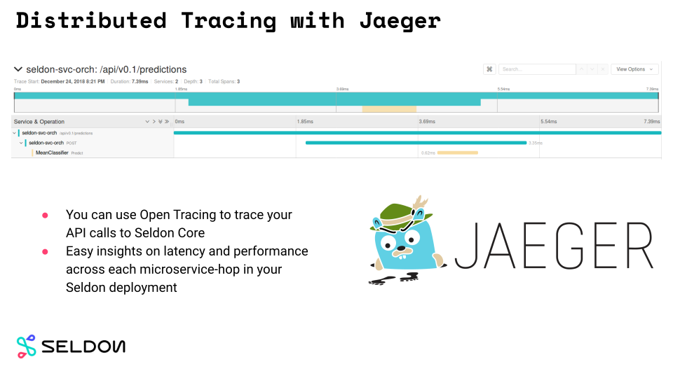

# Seldon 核心組件概述

原文:[Overview of Seldon Core Components](https://docs.seldon.io/projects/seldon-core/en/latest/workflow/overview.html)

Seldon 核心將您的 ML 模型轉換為生產就緒的 REST/gRPC 微服務。

Seldon Core 的主要組件有：

- `Reusable` 和 `Non-Reusable` 模型服務器
- 容器化模型的語言包裝器
- SeldonDeployment CRD 和 Seldon Core Operator
- 用於進階模型推理的服務協調器

以及與第三方系統的集成：

- Kubernetes Ingress 與 Ambassador 和 Istio 的集成
- Prometheus 的指標
- 用 Jaeger 追踪
- OpenApi 文檔

## 端到端的 Model Serving

使用 Seldon Core，您可以使用靈活的模型服務器將您的模型直接投入生產。


使用所謂的 `Reusable Model Servers`，您只需幾個步驟即可將模型部署到 Kubernetes 集群中：

1. 數據科學家使用最先進 AI/ML 的庫（mlflow、dvc、xgboost、scikit-learn 等）來訓練並準備要上線的 ML 模型。

2. 訓練好的模型被上傳到中央存儲庫（例如 S3 存儲）。

3. 軟件工程師使用 `Seldon Core` 的 `Reusable Model Servers` 來與不同 AI/ML 模型整合，將其作為 Docker Image 上傳到 Image Registry。

4. 創建部署清單（`Seldon Deployment` CRD）並應用到 Kubernetes 集群。

5. `Seldon Core Operator` 創建所有必需的 Kubernetes 資源。

6. `Service Orchestrator` 將推理請求發送并傳遞到 Seldon 部署的所有內部模型。

7. 可以通過利用我們與第三方框架(Prometheus, Jaeger)的集成來收集指標和跟踪數據。

如果您要在第 2 步和第 3 步中使用不可重用模型服務器，您需要準備一個嵌入了 ML 模型的 Docker 映像。我們將在下一節討論這兩種方法之間的區別。

## 兩種類型的模型服務器

使用 Seldon Core，您可以構建兩種類型的服務器：`reusable` 和 `non-reusable`。根據上下文和實際用例，兩種類型的服務器都有其應用的情境。

- `Reusable Model Servers`: 通常稱為預打包模型服務器。允許部署一系列類似模型，而無需每次都構建新服務器。他們經常從中央存儲庫（比如貴公司的 S3 存儲）中獲取模型
- `Non-Reusable Model Servers`: 旨在為單一模型提供服務的專用服務器。不需要中央存儲庫，但需要為每個模型構建一個新的 Docker Image。


在其專用文檔頁面上閱讀有關Seldon core 預打包模型服務器的更多信息：

- [MLflow Server](https://docs.seldon.io/projects/seldon-core/en/latest/servers/mlflow.html)
- [SKLearn Server](https://docs.seldon.io/projects/seldon-core/en/latest/servers/sklearn.html)
- [Tensorflow Server](https://docs.seldon.io/projects/seldon-core/en/latest/servers/tensorflow.html)
- [XGBoost Server](https://docs.seldon.io/projects/seldon-core/en/latest/servers/xgboost.html)

在[此處](https://docs.seldon.io/projects/seldon-core/en/latest/servers/custom.html)閱讀如何構建您自己的預打包模型服務器。

## 不同開發語言 Wrappers

語言包裝器允許 Seldon Core 用戶構建 `Reusable` 和 `Non-Reusable` 模型服務器。正如您將看到的，整個過程非常簡單，只需要用戶定義加載模型和執行推理預測的邏輯以及所需的運行時依賴項。


模型加載和推理邏輯在 `Model.py` 文件中定義：

```python title="Model.py"
class Model:
  def __init__(self, ...):
    """Custom logic that prepares model.

    - Reusable servers: your_loader downloads model from remote repository.
    - Non-Reusable servers: your_loader loads model from a file embedded in the image.
    """
    self._model = your_loader(...)

  def predict(self, features, names=[], meta=[]):
    """Custom inference logic.""""
    return self._model.predict(...)
```

`Reusable` 模型服務器和 `Non-Reusable` 模型服務器之間的主要區別在於模型是動態加載的還是嵌入在容器 image 本身中。

`seldon-core-microservice` Python 包裝器可用於將 `Model.py` 轉換為完全可運作的微服務：

```bash
$ seldon-core-microservice Model --service-type MODEL
```

上述指令會啟動一個模型服務器並在其端點上提供推理請求（默認值：9000）：

```bash
$ curl http://localhost:9000/api/v1.0/predictions \
    -H 'Content-Type: application/json' \
    -d '{"data": {"names": ..., "ndarray": ...}}'

{
   "meta" : {...},
   "data" : {"names": ..., "ndarray" : ...}
}
```


要完成容器化過程，您還需要兩個組件：

- 描述您的運行時依賴項的 `requirements.txt` 文件

- `.s2/environment` 描述您的微服務的文件（api 和模型類型）

一旦這些就位，您可以使用一個簡單的 `s2i` 命令:

```bash
s2i build . seldonio/seldon-core-s2i-python3:1.16.0-dev model:0.1
```

創建可用來提供推理請求模型服務器的 Docker 映像。

在其專用文檔頁面上閱讀有關 [Python Language Wrapper](https://docs.seldon.io/projects/seldon-core/en/latest/python/index.html) 的更多信息。

## Seldon Deployment CRD

Seldon Deployment CRD（自定義資源定義）是 Seldon Core 的真正優勢。它允許您輕鬆地將推理模型部署到 Kubernetes 集群並處理一些實際的生產流量控制！

自定義資源 (CRD) 基本上是 Kubernetes API 的擴展。它們允許創建共同作用的基本 Kubernetes 對象的自定義組合。在 Seldon Core 中，我們使用 CRD 通過清單 yaml 文件來定義 inference graph。

您編寫的清單文件功能強大且簡單。您可以輕鬆定義部署中需要的模型以及它們在 inference graph 中的連接方式。



您可以將 CRD 視為圍繞集群中創建的實際部署和服務的抽象。將清單應用到集群後，Seldon Core Operator 會創建服務推理請求所需的所有 Kubernetes 對象。

在其[專用文檔](https://docs.seldon.io/projects/seldon-core/en/latest/reference/seldon-deployment.html)頁面上閱讀有關 Seldon Deployment CRD 的更多信息。

## Seldon Core Operator

Seldon Core Operator 控制您在 Kubernetes 集群中的 Seldon 部署。它讀取應用於集群的 Seldon 部署資源的 CRD 定義，並創建所有必需的組件，如 Pod 和服務。

它根據常見的 Kubernetes operator 模式在工作(一個連續循環中)：

- 觀察集群的當前狀態
- 與期望狀態的差異
- 如有必要，採取行動以應用所需的狀態


## Service Orchestrator

Service Orchestrator 負責管理 inference graph 的流量。它從 CRD 中讀取 inference graph 結構，並在收到推理請求時確保它以正確的順序傳遞到 inference graph 中的每個節點。

正是由於 Service Orchestrator 的存在，Seldon 世界才可以使用複雜的 graph 組件，如路由器、組合器和輸出/輸入轉換器。


Service Orchestrator 還負責提供許多開箱即用的進階功能：

- Jaeger tracing
- Prometheus metrics
- request payload logging

在其[專用文檔](https://docs.seldon.io/projects/seldon-core/en/latest/graph/svcorch.html)頁面上閱讀有關 Service Orchestrator 的更多信息。

## 元數據出處

在 Seldon 中，我們了解模型元數據的重要性。您可以輕鬆地對模型進行版本控制並描述其預期的輸入和輸出。

這些允許您連接到您訓練模型的平台（DVC、Pachyderm 等），並了解您可以從推理圖中獲得哪些輸入/輸出。


在其[專用文檔](https://docs.seldon.io/projects/seldon-core/en/latest/reference/apis/metadata.html)頁面上閱讀有關元數據來源的更多信息。

## Prometheus 的指標

指標是在生產中為 ML 推理模型提供服務的重要資訊。開箱即用的 Seldon Core 部署 `Service Orchestrator `上提供 Prometheus 標準指標。


在其[專用文檔](https://docs.seldon.io/projects/seldon-core/en/latest/analytics/analytics.html)頁面上閱讀有關指標的更多信息。

## 使用 Jaeger 進行分佈式追踪

默認情況下，Seldon Core 支持 Jaeger 進行分佈式跟踪。



在其[專用文檔](https://docs.seldon.io/projects/seldon-core/en/latest/graph/distributed-tracing.html)頁面上閱讀有關跟踪的更多信息。

## 為什麼不用 Flask 包裝模型？

你可能會問：為什麼不直接用 Flask 包裝模型？

以下是選擇 Seldon Core 的一些好處：

- 所有艱苦的工作都已經完成
- 開箱即用的複雜 inference graph
- 可重複使用的模型服務器（構建一次，部署多次）
- 與指標和跟踪解決方案集成
- 自動入口配置
- Seldon Core 經過了廣泛的開源和商業用戶社群的實戰測試

## Seldon Core 的其他功能？

Seldon Core 的安裝量超過 200 萬，被跨組織用於管理機器學習模型的大規模部署，主要優勢包括：

- 使用 Seldon Core 語言包裝器或預打包的推理服務器將 ML 模型容器化的方法簡便。
- 可以通過 Swagger UI、Seldon Python Client 或 Curl / GRPCurl 進行測試的現成端點
- 雲 Agnostic，並在 AWS EKS、Azure AKS、Google GKE、阿里雲、Digital Ocean 和 Openshift 上進行了測試。
- 由預測器、轉換器、路由器、組合器等組成的強大而豐富的推理圖。
- 跨異構工具包和語言模型的標準化服務層。
- 與 Prometheus 和 Grafana 集成的進階和可定制指標。
- 通過與 Elasticsearch 集成的模型輸入輸出請求日誌記錄實現全面的可審計性。
- 通過集成到 Jaeger 進行微服務跟踪，以深入了解跨微服務躍點的延遲。

