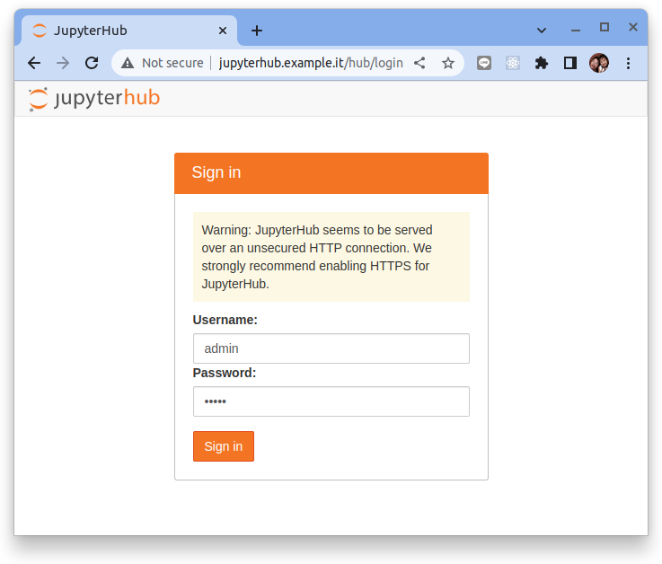
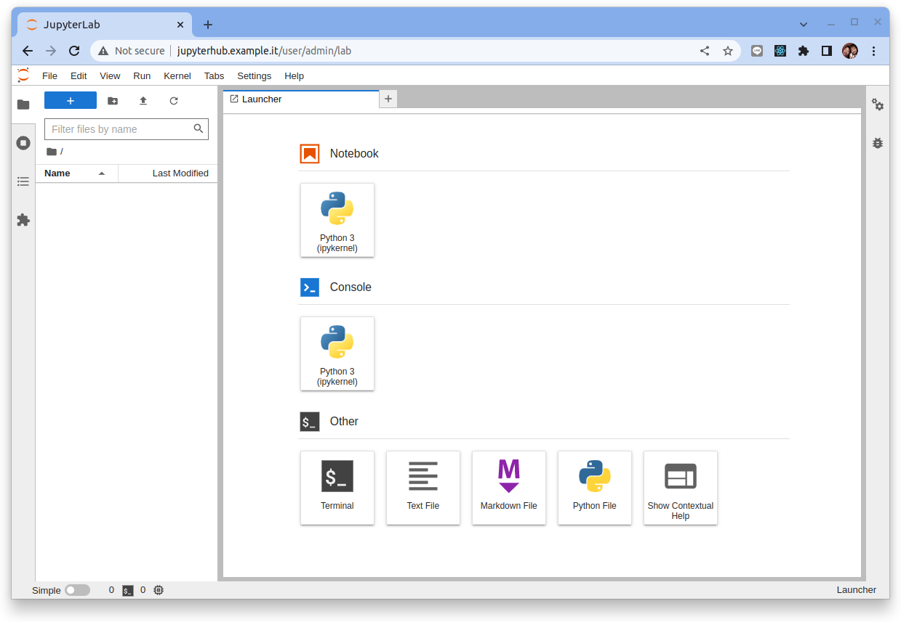

# Seldon core 快速入門指南

原文:[Seldon Core: Blazing Fast, Industry-Ready ML](https://docs.seldon.io/projects/seldon-core/en/latest/workflow/github-readme.html)


Seldon 核心將您的 ML 模型（Tensorflow、Pytorch、H2o 等）或語言包裝器（Python、Java 等）轉換為生產 REST/GRPC 微服務。

Seldon 處理擴展到數千個生產機器學習模型，並提供開箱即用的高級機器學習功能，包括高級指標、請求日誌記錄、解釋器、離群值檢測器、A/B 測試、Canaries 等。

通過預先打包的推理服務器和語言包裝器，可以簡化使用 Seldon Core 部署模型的過程。您可以在下面看到如何部署的“hello world Iris”示例。

## 步驟 01 - 環境安裝

### 創建 K8S 集群

執行下列命令來創建實驗 Kubernetes 集群:

```bash title="執行下列命令  >_"
k3d cluster create  \
    --k3s-arg "--disable=traefik@server:0" \
    --api-port 6443 \
    --port 8080:80@loadbalancer \
    --port 8443:443@loadbalancer \
    --servers-memory=8G
```

說明:

* `--disable=traefik@server:0` 不使用 K3D 自帶的 Traefix 的負載均衡器
* `--servers-memory=8G` 增加一些節點內存

### 安裝 Metallb

配置 Helm 存儲庫：

```bash title="執行下列命令  >_"
#　setup helm repo
helm repo add metallb https://metallb.github.io/metallb

helm repo update
```

**1. 安裝 metallb chart，它用於部署 metallb 服務:**

```bash title="執行下列命令  >_"
# install metallb to specific namespace
helm upgrade --install --create-namespace --namespace metallb-system \
metallb metallb/metallb
```

**2. 檢查本機虛擬網絡設定:**

檢查本地本地 Kubernetes 集群環境在本機 Docker 虛擬網絡 `k3d-k3s-default` 的設定。

```bash
docker network inspect k3d-k3s-default
```

結果:

```yaml hl_lines="13-16"
[
    {
        "Name": "k3d-k3s-default",
        "Id": "98d38e0a91e4c04aa7aff0c93fab578aa4aff4d91273db14b35675389d5b09d4",
        "Created": "2023-01-08T08:23:01.111240686+08:00",
        "Scope": "local",
        "Driver": "bridge",
        "EnableIPv6": false,
        "IPAM": {
            "Driver": "default",
            "Options": null,
            "Config": [
                {
                    "Subnet": "172.25.0.0/16",
                    "Gateway": "172.25.0.1"
                }
            ]
        },
        ...
    }...
...
...
]
```

從上列的資訊我們可得知 Docker 幫 K3D 的集群保留了下列的虛擬網段:

- Subnet: `172.25.0.0/16`

讓我們利用網路上的 [Subnet Calculator](https://mxtoolbox.com/subnetcalculator.aspx) 來看一下這個虛擬網段的配置:

|   |   |
|--- |---|
|Input|172.25.0.0/16|
|CIDR|172.25.0.0/16|
|CIDR IP Range|172.25.0.0 - 172.25.255.255|
|IPs|65,536|
|Subnet Mask|255.255.00|


讓我們從這個虛擬網段裡的 CIDR IP Range 中保留 100 個 IP (`172.25.1.1`-`172.25.1.100`) 來做本次的練習。

**3. 配置 IP Adress Pool:**

讓我們使用 CRD 來設定 Metallb:

```bash hl_lines="9"
cat <<EOF | kubectl apply -n metallb-system -f -
apiVersion: metallb.io/v1beta1
kind: IPAddressPool
metadata:
  name: ip-pool
  namespace: metallb-system
spec:
  addresses:
  - 172.25.1.1-172.25.1.100
---
apiVersion: metallb.io/v1beta1
kind: L2Advertisement
metadata:
  name: l2advertise
  namespace: metallb-system
spec:
  ipAddressPools:
  - ip-pool
EOF
```


### 安裝 Istio 

配置 Helm 存儲庫：

```bash title="執行下列命令  >_"
helm repo add istio https://istio-release.storage.googleapis.com/charts

helm repo update
```

#### 安裝步驟

1. 安裝 `Istio base chart`，它包含了 Istio 控制平面用到的集群範圍的資源:

    ```bash title="執行下列命令  >_"
    helm upgrade --install --create-namespace --namespace istio-system \
    istio-base istio/base
    ```

3. 安裝 Istio discovery chart，它用於部署 istiod 服務:

    ```bash title="執行下列命令  >_"
    helm upgrade --install --create-namespace --namespace istio-system \
    istiod istio/istiod
    ```

4. 安裝 Istio 的入站網關:

    ```bash title="執行下列命令  >_"
    helm upgrade --install --create-namespace --namespace istio-system \
    istio-ingressgateway istio/gateway
    ```

### 安裝 JupyterHub 

配置 Helm 存儲庫：

```bash title="執行下列命令  >_"
helm repo add jupyterhub https://jupyterhub.github.io/helm-chart/

helm repo update
```

編輯 config.yaml:

```yaml title="config.yaml"
ingress:
  enabled: true
  annotations: {}
  hosts: 
    - jupyterhub.example.it

singleuser:
  defaultUrl: "/lab"
  extraEnv:
    JUPYTERHUB_SINGLEUSER_APP: "jupyter_server.serverapp.ServerApp"
```

然後執行下列指令進行安裝

```bash title="執行下列命令  >_"
helm upgrade --cleanup-on-fail \
  --install jupyterhub jupyterhub/jupyterhub \
  --namespace jupyterhub-system \
  --create-namespace \
  --values config.yaml
```

檢查通過 Helm chart 所創建的 Ingress:

```bash
$ kubectl get ing -n jupyterhub-system

NAME         CLASS    HOSTS                   ADDRESS      PORTS   AGE
jupyterhub   <none>   jupyterhub.example.it   172.25.1.1   80      4m56s
```

!!! tip
    查看 Ingress 物件所顯示的 ADDRESS 欄位可作為 ingress 是否正確配置的基本檢驗項目。

在 Linux 中修改 `/etc/hosts` 來增加 entry 來模擬 DNS 的名稱解析:

```console title="/etc/hosts"
# 1.選擇使用本機的 127.0.0.1 作為南北向的進入點
#   這樣的Request會通過外部的LoadBalancer (port:8080)來存取
127.0.0.1   jupyterhub.example.it

## 或是

# 2.選擇 docker network 的虛擬網絡的 IP 作為南北向的進入點
#   要注意配置在K8S集群裡的LoadBalancer所取得的外部 IP
172.25.1.1   jupyterhub.example.it
```

本教程使用選擇 docker network 的虛擬網絡的 IP 作為南北向的進入點, 這個設定也會比較趨向真實環境的作法。

!!! tip
    每個人的本機的 docker network 的虛擬網絡的 IP 都會不同，請特別注意本機的 Ingress Controller 所配置出來的 IP。

#### 連接到 JupyterHub UI

JupyterHub Web UI 可通過 Ingress 所設定的 http://jupyterhub.example.it 來訪問。



鍵入下列的密錀並點擊 `Sing in`:

- Username: `admin`
- Password: `admin`



### 安裝 Seldon Core

配置 Helm 存儲庫：

```bash title="執行下列命令  >_"
helm repo add seldonio https://storage.googleapis.com/seldon-charts

helm repo update
```

安裝 `seldon-core-operator`:

```bash
helm upgrade --install --create-namespace \
    --namespace seldon-system \
    --set usageMetrics.enabled=true \
    --set istio.enabled=true \
    seldon-core-operator seldonio/seldon-core-operator
```

您需要在 `istio-system` 命名空間中安裝一個 istio gateway。默認情況下，我們假定一個名為 `seldon-gateway` 的網關。例如，您可以使用以下 yaml 創建它：

```bash
kubectl apply -f -<<EOF
apiVersion: networking.istio.io/v1alpha3
kind: Gateway
metadata:
  name: seldon-gateway
  namespace: istio-system
spec:
  selector:
    istio: ingressgateway # use istio default controller
  servers:
  - port:
      number: 80
      name: http
      protocol: HTTP
    hosts:
    - "*"
EOF
```

```bash
kubectl apply -f -<<EOF
apiVersion: networking.k8s.io/v1
kind: Ingress
metadata:
  annotations:
    kubernetes.io/ingress.class: istio
  name: ingress-nginx-svc
spec:
  rules:
  - host: "nginx.example.it"
    http:
      paths:
      - pathType: Prefix
        path: "/"
        backend:
          service:
            name: nginx
            port:
              number: 80
EOF
```

```bash
kubectl apply -f -<<EOF
apiVersion: networking.k8s.io/v1
kind: IngressClass
metadata:
  name: istio
spec:
  controller: istio.io/ingress-controller
EOF
```

```bash
kubectl apply -f -<<EOF
apiVersion: networking.k8s.io/v1
kind: Ingress
metadata:
  name: ingress-nginx-svc
spec:
  rules:
  - host: "nginx.example.it"
    http:
      paths:
      - pathType: Prefix
        path: "/"
        backend:
          service:
            name: nginx
            port:
              number: 80
EOF
```