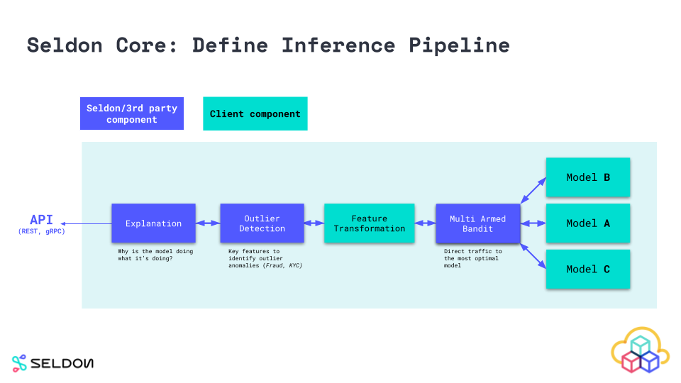
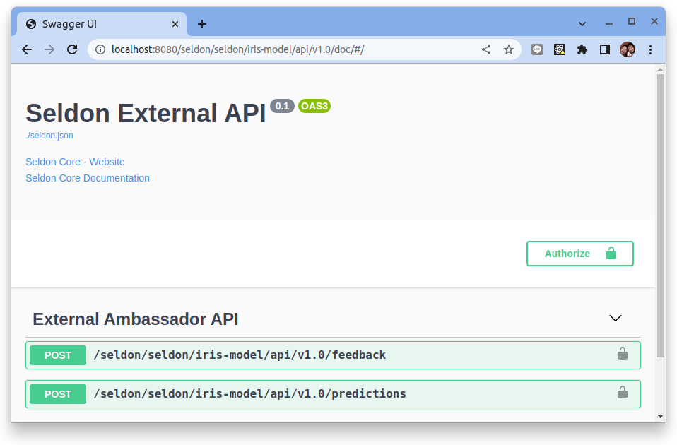
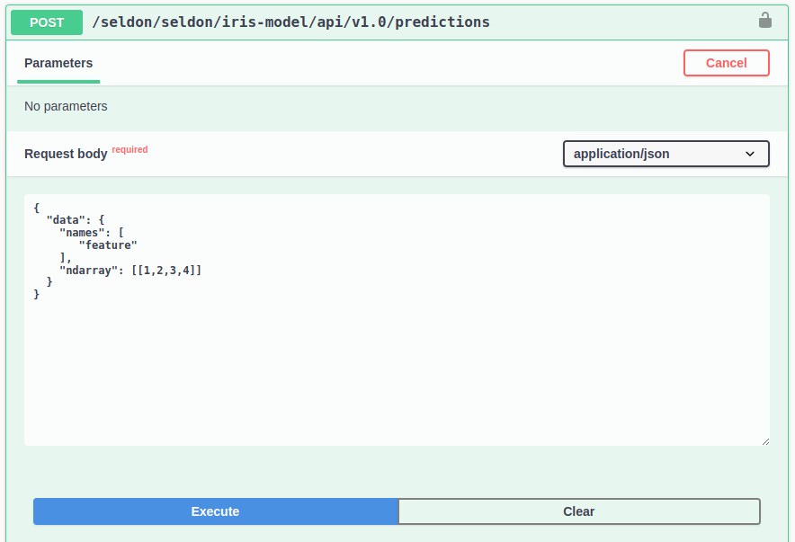
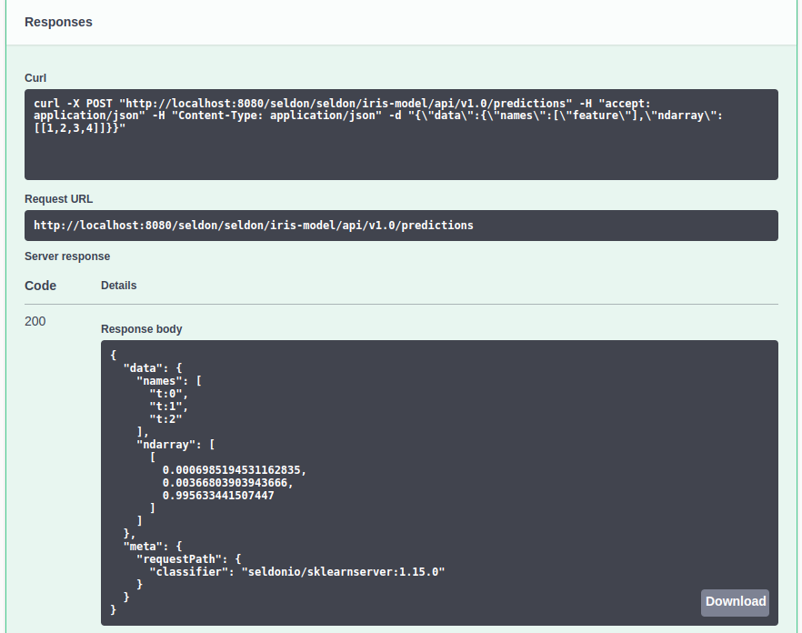

# Seldon core 快速入門指南

原文:[Seldon Core: Blazing Fast, Industry-Ready ML](https://docs.seldon.io/projects/seldon-core/en/latest/workflow/github-readme.html)


Seldon 核心將您的 ML 模型（Tensorflow、Pytorch、H2o 等）或語言包裝器（Python、Java 等）轉換為生產 REST/GRPC 微服務。

Seldon 處理擴展到數千個生產機器學習模型，並提供開箱即用的高級機器學習功能，包括高級指標、請求日誌記錄、解釋器、離群值檢測器、A/B 測試、Canaries 等。

通過預先打包的推理服務器和語言包裝器，可以簡化使用 Seldon Core 部署模型的過程。您可以在下面看到如何部署的“hello world Iris”示例。

## 步驟 01 - 環境安裝

### 創建 K8S 集群

執行下列命令來創建實驗 Kubernetes 集群:

```bash title="執行下列命令  >_"
k3d cluster create  --servers 1 --agents 1 --api-port 6443 \
--k3s-arg "--disable=traefik@server:0" \
--port 8080:80@loadbalancer --port 8443:443@loadbalancer \
--agents-memory=8G
```

說明:

* `--disable=traefik@server:0` 安裝 Istio 後禁用 Traefik 負載均衡器
* `--agents-memory=8G` 安裝 Istio 的額外增加一些內存

### 安裝 Istio 

配置 Helm 存儲庫：

```bash title="執行下列命令  >_"
helm repo add istio https://istio-release.storage.googleapis.com/charts

helm repo update
```

#### 安裝步驟

1. 安裝 `Istio base chart`，它包含了 Istio 控制平面用到的集群範圍的資源:

    ```bash title="執行下列命令  >_"
    helm upgrade --install --create-namespace --namespace istio-system \
    istio-base istio/base
    ```

3. 安裝 Istio discovery chart，它用於部署 istiod 服務:

    ```bash title="執行下列命令  >_"
    helm upgrade --install --create-namespace --namespace istio-system \
    istiod istio/istiod
    ```

4. 安裝 Istio 的入站網關:

    ```bash title="執行下列命令  >_"
    helm upgrade --install --create-namespace --namespace istio-system \
    istio-ingressgateway istio/gateway
    ```

### 安裝 Seldon Core

配置 Helm 存儲庫：

```bash title="執行下列命令  >_"
helm repo add seldonio https://storage.googleapis.com/seldon-charts

helm repo update
```

安裝 `seldon-core-operator`:

```bash
helm upgrade --install --create-namespace \
    --namespace seldon-system \
    --set usageMetrics.enabled=true \
    --set istio.enabled=true \
    seldon-core-operator seldonio/seldon-core-operator
```

您需要在 `istio-system` 命名空間中安裝一個 istio gateway。默認情況下，我們假定一個名為 `seldon-gateway` 的網關。例如，您可以使用以下 yaml 創建它：

```bash
kubectl apply -f -<<EOF
apiVersion: networking.istio.io/v1alpha3
kind: Gateway
metadata:
  name: seldon-gateway
  namespace: istio-system
spec:
  selector:
    istio: ingressgateway # use istio default controller
  servers:
  - port:
      number: 80
      name: http
      protocol: HTTP
    hosts:
    - "*"
EOF
```

## 步驟 02 - 了解 Seldon 核心工作流程

安裝 Seldon Core 後，您可以通過以下三個步驟來發佈生模型到生產環境：

1. 使用 Seldon Core 預先打包的推理服務器或語言包裝器包裝 AI/ML 模型
2. 定義和部署您的 Seldon Core 推理 graph
3. 發送預測並監控性能

### 1. Wrap AI/ML 模型

您想要在生產環境中運行的組件需要包裝為遵守 [Seldon 微服務 API](https://docs.seldon.io/projects/seldon-core/en/latest/reference/apis/internal-api.html) 的 Docker 容器。您可以創建服務於預測的模型、決定請求去向的路由器，例如 A-B 測試、組合響應的組合器和提供可以轉換請求和/或響應的通用組件的轉換器。

為了讓用戶輕鬆包裝使用不同語言和工具包構建的機器學習組件，Seldon Core 提供了包裝器，使您可以輕鬆地從可以在 seldon-core 中運行的代碼構建 docker 容器。目前推薦的工具是 RedHat 的 [Source-to-Image](https://github.com/openshift/source-to-image)。可以在 [Wrapping your models](https://docs.seldon.io/projects/seldon-core/en/latest/wrappers/language_wrappers.html) 文檔中找到更多詳細信息。

### 2. 定義 Runtime Service Graph

要在 Kubernetes 上運行 machine learning graph，您需要定義在上一步中創建的組件如何組合在一起以表示 service graph。這是在 SeldonDeployment Kubernetes 自定義資源中定義的。提供了[構建此推理圖的指南](https://docs.seldon.io/projects/seldon-core/en/latest/graph/inference-graph.html)。



### 3. 部署 AI 推論服務和進行預測

您可以像使用任何其他 Kubernetes 資源一樣使用 kubectl 來部署您的 ML 服務。部署後，您可以通過調用[公開的 API](https://docs.seldon.io/projects/seldon-core/en/latest/workflow/serving.html) 獲得預測。

## 步驟 03 - 實踐 Seldon 核心工作流程示例

使用 Seldon Core 量產您的第一個 AI/ML 模型。您可以通過兩種方式使用 Seldon Core：

- 使用 Seldon Core 預先打包的推理服務器包裝您的模型
- 使用 Seldon Core 的語言包裝器包裝您的模型

### 1. 使用 Seldon Core 預先打包的推理服務器包裝模型

您可以使用 Seldon Core 預打包推理服務器，這些服務器針對流行的機器學習框架和語言進行了優化，並允許簡化可擴展到大量用例的工作流程。

典型的工作流通常是編程式的（通過 CI/CD 觸發），但下面我們展示了您通常會執行的命令。

**1. Export your model binaries / artifacts**

使用您計劃使用的相應[預打包模型服務器](https://docs.seldon.io/projects/seldon-core/en/latest/servers/overview.html)中概述的要求中提供的說明來導出您的模型二進製文件。

```bash
>>my_sklearn_model.train(...)
>>joblib.dump(my_sklearn_model, "model.joblib")

[Created file at /mypath/model.joblib]
```

**2. Upload your model to an object store**

您可以將您的模型上傳到 Seldon Core 預打包模型服務器文件下載器支持的對象存儲中(S3, Minio..etc)，或者添加您的自定義文件下載器。

為簡單起見，本教程使用的範例模型二進製文件已經上傳到 Google Object Store 存儲桶中，因此您可以繼續下一步並在 Seldon Core 上運行您的模型。

```bash
$ gsutil cp model.joblib gs://seldon-models/v1.16.0-dev/sklearn/iris/model.joblib

[ Saved into gs://seldon-models/v1.16.0-dev/sklearn/iris/model.joblib ]
```

**3. Deploy to Seldon Core in Kubernetes**

創建一個命名空間來運行您的模型：

```bash
kubectl create namespace seldon
```

最後，您可以使用您選擇的預打包模型服務器加載模型二進製文件來部署您的模型。

```bash hl_lines="10"
kubectl apply -f - << END
apiVersion: machinelearning.seldon.io/v1
kind: SeldonDeployment
metadata:
  name: iris-model
  namespace: seldon
spec:
  name: iris
  predictors:
  - graph:
      implementation: SKLEARN_SERVER
      modelUri: gs://seldon-models/v1.16.0-dev/sklearn/iris
      name: classifier
    name: default
    replicas: 1
END
```

**4. Send a request in Kubernetes cluster**

經由 Seldon Core 部署的每個模型都公開了一個標準化的 Swagger UI 用戶界面，以使用 Seldon Core 的 OpenAPI schema 發送請求。

執行以下命令來確定您的 Kubernetes 集群是否在支持外部負載均衡器的環境中運行：

```bash
kubectl get svc istio-ingressgateway -n istio-system
```

結果：

```
NAME                   TYPE           CLUSTER-IP     EXTERNAL-IP                   PORT(S)                                      AGE
istio-ingressgateway   LoadBalancer   10.43.238.50   192.168.144.2,192.168.144.3   15021:30779/TCP,80:32509/TCP,443:30026/TCP   22m
```

在本次範例中的 Kubernetes 環境裡頭所暴露出來的外部 IP 是 `192.168.144.2` 與 `192.168.144.3`。 為了方便後續的驗證，使用環境變數把 `ingress_url` 暴露出來:

```bash
export ingress_url=192.168.144.2
```

這可以通過端點 `http://<ingress_url>/seldon/<namespace>/<model-name>/api/v1.0/doc/` 來訪問 Swagger UI，這將允許您直接通過瀏覽器發送與驗證請求。

使用瀏覽器來鍵入下列的 Url:

- 通過 K3D 的 Gateway (本機: 8080 << K3D cluster gateway: 80)
    - `http://localhost:8080/seldon/seldon/iris-model/api/v1.0/doc/`

- 直接通過本機的 LoadBalancer 的 IP
    - `http://<ingress_url>/seldon/seldon/iris-model/api/v1.0/doc/`



在 OpenAPI 的 UI 上點選 “POST /seldon/seldon/iris-model/api/v1.0/predictions" 之後再點選 "Try it out"，最後在 Requet body 上鍵入:

```json
{
  "data": {
    "names": [
       "feature"
    ],
    "ndarray": [[1,2,3,4]]
  }
}
```



!!! tip
    每一種模型的特徵(feature)會根據不同模型的設計而有所不同。


最後點擊 "Execute" 來進行模型的推論預測:



或者，您可以使用 Seldon Python 客戶端或其他 Linux CLI 以編程方式發送請求：

```bash
$ curl -X POST http://<ingress_url>/seldon/seldon/iris-model/api/v1.0/predictions \
    -H 'Content-Type: application/json' \
    -d '{ "data": { "ndarray": [1,2,3,4] } }' | json_pp

{
   "meta" : {},
   "data" : {
      "names" : [
         "t:0",
         "t:1",
         "t:2"
      ],
      "ndarray" : [
         [
            0.000698519453116284,
            0.00366803903943576,
            0.995633441507448
         ]
      ]
   }
}
```

### 2. 使用 Seldon Core 語言包裝器包裝模型

以下是使用 Seldon Core 的語言包裝器容器化模型所需的進階步驟。

語言包裝器用於更多自定義用例，這些用例需要我們預打包的模型服務器未涵蓋的依賴項。可以使用 Seldon Core 的 Python 和 Java 包裝器構建語言包裝器——有關更多詳細信息，請查看[語言包裝器](https://docs.seldon.io/projects/seldon-core/en/latest/wrappers/language_wrappers.html)文檔。

**1. Export your model binaries and/or artifacts:**

首先導出模型二進製文件，接著 Seldon Core 將負責加載模型的邏輯。這意味著我們可以使用第三方依賴甚至外部系統調用。 Seldon Core 正在運行具有非常異構模型的生產用例。

```bash
>> my_sklearn_model.train(...)
>> joblib.dump(my_sklearn_model, "model.joblib")

[Created file at /mypath/model.joblib]
```

**2. Create a wrapper class Model.py**

在這種情況下，我們使用 Python 語言包裝器，它允許我們創建一個自定義包裝器文件，該文件允許我們通過 `predict` 方法公開所有功能 - 通過 API 發送的任何 HTTP/GRPC 請求都傳遞給該函數，並且 response 將包含我們從該函數返回的任何內容。

Python SDK 還允許其他功能，例如用於模型加載邏輯、自定義 Prometheus 指標、客制化元數據的標籤等等。

```python
class Model:
    def __init__(self):
        self._model = joblib.load("model.joblib")

    def predict(self, X):
        output = self._model(X)
        return output
```

**3. Test model locally**

在我們將模型部署到生產環境之前，我們實際上可以使用 Python seldon-core 模塊微服務 CLI 功能在本地運行我們的模型。

```bash
$ seldon-core-microservice Model REST --service-type MODEL

2020-03-23 16:59:17,366 - werkzeug:_log:122 - INFO:   * Running on http://0.0.0.0:5000/ (Press CTRL+C to quit)

$ curl -X POST localhost:5000/api/v1.0/predictions \
    -H 'Content-Type: application/json' \
    -d '{ "data": { "ndarray": [1,2,3,4] } }' \
    | json_pp

{
   "meta" : {},
   "data" : {
      "names" : [
         "t:0",
         "t:1",
         "t:2"
      ],
      "ndarray" : [
         [
            0.000698519453116284,
            0.00366803903943576,
            0.995633441507448
         ]
      ]
   }
}
```

**4. Use the Seldon tools to containerise your model**

現在我們可以使用 Seldon Core utility 程序將我們的 python 類轉換為 Seldon Core 微服務。在這種情況下，我們還將模型二進製文件容器化。

下面的結果是一個名為 `sklearn_iris` 和標籤 `0.1` 的容器，我們將能夠使用 Seldon Core 對其進行部署。

```bash
s2i build . seldonio/seldon-core-s2i-python3:1.16.0-dev sklearn_iris:0.1
```

**5. Deploy to Kubernetes**

創建一個命名空間以在以下位置運行您的模型：

```bash
kubectl create namespace seldon
```

與我們對預打包模型服務器所做的類似，我們在這裡定義我們的部署結構，但是我們還必須指定我們剛剛構建的容器，以及我們可能想要添加的任何其他 containerSpec 選項。

```bash
kubectl apply -f - << END
apiVersion: machinelearning.seldon.io/v1
kind: SeldonDeployment
metadata:
  name: iris-model
  namespace: seldon
spec:
  name: iris
  predictors:
  - graph:
      implementation: SKLEARN_SERVER
      modelUri: gs://seldon-models/v1.16.0-dev/sklearn/iris
      name: classifier
    name: default
    replicas: 1
END
```

結果:

```
seldondeployment.machinelearning.seldon.io/iris-model created
```

**6. Send a request to your deployed model in Kubernetes**

部署的每個模型都公開了一個標準化的用戶界面，以使用 Seldon Core 的 OpenAPI schema 發送請求。

這可以通過端點 `http://<ingress_url>/seldon/<namespace>/<model-name>/api/v1.0/doc/` 訪問，這將允許您直接通過瀏覽器發送請求。


或者，您可以使用我們的 Seldon Python 客戶端或其他 Linux CLI 以編程方式發送請求：

```bash
$ curl -X POST http://<ingress>/seldon/model-namespace/iris-model/api/v1.0/predictions \
    -H 'Content-Type: application/json' \
    -d '{ "data": { "ndarray": [1,2,3,4] } }' | json_pp

{
   "meta" : {},
   "data" : {
      "names" : [
         "t:0",
         "t:1",
         "t:2"
      ],
      "ndarray" : [
         [
            0.000698519453116284,
            0.00366803903943576,
            0.995633441507448
         ]
      ]
   }
}
```

