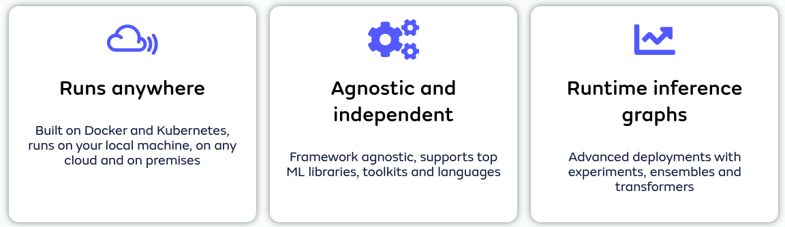

# Seldon Core

用於輕鬆快速地大規模部署模型和實驗的開源框架。

## 概述

Seldon core 將您的 ML 模型（Tensorflow、Pytorch、H2o 等）或語言包裝器（Python、Java 等）轉換為生產環境等級的 REST/GRPC 微服務。

Seldon 處理擴展到數千個生產機器學習模型，並提供開箱即用的進階機器學習功能，包括進階指標、請求日誌記錄、解釋器、離群值檢測器、A/B 測試、Canaries 等。

## 以數據為中心的部署管道

- 通過實驗、集成和轉換器實現以數據為中心和更輕鬆的模型部署。
- 在任何雲上運行，與框架無關，並支持頂級 ML 庫、工具包和語言。

