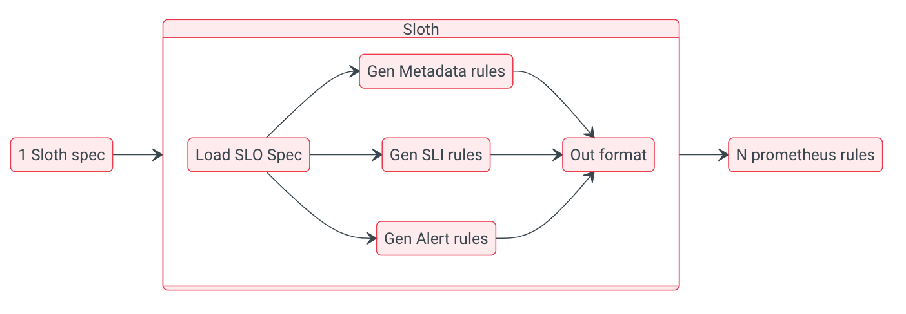

# SLO 告警

看過 Google 網站可靠性工作手冊一書的朋友都知道，該書在第一部分重點講解了基於 SLO 的告警監控相關知識，可見基於 SLO 的監控告警依然成為一種趨勢，那在實際工作中，我們該如何實施和落地 SLO 監控告警呢?

## 基礎概念

### 為什麼需要基於 SLO 告警

基於 SLO 告警相對於傳統告警方法，它能夠做到：

- 告警基於具體症狀（SLIs）。
- 可以觸發不同級別的告警信息（一般警告可以生成 ticket，嚴重告警直接 OnCall）。
= 會考慮時間和數量兩個維度（特定時間的錯誤速率和錯誤數量）。


這些能力帶來的直接好處包括但不限於：

- 正確的時間觸發正確的告警（重要的告警可以立即觸發，不重要的可以適當延遲）。
- 有效減少告警疲勞。
- 減少誤報和漏報。

### 什麼是 SLI

**SLI** 全名為 **服務水平指標** (`Service level indicator`)，它是一種量化您的服務如何響應用戶的方法，而我們 SLO 是完全依賴 SLI 的。

對於用戶而言什麼是好/壞的服務呢？舉個例子：

- `狀態碼 >= 500` 可視為錯誤。
- `請求延遲 > 200ms` 可視為錯誤。
- `進程運行非 0 狀態碼退出` 可視為錯誤。

通常我們可以使用事件(event)發生的指標來收集它。

### 什麼是 SLO

**SLO** 全名為 **服務水平目標** (`Service level objective`)。通常它是一個百分比，表示您的服務在特定時間段內可能出現多少 SLI 錯誤。

通常我們可以使用 **事件發生的比率** 來衡量它：`(good/bad) 次數 / total 次數`。

### 什麼是 Error Budget

錯誤預算 (Error Budget) 是您在特定時間段內可以擁有的錯誤數量發生的預算，這是由 SLO 驅動的。

舉個例子：

- SLI 錯誤: API 服務呼叫回應的狀態碼 >= 500 所有請求
- 時間週期: 30 天
- SLO: 99.9%
- 錯誤預算: 0.0999% (100-99.9)
- 預估 30 天總請求數：10000 次
- 允許的錯誤請求數的預算：9.99 次 (10000 * 0.0999 / 100)

如果我們有超過 9.99 個 >=500 的請求響應，我們將燃燒(burn)更多的可用預算，如果我們有更少的錯誤，這個時間週期內的錯誤預算還有剩餘。

### 什麼是 Burn Rate

這裡燃燒率(burn rate)指 {==燃燒錯誤預算的速度==}。這是基於 SLO 的告警的關鍵，一般我們根據多個窗口周期的不同錯誤預算燃燒率來進行告警。

不同燃燒率舉例:

- 1: 您在預期期間消耗了 100% 的錯誤預算（例如，如果 30 天，則剛好 30 天消耗完畢）。
- 2: 您在預期期間內消耗了 200% 的錯誤預算（例如，如果是 30 天，則 15 天消耗完畢）。
- 60: 您在預期週期內消耗了 6000% 的錯誤預算（例如，如果週期為 30 天，則 12 小時消耗完畢）。
- 1080: 您在預期週期內消耗了 108000% 的錯誤預算（例如，如果週期為 30 天，則 40 分鐘消耗完畢）。

簡單來思考 Burn rate 就是要讓它的數字小於 1 (100%)。

### 什麼是 ticket 和 page 告警

SRE 一般使用多窗口、多燃燒率(Multi-Window, Multi-BurnRate)策略進行告警，針對不同的 SLI，不同周期不同燃燒率，我們會產生不同級別的告警信息，主要包括 ticket 和 page 兩種。

- page: 指嚴重告警，需要立馬發送通知重要頻道，觸發 oncall 等。
- ticket：指一般告警，可以發送一般知會的頻道，生成對應運維檢視工單等。

它們觸發的邏輯略有不同，page 觸發速度更快，但需要更快的錯誤預算消耗率，而 ticket 告警的觸發速度要慢一些，並且需要更低且較為恆定的錯誤預算消耗率。

以 99.9% SLO 為例，通常它們的告警配置對照表可以為：

|Severity<br/>嚴重程度|Long Time-Window<br/>長時間窗口|Short Time-Window<br/>短時間窗口|Burn Rate<br/>燃燒率|Error Budget Consumption<br/>消耗的預算|
|:--------------------:|:-----------------------------:|:------------------------------:|:-------------------:|:-------------------------------------:|
|Page	|1小時	|5分鐘	|14.4	|2%|
|Page	|6小時	|30分鐘	|6	|5%|
|Ticket	|3天	|6小時	|1	|10%|

## 為什麼使用 MWMB 方法

主要講解基於 SLO 告警一般使用方法以及為什麼要使用多窗口多燃燒率(MWMB)的方法來做告警的設計。

注意：

- 大部分內容來自 Google 網站可靠性工作手冊第 5 章，直接查看[原文](https://github.com/redbearder/The-Site-Reliability-Workbook-CHS/blob/master/6_%E7%AC%AC%E4%B8%80%E9%83%A8%E5%88%86-%E5%9F%BA%E7%A1%80/6-4_%E7%AC%AC5%E7%AB%A0-%E5%9F%BA%E4%BA%8ESLO%E5%8F%91%E5%87%BA%E8%AD%A6%E6%8A%A5.md)。
- 示例以 Prometheus rules 為例。

### 方法1：錯誤率 ≥ SLO 閾值

這種方法是大家最容易想到的，直接看最近一個較小時間窗口內（例如 10 分鐘）目標錯誤率是否超過 SLO 閾值，如果超過即觸發告警。

例如，30 天的 SLO 為 99.9％，過去 10 分鐘內的錯誤率 ≥0.1％ 時發出警報:

```yaml
- alert: HighErrorRate
  expr: job:slo_errors_per_request:ratio_rate10m{job="myjob"} >= 0.001
```

`job:slo_errors_per_request:ratio_rate10m` 指標可以使用 Prometheus 的 record rule 生成。

針對這種情況，假如某一種服務 (SLO 目標: available 99.9%) 在過去10分鐘裡大約有 0.6s（10m*0.001）不可用即可觸發告警。

這種方法最大的問題是精度低，假如我們真的有一個服務，每隔 10 分鐘就中斷 0.6s，這意味著我們每天最多可以收到 144（24*6）個告警信息。

### 方案2：增加觀察窗口

方案#1 中我們使用了一個較小時間窗口（10 分鐘），這樣可能會因為服務抖動導致頻繁告警，為了降低告警頻率，我們可以適當增加錯誤指標觀察的時間窗口，比如變為 36 小時（佔 30 天錯誤預算 5%）。

對應的告警規則為:

```yaml
- alert: HighErrorRate
  expr: job:slo_errors_per_request:ratio_rate36h{job="myjob"} > 0.001
```

此時當服務中斷大約 2 分鐘 10 秒（36h*0.001）即可觸發告警。

這種方法最大的問題是告警重置時間較長，假如業務中斷 2 分鐘 10 秒後，業務馬上恢復，我們仍然要等到 36 小時後，才能收到告警恢復(resolve)的通知。

### 方案3：告警持續性檢測

這種方案主要使用一個較短的時間窗口，並觀察其告警狀態持續性，對應 Prometheus 中的告警規則就是使用 `for` ，比如：

```yaml
- alert: HighErrorRate
  expr: job:slo_errors_per_request:ratio_rate1m{job="myjob"} > 0.001
  for: 1h
```

這種方法可以解決方案#1 中每隔 10m 分鐘中斷 0.6s 導致頻繁告警的情況，又可以解決方案#2 中告警重置時間久的問題。

但這種方法也有一個致命問題，就是無法識別問題嚴重性，100% 錯誤率和 0.2% 錯誤率都需要持續 1 小時才能收到告警。

以 1h 為例，假如服務 100% 中斷的情況，當我們收到告警的時候，已經消耗了 30 天錯誤預算的 140%（60分鐘/43分鐘）。

### 方案4：基於單一燃燒率

前面 3 種方案都採用固定時間窗口和固定閾值的方式，為了改進方案，我們很自然想到基於錯誤預算燃燒耗率的方法，針對不同燃燒率我們可以配置不同告警級別，消耗越快，告警級別越高。

燃燒率與耗盡時間的關係如表格：

|燃燒率	|30 天 99.9％ SLO的錯誤率	|耗盡時間|
|------|-----------------------|-------|
|1	|0.1%	|30天|
|2	|0.2%	|15天|
|10	|1%	|3天|
|1000	|100%	|43分鐘|

那麼我們該使用怎樣的燃燒率呢？

舉個例子，在 1 小時內燃燒了 30 天錯誤預算的 5％，這就需要觸發告警了，此時可以得到燃燒率為 36 (30x24x(0.05/1))。

其告警規則為：

```yaml
- alert: HighErrorRate
  expr: job:slo_errors_per_request:ratio_rate1h{job="myjob"} > 36
```

這種方法雖然解決前面提到的一些誤報和恢復重置時間長的問題，但假如服務的燃燒率恰好只有 35，意味著 20.5 小時將消耗完所有的錯誤預算，而且您收不到任何告警。

### 方案5：基於多個燃燒率

方案#4中只有一個固定的消耗率，針對固定 35 燃燒率的問題，我們可以使用多個燃燒率來避免，不同燃燒率可以對應不同告警級別。

比較建議的時間窗口和燃燒率，消耗的 SLO 百分比對照表如下:

|消耗 SLO 預算	|時間窗口	|燃燒率	|通知方式|
|-------------|--------|------|-------|
|2％	|1小時	|14.4	|Oncall|
|5％	|6小時	|6	|Oncall|
|10％	|3天	|1	|Ticket|

告警規則配置為：

```yaml
expr: (
    job:slo_errors_per_request:ratio_rate1h{job="myjob"} > (14.4*0.001)
  or
    job:slo_errors_per_request:ratio_rate6h{job="myjob"} > (6*0.001)
  )
severity: page

expr: job:slo_errors_per_request:ratio_rate3d{job="myjob"} > 0.001
severity: ticket
```

這種方式能夠解決方案#4中的問題，但同一現象可能會觸發多條告警，這意味著您需要更智能的告警抑制手段。

例如，五分鐘內消耗了10％的預算，也意味著六小時內消耗了5％的預算，一小時內消耗了2％的預算，所以您可能會同時收到3條不同告警信息。

### 方案6：多窗口、多燃燒率

我們繼續在方案5之上進行迭代，思路很簡單，確保當前服務仍在不斷消耗預算的時候才進行告警。

為此我們需要增加一個短時間觀察窗口，一般短窗口的時間為長窗口的時間的1/12，只有兩個時間窗口燃燒率都滿足條件，才進行告警通知。

99.9％ SLO警報配置的推薦參數表為：

|消耗 SLO 預算	|長期窗口	|短期窗口	|燃燒率	|通知方式|
|-------------|--------|------|-------|--------|
|2％	|1小時	|5分鐘	|14.4	|Oncall|
|5％	|6小時	|30分鐘	|6	|Oncall|
|10％	|3天	|6小時	|1	|Ticket|

所以最後告警規則配置大致為：

```yaml
expr: (
      job:slo_errors_per_request:ratio_rate1h{job="myjob"} > (14.4*0.001)
    and
      job:slo_errors_per_request:ratio_rate5m{job="myjob"} > (14.4*0.001)
    )
  or
    (
      job:slo_errors_per_request:ratio_rate6h{job="myjob"} > (6*0.001)
    and
      job:slo_errors_per_request:ratio_rate30m{job="myjob"} > (6*0.001)
    )
severity: page

expr: (
      job:slo_errors_per_request:ratio_rate24h{job="myjob"} > (3*0.001)
    and
      job:slo_errors_per_request:ratio_rate2h{job="myjob"} > (3*0.001)
    )
  or
    (
      job:slo_errors_per_request:ratio_rate3d{job="myjob"} > 0.001
    and
      job:slo_errors_per_request:ratio_rate6h{job="myjob"} > 0.001
    )
severity: ticket
```

好了，到此我們想要的最終方法已經有了，即採用多窗口多燃燒率（MWMB）的方式。

在基於 SLO 設計告警的時候，我們盡量採用 MWMB 的方法，它在告警及時性、告警重置恢復時間、誤報、漏報都做了較好權衡。

但由於使用 MWMB 方法，對應的告警規則更為複雜，這給我們編寫和維護規則配置文件帶來了挑戰。所以在實際工作中應該盡可能將其自動化，只需編寫對應服務 SLO，即可按照 MWMB 方法，自動生成對應的告警規則（Prometheus alert/record rules）。

## 開源項目 sloth 使用

SLO 告警需注意以下幾點：

- 時間窗口、燃燒率、告警級別需要同時考慮。
- 單個 SLO 會同時生成多個 Prometheus record 和 alert 規則。
- 時間窗口、燃燒率、告警級別任一更改需要重新生成告警規則。

大量 Prometheus 規則文件的生成並不容易，那我們該如何準確、高效的生成它們呢？

這就是今天要向大家推薦的一個 Prometheus SLO 生成器 -- sloth（https://github.com/slok/sloth）。

### Sloth 簡介

Sloth 是 GitHub 上一個開源的 Prometheus SLO 自動生成器，它採用 MWMR 的策略，支持窗口和多個告警策略的配置，以及 SLI 插件來簡化 SLO 定義的宣告，另外它還打通了 Prometheus-Operator 並提供了開箱即用的 Grafana 模板，實現多服務 SLO 統一可視化。

### SLoth 整體架構



從架構圖可知，sloth 統一加載 SLO 配置後，會將其自動轉化為 `SLI`, `Metadata`, `Alert` 三類 Prometheus 規則：

- `SLI`: 屬於 Prometheus record 類型，它是一切 SLO 計算的基礎，根據用戶配置的 events，自動生成不同時間窗口的指標錯誤率（例如 slo:sli_error:ratio_rate5m，slo:sli_error:ratio_rate30m）。
- `Metadata`: 屬於 Prometheus record 類型，主要用於某個服務 SLO 使用情況統計，如剩餘錯誤預算、SLO 目標百分比，這些指標用於 SLO 可視化非常方便。
- `Alert`: 屬於 Prometheus alert 類型，它依靠生成的 SLIs，集合不同窗口配置參數生成不同級別的告警規則。

### Sloth 支持的 SLO 三種宣告格式

Sloth 一共支持三種不同 SLO 格式，它們分別為默認、K8s、OpenSLO。

**1. 預設格式:**

```yaml
version: "prometheus/v1"
service: "myservice"
labels:
  owner: "myteam"
slos:
  - name: "requests-availability"
    objective: 99.9
    description: "Common SLO based on availability for HTTP request responses."
    sli:
      events:
        error_query: sum(rate(http_request_duration_seconds_count{job="myservice",code=~"(5..|429)"}[{{.window}}]))
        total_query: sum(rate(http_request_duration_seconds_count{job="myservice"}[{{.window}}]))
    alerting:
      ...
```

它是 sloth 自定義的格式，主要包含了服務名稱、服務標籤和多個 SLos 配置，非 K8S 環境大多采用它。

**2. K8s 格式:**

```yaml
apiVersion: sloth.slok.dev/v1
kind: PrometheusServiceLevel
metadata:
  name: sloth-slo-my-service
  namespace: monitoring
spec:
  service: "myservice"
  labels:
  owner: "myteam"
  slos:
    - name: "requests-availability"
        objective: 99.9
        description: "Common SLO based on availability for HTTP request responses."
        sli:
        events:
            error_query: sum(rate(http_request_duration_seconds_count{job="myservice",code=~"(5..|429)"}[{{.window}}]))
            total_query: sum(rate(http_request_duration_seconds_count{job="myservice"}[{{.window}}]))
        alerting:
        ...
```

它其實是一個叫做 PrometheusServiceLevel 的 K8s CRD，其 spec 內容與 sloth 默認格式基本一致。

Sloth 不僅支持 CLI 還支持 K8s controller，當它監聽到 K8s 集群的 `PrometheusServiceLevel` 資源對象的變更，會自動將其轉化為 Prometheus Operator 的 `PrometheusRule` 資源對象，做到 Prometheus Operator 無縫對接。

**3. OpenSLO 格式:**

```yaml
apiVersion: openslo/v1alpha
kind: SLO
metadata:
  name: sloth-slo-my-service
  displayName: Requests Availability
spec:
  service: my-service
  description: "Common SLO based on availability for HTTP request responses."
  budgetingMethod: Occurrences
  objectives:
    - ratioMetrics:
        good:
          source: prometheus
          queryType: promql
          query: sum(rate(http_request_duration_seconds_count{job="myservice",code!~"(5..|429)"}[{{.window}}]))
        total:
          source: prometheus
          queryType: promql
          query: sum(rate(http_request_duration_seconds_count{job="myservice"}[{{.window}}]))
      target: 0.999
  timeWindows:
    - count: 30
      unit: Day
```

社區為了更好推進 SLO 落地和應用，發起了 OpenSLO 項目，它支持多種數據源（不僅限於 Prometheus），所以 sloth 也對其進行了部分支持。

### 安装和使用

1. K8s 安装和使用:

```bash
# 下載 CRD yaml 檔
curl https://raw.githubusercontent.com/slok/sloth/v0.11.0/pkg/kubernetes/gen/crd/sloth.slok.dev_prometheusservicelevels.yaml -o sloth.slok.dev_prometheusservicelevels.yaml

# CRD 安装
kubectl apply -f ./sloth.slok.dev_prometheusservicelevels.yaml

# 下載 Sloth　yaml 檔案
curl https://raw.githubusercontent.com/slok/sloth/main/deploy/kubernetes/raw/sloth.yaml -o sloth.yaml

kubectl create ns monitoring

# 運行 sloth controller
kubectl apply -f ./sloth.yaml

# 運行範例
kubectl apply -f ./examples/k8s-getting-started.yml
```

2. Helm 安裝:

```bash
helm repo add sloth https://slok.github.io/sloth
helm repo update
helm template sloth/sloth --include-crds

# 運行範例
kubectl apply -f ./examples/k8s-getting-started.yml
```

### 實戰練習

整個流程如下圖：


流程說明：

- 使用 sloth cli 自動生成 SLO 相關的規則文件。
- 創建一個叫做 MyService 的 HTTP 服務，該服務通過暴露的接口可以設置不同錯誤預算消耗率。
- 部署 Prometheus 收集 MyService 的指標，並加載 sloth 自動生成的 rules 配置文件。
- Grafana 通過導入 sloth 預設的模版，進行 MyService SLO 的可視化。


**啟動程序:**

示例程序已提交到 https://github.com/grafanafans/play-with-sloth 倉庫，歡迎查看。

```bash
git clone https://github.com/grafanafans/play-with-sloth.git

# 使用 sloth cli 生成 myservice 的 rules
make generate 
make start
```

**Grafana 導入 sloth 看板:**

使用導入創建的方式新增 slos 相關看板，導入的看板 id 為 14348 和 14643。

**設置 MyService 錯誤率:**

```bash
curl http://localhost:8080/errrate?value=0.005
```

當設置錯誤率為 0.5%（SLO 0.1% 的 5 倍），其看板內容大致為：


本節主要講解如何圍繞 sloth 進行 SLO 建設，使用 sloth 不僅可以高效的生成大量 Prometheus rules 配置文件，還可以通過開箱即用的統一看闆對多個服務的 SLO 進行觀測。另外 sloth 提供的 k8s controller 能夠無縫與 Prometheus Operator 集成，方便雲原生的用戶進行使用。

## 開源項目 pyrra 使用

如何使用 sloth 進行 Prometheus 規則的自動生成和 SLO 統一觀測，今天我們再來看另外一個類似的開源項目 -- pyrra(https://github.com/pyrra-dev/pyrra)。

### Pyrra 簡介

Pyrra 大部分功能和 sloth 類似，它提供了 4 個子命令，分別為：

- generate：它是最基礎的命令，通過它實現規則文件手動生成。
- filesystem: 它在 generate 命令上，通過對特定目錄監聽的方式，實現規則文件自動生成。
- kubernetes: 它通過啟動的 K8s Controller 實現對 ServiceLevelObjective 資源監聽，生成 PrometheusRule 對象，實現與 Prometheus Operator 無縫對接。
- api: 它提供一個開箱即用的 UI，支持 SLO 列表和詳情信息查詢，適用於未部署 Grafana 的場景（當然 pyrra 也提供了 Grafana 模板）。

### Pyrra SLO 宣告格式

相較於 sloth，pyrra 只提供一種 SLO 格式，及自定義 K8s 資源 `ServiceLevelObjective`，內容大致為:

```yaml
apiVersion: pyrra.dev/v1alpha1
kind: ServiceLevelObjective
metadata:
  name: pyrra-api-errors
  namespace: monitoring
  labels:
    prometheus: k8s
    role: alert-rules
    pyrra.dev/team: operations # Any labels prefixed with 'pyrra.dev/' will be propagated as Prometheus labels, while stripping the prefix.
spec:
  target: "99"
  window: 2w
  description: Pyrra's API requests and response errors over time grouped by route.
  indicator:
    ratio:
      errors:
        metric: http_requests_total{job="pyrra",code=~"5.."}
      total:
        metric: http_requests_total{job="pyrra"}
      grouping:
        - route
```

我們主要關注以下欄位:

- `metadata.name`: 表示該 SLO 的名稱。
- `metadata.labels`: 表示該 SLO 的標籤，其中 pyrra.dev/ 開頭的標籤會去除前綴後，添加到最終生成的告警規則中。
- `spec.target`: 表示 SLO 目標值。
- `spec.window`: 表示 SLO 計算週期。
- `spec.indicator`: 表示 SLO 計算指標，支持 `ratio` 和 `latency` 兩種類型。

pyrra 生成的 Prometheus 規則類型主要有:

- `increase`: 包含 SLO 週期總請求數和指標不存在的告警。
- `metric_name:burnrate5m`: 屬於 record 記錄，主要記錄各時間窗口每秒的錯誤率。
- `ErrorBudgetBurn`: alert 告警，支持多窗口多燃燒率。
- `generic`：主要包含 SLO 的一些元信息，例如配置的 SLO 目標值，時間窗口大小等。

### Pyrra 與 Sloth 對比

優勢：

- 提供 filesystem 模式，實現對 SLO 目錄文件變化，自動觸發 generate 命令。
- 提供 api 模式，一個開箱即用的統一看板。

不足：

- 不支持 OpenSLO 格式。
- 不支持時間窗口內更詳細配置，例如短/長期窗口具體的告警燃燒率。
- 不支持 Sloth 類似的 SLI 插件，對於通用服務（中間件）需要手動編寫 SLIs。

實際使用中，如果我們沒有太多窗口配置定制化，而且有 SLO 狀態頁面的需求（不方便使用 Grafana），pyrra 是個不錯的選擇。

### 實戰練習

我們還是以 MyService 為例，收集其指標並通過手動改變請求錯誤率的方式，對其 SLO 進行觀測。

整個流程如下圖：

1. 啟動 MyService，能夠通過接口進行錯誤率設置。
2. 通過 pyrra filesystem 模式，自動生成 MyService SLO 對應的 Prometheus 規則。
3. 啟動 Prometheus，加載生成的規則文件，並收集 MyService 指標。
4. 啟動 Grafana 和 pyrra api，查看 SLO 列表和詳情頁面。

**啟動程序:**

示例程序已提交到 https://github.com/grafanafans/play-with-pyrra 倉庫，歡迎查看。

```bash
git clone https://github.com/grafanafans/play-with-pyrra.git

docker-compose up -d
```

當程序啟動後，你將看到5個容器，它們分別為：

- Prometheus: http://localhost:9090
- Pyrra API: http://localhost:9099
- Grafana: http://localhost:3000
- MyService: http://localhost:8080
- Pyrra Filesystem.

**設置 MyService 錯誤率:**

```bash
curl http://localhost:8080/errrate?value=0.005
```

當設置錯誤率為 0.5%（SLO 0.1% 的5倍），通過 Pyrra API 和 Grafana 觀測到的 SLO 詳情信息如下。

- Pyrra API 頁面


- Grafana 頁面


可以看到 pyrra 和 sloth 做的事情類似，它也提供命令行和 K8s Controller 方式實現 Prometheus 規則的自動生成。相較於 sloth，它在服務化方面做的更多一些，不僅提供了一個開箱即用的 SLO 頁面還支持 filesystem 模式對 SLO 目錄進行監聽。

總的來說，如果您有 SLO 狀態頁面的需求（不方便使用 Grafa
