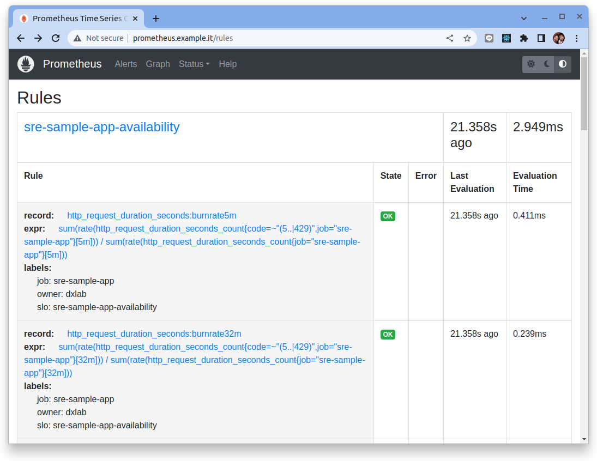

# 使用 Helm 來安裝配置 Pyrra

<figure markdown>
  { width="800" }
  <figcaption>範例架構</figcaption>
</figure>


請跟隨本教程一起，使用 Helm 安裝、配置、並深入評估 Pyrra 這個 SLO as code 的工具。本教程會安裝下列的元件:

- Ubuntu 20.04 (O.S)
- Docker
- Kubernetes (K3D)
- Metallb
- Nginx Ingress Controller
- Prometheus
- Grafana
- Pyrra


## 步驟 01 - 環境安裝

### 先決條件

**作業系統**

本教程使用 Ubuntu 20.04 (Workstation) 安裝在下列的硬體上:

- Intel Core i7 (8 Cores)
- Memory 32 Gb

**安裝 Docker**

根據 [Docker 官網: Install Docker Engine on Ubuntu](https://docs.docker.com/engine/install/ubuntu/) 的指引來安裝 Docker 相關的程式與套件。

安裝完了之後要再進行 [Linux post-installation steps for Docker Engine](https://docs.docker.com/engine/install/linux-postinstall/) 來確保特定使用者帳號加入到 `docker` 的群組并確保相關的權限設定。

```bash title="執行下列命令  >_"
sudo usermod -aG docker $USER
```

**安裝 K3D**

使用下列的命令來下載并安裝 [K3D](https://k3d.io/):

```bash title="執行下列命令  >_"
wget -q -O - https://raw.githubusercontent.com/k3d-io/k3d/main/install.sh | bash
```

**安裝 Helm3 CLI**

安裝 Helm3 的二進製文件。

```bash title="執行下列命令  >_"
sudo apt install git -y

curl -fsSL -o get_helm.sh https://raw.githubusercontent.com/helm/helm/master/scripts/get-helm-3

chmod 700 get_helm.sh

sudo ./get_helm.sh
```

### 創建本機 Docker Network

使用 docker 創建一個虛擬的網路來做為本次教程的網路架構。

|   |   |
|--- |---|
|CIDR|172.22.0.0/24|
|CIDR IP Range|172.20.0.0 - 172.20.0.255|
|IPs|256|
|Subnet Mask|255.255.255.0|
|Gateay|172.20.0.1|

```bash   title="執行下列命令  >_"
docker network create \
  --driver=bridge \
  --subnet=172.20.0.0/24 \
  --gateway=172.20.0.1 \
  lab-network
```

檢查 Docker 虛擬網絡 `lab-network` 的設定。

```bash title="執行下列命令  >_"
docker network inspect lab-network
```

結果:

```json hl_lines="14-15"
[
    {
        "Name": "lab-network",
        "Id": "2e2ca22fbb712cbc19d93acb16fc4e1715488c4c18b82d12dba4c1634ac5b1b6",
        "Created": "2023-02-09T23:07:33.186003336+08:00",
        "Scope": "local",
        "Driver": "bridge",
        "EnableIPv6": false,
        "IPAM": {
            "Driver": "default",
            "Options": {},
            "Config": [
                {
                    "Subnet": "172.20.0.0/24",
                    "Gateway": "172.20.0.1"
                }
            ]
        },
        "Internal": false,
        "Attachable": false,
        "Ingress": false,
        "ConfigFrom": {
            "Network": ""
        },
        "ConfigOnly": false,
        "Containers": {},
        "Options": {},
        "Labels": {}
    }
]
```

讓我們從這個虛擬網段裡的 CIDR IP Range 中保留 5 個 IP (`172.20.0.10-172.20.0.15`) 來做本次的練習。

### 創建 K8S 集群

執行下列命令來創建實驗 Kubernetes 集群:

```bash title="執行下列命令  >_"
k3d cluster create  --api-port 6443 \
  --port 8080:80@loadbalancer --port 8443:443@loadbalancer \
  --k3s-arg "--disable=traefik@server:0" \
  --k3s-arg "--disable=servicelb@server:0" \
  --network lab-network
```

參數說明:

- `--k3s-arg "--disable=servicelb@server:0"` 不安裝 K3D 預設的 traefik (IngressController), 我們將使用　nginx ingress controller
- `--k3s-arg "--disable=traefik@server:0"` 不安裝 K3D 預設的 servicelb (klipper-lb), 我們將使用 metallb
- `--network lab-network` 使用預先創建的 docker 虛擬網段

<figure markdown>
  { width="550" }
  <figcaption>Kubernetes 安裝</figcaption>
</figure>


### 安裝/設定 MetalLB

在本次的結構裡, Nginx Ingress Controller 負責對外開放在 Kubernetes 裡頭的服務。因此在本次的 lab 架構會使用 metallb 來配置固定的 IP。

#### Helm 安裝

使用 Helm 的手法來進行 Ｍetallb 安裝:

```bash title="執行下列命令  >_"
#　setup helm repo
helm repo add metallb https://metallb.github.io/metallb

helm repo update

# install metallb to specific namespace
helm upgrade --install --create-namespace --namespace metallb-system \
  metallb metallb/metallb
```

#### 設定 IP Adress Pool

我們將使用 MetalLB 的 Layer 2 模式是最簡單的配置：在大多數的情況下，你不需要任何特定於協議的配置，只需要 IP 地址範圍。

Layer 2 模式模式不需要將 IP 綁定到應用程式節點的網絡接口。它通過直接響應本地網絡上的 ARP 請求來工作，將機器的 MAC 地址提供給客戶端。

確認 metallb 相關的 pods 己經正確啟動:

```bash  title="執行下列命令  >_"
kubectl get pods -n metallb-system
```

結果:

```
NAME                                  READY   STATUS    RESTARTS       AGE
metallb-controller-786bc74686-l6h86   1/1     Running   1 (119s ago)   3m59s
metallb-speaker-dwbnv                 1/1     Running   0              3m59s
```

讓我們使用 CRD 來設定 Metallb:

```bash  title="執行下列命令  >_" hl_lines="9"
cat <<EOF | kubectl apply -n metallb-system -f -
apiVersion: metallb.io/v1beta1
kind: IPAddressPool
metadata:
  name: ip-pool
  namespace: metallb-system
spec:
  addresses:
  - 172.20.0.10-172.20.0.15
---
apiVersion: metallb.io/v1beta1
kind: L2Advertisement
metadata:
  name: l2advertise
  namespace: metallb-system
spec:
  ipAddressPools:
  - ip-pool
EOF
```

結果:

```bash
ipaddresspool.metallb.io/ip-pool created
l2advertisement.metallb.io/l2advertise created
```

!!! tip
    如果只有一個 IP 要讓 Metallb 來給予，那麼 CIDR 的設定可設成 172.20.0.5/32 (也就是只有一個 IP: `172.20.0.5` 可被指派使用)

### 安裝/設定 Nginx Ingress Controller

#### Helm 安裝

使用以下命令添加 Nginx Ingress Controller 的 chart 存儲庫：

```bash title="執行下列命令  >_"
helm repo add ingress-nginx https://kubernetes.github.io/ingress-nginx

helm repo update
```

使用文字編輯器創建一個設定檔 `ingress-nginx-values.yaml` 來設定 `ingress-nginx` 要從 metallb 取得特定的預設 IP (`172.20.0.13`):

```yaml title="ingress-nginx-values.yaml"
controller:
  # add annotations to get ip from metallb
  service:
    annotations:
      metallb.universe.tf/address-pool: ip-pool
    loadBalancerIP: "172.20.0.13"
  # set ingressclass as default
  ingressClassResource:
    default: true
```

將 Nginx Ingress Controller 安裝到 kube-system 命名空間中：

```bash title="執行下列命令  >_"
helm upgrade --install \
     --create-namespace --namespace kube-system \
     ingress-nginx ingress-nginx/ingress-nginx \
     --values ingress-nginx-values.yaml
```

檢查:

```bash title="執行下列命令  >_"
kubectl get svc -n kube-system
```

結果:

```
NAME                                 TYPE           CLUSTER-IP      EXTERNAL-IP   PORT(S)                      AGE
ingress-nginx-controller             LoadBalancer   10.43.160.250   172.20.0.13    80:30672/TCP,443:30990/TCP   91s
```

!!! tip
    特別注意 `ingress-nginx-controller` 的 EXTERNAL-IP 是否從 metallb 取得 `172.20.0.13`

#### 驗證 Ingress 設定

創建一個 Nginx 的 Deployment 與 Service:

```bash title="執行下列命令  >_"
kubectl create deployment nginx --image=nginx

kubectl create service clusterip nginx --tcp=80:80
```

創建 Ingress 來曝露這個測試的 Nginx 網站:

```bash title="執行下列命令  >_"
kubectl apply -f -<<EOF
apiVersion: networking.k8s.io/v1
kind: Ingress
metadata:
  name: ingress-nginx-svc
spec:
  rules:
  - host: "nginx.example.it"
    http:
      paths:
      - pathType: Prefix
        path: "/"
        backend:
          service:
            name: nginx
            port:
              number: 80
EOF
```

檢查看這個 ingress 是否有取得 IP ADDRESS:

```bash title="執行下列命令  >_"
kubectl get ing/ingress-nginx-svc
```

結果:

```
NAME                CLASS    HOSTS              ADDRESS       PORTS   AGE
ingress-nginx-svc   <none>   nginx.example.it   172.20.0.13   80      21s
```

修改 `/etc/hosts` 來增加一筆 entry 來模擬 DNS 解析:

``` title="/etc/hosts"
...
172.20.0.13  nginx.example.it
...
```

使用瀏覽器瀏覽 `http://nginx.example.it`:


<figure markdown>
  { width="550" }
  <figcaption>Ingress 與 LoadBalancer 元件</figcaption>
</figure>

### kube-prometheus-stack

本教程使用 `kube-prometheus-stack` 來構建可觀測性的相關元件, 詳細說明請參additionalDataSources

- [Prometheus 簡介](../../../../prometheus/prometheus/overview.md)
- [Prometheus Operator 簡介](../../../../prometheus/prometheus/overview.md)

添加 Prometheus-Community helm 存儲庫並更新本地緩存：

```bash title="執行下列命令  >_"
helm repo add prometheus-community https://prometheus-community.github.io/helm-charts

helm repo update 
```

創建要配置的 prometheus stack 的設定檔案(使用任何文字編輯器來創建):

```yaml title="kube-stack-prometheus-values.yaml" hl_lines="2-3"
# disable alert rules 
defaultRules:
  create: false
grafana:
  ingress:
    enabled: true
    hosts:
      - grafana.example.it
  # specify tag to ensure grafana version
  image:
    tag: "9.3.6"
  # change timezone setting base on browser
  defaultDashboardsTimezone: browser
  grafana.ini:
    users:
      viewers_can_edit: true
    auth:
      disable_login_form: false
      disable_signout_menu: false
    auth.anonymous:
      enabled: true
      org_role: Viewer
    feature_toggles:
      enable: traceqlEditor
  sidecar:
    datasources:
      logLevel: "DEBUG"
      enabled: true
      searchNamespace: "ALL"
    dashboards:
      logLevel: "DEBUG"
      # enable the cluster wide search for dashbaords and adds/updates/deletes them in grafana
      enabled: true
      searchNamespace: "ALL"
      label: grafana_dashboard
      labelValue: "1"

prometheus:
  ingress:
    enabled: true
    hosts:
      - prometheus.example.it

  prometheusSpec:
    # enable the cluster wide search for ServiceMonitor CRD
    serviceMonitorSelectorNilUsesHelmValues: false
    # enable the cluster wide search for PodMonitor CRD
    podMonitorSelectorNilUsesHelmValues: false
    # enable the cluster wide search for PrometheusRule CRD
    ruleSelectorNilUsesHelmValues: false
    probeSelectorNilUsesHelmValues: false

    scrapeInterval: "10s"
    evaluationInterval: "10s"
```

使用 Helm 在命名空間監控中部署 `kube-stack-prometheus` chart:

```bash title="執行下列命令  >_"
helm upgrade --install \
  --create-namespace --namespace monitoring \
  kube-stack-prometheus prometheus-community/kube-prometheus-stack \
  --values kube-stack-prometheus-values.yaml
```

檢查看這個所創建的 ingress 是否有取得 IP ADDRESS:

```bash title="執行下列命令  >_"
kubectl get ing -n monitoring
```

結果:

```
NAME                                    CLASS   HOSTS                   ADDRESS       PORTS   AGE
kube-stack-prometheus-grafana           nginx   grafana.example.it      172.20.0.13   80      3m53s
kube-stack-prometheus-kube-prometheus   nginx   prometheus.example.it   172.20.0.13   80      3m53s
```

由於對 Grafana 與 Prometheus 啟動了 ingress, 修改 `/etc/hosts` 來增加兩筆 entry 來模擬 DNS 解析:

``` title="/etc/hosts"
...
172.20.0.13  grafana.example.it
172.20.0.13  prometheus.example.it
...
```

使用 Browser 檢查 Prometheus Web UI (`http://prometheus.example.it/alerts`): 


此時 Prometheus 裡頭應該看不到任何的 alert rules。

<figure markdown>
  { width="550" }
  <figcaption>Prometheus 相關元件</figcaption>
</figure>


### 安裝 Pyrra

#### Helm 安裝

使用以下命令添加 Pyrra 的 chart 存儲庫：

```bash title="執行下列命令  >_"
helm repo add rlex https://rlex.github.io/helm-charts

helm repo update
```

!!! info
    Pyrra 需要 Prometheus 才能正常工作。在安裝 Pyrra 時需要通過 `prometheusUrl` 變量指定 Prometheus 的服務端點 - 默認假定您已默認部署到 “monitoring” 命名空間。此外，您（很可能）需要指定 prometheusExternalUrl 和公開的 prometheus UI 的 URL，否則 Pyrra 的一些圖表的鏈接將無法正確被指向。

    | Key | Type | Default | Description |
    |-----|------|---------|-------------|
    | additionalLabels | object | `{}` |  |
    | fullnameOverride | string | `""` | Overrides helm-generated chart fullname |
    | genericRules.enabled | bool | `false` | enables generate Pyrra generic recording rules. Pyrra generates metrics with the same name for each SLO. |
    | image.pullPolicy | string | `"IfNotPresent"` | Overrides pullpolicy |
    | image.repository | string | `"ghcr.io/pyrra-dev/pyrra"` | Overrides the image repository |
    | image.tag | string | `"v0.5.5"` | Overrides the image tag |
    | imagePullSecrets | list | `[]` | specifies pull secrets for image repository |
    | ingress.annotations | object | `{}` | additional annotations for ingress |
    | ingress.className | string | `""` | specifies ingress class name (ie nginx) |
    | ingress.enabled | bool | `false` | enables ingress for server UI |
    | ingress.hosts[0].host | string | `"chart-example.local"` |  |
    | ingress.hosts[0].paths[0].path | string | `"/"` |  |
    | ingress.hosts[0].paths[0].pathType | string | `"ImplementationSpecific"` |  |
    | ingress.tls | list | `[]` |  |
    | nameOverride | string | `""` | overrides chart name |
    | nodeSelector | object | `{}` | node selector for scheduling server pod |
    | podAnnotations | object | `{}` | additional annotations for server pod |
    | podSecurityContext | object | `{}` | additional security context for server pod |
    | prometheusExternalUrl | string | `""` | url to public-facing prometheus UI in case it differs from prometheusUrl |
    | prometheusUrl | string | `"http://prometheus-operated.monitoring.svc.cluster.local:9090"` | url to prometheus instance with metrics |
    | resources | object | `{}` | resource limits and requests for server pod |
    | securityContext | object | `{}` | additional security context for server |
    | service.nodePort | string | `""` | node port for HTTP, choose port between <30000-32767> |
    | service.port | int | `9099` | service port for server |
    | service.type | string | `"ClusterIP"` | service type for server |
    | serviceAccount.annotations | object | `{}` | Annotations to add to the service account |
    | serviceAccount.create | bool | `true` | Specifies whether a service account should be created |
    | serviceAccount.name | string | `""` | If not set and create is true, a name is generated using the fullname template |
    | serviceMonitor.enabled | bool | `false` | enables servicemonitor for server monitoring |
    | serviceMonitor.labels | object | `{}` | Set labels for the ServiceMonitor, use this to define your scrape label for Prometheus Operator |
    | tolerations | object | `{}` | tolerations for scheduling server pod |

創建要配置的 Pyrra 的設定檔案(使用任何文字編輯器來創建):

```yaml title="pyrra-values.yaml" hl_lines="2-3"
ingress:
  enabled: true
  hosts:
    - host: "pyrra.example.it"
      paths:
      - path: "/"
        pathType: "ImplementationSpecific"
image:
  tag: "v0.7.1"

prometheusExternalUrl: "http://prometheus.example.it"

prometheusUrl: "http://prometheus-operated.monitoring.svc.cluster.local:9090"

serviceMonitor:
  # -- enables servicemonitor for server monitoring
  enabled: true

genericRules:
  # -- enables generate Pyrra generic recording rules. Pyrra generates metrics with the same name for each SLO.
  enabled: false
```

將 Pyrra 安裝到 sre-system 命名空間中：

```bash title="執行下列命令  >_"
helm upgrade --install \
     --create-namespace --namespace sre-system \
     pyrra rlex/pyrra \
     --values pyrra-values.yaml \
     --version 0.10.0
```

檢查:

```bash title="執行下列命令  >_"
kubectl get all -n sre-system
```

結果:

```
NAME                       READY   STATUS    RESTARTS   AGE
pod/pyrra-dcb5566c-xwnwm   2/2     Running   0          6m17s

NAME            TYPE        CLUSTER-IP     EXTERNAL-IP   PORT(S)                      AGE
service/pyrra   ClusterIP   10.43.99.122   <none>        9443/TCP,9444/TCP,9099/TCP   6m17s

NAME                    READY   UP-TO-DATE   AVAILABLE   AGE
deployment.apps/pyrra   1/1     1            1           6m17s

NAME                             DESIRED   CURRENT   READY   AGE
replicaset.apps/pyrra-dcb5566c   1         1         1       6m17s
```

由於對 Pyrra 設定了 ingress, 修改 `/etc/hosts` 來增加 entry 來模擬 DNS 解析:

``` title="/etc/hosts"
...
172.20.0.13  pyrra.example.it
...
```

使用 Browser 檢查 Pyrra Web UI (`http://pyrra.example.it`): 


<figure markdown>
  { width="550" }
  <figcaption>Pyrra 元件</figcaption>
</figure>

## 步驟 02 - Pyrra 功能驗證

整體結構如下:

1. 佈署範例應用程式
2. 設定 ServiceLevelObjective (CRD)
3. 檢視 Pyrra 產生的 record rules
4. 檢視 Grafana Dashboard
5. 設定錯誤率 (模擬錯誤發生)


### 1. 佈署範例應用程式

範例應用程式是一個使用 Golang 所撰寫的小程式, 它內嵌了 prometheus 的 sdk 並且曝露了可讓 Prometheus 來括取的範例指標。

範例程式並公開了一個 api 可使用 `curl` 工具來設定錯誤率, 這個設定產出 Http Error Code (500) 的指標數據。

!!! info
    範例程程的源碼可在 [`https://github.com/grafanafans/play-with-sloth`](https://github.com/grafanafans/play-with-sloth) 查看詳細內容。

    開發者的 Github: [https://github.com/songjiayang](https://github.com/songjiayang)

讓我們先佈署範例應用進到 Kubernetes 的 `default` 命名空間中:

```bash  title="執行下列命令  >_"
kubectl apply -f -<<EOF
apiVersion: apps/v1
kind: Deployment
metadata:
  name: sre-sample-app
  labels:
    app: sre-sample-app
spec:
  replicas: 1
  selector:
    matchLabels:
      app: sre-sample-app
  template:
    metadata:
      labels:
        app: sre-sample-app
    spec:
      containers:
      - name: sre-sample-app
        image: songjiayang/sloth-myservice:0.0.1
        ports:
        - name: metrics
          containerPort: 8080
---
apiVersion: v1
kind: Service
metadata:
  name: sre-sample-app
  labels:
    app: sre-sample-app
spec:
  selector:
    app: sre-sample-app
  ports:
    - name: metrics
      protocol: TCP
      port: 80
      targetPort: metrics
EOF
```

創建 Ingress 來曝露這個測試的 Sample App:

```bash title="執行下列命令  >_"
kubectl apply -f -<<EOF
apiVersion: networking.k8s.io/v1
kind: Ingress
metadata:
  name: sre-sample-app
spec:
  rules:
  - host: "sre-sample-app.example.it"
    http:
      paths:
      - pathType: Prefix
        path: "/"
        backend:
          service:
            name: sre-sample-app
            port:
              number: 80
EOF
```

檢查 ingress:

```bash title="執行下列命令  >_"
kubectl get ing -n default
```

結果:

```
NAME             CLASS   HOSTS                       ADDRESS       PORTS   AGE
sre-sample-app   nginx   sre-sample-app.example.it   172.20.0.13   80      98s
```

修改 `/etc/hosts` 來增加 entry 來模擬 DNS 解析:

``` title="/etc/hosts"
...
172.20.0.13  sre-sample-app.example.it
...
```

首先使用 Browser 檢查 `http://sre-sample-app.example.it/metrics` 所的曝露的指標:


在本次的驗證中主要使用的是 `http_request_duration_seconds` (histogram) 這個指標。

從擷圖中可看出來在初始的狀態下指標的標籤標示的都是 `{code="200"}`的數據:

```
# HELP http_request_duration_seconds HTTP request latency distributions.
# TYPE http_request_duration_seconds histogram
http_request_duration_seconds_bucket{code="200",le="0.005"} 0
http_request_duration_seconds_bucket{code="200",le="0.01"} 1
http_request_duration_seconds_bucket{code="200",le="0.025"} 13
http_request_duration_seconds_bucket{code="200",le="0.05"} 34
http_request_duration_seconds_bucket{code="200",le="0.1"} 82
http_request_duration_seconds_bucket{code="200",le="0.25"} 250
http_request_duration_seconds_bucket{code="200",le="0.5"} 472
http_request_duration_seconds_bucket{code="200",le="1"} 937
http_request_duration_seconds_bucket{code="200",le="2.5"} 937
http_request_duration_seconds_bucket{code="200",le="5"} 937
http_request_duration_seconds_bucket{code="200",le="10"} 937
http_request_duration_seconds_bucket{code="200",le="+Inf"} 937
http_request_duration_seconds_sum{code="200"} 466.98240454927134
http_request_duration_seconds_count{code="200"} 937
```

接下來使用 `ServiceMonitor` 物件來宣告讓 Prometheus 來刮取指標:

```bash title="執行下列命令  >_"
kubectl apply -f -<<EOF
apiVersion: monitoring.coreos.com/v1
kind: ServiceMonitor
metadata:
  name: sre-sample-app
  labels:
    team: dxlab
spec:
  selector:
    matchLabels:
      app: sre-sample-app
  endpoints:
  - port: metrics
EOF
```

接著檢查 Prometheus UI，在上方導覽欄上點選　"Status" 在下接選單中選擇 "Targets"　並且在過濾欄中輸入 `sre-sample-app`:


### 2. 設定 SLO

Pyrra 提供了在 Kubernetes 宣告 SLO 的 CRD, 範例見: [Pyrra Demo Site](https://demo.pyrra.dev/)。


接下來我們使用 Pyrra 的 CRD 來定義監控 `sre-sample-app` 的 **Availability** 的 `SLO: 99.9%`:

```bash title="執行下列命令  >_" hl_lines="15 17"
kubectl apply -f -<<EOF
apiVersion: pyrra.dev/v1alpha1
kind: ServiceLevelObjective
metadata:
  name: sre-sample-app-availability
  namespace: default
  labels:
    pyrra.dev/owner: dxlab
spec:
  target: "99.9"
  window: 30d
  indicator:
    ratio:
      errors:
        metric: http_request_duration_seconds_count{job="sre-sample-app",code=~"(5..|429)"}
      total:
        metric: http_request_duration_seconds_count{job="sre-sample-app"}
EOF
```

### 3. 檢視 Pyrra 產生的 record rules

Pyrra 會根據 SLO 設定的宣告來產生相關的 Prometheus record rules 物件。

Pyrra 加載 SLO 配置後，會將其自動轉化為 `SLI`, 與　`Alert` 兩類的 Prometheus rules:

- `SLI`: 屬於 Prometheus record 類型，它是一切 SLO 計算的基礎，根據用戶配置的 events，自動生成不同時間窗口的指標錯誤率（例如 http_request_duration_seconds:burnrate5m，http_request_duration_seconds:burnrate4d6h51m）。
- `Alert`: 屬於 Prometheus alert 類型，它依靠生成的 SLIs，集合不同窗口配置參數生成不同級別的告警規則。

在 Prometheus UI，在上方導覽欄上點選　"Status" 在下接選單中選擇 "Rules" :



**SLI:**

{==sre-sample-app-availability==}:

```
record:http_request_duration_seconds:burnrate5m
expr:sum(rate(http_request_duration_seconds_count{code=~"(5..|429)",job="sre-sample-app"}[5m])) / sum(rate(http_request_duration_seconds_count{job="sre-sample-app"}[5m]))
labels:
job: sre-sample-app
owner: dxlab
slo: sre-sample-app-availability

record:http_request_duration_seconds:burnrate32m
expr:sum(rate(http_request_duration_seconds_count{code=~"(5..|429)",job="sre-sample-app"}[32m])) / sum(rate(http_request_duration_seconds_count{job="sre-sample-app"}[32m]))
labels:
job: sre-sample-app
owner: dxlab
slo: sre-sample-app-availability

record:http_request_duration_seconds:burnrate1h4m
expr:sum(rate(http_request_duration_seconds_count{code=~"(5..|429)",job="sre-sample-app"}[1h4m])) / sum(rate(http_request_duration_seconds_count{job="sre-sample-app"}[1h4m]))
labels:
job: sre-sample-app
owner: dxlab
slo: sre-sample-app-availability

record:http_request_duration_seconds:burnrate2h9m
expr:sum(rate(http_request_duration_seconds_count{code=~"(5..|429)",job="sre-sample-app"}[2h9m])) / sum(rate(http_request_duration_seconds_count{job="sre-sample-app"}[2h9m]))
labels:
job: sre-sample-app
owner: dxlab
slo: sre-sample-app-availability

record:http_request_duration_seconds:burnrate6h26m
expr:sum(rate(http_request_duration_seconds_count{code=~"(5..|429)",job="sre-sample-app"}[6h26m])) / sum(rate(http_request_duration_seconds_count{job="sre-sample-app"}[6h26m]))
labels:
job: sre-sample-app
owner: dxlab
slo: sre-sample-app-availability

record:http_request_duration_seconds:burnrate1d1h43m
expr:sum(rate(http_request_duration_seconds_count{code=~"(5..|429)",job="sre-sample-app"}[1d1h43m])) / sum(rate(http_request_duration_seconds_count{job="sre-sample-app"}[1d1h43m]))
labels:
job: sre-sample-app
owner: dxlab
slo: sre-sample-app-availability

record:http_request_duration_seconds:burnrate4d6h51m
expr:sum(rate(http_request_duration_seconds_count{code=~"(5..|429)",job="sre-sample-app"}[4d6h51m])) / sum(rate(http_request_duration_seconds_count{job="sre-sample-app"}[4d6h51m]))
labels:
job: sre-sample-app
owner: dxlab
slo: sre-sample-app-availability
```

{==sre-sample-app-availability-increase==}:

```
record:http_request_duration_seconds:increase30d
expr:sum by (code) (increase(http_request_duration_seconds_count{job="sre-sample-app"}[30d]))
labels:
job: sre-sample-app
owner: dxlab
slo: sre-sample-app-availability
```

**Alert:**

{==sre-sample-app-availability==}:

```
alert:ErrorBudgetBurn
expr:http_request_duration_seconds:burnrate5m{job="sre-sample-app",slo="sre-sample-app-availability"} > (14 * (1 - 0.9990000000000001)) and http_request_duration_seconds:burnrate1h4m{job="sre-sample-app",slo="sre-sample-app-availability"} > (14 * (1 - 0.9990000000000001))
for: 2m
labels:
job: sre-sample-app
long: 1h4m
owner: dxlab
severity: critical
short: 5m
slo: sre-sample-app-availability

alert:ErrorBudgetBurn
expr:http_request_duration_seconds:burnrate32m{job="sre-sample-app",slo="sre-sample-app-availability"} > (7 * (1 - 0.9990000000000001)) and http_request_duration_seconds:burnrate6h26m{job="sre-sample-app",slo="sre-sample-app-availability"} > (7 * (1 - 0.9990000000000001))
for: 16m
labels:
job: sre-sample-app
long: 6h26m
owner: dxlab
severity: critical
short: 32m
slo: sre-sample-app-availability

alert:ErrorBudgetBurn
expr:http_request_duration_seconds:burnrate2h9m{job="sre-sample-app",slo="sre-sample-app-availability"} > (2 * (1 - 0.9990000000000001)) and http_request_duration_seconds:burnrate1d1h43m{job="sre-sample-app",slo="sre-sample-app-availability"} > (2 * (1 - 0.9990000000000001))
for: 1h4m
labels:
job: sre-sample-app
long: 1d1h43m
owner: dxlab
severity: warning
short: 2h9m
slo: sre-sample-app-availability

alert:ErrorBudgetBurn
expr:http_request_duration_seconds:burnrate6h26m{job="sre-sample-app",slo="sre-sample-app-availability"} > (1 * (1 - 0.9990000000000001)) and http_request_duration_seconds:burnrate4d6h51m{job="sre-sample-app",slo="sre-sample-app-availability"} > (1 * (1 - 0.9990000000000001))
for: 3h13m
labels:
job: sre-sample-app
long: 4d6h51m
owner: dxlab
severity: warning
short: 6h26m
slo: sre-sample-app-availability
```

{==sre-sample-app-availability-increase==}:

```
alert:SLOMetricAbsent
expr:absent(http_request_duration_seconds_count{job="sre-sample-app"}) == 1
for: 2m
labels:
job: sre-sample-app
owner: dxlab
severity: critical
slo: sre-sample-app-availability
```

### 4. 檢視 Pyrra UI Dashboard


點擊 `sre-sample-app-availability` 會進入到這個 SLO 更詳細的資訊。


每個 SLO 將顯示：

- SLI
- SLO 元數據詳細信息（名稱、目標...）
- SLO 燃燒率
- 當月（自 1 日起）的剩餘誤差預算
- 最近 30 天的剩餘錯誤預算
- 在啟用警報的情況下，顯示當前警報的狀態
- 錯誤預算月份燃盡圖
- 燃燒率幅度

### 5. 設定錯誤率

範例程式並公開了一個 api 可使用 `curl` 工具來設定錯誤率, 這個設定會產出 `Http Error Code (500)` 的指標數據。

設定範例應用錯誤率 `0.005 (0.5%)`, 也就是每一千次的呼叫約莫有 5 次的錯誤:

```bash title="執行下列命令  >_"
curl http://sre-sample-app.example.it/errrate?value=0.005
```

首先使用 Browser 檢查 `http://sre-sample-app.example.it/metrics` 所的曝露的指標:


從截圖中可看出來在設定完錯誤率之後指標的標籤標示也開始出現 `{code="500"}` 的數據:

```hl_lines="16-29"
# TYPE http_request_duration_seconds histogram
http_request_duration_seconds_bucket{code="200",le="0.005"} 277
http_request_duration_seconds_bucket{code="200",le="0.01"} 579
http_request_duration_seconds_bucket{code="200",le="0.025"} 1455
http_request_duration_seconds_bucket{code="200",le="0.05"} 2866
http_request_duration_seconds_bucket{code="200",le="0.1"} 5917
http_request_duration_seconds_bucket{code="200",le="0.25"} 14789
http_request_duration_seconds_bucket{code="200",le="0.5"} 29303
http_request_duration_seconds_bucket{code="200",le="1"} 58529
http_request_duration_seconds_bucket{code="200",le="2.5"} 58529
http_request_duration_seconds_bucket{code="200",le="5"} 58529
http_request_duration_seconds_bucket{code="200",le="10"} 58529
http_request_duration_seconds_bucket{code="200",le="+Inf"} 58529
http_request_duration_seconds_sum{code="200"} 29254.174739043672
http_request_duration_seconds_count{code="200"} 58529
http_request_duration_seconds_bucket{code="500",le="0.005"} 23
http_request_duration_seconds_bucket{code="500",le="0.01"} 23
http_request_duration_seconds_bucket{code="500",le="0.025"} 23
http_request_duration_seconds_bucket{code="500",le="0.05"} 23
http_request_duration_seconds_bucket{code="500",le="0.1"} 23
http_request_duration_seconds_bucket{code="500",le="0.25"} 23
http_request_duration_seconds_bucket{code="500",le="0.5"} 23
http_request_duration_seconds_bucket{code="500",le="1"} 23
http_request_duration_seconds_bucket{code="500",le="2.5"} 23
http_request_duration_seconds_bucket{code="500",le="5"} 23
http_request_duration_seconds_bucket{code="500",le="10"} 23
http_request_duration_seconds_bucket{code="500",le="+Inf"} 23
http_request_duration_seconds_sum{code="500"} 0.054308108627554606
http_request_duration_seconds_count{code="500"} 23
```

當設置錯誤率為 0.5% (SLO 0.1% 的 5 倍)，通過 Pyrra API 觀測到的 SLO 信息如下。


點擊 `sre-sample-app-availability` 會進入到這個 SLO 更詳細的資訊。


## 步驟 03 - Pyrra 功能驗證(II)

前一部份用來展示開發團隊對自己佈署的應用程式的 SLO 監控, 接下來讓我們來監控平台的元件。

### 1. 曝露元件指標

使用文字編輯器創建一個設定檔 `ingress-nginx-values2.yaml` 來設定 `ingress-nginx` 能夠曝露指標并創建 `ServiceMonitor` 物件:

```yaml title="ingress-nginx-values.yaml" hl_lines="10-16"
controller:
  # add annotations to get ip from metallb
  service:
    annotations:
      metallb.universe.tf/address-pool: ip-pool
    loadBalancerIP: "172.20.0.13"
  # set ingressclass as default
  ingressClassResource:
    default: true
  # enable prometheus metrics
  metrics:
    enabled: true
    serviceMonitor:
      additionalLabels:
        release: prometheus
      enabled: true
```

更新 Nginx Ingress Controller 的安裝配置：

```bash title="執行下列命令  >_"
helm upgrade --install \
     --create-namespace --namespace kube-system \
     ingress-nginx ingress-nginx/ingress-nginx \
     --values ingress-nginx-values2.yaml
```

### 2. 設定 SLO

接下來我們使用 Pyrra 的 CRD 來定義監控 `nginx ingress controller` 的 **Availability** 與 **Latency** 的 SLO:

```bash title="執行下列命令  >_" hl_lines="14 30"
kubectl apply -f -<<EOF
apiVersion: pyrra.dev/v1alpha1
kind: ServiceLevelObjective
metadata:
  name: nginx-api-errors
  namespace: monitoring
  labels:
    prometheus: k8s
    role: alert-rules
spec:
  target: '99.9'
  window: 4w
  indicator:
    ratio:
      errors:
        metric: nginx_ingress_controller_requests{status=~"5.."}
      total:
        metric: nginx_ingress_controller_requests
---
# Latency
apiVersion: pyrra.dev/v1alpha1
kind: ServiceLevelObjective
metadata:
  name: nginx-api-latency
  namespace: monitoring
spec:
  target: '90' # 90% of requests should be faster than 1s
  window: 4w
  indicator:
    latency:
      success:
        metric: nginx_ingress_controller_request_duration_seconds_bucket{le="1"}
      total:
        metric: nginx_ingress_controller_request_duration_seconds_count
EOF
```


