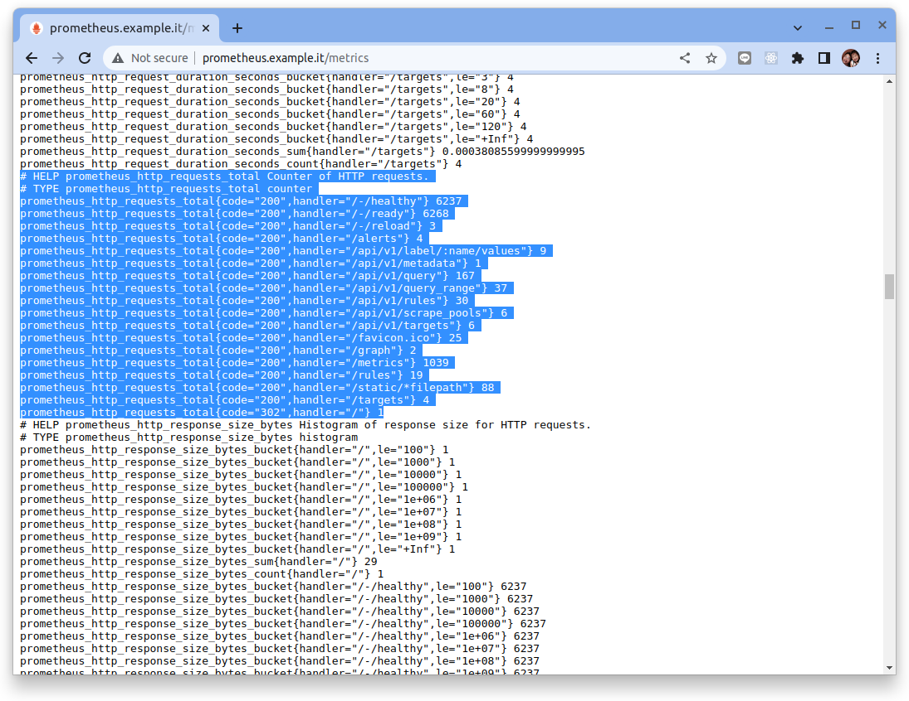
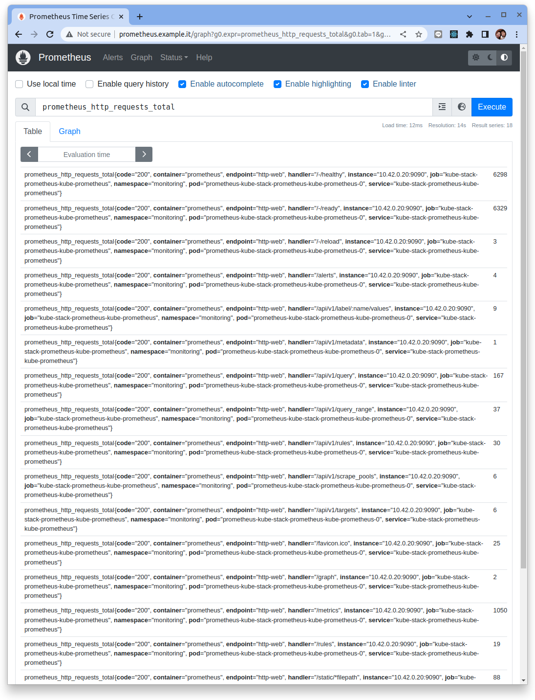
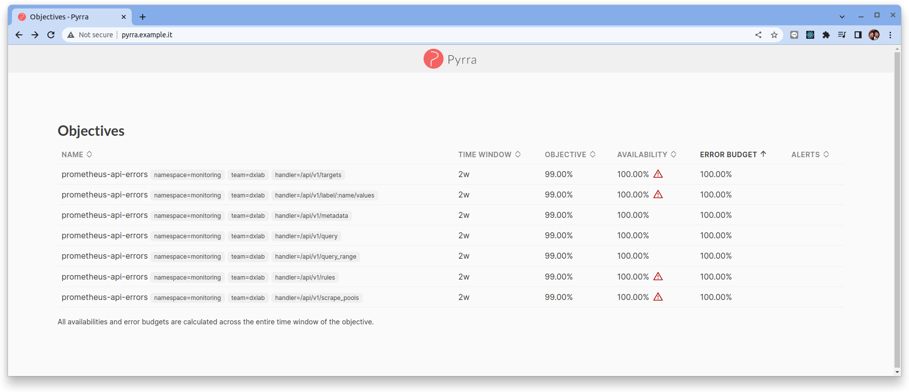
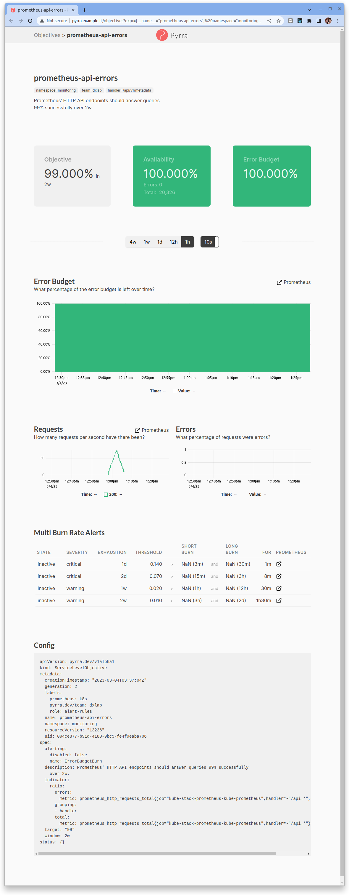

# SLO for Prometheus 範例

## Ratio 範例

Prometheus 提供了許多的 API 讓其它的應用系統查詢相關的 metadata 與進行 promql 的查詢計算。

我們想要使用 Pyrra 來對 Prometheus 的 API 服務進行 SLO 的定義與監控。

Ratio 類型的 SLO 是衡量 “錯誤事件發生次數 / 總事件發生次數” 的指標。

### 選擇 SLI 指標

指標資訊:

- Name: `prometheus_http_requests_total`
- Description: Counter of HTTP requests
- Type: counter
- Labels:
    - `code` Http reponse 的回應碼, 例如: 200, 500
    - `handler` API 的路徑, 例如: "/api/v1/query", "/targets"

```title="prometheus_http_requests_total 指標範例資料"
# HELP prometheus_http_requests_total Counter of HTTP requests.
# TYPE prometheus_http_requests_total counter
prometheus_http_requests_total{code="200",handler="/-/healthy"} 6237
prometheus_http_requests_total{code="200",handler="/-/ready"} 6268
prometheus_http_requests_total{code="200",handler="/-/reload"} 3
prometheus_http_requests_total{code="200",handler="/alerts"} 4
prometheus_http_requests_total{code="200",handler="/api/v1/label/:name/values"} 9
prometheus_http_requests_total{code="200",handler="/api/v1/metadata"} 1
prometheus_http_requests_total{code="200",handler="/api/v1/query"} 167
prometheus_http_requests_total{code="200",handler="/api/v1/query_range"} 37
prometheus_http_requests_total{code="200",handler="/api/v1/rules"} 30
prometheus_http_requests_total{code="200",handler="/api/v1/scrape_pools"} 6
prometheus_http_requests_total{code="200",handler="/api/v1/targets"} 6
prometheus_http_requests_total{code="200",handler="/favicon.ico"} 25
prometheus_http_requests_total{code="200",handler="/graph"} 2
prometheus_http_requests_total{code="200",handler="/metrics"} 1039
prometheus_http_requests_total{code="200",handler="/rules"} 19
prometheus_http_requests_total{code="200",handler="/static/*filepath"} 88
prometheus_http_requests_total{code="200",handler="/targets"} 4
prometheus_http_requests_total{code="302",handler="/"} 1
```



指標經由 Prometheus 收集之後會再增加一些在 Kubernetes 中取得的資訊在 metrics 的標籤中:

- Name: `prometheus_http_requests_total`
- Description: Counter of HTTP requests
- Type: counter
- Labels:
    - `code` Http reponse 的回應碼
    - `handler` API 的路徑
    - `container` 容器名稱, 例如: "prometheus"
    - `endpoint` 端口名稱, 例如: "http-web"
    - `instance` 實例名稱, 例如: "10.42.0.20:9090"
    - `job` 指標括取工作名稱, 例如: "kube-stack-prometheus-kube-prometheus"
    - `namespace` 命名空間, 例如: "monitoring"
    - `pod` Pod名稱, 例如: "prometheus-kube-stack-prometheus-kube-prometheus-0"
    - `service` 服務名稱, 例如:"kube-stack-prometheus-kube-prometheus"



### 定義與宣告 SLO

我們想要對 `/api/*` 的服務進行 SLO 的定義與監控

```title="prometheus_http_requests_total 指標範例" hl_lines="7-13"
# HELP prometheus_http_requests_total Counter of HTTP requests.
# TYPE prometheus_http_requests_total counter
prometheus_http_requests_total{code="200",handler="/-/healthy"} 6237
prometheus_http_requests_total{code="200",handler="/-/ready"} 6268
prometheus_http_requests_total{code="200",handler="/-/reload"} 3
prometheus_http_requests_total{code="200",handler="/alerts"} 4
prometheus_http_requests_total{code="200",handler="/api/v1/label/:name/values"} 9
prometheus_http_requests_total{code="200",handler="/api/v1/metadata"} 1
prometheus_http_requests_total{code="200",handler="/api/v1/query"} 167
prometheus_http_requests_total{code="200",handler="/api/v1/query_range"} 37
prometheus_http_requests_total{code="200",handler="/api/v1/rules"} 30
prometheus_http_requests_total{code="200",handler="/api/v1/scrape_pools"} 6
prometheus_http_requests_total{code="200",handler="/api/v1/targets"} 6
prometheus_http_requests_total{code="200",handler="/favicon.ico"} 25
prometheus_http_requests_total{code="200",handler="/graph"} 2
prometheus_http_requests_total{code="200",handler="/metrics"} 1039
prometheus_http_requests_total{code="200",handler="/rules"} 19
prometheus_http_requests_total{code="200",handler="/static/*filepath"} 88
prometheus_http_requests_total{code="200",handler="/targets"} 4
prometheus_http_requests_total{code="302",handler="/"} 1
```

```yaml title="SLO (Ratio)範例"
apiVersion: pyrra.dev/v1alpha1
kind: ServiceLevelObjective
metadata:
  name: prometheus-api-errors
  namespace: monitoring
  labels:
    prometheus: k8s
    role: alert-rules
    # 任何以 “pyrra.dev/” 為前綴的標籤都將作為 Prometheus 標籤傳播，同時去除前綴。
    pyrra.dev/team: dxlab
spec:
  # Description 詳細地描述了 ServiceLevelObjective
  # 並對理解服務提供了額外的上下文。
  description: Prometheus' HTTP API endpoints should answer queries 99% successfully over 2w.

  # Target 是一個字符串，會被轉換為 0 - 100 之間的 float64 數字
  # 它表示在給定時間窗口中所需的服務可用性。
  target: "99"

  # Window 應該保留SLO的時間窗口。通常是 1d、7d 或 28d。
  window: 2w
  
  # ServiceLevelIndicator 是指示服務運行情況的底層 Prometheus 指標數據源。
  indicator:
    # Ratio 是衡量 “錯誤事件發生次數 / 總事件發生次數” 的指標。
    ratio:
      # Errors 是衡量有多少錯誤事件發生的指標, 5xx 回應碼。
      errors:
        metric: prometheus_http_requests_total{job="kube-stack-prometheus-kube-prometheus",handler=~"/api.*",code=~"5.."}
      # Total 是衡量總共有多少請求事件的指標。
      total:
        metric: prometheus_http_requests_total{job="kube-stack-prometheus-kube-prometheus",handler=~"/api.*"}
      grouping:
        - handler
  
  # Alerting Alerting 由 Pyrra 定義生成的警報規則。
  alerting:
    # Disabled 用於禁用警報的生成。記錄規則仍然生成。
    disabled: false
    # Name 用於 Pyrra 生成的警報的名稱。默認為“ErrorBudgetBurn”。
    name: "ErrorBudgetBurn"
```

```bash
kubectl apply -f -<<EOF
apiVersion: pyrra.dev/v1alpha1
kind: ServiceLevelObjective
metadata:
  name: prometheus-api-errors
  namespace: monitoring
  labels:
    prometheus: k8s
    role: alert-rules
    # 任何以 “pyrra.dev/” 為前綴的標籤都將作為 Prometheus 標籤傳播，同時去除前綴。
    pyrra.dev/team: dxlab
spec:
  # Description 詳細地描述了 ServiceLevelObjective
  # 並對理解服務提供了額外的上下文。
  description: Prometheus' HTTP API endpoints should answer queries 99% successfully over 2w.

  # Target 是一個字符串，會被轉換為 0 - 100 之間的 float64 數字
  # 它表示在給定時間窗口中所需的服務可用性。
  target: "99"

  # Window 應該保留SLO的時間窗口。通常是 1d、7d 或 28d。
  window: 2w
  
  # ServiceLevelIndicator 是指示服務運行情況的底層 Prometheus 指標數據源。
  indicator:
    # Ratio 是衡量 “錯誤事件發生次數 / 總事件發生次數” 的指標。
    ratio:
      # Errors 是衡量有多少錯誤事件發生的指標, 5xx 回應碼。
      errors:
        metric: prometheus_http_requests_total{job="kube-stack-prometheus-kube-prometheus",handler=~"/api.*",code=~"5.."}
      # Total 是衡量總共有多少請求事件的指標。
      total:
        metric: prometheus_http_requests_total{job="kube-stack-prometheus-kube-prometheus",handler=~"/api.*"}
      grouping:
        - handler
  
  # Alerting Alerting 由 Pyrra 定義生成的警報規則。
  alerting:
    # Disabled 用於禁用警報的生成。記錄規則仍然生成。
    disabled: false
    # Name 用於 Pyrra 生成的警報的名稱。默認為“ErrorBudgetBurn”。
    name: "ErrorBudgetBurn"
EOF
```

由於在 SLO 的宣告中我們設定了 `grouping: handler`, 因此 Pyrra 生成了多個 SLO (by handler):



點擊任何一個 SLO 可檢視詳細的相關內容:




## Latency 範例

我們想要使用 Pyrra 定義 Prometheus 的 API 服務在回應速度 (latency) 的 SLO。

Latency  類型的 SLO 是衡量 "比特定延遲 (latency) 的百分位 (percentile) 高" 的 SLO。

### 選擇 SLI 指標

指標資訊:

- Name: `prometheus_http_request_duration_seconds`
- Description: Histogram of latencies for HTTP requests.
- Type: `histogram`
- Labels:
    - `le` 小於多少秒的回應時間, 例如: 0.1, 0.2, 0.4, 1, 3, 8, 20, 60, 120, +Inf
    - `handler` API 的路徑, 例如: "/api/v1/query", "/targets"

### 定義與宣告 SLO

```yaml title="SLO (Latency) 範例" hl_lines="29"
apiVersion: pyrra.dev/v1alpha1
kind: ServiceLevelObjective
metadata:
  name: prometheus-api-latency
  namespace: monitoring
  labels:
    prometheus: k8s
    role: alert-rules
    # 任何以 “pyrra.dev/” 為前綴的標籤都將作為 Prometheus 標籤傳播，同時去除前綴。
    pyrra.dev/team: dxlab
spec:
  # Description 詳細地描述了 ServiceLevelObjective
  # 並對理解服務提供了額外的上下文。
  description: Prometheus' HTTP API endpoints should answer queries 99% less than 0.75 sec latency over 2w group by handler.

  # Target 是一個字符串，會被轉換為 0 - 100 之間的 float64 數字
  # 它表示在給定時間窗口中所需的服務 latency 要求。
  target: "99"

  # Window 應該保留SLO的時間窗口。通常是 1d、7d 或 28d。
  window: 2w
  
  # ServiceLevelIndicator 是指示服務運行情況的底層 Prometheus 指標數據源。
  indicator:    
    # Latency 是衡量比特定延遲(latency)的百分位(percentile)高的指標。
    latency:
      # Success 是返回特定延遲(latency)的請求次數的指標
      success:
        metric: prometheus_http_request_duration_seconds_bucket{job="kube-stack-prometheus-kube-prometheus",handler=~"/api.*",le="0.1"}
      # Total 是返回總共有多少請求次數的指標。
      total:
        metric: prometheus_http_request_duration_seconds_count{job="kube-stack-prometheus-kube-prometheus", handler=~"/api.*"}
      grouping: 
        - handler

  
  # Alerting Alerting 由 Pyrra 定義生成的警報規則。
  alerting:
    # Disabled 用於禁用警報的生成。記錄規則仍然生成。
    disabled: false
    # Name 用於 Pyrra 生成的警報的名稱。默認為“ErrorBudgetBurn”。
    name: "ErrorBudgetBurn"
```

!!! tip
    在 Pyrra 宣告 latency 類型的 SLO 時要特別注意選擇 `histogram` 的指標, 並且要注意原始指標的 bucket 的區間(`le`)。
    因為在 Pyrra 生成的 Prometheus Recording Rules 中會利用這個 bucket 的數量來作為分子, 它并不會使用 `histogram_quantile()` 的函數來計算百分位數。

    - `le` 小於多少秒的回應時間, 例如: 0.1, 0.2, 0.4, 1, 3, 8, 20, 60, 120, +Inf
    
    另外在測試的過程發現 Latency 類型的SLO宣告如果使用 `group` 的功能之後, 在UI的呈現上會有一些小問題。

```bash
kubectl apply -f -<<EOF
apiVersion: pyrra.dev/v1alpha1
kind: ServiceLevelObjective
metadata:
  name: prometheus-api-latency4
  namespace: monitoring
  labels:
    prometheus: k8s
    role: alert-rules
    # 任何以 “pyrra.dev/” 為前綴的標籤都將作為 Prometheus 標籤傳播，同時去除前綴。
    pyrra.dev/team: dxlab
spec:
  # Description 詳細地描述了 ServiceLevelObjective
  # 並對理解服務提供了額外的上下文。
  description: Prometheus' HTTP API endpoints should answer queries 99% less than 0.1 sec latency over 2w group by handler.

  # Target 是一個字符串，會被轉換為 0 - 100 之間的 float64 數字
  # 它表示在給定時間窗口中所需的服務 latency 要求。
  target: "99"

  # Window 應該保留SLO的時間窗口。通常是 1d、7d 或 28d。
  window: 2w
  
  # ServiceLevelIndicator 是指示服務運行情況的底層 Prometheus 指標數據源。
  indicator:    
    # Latency 是衡量比特定延遲(latency)的百分位(percentile)高的指標。
    latency:
      # Success 是返回特定延遲(latency)的請求次數的指標
      success:
        metric: prometheus_http_request_duration_seconds_bucket{job="kube-stack-prometheus-kube-prometheus",handler=~"/api.*",le="1"}
      # Total 是返回總共有多少請求次數的指標。
      total:
        metric: prometheus_http_request_duration_seconds_count{job="kube-stack-prometheus-kube-prometheus", handler=~"/api.*"}
      grouping: 
        - handler

  
  # Alerting Alerting 由 Pyrra 定義生成的警報規則。
  alerting:
    # Disabled 用於禁用警報的生成。記錄規則仍然生成。
    disabled: false
    # Name 用於 Pyrra 生成的警報的名稱。默認為“ErrorBudgetBurn”。
    name: "ErrorBudgetBurn"
EOF
```

```bash
kubectl apply -f -<<EOF
apiVersion: pyrra.dev/v1alpha1
kind: ServiceLevelObjective
metadata:
  labels:
    prometheus: k8s
    role: alert-rules
  name: apiserver-read-resource-request-latency2
  namespace: monitoring
spec:
  description: ""
  indicator:
    latency:
      success:
        metric: apiserver_request_duration_seconds_bucket{job="apiserver",scope=~"resource|",verb=~"LIST|GET",le="1"}
      total:
        metric: apiserver_request_duration_seconds_count{job="apiserver",scope=~"resource|",verb=~"LIST|GET"}
  target: "99"
  window: 2w
EOF
```