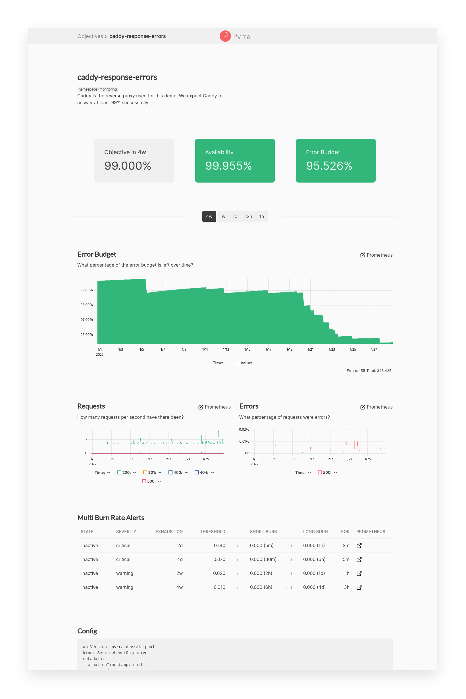
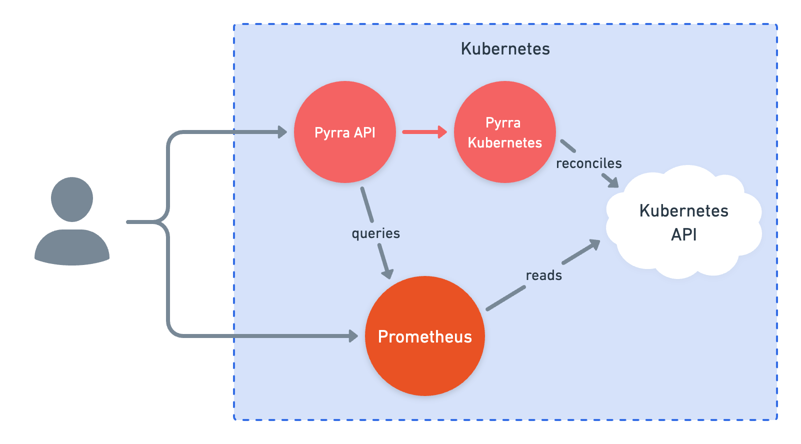

# Pyrra Prometheus SLO 產生器

原文: [Pyrra Github](https://github.com/pyrra-dev/pyrra/blob/main/README.md)


通過 Pyrra 與 Prometheus 的組合來讓 SLO 對每個人都易於管理、訪問和使用！

## 特點

Ｐyrra 具備下列的特點:

- 支持 Kubernetes、Docker 和文件系統
- 支持生成 4 個不同嚴重程度的多燃燒率告警
- 列出所有服務級別目標的整合型 Dashbaord
- 按剩餘錯誤預算排序以快速查看最差的錯誤預算
- 單擊標籤以過濾包含該標籤的 SLO
- 包含服務級別目標詳細信息的圖表
    - 突出顯示為 3 個 SRE 最重要的數字: 目標、可用性、錯誤預算
    - 支援查看錯誤預算如何隨時間變化的圖表
    - 詳細的服務的請求、錯誤、持續時間 (RED) 圖表
- 通過 `--generic-rules` 生成的 Grafana 儀表板



## 架構

Pyrra 包含三個組件，所有組件都通過一個二進製文件工作：

- **UI** 顯示 SLO、錯誤預算、消耗率等。
- **API** 將有關 SLO 的信息從後端（如 Kubernetes）傳遞到 UI。
- **後端 Operator** 監視新的 SLO 對象，然後為每個對象創建 Prometheus 記錄規則。
    - 對於 Kubernetes，有一個 Kubernetes Operator 可用
    - 對於其他，有一個基於文件系統的 Operator 可用

使用 YAML 格式定義 SLO:

```yaml
apiVersion: pyrra.dev/v1alpha1
kind: ServiceLevelObjective
metadata:
  name: pyrra-api-errors
  namespace: monitoring
  labels:
    prometheus: k8s
    role: alert-rules
    pyrra.dev/team: operations # Any labels prefixed with 'pyrra.dev/' will be propagated as Prometheus labels, while stripping the prefix.
spec:
  target: "99"
  window: 2w
  description: Pyrra's API requests and response errors over time grouped by route.
  indicator:
    ratio:
      errors:
        metric: http_requests_total{job="pyrra",code=~"5.."}
      total:
        metric: http_requests_total{job="pyrra"}
      grouping:
        - route
```

為了計算 `error budget burn rates`，Pyrra 將為每個 SLO 創建 [Prometheus recording rules](https://prometheus.io/docs/prometheus/latest/configuration/recording_rules/#recording-rules)。

Ｐyrra 將為上述範例的 SLO 創建以下的 Prometheus recording rules:

```
http_requests:increase2w
http_requests:burnrate3m
http_requests:burnrate15m
http_requests:burnrate30m
http_requests:burnrate1h
http_requests:burnrate3h
http_requests:burnrate12h
http_requests:burnrate2d
```

Prometheus recording rule 的名稱基於最初提供的指標。規則也包含著必要的標籤，以便在有多個相同名稱的記錄規則的情況下來作為唯一標識。

## 在 Kubernetes 集群中運行



這裡需要進行兩種部署：一種用於 API/UI，一種用於Pyrra operator。對於第一次部署，使用 `api` 參數啟動二進製文件。

當使用 kubernetes 來啟動 Pyrra 服務時，Ｐyrra operator 服務將監視 apiserver 是否有 `ServiceLevelObjectives` 資源的創建。一旦偵測到有了新的 SLO，Pyrra 將創建 PrometheusRule 對象（通過 Prometheus operator)。

### SLO 規格定義

Pyrra 設計了一個 SLO (CRD) 來讓 SRE 工程師定義服務的 SLO, 詳細的spec在:

- https://pkg.go.dev/github.com/pyrra-dev/pyrra/kubernetes/api/v1alpha1

Pyrray 主要支持兩種類型的 SLO 定義:

- Ratio 是衡量 “錯誤事件發生次數 / 總事件發生次數” 的 SLO。
- Latency 是衡量 "比特定延遲 (latency) 的百分位 (percentile) 高" 的 SLO。

利用這兩種 SLO 的定義，可用來實踐在 Goolge SRE 書本中[最常看見的 SLO 範例](https://sre.google/workbook/slo-document/):


|Category	|SLI	|SLO|
|---------|-----|---|
|Availability|The proportion of successful requests, as measured from the load balancer metrics.<br/>Any HTTP status other than 500–599 is considered successful.<br/><br/>{++count of "api" http_requests which do not have a 5XX status code divided by count of all "api" http_requests.++}|97% success|
|Latency|The proportion of sufficiently fast requests, as measured from the load balancer metrics.<br/>“Sufficiently fast” is defined as < 400 ms, or < 850 ms.<br/><br/>{++count of "api" http_requests with a duration less than or equal to "0.4" seconds divided by count of all "api" http_requests++}<br/><br/>{++count of "api" http_requests with a duration less than or equal to "0.85" seconds divided by count of all "api" http_requests++}|90% of requests < 400 ms<br/><br/>99% of requests < 850 ms|


**Ratio 範例:**

下面是一個使用 Ratio 類型來定義SLO的範例:

```yaml title="SLO (Ratio)範例"
apiVersion: pyrra.dev/v1alpha1
kind: ServiceLevelObjective
metadata:
  name: pyrra-api-errors
  namespace: monitoring
  labels:
    prometheus: k8s
    role: alert-rules
    # 任何以 “pyrra.dev/” 為前綴的標籤都將作為 Prometheus 標籤傳播，同時去除前綴。
    pyrra.dev/team: operations
spec:
  # Description 詳細地描述了 ServiceLevelObjective
  # 並對理解服務提供了額外的上下文。
  description: Pyrra's API requests and response errors over time grouped by route.

  # Target 是一個字符串，會被轉換為 0 - 100 之間的 float64 數字
  # 它表示在給定時間窗口中所需的服務可用性。
  target: "99"

  # Window 應該保留SLO的時間窗口。通常是 1d、7d 或 28d。
  window: 2w
  
  # ServiceLevelIndicator 是指示服務運行情況的底層 Prometheus 指標數據源。
  indicator:
    # Ratio 是衡量 “錯誤事件發生次數 / 總事件發生次數” 的指標。
    ratio:
      # Errors 是衡量有多少錯誤事件發生的指標。
      errors:
        metric: http_requests_total{job="pyrra",code=~"5.."}
      # Total 是衡量總共有多少請求事件的指標。
      total:
        metric: http_requests_total{job="pyrra"}
      grouping:
        - route
  
  # Alerting Alerting 由 Pyrra 定義生成的警報規則。
  alerting:
    # Disabled 用於禁用警報的生成。記錄規則仍然生成。
    disabled: false
    # Name 用於 Pyrra 生成的警報的名稱。默認為“ErrorBudgetBurn”。
    name: "ErrorBudgetBurn"
```

**Latency 範例:**

下面是一個使用 Latency 類型來定義 SLO 的範例:

```yaml title="SLO (Latency)範例"
apiVersion: pyrra.dev/v1alpha1
kind: ServiceLevelObjective
metadata:
  name: pyrra-api-latency
  namespace: monitoring
  labels:
    prometheus: k8s
    role: alert-rules
    # 任何以 “pyrra.dev/” 為前綴的標籤都將作為 Prometheus 標籤傳播，同時去除前綴。
    pyrra.dev/team: operations
spec:
  # Description 詳細地描述了 ServiceLevelObjective
  # 並對理解服務提供了額外的上下文。
  description: Pyrra's API requests and response latency over time grouped by code.

  # Target 是一個字符串，會被轉換為 0 - 100 之間的 float64 數字
  # 它表示在給定時間窗口中所需的服務 latency 要求。
  target: "99"

  # Window 應該保留SLO的時間窗口。通常是 1d、7d 或 28d。
  window: 2w
  
  # ServiceLevelIndicator 是指示服務運行情況的底層 Prometheus 指標數據源。
  indicator:    
    # Latency 是衡量比特定延遲(latency)的百分位(percentile)高的指標。
    latency:
      # Success 是返回特定延遲(latency)的請求次數的指標
      success:
        metric: http_request_duration_seconds_bucket{job="sre-sample-app", le="1.0"}
      # Total 是返回總共有多少請求次數的指標。
      total:
        metric: http_request_duration_seconds_count{job="sre-sample-app"}
      grouping: 
        - code

  
  # Alerting Alerting 由 Pyrra 定義生成的警報規則。
  alerting:
    # Disabled 用於禁用警報的生成。記錄規則仍然生成。
    disabled: false
    # Name 用於 Pyrra 生成的警報的名稱。默認為“ErrorBudgetBurn”。
    name: "ErrorBudgetBurn"
```

從 Pyrra 的 SLO (CRD) 的設計看來現在 Pyrra 主要支持了 ratio 與 latency 的兩類型的定義，相當的簡潔與降低採用的困難度。

然而在 alert 的客制化則相對有限，比如想在 alert 中增加一些額外的標籤或 annotation 的話則在現在版本上暫時會無法達成。