# 使用 Helm 來安裝配置 Sloth


請跟隨本教程一起，使用 Helm 安裝、配置、並深入評估 Sloth 這個 SLO as code 的工具。本教程會安裝下列的元件:

- Ubuntu 20.04 (O.S)
- Docker
- Kubernetes (K3D)
- Metallb
- Nginx Ingress Controller
- Prometheus
- Grafana
- Sloth

## 步驟 01 - 環境安裝

### 先決條件

安裝 Helm3 的二進製文件。

```bash
sudo apt install git -y

curl -fsSL -o get_helm.sh https://raw.githubusercontent.com/helm/helm/master/scripts/get-helm-3

chmod 700 get_helm.sh

sudo ./get_helm.sh
```


### 創建本機 Docker Network

使用 docker 創建一個虛擬的網路來做為本次教程的網路架構。

|   |   |
|--- |---|
|CIDR|172.22.0.0/24|
|CIDR IP Range|172.20.0.0 - 172.20.0.255|
|IPs|256|
|Subnet Mask|255.255.255.0|
|Gateay|172.20.0.1|

```bash
docker network create \
  --driver=bridge \
  --subnet=172.20.0.0/24 \
  --gateway=172.20.0.1 \
  lab-network
```

檢查 Docker 虛擬網絡 `lab-network` 的設定。

```bash
docker network inspect lab-network
```

結果:

```json hl_lines="14-15"
[
    {
        "Name": "lab-network",
        "Id": "2e2ca22fbb712cbc19d93acb16fc4e1715488c4c18b82d12dba4c1634ac5b1b6",
        "Created": "2023-02-09T23:07:33.186003336+08:00",
        "Scope": "local",
        "Driver": "bridge",
        "EnableIPv6": false,
        "IPAM": {
            "Driver": "default",
            "Options": {},
            "Config": [
                {
                    "Subnet": "172.20.0.0/24",
                    "Gateway": "172.20.0.1"
                }
            ]
        },
        "Internal": false,
        "Attachable": false,
        "Ingress": false,
        "ConfigFrom": {
            "Network": ""
        },
        "ConfigOnly": false,
        "Containers": {},
        "Options": {},
        "Labels": {}
    }
]
```

讓我們從這個虛擬網段裡的 CIDR IP Range 中保留 5 個 IP (`172.20.0.10-172.20.0.15`) 來做本次的練習。

### 創建 K8S 集群

執行下列命令來創建實驗 Kubernetes 集群:

```bash title="執行下列命令  >_"
k3d cluster create  --api-port 6443 \
  --port 8080:80@loadbalancer --port 8443:443@loadbalancer \
  --k3s-arg "--disable=traefik@server:0" \
  --k3s-arg "--disable=servicelb@server:0" \
  --network lab-network
```

參數說明:

- `--k3s-arg "--disable=servicelb@server:0"` 不安裝 K3D 預設的 traefik (IngressController), 我們將使用　nginx ingress controller
- `--k3s-arg "--disable=traefik@server:0"` 不安裝 K3D 預設的 servicelb (klipper-lb), 我們將使用 metallb
- `--network lab-network` 使用預先創建的 docker 虛擬網段

### 安裝/設定 MetalLB

在本次的結構裡, Nginx Ingress Controller 負責對外開放在 Kubernetes 裡頭的服務。因此在本次的 lab 架構會使用 metallb 來配置固定的 IP。

#### Helm 安裝

使用 Helm 的手法來進行 Ｍetallb 安裝:

```bash
#　setup helm repo
helm repo add metallb https://metallb.github.io/metallb

helm repo update

# install metallb to specific namespace
helm upgrade --install --create-namespace --namespace metallb-system \
  metallb metallb/metallb
```

#### 設定 IP Adress Pool

我們將使用 MetalLB 的 Layer 2 模式是最簡單的配置：在大多數的情況下，你不需要任何特定於協議的配置，只需要 IP 地址範圍。

Layer 2 模式模式不需要將 IP 綁定到工作程序節點的網絡接口。它通過直接響應本地網絡上的 ARP 請求來工作，將機器的 MAC 地址提供給客戶端。

確認 metallb 相關的 pods 己經正確啟動:

```bash
kubectl get pods -n metallb-system
```

結果:

```
NAME                                  READY   STATUS    RESTARTS       AGE
metallb-controller-786bc74686-l6h86   1/1     Running   1 (119s ago)   3m59s
metallb-speaker-dwbnv                 1/1     Running   0              3m59s
```

讓我們使用 CRD 來設定 Metallb:

```bash hl_lines="9"
cat <<EOF | kubectl apply -n metallb-system -f -
apiVersion: metallb.io/v1beta1
kind: IPAddressPool
metadata:
  name: ip-pool
  namespace: metallb-system
spec:
  addresses:
  - 172.20.0.10-172.20.0.15
---
apiVersion: metallb.io/v1beta1
kind: L2Advertisement
metadata:
  name: l2advertise
  namespace: metallb-system
spec:
  ipAddressPools:
  - ip-pool
EOF
```

結果:

```bash
ipaddresspool.metallb.io/ip-pool created
l2advertisement.metallb.io/l2advertise created
```

!!! tip
    如果只有一個 IP 要讓 Metallb 來給予，那麼 CIDR 的設定可設成 172.20.0.5/32 (也就是只有一個 IP: `172.20.0.5` 可被指派使用)

### 安裝/設定 Nginx Ingress Controller

#### Helm 安裝

使用以下命令添加 Nginx Ingress Controller 的 chart 存儲庫：

```bash
helm repo add ingress-nginx https://kubernetes.github.io/ingress-nginx

helm repo update
```

使用文字編輯器創建一個設定檔 `ingress-nginx-values.yaml` 來設定 `ingress-nginx` 要從 metallb 取得特定的預設 IP (`172.20.0.13`):

```yaml title="ingress-nginx-values.yaml"
controller:
  # add annotations to get ip from metallb
  service:
    annotations:
      metallb.universe.tf/address-pool: ip-pool
    loadBalancerIP: "172.20.0.13"
  # set ingressclass as default
  ingressClassResource:
    default: true
```

將 Nginx Ingress Controller 安裝到 kube-system 命名空間中：

```bash
helm upgrade --install \
     --create-namespace --namespace kube-system \
     ingress-nginx ingress-nginx/ingress-nginx \
     --values ingress-nginx-values.yaml
```

檢查:

```bash
kubectl get svc -n kube-system
```

結果:

```
NAME                                 TYPE           CLUSTER-IP      EXTERNAL-IP   PORT(S)                      AGE
ingress-nginx-controller             LoadBalancer   10.43.160.250   172.20.0.13    80:30672/TCP,443:30990/TCP   91s
```

!!! tip
    特別注意 `ingress-nginx-controller` 的 EXTERNAL-IP 是否從 metallb 取得 `172.20.0.13`

#### 驗證 Ingress 設定

創建一個 Nginx 的 Deployment 與 Service:

```bash
kubectl create deployment nginx --image=nginx

kubectl create service clusterip nginx --tcp=80:80
```

創建 Ingress 來曝露這個測試的 Nginx 網站:

```bash
kubectl apply -f -<<EOF
apiVersion: networking.k8s.io/v1
kind: Ingress
metadata:
  name: ingress-nginx-svc
spec:
  rules:
  - host: "nginx.example.it"
    http:
      paths:
      - pathType: Prefix
        path: "/"
        backend:
          service:
            name: nginx
            port:
              number: 80
EOF
```

檢查看這個 ingress 是否有取得 IP ADDRESS:

```bash
kubectl get ing/ingress-nginx-svc
```

結果:

```
NAME                CLASS    HOSTS              ADDRESS       PORTS   AGE
ingress-nginx-svc   <none>   nginx.example.it   172.20.0.13   80      21s
```

修改 `/etc/hosts` 來增加一筆 entry 來模擬 DNS 解析:

``` title="/etc/hosts"
...
172.20.0.13  nginx.example.it
...
```

使用瀏覽器瀏覽 `http://nginx.example.it`:


### kube-prometheus-stack

本教程使用 `kube-prometheus-stack` 來構建可觀測性的相關元件, 詳細說明請參additionalDataSources

- [Prometheus 簡介](../../../../prometheus/prometheus/overview.md)
- [Prometheus Operator 簡介](../../../../prometheus/prometheus/overview.md)

添加 Prometheus-Community helm 存儲庫並更新本地緩存：

```bash
helm repo add prometheus-community https://prometheus-community.github.io/helm-charts

helm repo update 
```

創建要配置的 prometheus stack 的設定檔案(使用任何文字編輯器來創建):

```yaml title="kube-stack-prometheus-values.yaml" hl_lines="2-3"
# disable alert rules 
defaultRules:
  create: false
grafana:
  ingress:
    enabled: true
    hosts:
      - grafana.example.it
  # specify tag to ensure grafana version
  image:
    tag: "9.3.6"
  # change timezone setting base on browser
  defaultDashboardsTimezone: browser
  grafana.ini:
    users:
      viewers_can_edit: true
    auth:
      disable_login_form: false
      disable_signout_menu: false
    auth.anonymous:
      enabled: true
      org_role: Viewer
    feature_toggles:
      enable: traceqlEditor
  sidecar:
    datasources:
      logLevel: "DEBUG"
      enabled: true
      searchNamespace: "ALL"
    dashboards:
      logLevel: "DEBUG"
      # enable the cluster wide search for dashbaords and adds/updates/deletes them in grafana
      enabled: true
      searchNamespace: "ALL"
      label: grafana_dashboard
      labelValue: "1"

prometheus:
  ingress:
    enabled: true
    hosts:
      - prometheus.example.it

  prometheusSpec:
    # enable the cluster wide search for ServiceMonitor CRD
    serviceMonitorSelectorNilUsesHelmValues: false
    # enable the cluster wide search for PodMonitor CRD
    podMonitorSelectorNilUsesHelmValues: false
    # enable the cluster wide search for PrometheusRule CRD
    ruleSelectorNilUsesHelmValues: false
    probeSelectorNilUsesHelmValues: false
```

使用 Helm 在命名空間監控中部署 `kube-stack-prometheus` chart:

```bash
helm upgrade --install \
  --create-namespace --namespace monitoring \
  kube-stack-prometheus prometheus-community/kube-prometheus-stack \
  --values kube-stack-prometheus-values.yaml
```

檢查看這個所創建的 ingress 是否有取得 IP ADDRESS:

```bash
kubectl get ing -n monitoring
```

結果:

```
NAME                                    CLASS   HOSTS                   ADDRESS       PORTS   AGE
kube-stack-prometheus-grafana           nginx   grafana.example.it      172.20.0.13   80      3m53s
kube-stack-prometheus-kube-prometheus   nginx   prometheus.example.it   172.20.0.13   80      3m53s
```

由於對 Grafana 與 Prometheus 啟動了 ingress, 修改 `/etc/hosts` 來增加兩筆 entry 來模擬 DNS 解析:

``` title="/etc/hosts"
...
172.20.0.13  grafana.example.it
172.20.0.13  prometheus.example.it
...
```

使用 Browser 檢查 Prometheus Web UI (`http://prometheus.example.it/alerts`): 

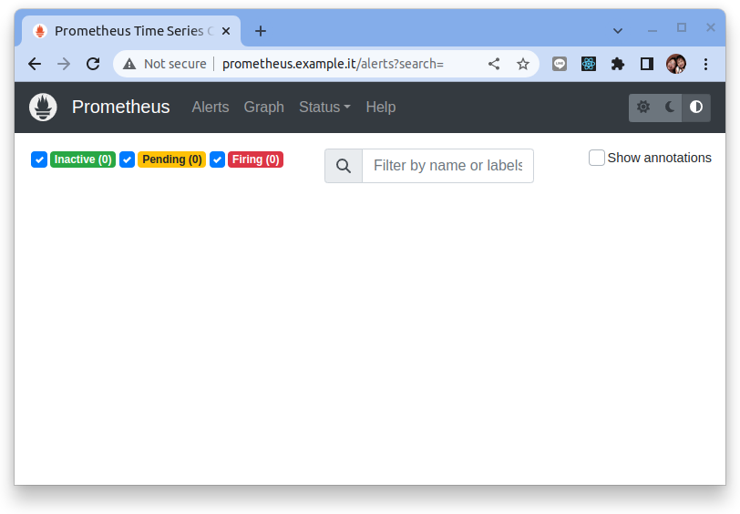

此時 Prometheus 裡頭應該看不到任何的 alert rules。

### 安裝 Sloth

#### Helm 安裝

使用以下命令添加 Sloth 的 chart 存儲庫：

```bash
helm repo add sloth https://slok.github.io/sloth

helm repo update
```

將 Sloth 安裝到 sre-system 命名空間中：

```bash
# create namespace
kubectl create namespace sre-system

# apply sloth CRD
kubectl apply -f https://raw.githubusercontent.com/slok/sloth/main/deploy/kubernetes/helm/sloth/crds/sloth.slok.dev_prometheusservicelevels.yaml -n sre-system
```

安裝 Sloth:

```bash
helm upgrade --install \
     --create-namespace --namespace sre-system \
     sloth sloth/sloth
```

檢查:

```bash
kubectl get all -n sre-system
```

結果:

```
NAME                        READY   STATUS    RESTARTS   AGE
pod/sloth-bb88c58d6-g8hcv   2/2     Running   0          24m

NAME                    READY   UP-TO-DATE   AVAILABLE   AGE
deployment.apps/sloth   1/1     1            1           24m

NAME                              DESIRED   CURRENT   READY   AGE
replicaset.apps/sloth-bb88c58d6   1         1         1       24m
```

## 步驟 02 - Sloth 功能驗證

整體結構如下:

1. 佈署範例應用程式
2. 設定錯誤率
3. 設定 PrometheusServiceLevel (CRD)
4. 檢視 Sloth 產生的 record rules
5. 檢視 Grafana Dashboard

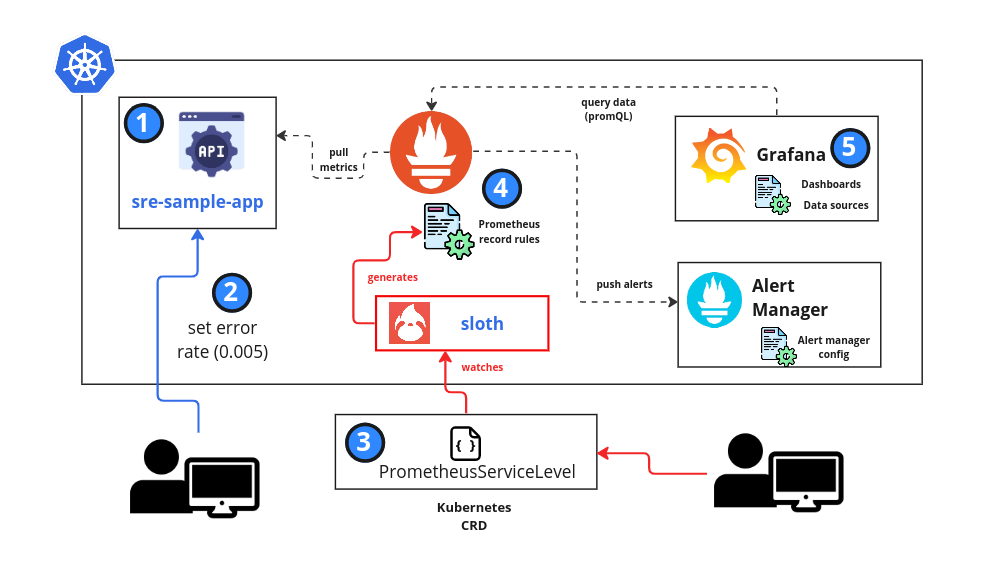

### 1. 佈署範例應用程式

範例應用程式是一個使用 Golang 所撰寫的小程式, 它內嵌了 prometheus 的 sdk 並且曝露了可讓 Prometheus 來括取的範例指標。

範例程式並公開了一個 api 可使用 `curl` 工具來設定錯誤率, 這個設定產出 Http Error Code (500) 的指標數據。

!!! info
    簡例程序可在 `https://github.com/grafanafans/play-with-sloth` 查看詳細內容。

    開發者的Github: https://github.com/songjiayang

讓我們先佈署範例應用進到 Kubernetes 的 `default` 命名空間中:

```bash
kubectl apply -f -<<EOF
apiVersion: apps/v1
kind: Deployment
metadata:
  name: sre-sample-app
  labels:
    app: sre-sample-app
spec:
  replicas: 1
  selector:
    matchLabels:
      app: sre-sample-app
  template:
    metadata:
      labels:
        app: sre-sample-app
    spec:
      containers:
      - name: sre-sample-app
        image: songjiayang/sloth-myservice:0.0.1
        ports:
        - name: metrics
          containerPort: 8080
---
apiVersion: v1
kind: Service
metadata:
  name: sre-sample-app
  labels:
    app: sre-sample-app
spec:
  selector:
    app: sre-sample-app
  ports:
    - name: metrics
      protocol: TCP
      port: 80
      targetPort: metrics
EOF
```

創建 Ingress 來曝露這個測試的 Sample App:

```bash
kubectl apply -f -<<EOF
apiVersion: networking.k8s.io/v1
kind: Ingress
metadata:
  name: sre-sample-app
spec:
  rules:
  - host: "sre-sample-app.example.it"
    http:
      paths:
      - pathType: Prefix
        path: "/"
        backend:
          service:
            name: sre-sample-app
            port:
              number: 80
EOF
```

檢查 ingress:

```bash
kubectl get ing -n default
```

結果:

```
NAME             CLASS   HOSTS                       ADDRESS       PORTS   AGE
sre-sample-app   nginx   sre-sample-app.example.it   172.20.0.13   80      98s
```

修改 `/etc/hosts` 來增加 entry 來模擬 DNS 解析:

``` title="/etc/hosts"
...
172.20.0.13  sre-sample-app.example.it
...
```

首先使用 Browser 檢查 `http://sre-sample-app.example.it/metrics` 所的曝露的指標:

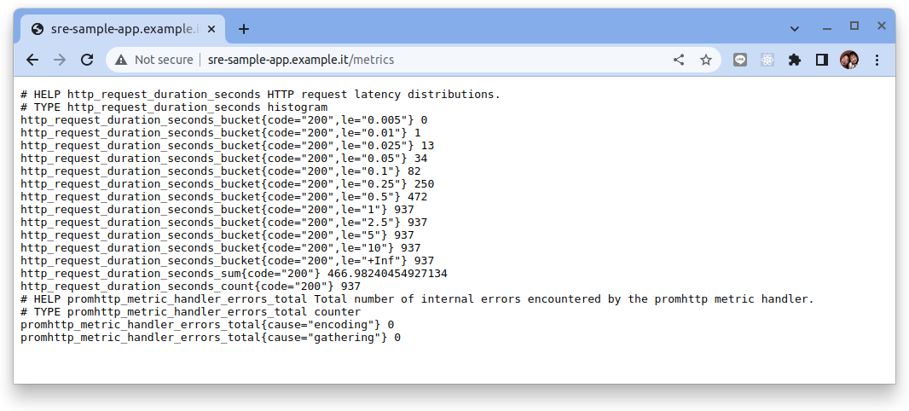

在本次的驗證中主要使用的是 `http_request_duration_seconds` (histogram) 這個指標。

從擷圖中可看出來在初始的狀態下指標的標籤標示的都是 `{code="200"}`的數據:

```
# HELP http_request_duration_seconds HTTP request latency distributions.
# TYPE http_request_duration_seconds histogram
http_request_duration_seconds_bucket{code="200",le="0.005"} 0
http_request_duration_seconds_bucket{code="200",le="0.01"} 1
http_request_duration_seconds_bucket{code="200",le="0.025"} 13
http_request_duration_seconds_bucket{code="200",le="0.05"} 34
http_request_duration_seconds_bucket{code="200",le="0.1"} 82
http_request_duration_seconds_bucket{code="200",le="0.25"} 250
http_request_duration_seconds_bucket{code="200",le="0.5"} 472
http_request_duration_seconds_bucket{code="200",le="1"} 937
http_request_duration_seconds_bucket{code="200",le="2.5"} 937
http_request_duration_seconds_bucket{code="200",le="5"} 937
http_request_duration_seconds_bucket{code="200",le="10"} 937
http_request_duration_seconds_bucket{code="200",le="+Inf"} 937
http_request_duration_seconds_sum{code="200"} 466.98240454927134
http_request_duration_seconds_count{code="200"} 937
```

接下來使用 `ServiceMonitor` 物件來宣告讓 Prometheus 來刮取指標:

```bash
kubectl apply -f -<<EOF
apiVersion: monitoring.coreos.com/v1
kind: ServiceMonitor
metadata:
  name: sre-sample-app
  labels:
    team: dxlab
spec:
  selector:
    matchLabels:
      app: sre-sample-app
  endpoints:
  - port: metrics
EOF
```

接著檢查 Prometheus UI，在上方導覽欄上點選　"Status" 在下接選單中選擇 "Targets"　並且在過濾欄中輸入 `sre-sample-app`:

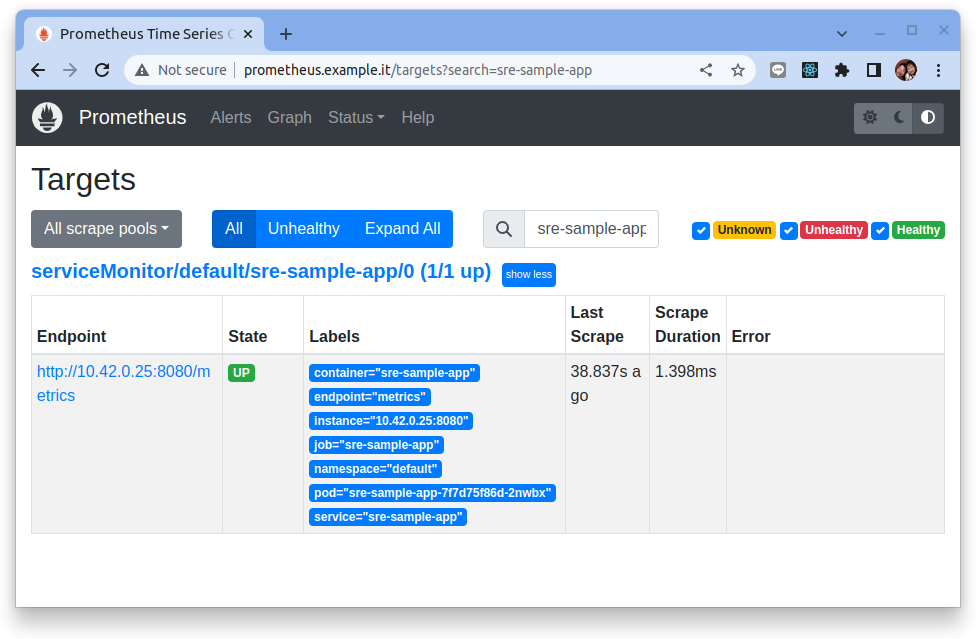

### 2. 設定錯誤率

範例程式並公開了一個 api 可使用 `curl` 工具來設定錯誤率, 這個設定會產出 Http Error Code (500) 的指標數據。

設定範例應用錯誤率 0.005 (0.5%), 也就是每一千次的呼叫約莫有 5 次的錯誤:

```bash
curl http://sre-sample-app.example.it/errrate?value=0.005
```

首先使用 Browser 檢查 `http://sre-sample-app.example.it/metrics` 所的曝露的指標:

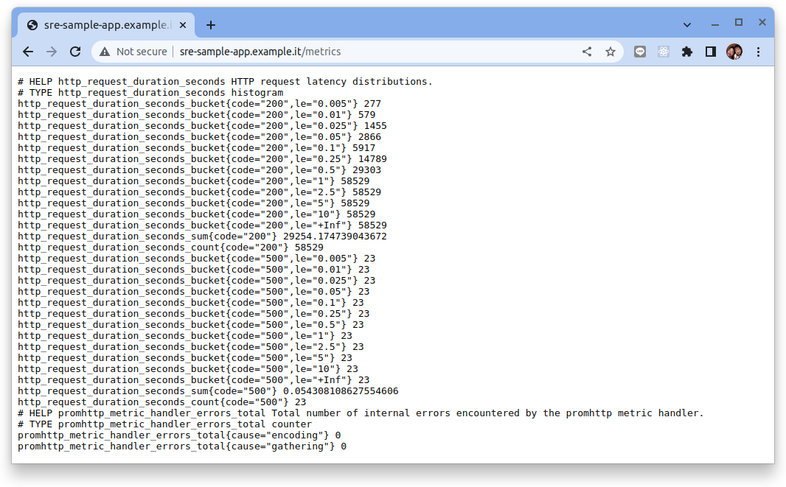

從擷圖中可看出來在設定完錯誤率之後指標的標籤標示也開始出現 `{code="500"}` 的數據:

```hl_lines="16-29"
# TYPE http_request_duration_seconds histogram
http_request_duration_seconds_bucket{code="200",le="0.005"} 277
http_request_duration_seconds_bucket{code="200",le="0.01"} 579
http_request_duration_seconds_bucket{code="200",le="0.025"} 1455
http_request_duration_seconds_bucket{code="200",le="0.05"} 2866
http_request_duration_seconds_bucket{code="200",le="0.1"} 5917
http_request_duration_seconds_bucket{code="200",le="0.25"} 14789
http_request_duration_seconds_bucket{code="200",le="0.5"} 29303
http_request_duration_seconds_bucket{code="200",le="1"} 58529
http_request_duration_seconds_bucket{code="200",le="2.5"} 58529
http_request_duration_seconds_bucket{code="200",le="5"} 58529
http_request_duration_seconds_bucket{code="200",le="10"} 58529
http_request_duration_seconds_bucket{code="200",le="+Inf"} 58529
http_request_duration_seconds_sum{code="200"} 29254.174739043672
http_request_duration_seconds_count{code="200"} 58529
http_request_duration_seconds_bucket{code="500",le="0.005"} 23
http_request_duration_seconds_bucket{code="500",le="0.01"} 23
http_request_duration_seconds_bucket{code="500",le="0.025"} 23
http_request_duration_seconds_bucket{code="500",le="0.05"} 23
http_request_duration_seconds_bucket{code="500",le="0.1"} 23
http_request_duration_seconds_bucket{code="500",le="0.25"} 23
http_request_duration_seconds_bucket{code="500",le="0.5"} 23
http_request_duration_seconds_bucket{code="500",le="1"} 23
http_request_duration_seconds_bucket{code="500",le="2.5"} 23
http_request_duration_seconds_bucket{code="500",le="5"} 23
http_request_duration_seconds_bucket{code="500",le="10"} 23
http_request_duration_seconds_bucket{code="500",le="+Inf"} 23
http_request_duration_seconds_sum{code="500"} 0.054308108627554606
http_request_duration_seconds_count{code="500"} 23
```

### 3. 設定 SLO

Ｓloth 提供了在 Kubernetes 宣告 SLO 的 CRD, 詳細內容見: [Sloth SLO API and specs](https://sloth.dev/specs/kubernetes/)。

接下來我們使用 Sloth 的 CRD 來定義監控 `sre-sample-app` 的 **Availability** 的 `SLO: 99.9%`:

```bash hl_lines="24 29"
kubectl apply -f -<<EOF
apiVersion: sloth.slok.dev/v1
kind: PrometheusServiceLevel
metadata:
  name: slo-sre-sample-app
  namespace: monitoring
spec:
  service: "sre-sample-app"
  labels:
    owner: "dxlab"
    repo: "myorg/myservice"
    tier: "2"
  # SLOs are the SLOs of the service.
  slos:
    # We allow failing (5xx and 429) 1 request every 1000 requests (99.9%).
    - name: "requests-availability"
      objective: 99.9
      description: "Common SLO based on availability for HTTP request responses."
      sli:
        events:
          # ErrorQuery is a Prometheus query that will get the number/count of events
          # that we consider that are bad for the SLO (e.g "http 5xx", "latency > 250ms"...).
          # Requires the usage of `{{.window}}` template variable.
          errorQuery: sum(rate(http_request_duration_seconds_count{job="sre-sample-app",code=~"(5..|429)"}[{{.window}}]))

          # TotalQuery is a Prometheus query that will get the total number/count of events
          # for the SLO (e.g "all http requests"...).
          # Requires the usage of `{{.window}}` template variable.
          totalQuery: sum(rate(http_request_duration_seconds_count{job="sre-sample-app"}[{{.window}}]))
      alerting:
        name: SreSampleAppHighErrorRate
        labels:
          category: "availability"
        annotations:
          # Overwrite default Sloth SLO alert summmary on ticket and page alerts.
          summary: "High error rate on 'sre-sample-app' requests responses"

        # Page alert refers to the critical alert (check multiwindow-multiburn alerts).
        pageAlert:
          labels:
            severity: pageteam
            routing_key: myteam
        
        # TicketAlert alert refers to the warning alert (check multiwindow-multiburn alerts).
        ticketAlert:
          labels:
            severity: "slack"
            slack_channel: "#alerts-myteam"
EOF
```

### 4. 檢視 Sloth 產生的 record rules

Sloth 會根據 SLO 設定的宣告來產生相關的 Prometheus record rules 物件。

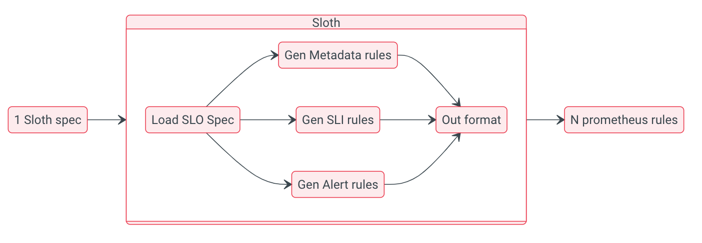

從架構圖可知，sloth 統一加載 SLO 配置後，會將其自動轉化為 `SLI`, `Metadata`, `Alert` 三類 Prometheus 規則：

- `SLI`: 屬於 Prometheus record 類型，它是一切 SLO 計算的基礎，根據用戶配置的 events，自動生成不同時間窗口的指標錯誤率（例如 slo:sli_error:ratio_rate5m，slo:sli_error:ratio_rate30m）。
- `Metadata`: 屬於 Prometheus record 類型，主要用於某個服務 SLO 使用情況統計，如剩餘錯誤預算、SLO 目標百分比，這些指標用於 SLO 可視化非常方便。
- `Alert`: 屬於 Prometheus alert 類型，它依靠生成的 SLIs，集合不同窗口配置參數生成不同級別的告警規則。

在 Prometheus UI，在上方導覽欄上點選　"Status" 在下接選單中選擇 "Rules" :

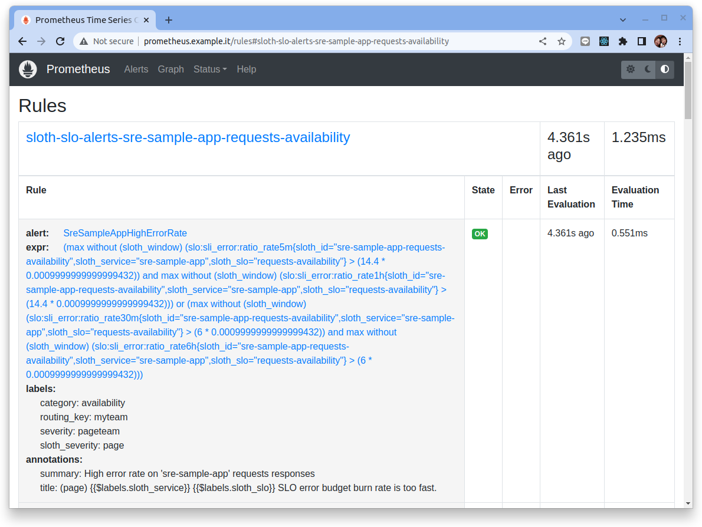

**SLI:**

`sloth-slo-sli-recordings-sre-sample-app-requests-availability`

```
record:slo:sli_error:ratio_rate5m
expr:(sum(rate(http_request_duration_seconds_count{code=~"(5..|429)",job="sre-sample-app"}[5m]))) / (sum(rate(http_request_duration_seconds_count{job="sre-sample-app"}[5m])))
labels:
owner: dxlab
repo: myorg/myservice
sloth_id: sre-sample-app-requests-availability
sloth_service: sre-sample-app
sloth_slo: requests-availability
sloth_window: 5m
tier: 2

record:slo:sli_error:ratio_rate30m
expr:(sum(rate(http_request_duration_seconds_count{code=~"(5..|429)",job="sre-sample-app"}[30m]))) / (sum(rate(http_request_duration_seconds_count{job="sre-sample-app"}[30m])))
labels:
owner: dxlab
repo: myorg/myservice
sloth_id: sre-sample-app-requests-availability
sloth_service: sre-sample-app
sloth_slo: requests-availability
sloth_window: 30m
tier: 2

record:slo:sli_error:ratio_rate1h
expr:(sum(rate(http_request_duration_seconds_count{code=~"(5..|429)",job="sre-sample-app"}[1h]))) / (sum(rate(http_request_duration_seconds_count{job="sre-sample-app"}[1h])))
labels:
owner: dxlab
repo: myorg/myservice
sloth_id: sre-sample-app-requests-availability
sloth_service: sre-sample-app
sloth_slo: requests-availability
sloth_window: 1h
tier: 2

record:slo:sli_error:ratio_rate2h
expr:(sum(rate(http_request_duration_seconds_count{code=~"(5..|429)",job="sre-sample-app"}[2h]))) / (sum(rate(http_request_duration_seconds_count{job="sre-sample-app"}[2h])))
labels:
owner: dxlab
repo: myorg/myservice
sloth_id: sre-sample-app-requests-availability
sloth_service: sre-sample-app
sloth_slo: requests-availability
sloth_window: 2h
tier: 2

record:slo:sli_error:ratio_rate6h
expr:(sum(rate(http_request_duration_seconds_count{code=~"(5..|429)",job="sre-sample-app"}[6h]))) / (sum(rate(http_request_duration_seconds_count{job="sre-sample-app"}[6h])))
labels:
owner: dxlab
repo: myorg/myservice
sloth_id: sre-sample-app-requests-availability
sloth_service: sre-sample-app
sloth_slo: requests-availability
sloth_window: 6h
tier: 2

record:slo:sli_error:ratio_rate1d
expr:(sum(rate(http_request_duration_seconds_count{code=~"(5..|429)",job="sre-sample-app"}[1d]))) / (sum(rate(http_request_duration_seconds_count{job="sre-sample-app"}[1d])))
labels:
owner: dxlab
repo: myorg/myservice
sloth_id: sre-sample-app-requests-availability
sloth_service: sre-sample-app
sloth_slo: requests-availability
sloth_window: 1d
tier: 2

record:slo:sli_error:ratio_rate3d
expr:(sum(rate(http_request_duration_seconds_count{code=~"(5..|429)",job="sre-sample-app"}[3d]))) / (sum(rate(http_request_duration_seconds_count{job="sre-sample-app"}[3d])))
labels:
owner: dxlab
repo: myorg/myservice
sloth_id: sre-sample-app-requests-availability
sloth_service: sre-sample-app
sloth_slo: requests-availability
sloth_window: 3d
tier: 2

record:slo:sli_error:ratio_rate30d
expr:sum_over_time(slo:sli_error:ratio_rate5m{sloth_id="sre-sample-app-requests-availability",sloth_service="sre-sample-app",sloth_slo="requests-availability"}[30d]) / ignoring (sloth_window) count_over_time(slo:sli_error:ratio_rate5m{sloth_id="sre-sample-app-requests-availability",sloth_service="sre-sample-app",sloth_slo="requests-availability"}[30d])
labels:
owner: dxlab
repo: myorg/myservice
sloth_id: sre-sample-app-requests-availability
sloth_service: sre-sample-app
sloth_slo: requests-availability
sloth_window: 30d
tier: 2
```

**Metadata:**

`sloth-slo-meta-recordings-sre-sample-app-requests-availability`

```
record:slo:objective:ratio
expr:vector(0.9990000000000001)
labels:
owner: dxlab
repo: myorg/myservice
sloth_id: sre-sample-app-requests-availability
sloth_service: sre-sample-app
sloth_slo: requests-availability
tier: 2

record:slo:error_budget:ratio
expr:vector(1 - 0.9990000000000001)
labels:
owner: dxlab
repo: myorg/myservice
sloth_id: sre-sample-app-requests-availability
sloth_service: sre-sample-app
sloth_slo: requests-availability
tier: 2

record:slo:time_period:days
expr:vector(30)
labels:
owner: dxlab
repo: myorg/myservice
sloth_id: sre-sample-app-requests-availability
sloth_service: sre-sample-app
sloth_slo: requests-availability
tier: 2

record:slo:current_burn_rate:ratio
expr:slo:sli_error:ratio_rate5m{sloth_id="sre-sample-app-requests-availability",sloth_service="sre-sample-app",sloth_slo="requests-availability"} / on (sloth_id, sloth_slo, sloth_service) group_left () slo:error_budget:ratio{sloth_id="sre-sample-app-requests-availability",sloth_service="sre-sample-app",sloth_slo="requests-availability"}
labels:
owner: dxlab
repo: myorg/myservice
sloth_id: sre-sample-app-requests-availability
sloth_service: sre-sample-app
sloth_slo: requests-availability
tier: 2

record:slo:period_burn_rate:ratio
expr:slo:sli_error:ratio_rate30d{sloth_id="sre-sample-app-requests-availability",sloth_service="sre-sample-app",sloth_slo="requests-availability"} / on (sloth_id, sloth_slo, sloth_service) group_left () slo:error_budget:ratio{sloth_id="sre-sample-app-requests-availability",sloth_service="sre-sample-app",sloth_slo="requests-availability"}
labels:
owner: dxlab
repo: myorg/myservice
sloth_id: sre-sample-app-requests-availability
sloth_service: sre-sample-app
sloth_slo: requests-availability
tier: 2

record:slo:period_error_budget_remaining:ratio
expr:1 - slo:period_burn_rate:ratio{sloth_id="sre-sample-app-requests-availability",sloth_service="sre-sample-app",sloth_slo="requests-availability"}
labels:
owner: dxlab
repo: myorg/myservice
sloth_id: sre-sample-app-requests-availability
sloth_service: sre-sample-app
sloth_slo: requests-availability
tier: 2

record:sloth_slo_info
expr:vector(1)
labels:
owner: dxlab
repo: myorg/myservice
sloth_id: sre-sample-app-requests-availability
sloth_mode: ctrl-gen-k8s
sloth_objective: 99.9
sloth_service: sre-sample-app
sloth_slo: requests-availability
sloth_spec: sloth.slok.dev/v1
sloth_version: v0.11.0
tier: 2
```

**Alert:**

`sloth-slo-alerts-sre-sample-app-requests-availability`

```
alert:SreSampleAppHighErrorRate
expr:(max without (sloth_window) (slo:sli_error:ratio_rate5m{sloth_id="sre-sample-app-requests-availability",sloth_service="sre-sample-app",sloth_slo="requests-availability"} > (14.4 * 0.0009999999999999432)) and max without (sloth_window) (slo:sli_error:ratio_rate1h{sloth_id="sre-sample-app-requests-availability",sloth_service="sre-sample-app",sloth_slo="requests-availability"} > (14.4 * 0.0009999999999999432))) or (max without (sloth_window) (slo:sli_error:ratio_rate30m{sloth_id="sre-sample-app-requests-availability",sloth_service="sre-sample-app",sloth_slo="requests-availability"} > (6 * 0.0009999999999999432)) and max without (sloth_window) (slo:sli_error:ratio_rate6h{sloth_id="sre-sample-app-requests-availability",sloth_service="sre-sample-app",sloth_slo="requests-availability"} > (6 * 0.0009999999999999432)))
labels:
category: availability
routing_key: myteam
severity: pageteam
sloth_severity: page
annotations:
summary: High error rate on 'sre-sample-app' requests responses
title: (page) {{$labels.sloth_service}} {{$labels.sloth_slo}} SLO error budget burn rate is too fast.

alert:SreSampleAppHighErrorRate
expr:(max without (sloth_window) (slo:sli_error:ratio_rate2h{sloth_id="sre-sample-app-requests-availability",sloth_service="sre-sample-app",sloth_slo="requests-availability"} > (3 * 0.0009999999999999432)) and max without (sloth_window) (slo:sli_error:ratio_rate1d{sloth_id="sre-sample-app-requests-availability",sloth_service="sre-sample-app",sloth_slo="requests-availability"} > (3 * 0.0009999999999999432))) or (max without (sloth_window) (slo:sli_error:ratio_rate6h{sloth_id="sre-sample-app-requests-availability",sloth_service="sre-sample-app",sloth_slo="requests-availability"} > (1 * 0.0009999999999999432)) and max without (sloth_window) (slo:sli_error:ratio_rate3d{sloth_id="sre-sample-app-requests-availability",sloth_service="sre-sample-app",sloth_slo="requests-availability"} > (1 * 0.0009999999999999432)))
labels:
category: availability
severity: slack
slack_channel: #alerts-myteam
sloth_severity: ticket
annotations:
summary: High error rate on 'sre-sample-app' requests responses
title: (ticket) {{$labels.sloth_service}} {{$labels.sloth_slo}} SLO error budget burn rate is too fast.
```

### 5. 檢視 Grafana Dashboard

Sloth 有構建出兩個對於 SLO 可視化的 dashboard, 可使用 Grafana 導入 Dashboard 的手法來創建, 導入的看板 id 為 `14348` 和 `14643`。

首先用下列的管理員帳號登入 Grafana:

- user: `admin`
- password: `prom-operator`

**SLO / Detail (14348):**

在左側的導航欄 "Dashboards" 圖示中的選單中點選 "+ Import", 然後在 "Import via grafana.com" 的欄位中鍵入 `14348`　再點選 "Load":

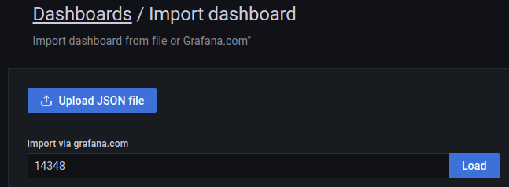

在 `prometheus` 的下接選單中選擇 `Prometheus` 再點選 "Import":

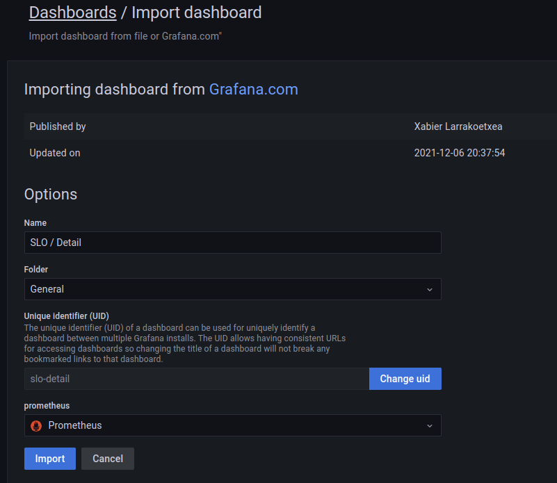

此儀表板具有每個 SLO 的詳細視圖。

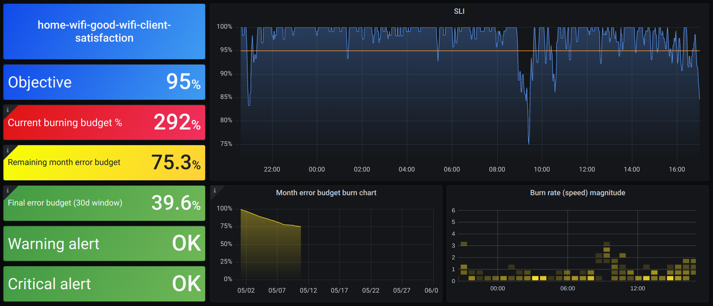

每個 SLO 將顯示：

- SLI
- SLO 元數據詳細信息（名稱、目標...）
- SLO 燃燒率
- 當月（自 1 日起）的剩餘誤差預算
- 最近 30 天的剩餘錯誤預算
- 在啟用警報的情況下，顯示當前警報的狀態
- 錯誤預算月份燃盡圖
- 燃燒率幅度

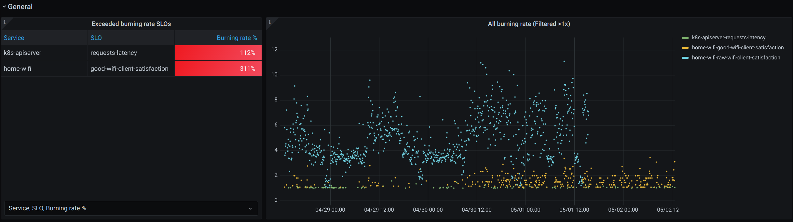

**High level Sloth SLOs (14643):**

依照相同的手法來導入 `14643`。

該儀表板顯示了 sloth 管理的系統中所有 SLO 的高級概覽。通常，此儀表板將用於檢查 SL​​O 錯誤預算消耗之間的相關性。

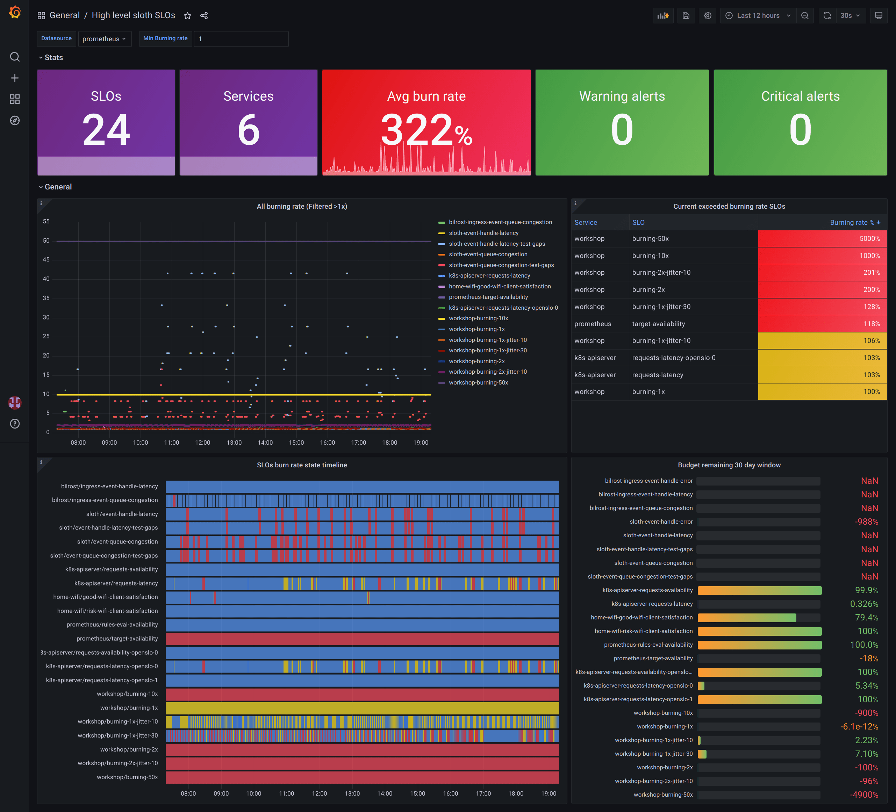


該儀表板附帶：

- SLO 的信息（數量、所有的平均消耗率、觸發警報……）
- 當前以高速率消耗預算的 SLO 圖表
- 包含所有 SLOS 錯誤預算燃燒的時間表

