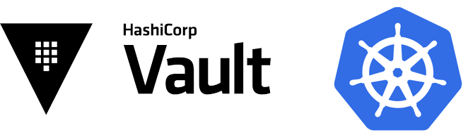

# Kubernetes

本章節介紹在 Kubernetes上運行 Vault，並解釋架構、配置、安裝和安全注意事項。

Hashicorp 建議使用官方 `HashiCorp Vault Helm chart` 將 Vault 部署到 Kubernetes 中。 Helm chart 允許用戶以各種配置部署 Vault：

- **Dev**：用於測試 Vault 的單個內存 Vault 服務器
- **Standalone (default)**：單個 Vault 服務器使用文件存儲後端持久保存到卷
- **High-Availability (HA)**：使用 HA 存儲後端（如 Consul）的 Vault 服務器集群（默認）
- **External**：依賴於外部 Vault 服務器的 Vault Agent Injector 服務器

## 用例

- `運行 Vault Service`：Vault 服務器集群可以直接在 Kubernetes 上運行。這可以由運行在 Kubernetes 內部以及 Kubernetes 外部的應用程序使用，只要它們可以通過網絡與服務器通信。
- `訪問和存儲秘密`：使用在 Kubernetes 中運行的 Vault 服務的應用程序可以使用許多不同的秘密引擎和身份驗證方法從 Vault 訪問和存儲秘密。
- `運行高可用 Vault 服務`：通過使用 pod 關聯性、高可用後端存儲（如 Consul）和自動解封，Vault 可以成為 Kubernetes 中的高可用服務。
- `加密即服務`：使用在 Kubernetes 中運行的 Vault 服務的應用程序可以利用 Transit 秘密引擎作為“加密即服務”。這允許應用程序在存儲靜態數據之前將加密需求卸載到 Vault。
- `Vault 的審計日誌`：操作員可以選擇將持久卷附加到 Vault 集群，該集群可用於存儲審計日誌。
- 和更多！ Vault 可以直接在 Kubernetes 上運行，因此除了 Vault 本身提供的原生集成之外，為 Kubernetes 構建的任何其他工具都可以選擇利用 Vault。

## Vault 整合 Kubernetes 入門

有幾種方法可以在不同的環境中嘗試使用 Kubernetes 的 Vault。

### 指南

- [通過 Helm 將 Vault 安裝到 Minikube](https://learn.hashicorp.com/tutorials/vault/kubernetes-minikube?in=vault/kubernetes) 包括使用 Minikube 和官方 Helm chart在本地安裝 Vault。
- [將 Kubernetes 集群與外部 Vault 集成](https://learn.hashicorp.com/tutorials/vault/kubernetes-external-vault?in=vault/kubernetes)提供了一個通過 Kubernetes 服務和端點使 Vault 可訪問的示例。
- [Kubernetes 上的 Vault 部署指南](https://learn.hashicorp.com/tutorials/vault/kubernetes-raft-deployment-guide?in=vault/kubernetes)涵蓋了安裝和配置單個 HashiCorp Vault 集群所需的步驟，如 Kubernetes 上的 [Vault 參考架構](https://learn.hashicorp.com/tutorials/vault/kubernetes-reference-architecture?in=vault/kubernetes)中定義的那樣。
