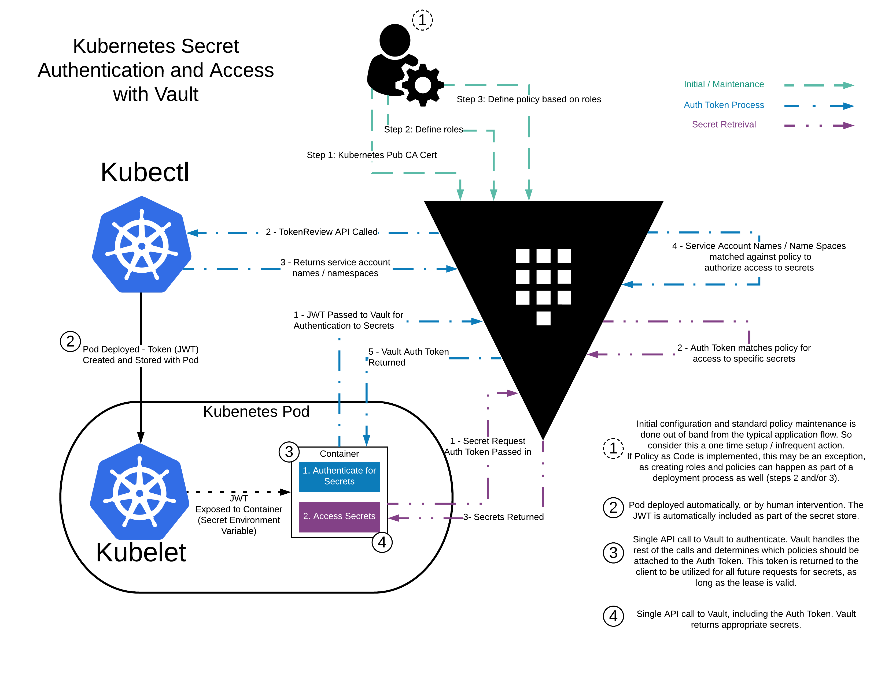
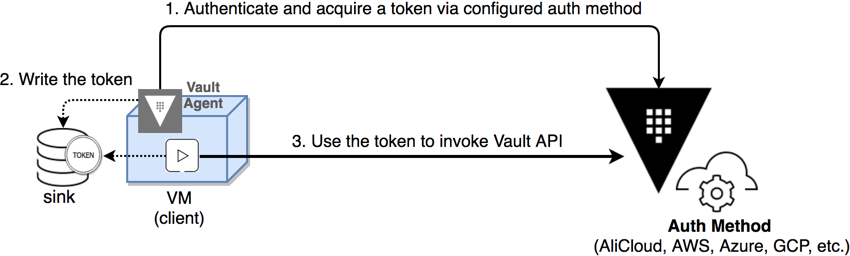

# Vault Agent with Kubernetes

原文: https://learn.hashicorp.com/tutorials/vault/agent-kubernetes?in=vault/auth-methods

幾乎所有對 Vault 的請求都必須附有身份驗證令牌。這包括所有 API 請求，以及通過 Vault CLI 的請求。如果您可以安全地從發起者那裡獲得第一個秘密到消費者，那麼在該發起者和消費者之間傳輸的所有後續秘密都可以通過成功分發和該第一個秘密的用戶建立的信任進行身份驗證。


## Challenge

在 Kubernetes 環境中運行的應用程序也不例外。幸運的是，Vault 提供了 [Kubernetes auth 方法](https://www.vaultproject.io/docs/auth/kubernetes)來使用 Kubernetes 服務帳戶(Service Account)令牌對客戶端進行身份驗證。




但是，客戶端(每一個在K8S裡頭的Pod)仍然需要負責管理 Vault 令牌的生命週期(TTL)。因此，下一個挑戰變成瞭如何以標準方式管理令牌的生命週期，而無需編寫自定義邏輯。

## Solution

[Vault Agent](https://www.vaultproject.io/docs/agent) 提供了許多不同的幫助功能，專門解決以下挑戰：

- 自動認證
- 令牌的安全交付/存儲
- 令牌的生命週期管理（更新和重新認證）



!!! info
    本教程重點介紹使用 kubernetes auth 方法的 Vault Agent `Auto-Auth` 的演示。 Vault Helm 引入了 Agent Sidecar Injector。有關 Sidecar 使用的分步教程，請參閱通過 Vault Helm Sidecar 將 Secrets 注入 Kubernetes Pod。

## Prerequisites

要執行本教程中描述的任務，您需要：

- 一個安裝好了的 Minikube
- 可從 Kubernetes 環境訪問到的 Vault 環境。請參閱入門教程以安裝 Vault。確保您的 Vault 服務器已初始化並解封

!!! info
    注意：出於演示的目的，本教程將 Minikube 作為 Kubernetes 環境運行。如果你希望改為針對 Azure Kubernetes 服務 (AKS) 群集進行測試，請按照 Azure Kubernetes 服務群集部分中的步驟創建 AKS 群集。如果要針對 Google Kubernetes Engine (GKE) 集群進行測試，請參閱 Google Kubernetes Engine 集群部分中描述的步驟。

通過從 clone GitHub [hashcorp/learn-vault-agent](https://github.com/hashicorp/learn-vault-agent) 存儲庫來檢索附加配置。

```baSH
$ git clone https://github.com/hashicorp/learn-vault-agent.git
```

此Git存儲庫包含所有 Vault 學習教程的支持內容。本教程的特定內容可以在子目錄中找到。

進入 `learn-vault-agent/identity/vault-agent-k8s-demo` 目錄。

```bash
$ cd learn-vault-agent/vault-agent-k8s-demo
```

!!! info
    工作目錄：本教程假設其它的命令都在此目錄中執行。

## Start a Vault server

要完成本教程，請啟動一個 Vault 開發服務器，該服務器在 `0.0.0.0:8200` 以 root 作為根令牌 ID 偵聽本地請求。

```bash
$ vault server -dev -dev-root-token-id root -dev-listen-address 0.0.0.0:8200
```

將 `-dev-listen-address` 設置為 `0.0.0.0:8200` 會覆蓋 Vault 開發服務器的默認地址 (`127.0.0.1:8200`)，並使 Vault 可以被 Kubernetes 集群及其 Pod 連接到。

為 Vault CLI 導出環境變量以定位到 Vault 服務器。

```bash
$ export VAULT_ADDR=http://0.0.0.0:8200
```

## Create a service account

### 1. Start Kubernetes

啟動在 Minikube 中運行的 Kubernetes 集群。

```bash
$ minikube start --driver=docker
```

等待幾分鐘讓 minikube 環境完全可用。

```bash
$ minikube status

minikube
type: Control Plane
host: Running
kubelet: Running
apiserver: Running
kubeconfig: Configured
```

### 2. Define Kubernetes Serviceaccount

在 Kubernetes 中，`service account`為在 Pod 中運行的進程提供身份，以便進程可以聯繫 Kubernetes API 服務器。在您首選的文本編輯器中打開提供的 `vault-auth-service-account.yaml` 文件，並檢查其內容以了解本教程要使用的服務帳戶定義。

```yaml title="vault-auth-service-account.yaml"
apiVersion: v1
kind: ServiceAccount
metadata:
  name: vault-auth
  namespace: default
---
apiVersion: rbac.authorization.k8s.io/v1
kind: ClusterRoleBinding
metadata:
  name: role-tokenreview-binding
  namespace: default
roleRef:
  apiGroup: rbac.authorization.k8s.io
  kind: ClusterRole
  name: system:auth-delegator
subjects:
- kind: ServiceAccount
  name: vault-auth
  namespace: default

```

### 3. Create Service account

創建 Vault-auth 服務帳戶。

```bash
$ kubectl apply --filename vault-auth-service-account.yaml
```

### 4. Kubernetes 1.24+ only

服務帳戶生成了一個在 Kubernetes 1.23 中自動配置所需的密鑰。在 Kubernetes 1.24+ 中，您需要顯式創建密鑰。

```yaml title="vault-auth-secret.yaml"
apiVersion: v1
kind: Secret
metadata:
  name: vault-auth-secret
  annotations:
    kubernetes.io/service-account.name: vault-auth
type: kubernetes.io/service-account-token
```

創建一個 Vault-auth-secret 密鑰。

```bash
$ kubectl apply --filename vault-auth-secret.yaml
```

## Configure Kubernetes auth method

### 1. Create a read-only policy

在 Vault 中創建一個唯讀的策略 `myapp-kv-ro`。

```bash
$ vault policy write myapp-kv-ro - <<EOF
path "secret/data/myapp/*" {
    capabilities = ["read", "list"]
}
EOF
```

### 2. Put test data

在 `secret/myapp` 路徑創建一些測試數據。

```bash
$ vault kv put secret/myapp/config \
      username='appuser' \
      password='suP3rsec(et!' \
      ttl='30s'

```

結果:

```bash
====== Secret Path ======
secret/data/myapp/config

======= Metadata =======
Key                Value
---                -----
created_time       2022-06-25T10:48:43.580414126Z
custom_metadata    <nil>
deletion_time      n/a
destroyed          false
version            1
```

### 3. Set up environment variables

將環境變量設置為指向正在運行的 Minikube 環境。將 `SA_SECRET_NAME` 環境變量值設置為 `vault-auth 服務帳戶`密碼。

```bash
$ export SA_SECRET_NAME=$(kubectl get secrets --output=json \
    | jq -r '.items[].metadata | select(.name|startswith("vault-auth-")).name')
```

將 `SA_JWT_TOKEN` 環境變量值設置為用於訪問 `TokenReview API` 的服務帳戶 JWT

```bash
$ export SA_JWT_TOKEN=$(kubectl get secret $SA_SECRET_NAME \
    --output 'go-template={{ .data.token }}' | base64 --decode)
```

將 `SA_CA_CRT` 環境變量值設置為用於與 Kubernetes API 對話的 PEM 編碼 CA 證書。

```bash
$ export SA_CA_CRT=$(kubectl config view --raw --minify --flatten \
    --output 'jsonpath={.clusters[].cluster.certificate-authority-data}' | base64 --decode)
```

將 `K8S_HOST` 環境變量值設置為 minikube IP 地址。

```bash
$ export K8S_HOST=$(kubectl config view --raw --minify --flatten \
    --output 'jsonpath={.clusters[].cluster.server}')
```

### 4. Configure the Kubernetes auth method

現在，啟用並配置 Kubernetes auth 方法。在默認路徑（`auth/kubernetes`）啟用 Kubernetes auth 方法。

```bash
$ vault auth enable kubernetes
```

告訴 Vault 如何與 Kubernetes (Minikube) 集群通信。

```bash
$ vault write auth/kubernetes/config \
     token_reviewer_jwt="$SA_JWT_TOKEN" \
     kubernetes_host="$K8S_HOST" \
     kubernetes_ca_cert="$SA_CA_CRT" \
     issuer="https://kubernetes.default.svc.cluster.local"
```

結果:

```bash
Success! Data written to: auth/kubernetes/config
```

!!! tips
    您可以使用[此方法](https://www.vaultproject.io/docs/auth/kubernetes#discovering-the-service-account-issuer)驗證 Kubernetes 集群的頒發者名稱。

### 5. Create role

創建一個名為 `example` 的角色，將 Kubernetes 服務帳戶映射到 Vault 策略和默認令牌 TTL。

```bash
$ vault write auth/kubernetes/role/example \
     bound_service_account_names=vault-auth \
     bound_service_account_namespaces=default \
     policies=myapp-kv-ro \
     ttl=24h
```

結果:

```bash
Success! Data written to: auth/kubernetes/role/example
```

## Determine the Vault address

正如您配置 Vault 一樣，綁定到主機上所有網絡的服務可以通過向 Kubernetes 集群的網關地址發送請求來由 Minikube 集群中的 pod 尋址。

### 1. 啟動 minikube SSH

```bash
$ minikube ssh

## ... minikube ssh login
```

### 2. 在此 SSH 會話中，檢索 Minikube 主機

```bash
$ dig host.minikube.internal

; <<>> DiG 9.16.1-Ubuntu <<>> host.minikube.internal
;; global options: +cmd
;; Got answer:
;; ->>HEADER<<- opcode: QUERY, status: NXDOMAIN, id: 13469
;; flags: qr rd ra; QUERY: 1, ANSWER: 0, AUTHORITY: 1, ADDITIONAL: 1

;; OPT PSEUDOSECTION:
; EDNS: version: 0, flags:; udp: 65494
;; QUESTION SECTION:
;host.minikube.internal.		IN	A

;; AUTHORITY SECTION:
.			86375	IN	SOA	a.root-servers.net. nstld.verisign-grs.com. 2022062500 1800 900 604800 86400

;; Query time: 43 msec
;; SERVER: 192.168.49.1#53(192.168.49.1)
;; WHEN: Sat Jun 25 13:02:27 UTC 2022
;; MSG SIZE  rcvd: 126

```

最後，創建一個名為 `EXTERNAL_VAULT_ADDR` 的變量來捕獲 Minikube 網關地址。

```bash
$ EXTERNAL_VAULT_ADDR=$(minikube ssh "dig +short host.docker.internal" | tr -d '\r')

$ EXTERNAL_VAULT_ADDR=192.168.50.191
```

### Optional: Verify the Kubernetes auth method configuration

**1. 定義一個帶有容器的 Pod**

```bash
$ cat > devwebapp.yaml <<EOF
apiVersion: v1
kind: Pod
metadata:
  name: devwebapp
  labels:
    app: devwebapp
spec:
  serviceAccountName: vault-auth
  containers:
    - name: devwebapp
      image: burtlo/devwebapp-ruby:k8s
      env:
        - name: VAULT_ADDR
          value: "http://$EXTERNAL_VAULT_ADDR:8200"
EOF

```

Pod 名為 devwebapp 並使用 vault-auth 服務帳戶運行。

**2. 默認命名空間中創建 devwebapp pod**

```bash
$ kubectl apply --filename devwebapp.yaml --namespace default

pod/devwebapp created
```

**3. 顯示默認命名空間中的所有 pod**

```bash
$ kubectl get pods

NAME        READY   STATUS    RESTARTS   AGE
devwebapp   1/1     Running   0          54s
```

等到 devwebapp pod 正在運行並準備就緒 (1/1)。

**4. 在 devwebapp pod 上啟動交互式 shell**

```bash
$ kubectl exec --stdin=true --tty=true devwebapp -- /bin/sh

#
```

您的系統提示將替換為新的提示 `#`。

!!! info
    注意：本節中的提示顯示為 $，但這些命令旨在在 devwebapp 容器上的此交互式 shell 中執行。


**5. 將 KUBE_TOKEN 設置為服務帳戶令牌**

```bash
$ KUBE_TOKEN=$(cat /var/run/secrets/kubernetes.io/serviceaccount/token)
```

**6. 通過帶有 KUBE_TOKEN 的示例角色使用 Vault 進行身份驗證**

```bash
curl --request POST \
       --data '{"jwt": "'"$KUBE_TOKEN"'", "role": "example"}' \
       $VAULT_ADDR/v1/auth/kubernetes/login

curl --request POST \
  --data '{"jwt": "'"$KUBE_TOKEN"'", "role": "example"}' \
  http://192.168.50.191:8200/v1/auth/kubernetes/login  
```