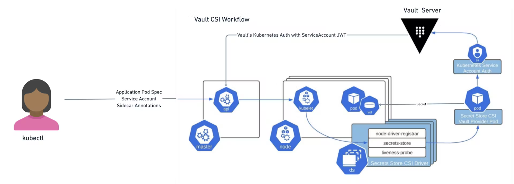

# 通過容器存儲接口 (CSI) 掛載 Vault Secret

原文: https://learn.hashicorp.com/tutorials/vault/kubernetes-secret-store-driver



依賴 Vault 管理其機密的 Kubernetes 應用程序 pod 可以通過網絡請求直接檢索它們，或者通過 Vault Injector 服務通過註釋或附加為臨時卷在已安裝的文件系統上維護它們。這種使用臨時卷存儲機密的方法是 Kubernetes 容器存儲接口 (CSI) 驅動程序的 Secrets Store 擴展的一個功能。

在本教程中，您將使用 `Helm chart` 設置 Vault 及其依賴項。然後啟用並配置 `secrets store CSI driver` 以創建一個包含您將掛載到應用程序 pod 的秘密的 volume。


## 先決條件

本教程需要安裝 Kubernetes 命令行界面 (CLI) 和 Helm CLI、Minikube 以及其他配置以將它們組合在一起。

Docker version.

```bash
$ docker --version

Docker version 20.10.17, build 100c701
```

Minikube version.

```bash
$ minikube version

minikube version: v1.25.2
commit: 362d5fdc0a3dbee389b3d3f1034e8023e72bd3a7
```

Helm version.

```bash
$ helm version

version.BuildInfo{Version:"v3.9.0", GitCommit:"7ceeda6c585217a19a1131663d8cd1f7d641b2a7", GitTreeState:"clean", GoVersion:"go1.17.5"}
```

## 啟動 Kubernetes

=== "Minikube"

    Minikube 是一個 CLI 工具，用於配置和管理單節點 Kubernetes 集群的生命週期。這些集群在虛擬機 (VM) 中本地運行。

    啟動 Kubernetes 集群。

    ```bash
    $ minikube start

    😄  minikube v1.25.2 on Ubuntu 21.10
    🎉  minikube 1.26.0 is available! Download it: https://github.com/kubernetes/minikube/releases/tag/v1.26.0
    💡  To disable this notice, run: 'minikube config set WantUpdateNotification false'

    ✨  Automatically selected the docker driver. Other choices: virtualbox, ssh
    👍  Starting control plane node minikube in cluster minikube
    🚜  Pulling base image ...
    🔥  Creating docker container (CPUs=2, Memory=3900MB) ...
    🐳  Preparing Kubernetes v1.23.3 on Docker 20.10.12 ...
        ▪ kubelet.housekeeping-interval=5m
        ▪ Generating certificates and keys ...
        ▪ Booting up control plane ...
        ▪ Configuring RBAC rules ...
    🔎  Verifying Kubernetes components...
        ▪ Using image gcr.io/k8s-minikube/storage-provisioner:v5
    🌟  Enabled addons: storage-provisioner, default-storageclass
    🏄  Done! kubectl is now configured to use "minikube" cluster and "default" namespace by default

    ```

    顯示 Kubernetes 集群的版本。

    ```bash
    $ kubectl version --output=json

    {
      "clientVersion": {
        "major": "1",
        "minor": "24",
        "gitVersion": "v1.24.1",
        "gitCommit": "3ddd0f45aa91e2f30c70734b175631bec5b5825a",
        "gitTreeState": "clean",
        "buildDate": "2022-05-24T12:26:19Z",
        "goVersion": "go1.18.2",
        "compiler": "gc",
        "platform": "linux/amd64"
      },
      "kustomizeVersion": "v4.5.4",
      "serverVersion": {
        "major": "1",
        "minor": "23",
        "gitVersion": "v1.23.3",
        "gitCommit": "816c97ab8cff8a1c72eccca1026f7820e93e0d25",
        "gitTreeState": "clean",
        "buildDate": "2022-01-25T21:19:12Z",
        "goVersion": "go1.17.6",
        "compiler": "gc",
        "platform": "linux/amd64"
      }
    }
    ```

    驗證 Minikube 集群的狀態。

    ```bash
    $ minikube status

    minikube
    type: Control Plane
    host: Runningk3d 是一個輕量級的包裝器，用於在 docker 中運行 k3s（Rancher Lab 的最小 Kubernetes 發行版）。
    kubelet: Running
    apiserver: Running
    kubeconfig: Configured  
    ```


=== "K3D"

    k3d 是一個輕量級的 kubernetes 包裝器，用於在 docker 中運行 k3s（Rancher Lab 的最小 Kubernetes 發行版）。

    k3d 使得在 docker 中創建單節點和多節點 k3s 集群變得非常容易，例如用於 Kubernetes 上的本地開發。

    啟動 Kubernetes 集群。

    ```bash
    $ mkdir -p /tmp/k3d/kubelet/pods
    $ k3d cluster create -v /tmp/k3d/kubelet/pods:/var/lib/kubelet/pods:shared

    WARN[0000] No node filter specified                     
    INFO[0000] Prep: Network                                
    INFO[0000] Created network 'k3d-k3s-default'            
    INFO[0000] Created image volume k3d-k3s-default-images  
    INFO[0000] Starting new tools node...                   
    INFO[0000] Starting Node 'k3d-k3s-default-tools'        
    INFO[0001] Creating node 'k3d-k3s-default-server-0'     
    INFO[0001] Creating LoadBalancer 'k3d-k3s-default-serverlb' 
    INFO[0001] Using the k3d-tools node to gather environment information 
    INFO[0001] HostIP: using network gateway 172.29.0.1 address 
    INFO[0001] Starting cluster 'k3s-default'               
    INFO[0001] Starting servers...                          
    INFO[0001] Starting Node 'k3d-k3s-default-server-0'     
    INFO[0005] All agents already running.                  
    INFO[0005] Starting helpers...                          
    INFO[0006] Starting Node 'k3d-k3s-default-serverlb'     
    INFO[0012] Injecting records for hostAliases (incl. host.k3d.internal) and for 2 network members into CoreDNS configmap... 
    INFO[0014] Cluster 'k3s-default' created successfully!  
    INFO[0014] You can now use it like this:                
    kubectl cluster-info
    ```

    驗證 K3D 集群的狀態。

    ```bash
    $ kubectl cluster-info
    ```


主機、kubelet、apiserver 報告它們正在運行。 kubectl 是一個命令行界面 (CLI)，用於針對 Kubernetes 集群運行命令，它也被配置為與這個最近啟動的集群進行通信。

## 安裝 Vault Helm chart

Vault 管理寫入這些可掛載卷的機密。要提供這些機密，需要一個 Vault 服務器。對於此演示，Vault 可以在開發模式下運行，以自動處理 KV 機密引擎的初始化、解封和設置。

添加 HashiCorp Helm 存儲庫。

```bash
$ helm repo add hashicorp https://helm.releases.hashicorp.com

"hashicorp" has been added to your repositories
```

更新所有存儲庫以確保 helm 知道最新版本。

```bash
$ helm repo update

Hang tight while we grab the latest from your chart repositories...
...Successfully got an update from the "secrets-store-csi-driver" chart repository
...Successfully got an update from the "hashicorp" chart repository
Update Complete. ⎈Happy Helming!⎈
```

安裝在開發模式下運行的最新版本的 Vault Helm chart，並禁用注入器服務並啟用 CSI。

```bash
$ helm install vault hashicorp/vault \
    --set "server.dev.enabled=true" \
    --set "injector.enabled=false" \
    --set "csi.enabled=true"
```

示例輸出：

```bash
NAME: vault
LAST DEPLOYED: Sun Jul 10 22:23:05 2022
NAMESPACE: default
STATUS: deployed
REVISION: 1
NOTES:
Thank you for installing HashiCorp Vault!

Now that you have deployed Vault, you should look over the docs on using
Vault with Kubernetes available here:

https://www.vaultproject.io/docs/


Your release is named vault. To learn more about the release, try:

  $ helm status vault
  $ helm get manifest vault
```

Vault 服務器在單個 pod `server.dev.enabled=true` 上以開發模式運行。 Vault Agent Injector pod 被禁用 `injector.enabled=false` 並且 Vault CSI Provider pod `csi.enabled=true` 被啟用。

顯示默認命名空間內的所有 pod。

```bash
$ kubectl get pods

NAME                       READY   STATUS    RESTARTS   AGE
vault-0                    1/1     Running   0          16m
vault-csi-provider-8kxjg   1/1     Running   0          16m
```

等到 vault-0 pod 正在運行並準備就緒 (1/1)。

## 在 Vault 中設置 Secret

在 [Create a pod with secretmounted](https://learn.hashicorp.com/tutorials/vault/kubernetes-secret-store-driver#create-a-pod-with-secret-mounted) 部分中掛載到 pod 的捲需要存儲在路徑 `secret/data/db-pass` 中的 secret。當 Vault 在開發中運行時，在路徑 `/secret` 中啟用了 KV 秘密引擎。

首先，在 `vault-0` pod 上啟動一個交互式 shell 會話。

```bash
$ kubectl exec -it vault-0 -- /bin/sh

/ $
```

您的系統提示符將替換為新的提示符 `/ $`。在此提示下發出的命令在 `vault-0` 容器上執行。

使用密碼在路徑 `secret/db-pass` 處創建一個秘密。

```bash
/ $ vault kv put secret/db-pass password="db-secret-password"

=== Secret Path ===
secret/data/db-pass

======= Metadata =======
Key                Value
---                -----
created_time       2022-07-10T15:17:48.580178065Z
custom_metadata    <nil>
deletion_time      n/a
destroyed          false
version            1
```

驗證密鑰在路徑 `secret/db-pass` 上是否可讀。

```bash
/ $ vault kv get secret/db-pass

=== Secret Path ===
secret/data/db-pass

======= Metadata =======
Key                Value
---                -----
created_time       2022-07-10T15:17:48.580178065Z
custom_metadata    <nil>
deletion_time      n/a
destroyed          false
version            1

====== Data ======
Key         Value
---         -----
password    db-secret-password
```

## 配置 Kubernetes authentication

Vault 提供了一種 `Kubernetes authentication` 方法，使客戶端能夠使用 Kubernetes 服務帳戶令牌進行身份驗證。訪問密鑰和創建卷的 Kubernetes 資源通過此方法通過角色進行身份驗證。

啟用 Kubernetes 身份驗證方法。

```bash
/ $ vault auth enable kubernetes

Success! Enabled kubernetes auth method at: kubernetes/
```

使用 Kubernetes API 地址配置 Kubernetes 身份驗證方法。它將自動使用 Vault pod 自己的服務帳戶令牌。

```bash
/ $ vault write auth/kubernetes/config \
    kubernetes_host="https://$KUBERNETES_PORT_443_TCP_ADDR:443"
```

結果:

```
Success! Data written to: auth/kubernetes/config
```

環境變量 `KUBERNETES_PORT_443_TCP_ADDR` 引用了 Kubernetes 主機的內部網絡地址。

創建一個名為 `internal-app` 的策略。這將用於授予 `webapp-sa` 服務帳戶讀取之前創建的 kv 密鑰的權限。

```bash
/ $ vault policy write internal-app - <<EOF
path "secret/data/db-pass" {
  capabilities = ["read"]
}
EOF
```

kv-v2 的數據要求在其掛載路徑（本例中為 `secret/`）之後包含額外的數據路徑元素。

最後，創建一個名為 database 的 Kubernetes 身份驗證角色，該角色將此策略與名為 `webapp-sa` 的 Kubernetes 服務帳戶綁定。

```bash
/ $ vault write auth/kubernetes/role/database \
    bound_service_account_names=webapp-sa \
    bound_service_account_namespaces=default \
    policies=internal-app \
    ttl=20m
```

結果:

```bash
Success! Data written to: auth/kubernetes/role/database
```

該角色將命名空間（默認）中的 Kubernetes 服務帳戶 `webapp-sa` 與 Vault 策略 `internal-app` 連接起來。認證後返回的令牌有效期為 20 分鐘。這個 Kubernetes 服務帳戶名稱 `webapp-sa` 將在下面創建。

最後，退出 `vault-0` pod。

```
/ $ exit
```

## 安裝 secrets store CSI driver

Secrets Store CSI 驅動程序 `secrets-store.csi.k8s.io` 允許 Kubernetes 將存儲在企業級外部機密存儲中的多個機密、密鑰和證書作為卷掛載到其 pod 中。附加卷後，其中的數據將被掛載到容器的文件系統中。

添加 Secrets Store CSI 驅動 Helm 存儲庫。

```bash
$ helm repo add secrets-store-csi-driver https://kubernetes-sigs.github.io/secrets-store-csi-driver/charts

"secrets-store-csi-driver" has been added to your repositories
```

安裝最新版本的 Kubernetes Secrets Store CSI 驅動程序。

```bash
$ helm install csi secrets-store-csi-driver/secrets-store-csi-driver \
    --set syncSecret.enabled=true
```

結果:

```bash
NAME: csi
LAST DEPLOYED: Sun Jul 10 23:57:05 2022
NAMESPACE: default
STATUS: deployed
REVISION: 1
TEST SUITE: None
NOTES:
The Secrets Store CSI Driver is getting deployed to your cluster.

To verify that Secrets Store CSI Driver has started, run:

  kubectl --namespace=default get pods -l "app=secrets-store-csi-driver"

Now you can follow these steps https://secrets-store-csi-driver.sigs.k8s.io/getting-started/usage.html
to create a SecretProviderClass resource, and a deployment using the SecretProviderClass. 
```

## 驗證 Vault CSI provider 啟動狀態

Secrets Store CSI 驅動程序支持通過提供程序進行擴展。提供者作為 Kubernetes DaemonSet 與 Secrets Store CSI 驅動程序 DaemonSet 一起啟動。

Vault CSI 提供程序通過 Vault Helm chart 安裝在 Vault 旁邊。

此 DaemonSet 啟動其自己的提供程序 pod 並運行一個 gRPC 服務器，Secrets Store CSI 驅動程序連接到該服務器以發出卷掛載請求。

獲取默認命名空間中的所有 pod，以檢查 Vault CSI 提供程序是否正在運行。

```bash
$ kubectl get pods

NAME                                 READY   STATUS    RESTARTS   AGE
csi-secrets-store-csi-driver-45w5k   3/3     Running   0          4m58s
vault-0                              1/1     Running   0          99m
vault-csi-provider-8kxjg             1/1     Running   0          99m
```

等到 vault-csi-provider pod 正在運行並準備就緒 (1/1)。

## 定義 SecretProviderClass resource

Kubernetes Secrets Store CSI Driver Helm 圖表為 SecretProviderClass 資源創建定義。此資源描述了提供給 Vault CSI 提供程序的參數。要配置它，需要 Vault 服務器的地址、Vault Kubernetes 身份驗證角色的名稱和機密。

定義一個名為 `vault-database` 的 `SecretProviderClass`。

```bash
$ cat > spc-vault-database.yaml <<EOF
apiVersion: secrets-store.csi.x-k8s.io/v1
kind: SecretProviderClass
metadata:
  name: vault-database
spec:
  provider: vault
  parameters:
    vaultAddress: "http://vault.default:8200"
    roleName: "database"
    objects: |
      - objectName: "db-password"
        secretPath: "secret/data/db-pass"
        secretKey: "password"
EOF
```

創建 vault-database 的 SecretProviderClass。

```bash
$ kubectl apply --filename spc-vault-database.yaml

secretproviderclass.secrets-store.csi.x-k8s.io/vault-database created
```

vault-database 的 SecretProviderClass 描述了一個 Secret 物件：

- `objectName` 是 secret 的 symbolic name 與要構建的檔案名稱。
- `secretPath` 是 secret 定義在 Vault 裡的路徑。
- `secretKey` 是 secret 裡的鍵名(key name)。

驗證已在默認命名空間中定義名為 `vault-database` 的 `SecretProviderClass`。

```bash
$ kubectl describe SecretProviderClass vault-database

Name:         vault-database
Namespace:    default
Labels:       <none>
Annotations:  kubectl.kubernetes.io/last-applied-configuration:
                {"apiVersion":"secrets-store.csi.x-k8s.io/v1","kind":"SecretProviderClass","metadata":{"annotations":{},"name":"vault-database","namespace...
API Version:  secrets-store.csi.x-k8s.io/v1
Kind:         SecretProviderClass
## ...
```

## 創建一個掛載 secret 的 pod

將 secret 存儲在 Vault 中，配置身份驗證並創建角色，安裝 `provider-vault` 擴展並定義 `SecretProviderClass`，最後是時候創建一個掛載所需機密的 pod。

創建一個名為 `webapp-sa` 的服務帳戶。

```bash
$ kubectl create serviceaccount webapp-sa
```

定義掛載秘密卷的 `webapp` pod。

```basy
$ cat > webapp-pod.yaml <<EOF
kind: Pod
apiVersion: v1
metadata:
  name: webapp
spec:
  serviceAccountName: webapp-sa
  containers:
  - image: jweissig/app:0.0.1
    name: webapp
    volumeMounts:
    - name: secrets-store-inline
      mountPath: "/mnt/secrets-store"
      readOnly: true
  volumes:
    - name: secrets-store-inline
      csi:
        driver: secrets-store.csi.k8s.io
        readOnly: true
        volumeAttributes:
          secretProviderClass: "vault-database"
EOF
```

`webapp` pod 定義了一個唯讀卷(volume)並將其掛載到 `/mnt/secrets-store`。在 `vault-database` SecretProviderClass 中定義的物件將被寫入至該路徑中的文件。


創建 `webapp pod`。

```bash
$ kubectl apply --filename webapp-pod.yaml
```

獲取默認命名空間內的所有 pod。

```bash
NAME                                 READY   STATUS    RESTARTS   AGE
csi-secrets-store-csi-driver-45w5k   3/3     Running   0          6h23m
vault-0                              1/1     Running   0          7h57m
vault-csi-provider-8kxjg             1/1     Running   0          7h57m
webapp 
```

等到 `webapp` pod 正在運行並準備就緒 (1/1)。

在 `webapp` pod 上的 `/mnt/secrets-store/db-password` 中顯示寫入文件系統的密碼機密。

```bash
$ kubectl exec webapp -- cat /mnt/secrets-store/db-password

db-secret-password
```

顯示的值與秘密 secret/db-pass 的密碼值匹配。

## 同步到 Kubernetes Secret

Secrets Store CSI 驅動程序還支持同步到 Kubernetes 的 Secret 物件。 Kubernetes Secret 填充了 CSI 卷中文件的內容，它們的生命週期與創建它們的 pod 的生命週期密切相關。

要為您的 `webapp` pod 添加 `secret` 同步，請更新 SecretProviderClass 以添加一個 `secretObjects` 條目：

```bash
$ cat > spc-vault-database.yaml <<EOF
apiVersion: secrets-store.csi.x-k8s.io/v1
kind: SecretProviderClass
metadata:
  name: vault-database
spec:
  provider: vault
  secretObjects:
  - data:
    - key: password
      objectName: db-password
    secretName: dbpass
    type: Opaque
  parameters:
    vaultAddress: "http://vault.default:8200"
    roleName: "database"
    objects: |
      - objectName: "db-password"
        secretPath: "secret/data/db-pass"
        secretKey: "password"
EOF
```

應用更改：

```bash
$ kubectl apply --filename spc-vault-database.yaml
```

當 pod 引用此 SecretProviderClass 時，CSI 驅動程序將創建一個名為`dbpass`的 Kubernetes secret，其中`password`字段設置為參數中`db-password`對象的內容。 Pod 會在啟動前等待 Secret 被創建，當 Pod 停止時，Secret 會被刪除
。
接下來，更新 pod 以引用新的 secret：

```bash
$ cat > webapp-pod.yaml <<EOF
kind: Pod
apiVersion: v1
metadata:
  name: webapp
spec:
  serviceAccountName: webapp-sa
  containers:
  - image: jweissig/app:0.0.1
    name: webapp
    env:
    - name: DB_PASSWORD
      valueFrom:
        secretKeyRef:
          name: dbpass
          key: password
    volumeMounts:
    - name: secrets-store-inline
      mountPath: "/mnt/secrets-store"
      readOnly: true
  volumes:
    - name: secrets-store-inline
      csi:
        driver: secrets-store.csi.k8s.io
        readOnly: true
        volumeAttributes:
          secretProviderClass: "vault-database"
EOF
```

請注意，現在有一個 env 條目，引用了一個秘密。刪除並重新部署 pod：

```bash
$ kubectl delete pod webapp && kubectl apply --filename webapp-pod.yaml
```

部署更新的配置並等待 `webapp` pod 再次出現。

```bash
$ kubectl get pods

NAME                                 READY   STATUS    RESTARTS   AGE
csi-secrets-store-csi-driver-w2xxv   3/3     Running   0          4m28s
vault-0                              1/1     Running   0          5m57s
vault-csi-provider-qxz8d             1/1     Running   0          5m57s
webapp                               1/1     Running   0          36s
```

您現在可以驗證 Kubernetes 密鑰是否已創建：

```bash
$ kubectl get secret dbpass

NAME     TYPE     DATA   AGE
dbpass   Opaque   1      100s
```

您還可以驗證該秘密在 pod 的環境中是否可用：

```bash
$ kubectl exec webapp -- env | grep DB_PASSWORD

DB_PASSWORD=db-secret-password
```
